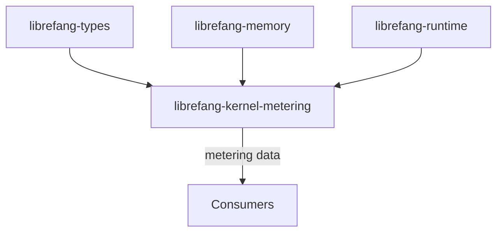

# Other — librefang-kernel-metering

# librefang-kernel-metering

Cost metering and quota enforcement for the LibreFang kernel.

## Overview

This module provides the infrastructure for tracking computational resource consumption and enforcing usage limits within the LibreFang kernel. It acts as the kernel's accounting layer — recording how much work has been performed and ensuring that consumers do not exceed their allocated quotas.

Metering in this context refers to the continuous measurement of resource usage (compute cycles, memory allocations, or other cost units), while quota enforcement is the policy mechanism that decides whether a requested operation is permitted based on current usage versus configured limits.

## Dependencies

| Crate | Role |
|---|---|
| `librefang-types` | Shared type definitions used across the kernel |
| `librefang-memory` | Memory management primitives, likely used for allocation tracking within metering |
| `librefang-runtime` | Runtime support for execution context and scheduling |
| `serde` | Serialization of metering records and quota configurations for persistence or transport |

## Architecture

The module sits between the kernel's foundational libraries (`types`, `memory`, `runtime`) and higher-level consumers that need to query or enforce resource limits. It defines the data model for metering and the logic for quota checks, but relies on external callers to integrate these checks into the execution path.

## Key Concepts

### Cost Metering

Every billable or trackable operation contributes to a metering counter. The module is responsible for:

- **Recording** cost units consumed by operations.
- **Aggregating** usage over time windows or per-tenant scopes.
- **Persisting** metering data via `serde`-based serialization for durability or reporting.

### Quota Enforcement

Quotas are the hard limits applied on top of metered usage. The enforcement layer:

- **Checks** current metered usage against configured quota thresholds.
- **Rejects** or **throttles** operations that would exceed the quota.
- **Provides** feedback to callers about remaining capacity.

## Integration Points

### Downstream Consumers

Other kernel modules and external services are expected to:

1. **Query** the current metered usage before performing expensive operations.
2. **Report** cost increments after operations complete.
3. **Subscribe** to quota exhaustion events if applicable.

### Serialization

The `serde` dependency indicates that metering records and quota configurations are serializable. This supports:

- Persisting usage data across restarts.
- Transmitting metering information to external billing or monitoring systems.
- Loading quota configurations from external sources.

## Implementation Notes

Given the module's current state (no detected execution flows or call edges), it likely consists primarily of **data structure definitions** and **pure logic functions** rather than runtime-active services. Consumers instantiate and drive the metering lifecycle themselves.

When contributing to this module:

- Keep metering logic **pure and side-effect-free** where possible — callers should control when and how state is mutated.
- Ensure all metering types derive or implement `Serialize` / `Deserialize` from `serde` for compatibility with the persistence layer.
- Avoid introducing circular dependencies with `librefang-memory` or `librefang-runtime`; this module should remain a consumer, not a provider, of those APIs.