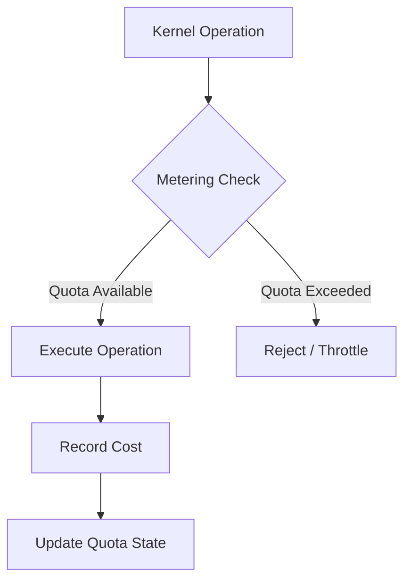

# Other — librefang-kernel-metering

# librefang-kernel-metering

Cost metering and quota enforcement for the LibreFang kernel.

## Overview

This module is responsible for tracking resource consumption and enforcing quota limits within the LibreFang kernel. It provides the infrastructure to measure computational costs associated with kernel operations and ensure that consumers stay within their allocated budgets.

Metering is a critical component for multi-tenant or resource-constrained environments where fair allocation and abuse prevention are required.

## Dependencies

| Dependency | Purpose |
|---|---|
| `librefang-types` | Shared type definitions for metering structures, cost units, and quota descriptors |
| `librefang-memory` | Memory allocation tracking — likely feeds into metering for memory-based cost calculations |
| `librefang-runtime` | Runtime context and execution state, used to attribute costs to the correct consumer |
| `serde` | Serialization support for persisting metering data, quota configurations, or transmitting metrics |

## Architecture

The typical flow involves intercepting kernel operations, checking whether the invoking context has sufficient quota, recording the actual cost after execution, and updating the remaining quota accordingly.

## Key Concepts

**Cost Units** — Operations are measured in abstract cost units rather than raw resources. This allows the kernel to express heterogeneous costs (CPU cycles, memory allocations, I/O operations) in a uniform way.

**Quotas** — Each consumer (process, tenant, or execution context) is assigned a quota representing its allowed budget of cost units over a given window.

**Enforcement Points** — Quota checks are expected to occur at boundaries where kernel resources are acquired or significant operations are initiated.

## Relationship to Other Modules

- **librefang-memory**: Memory allocations contribute to metered costs. The metering module may query memory usage statistics to derive cost values.
- **librefang-runtime**: Provides the execution context needed to identify which consumer a given operation belongs to, enabling per-context quota tracking.
- **librefang-types**: Defines the serializable structures for cost reports, quota configurations, and metering events.

## Notes

This module currently has no detected call edges in the static analysis, which may indicate that its integration points are configured at a higher level or that the module is in an early stage of development. When contributing, look for registration or hook-based patterns where metering checks are injected into kernel operation paths.