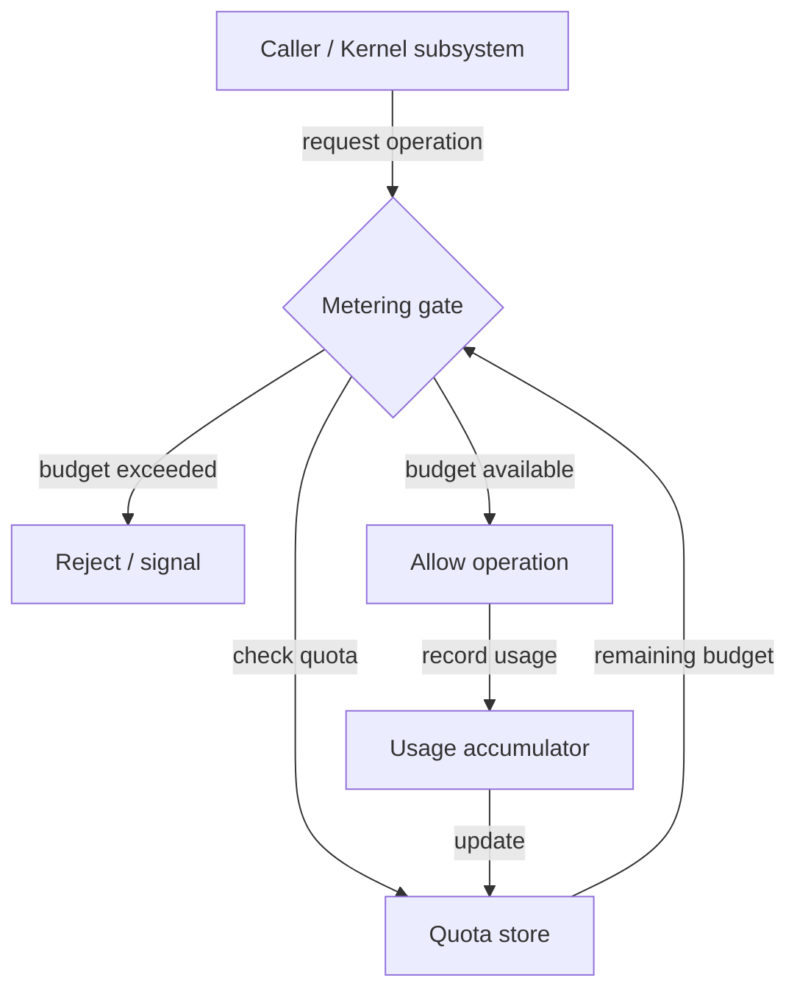

# Other — librefang-kernel-metering

# librefang-kernel-metering

Cost metering and quota enforcement for the LibreFang kernel.

## Overview

This module is responsible for tracking resource consumption and enforcing usage quotas within the LibreFang kernel. It provides the accounting layer that ensures callers cannot exceed their allocated budgets—whether those budgets are measured in compute steps, memory allocations, or other finite resources.

The module is currently in a **scaffolded state**: the package manifest and dependency graph are defined, but no execution flows or call edges have been wired yet. The documentation below describes the intended architecture based on the declared dependencies and package description.

## Intended Role

Metering sits between raw resource consumption and quota enforcement:

- **Metering** — measuring how much of a resource has been used.
- **Quota enforcement** — deciding whether a requested operation is allowed given the remaining budget, and rejecting or flagging it when the limit is exceeded.

This is a cross-cutting concern: any kernel subsystem that consumes finite resources should route through this module so that usage is consistently accounted for.

## Dependencies

| Dependency | Purpose in this module |
|---|---|
| `librefang-types` | Shared type definitions—likely includes metering-related types such as `Quota`, `UsageReport`, or `ResourceId`. |
| `librefang-memory` | Memory is a primary resource to meter. This module probably queries or hooks into the memory allocator to track allocation counts or bytes used. |
| `librefang-runtime` | Access to runtime state—likely needed to associate metering data with the current execution context (e.g., which tenant or session is consuming resources). |
| `serde` | Serialization support for persisting metering snapshots, transmitting usage data over IPC, or encoding quota configurations. |

## Expected Architecture

The expected flow is:

1. A kernel subsystem requests to perform a metered operation.
2. The metering gate checks the caller's remaining quota.
3. If the budget is exhausted, the request is rejected or a signal is raised.
4. If the budget allows, the operation proceeds and the actual consumption is recorded back into the usage accumulator.

## Integration Points

When implemented, this module is expected to be consumed by:

- **The request dispatch layer** — to meter incoming requests before they reach handlers.
- **Memory allocation paths** — to count bytes or allocations against a per-context budget.
- **Compute-heavy operations** — to enforce step or cycle limits on long-running work.

## Status

This module is **not yet implemented**. The `Cargo.toml` and dependency declarations are in place, but no types, traits, or functions have been defined. Contributions should begin by establishing the core types (quotas, usage counters, resource kinds) and the enforcement API surface.