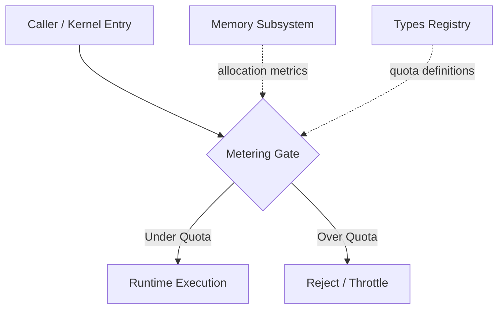

# Other — librefang-kernel-metering

# librefang-kernel-metering

Cost metering and quota enforcement for the LibreFang kernel.

## Purpose

This module is responsible for tracking resource consumption and enforcing usage quotas within the LibreFang kernel. It provides the accounting layer that ensures operations stay within defined cost boundaries — a critical function for a multi-tenant or resource-constrained runtime where unbounded usage could degrade system health.

## Dependencies

| Crate | Role |
|---|---|
| `librefang-types` | Shared type definitions — likely provides metering-related structs, enums, or trait declarations used across crates |
| `librefang-memory` | Memory subsystem access — used to query or track memory allocation as a metered resource |
| `librefang-runtime` | Runtime services — provides execution context, scheduling hooks, or runtime state needed during metering checks |
| `serde` | Serialization — metering data and quota configurations are serializable, supporting persistence or network transport |

## Position in the Architecture

The metering module sits as a gate between incoming requests and the runtime. Before work proceeds, the metering layer checks whether the caller has remaining quota. If the budget is exhausted, the request is rejected or throttled rather than being dispatched to the runtime.

## Current State

**This module has no detected execution flows, internal call graph, or incoming/outgoing calls.** This indicates one of the following:

1. **Placeholder / Stub** — The module has been scaffolded with its dependency declarations and Cargo metadata but does not yet contain implemented logic.
2. **Type-only definitions** — The module may export traits, structs, or constants consumed elsewhere without containing executable call paths of its own.
3. **Integration not yet wired** — The metering logic exists but has not been connected to the kernel's dispatch path.

When contributing to this module, check the source files (which were not provided in this analysis) to determine which case applies.

## Expected Responsibilities

Based on the crate's name and description, a complete implementation would be expected to cover:

- **Cost accounting** — Accumulating resource consumption per tenant, session, or operation type.
- **Quota storage and lookup** — Maintaining configurable limits and comparing current usage against them.
- **Enforcement decisions** — Returning accept/reject/throttle results that the kernel dispatch layer acts on.
- **Metric export** — Exposing metering data via `serde`-serializable structures for monitoring or billing.

## Contributing

When implementing or extending this module, keep the following in mind:

- **No side-effect coupling.** Metering should be observable but not alter the behavior of the operations it measures, except through explicit quota rejection.
- **Serialization stability.** Anything annotated with `serde` derives must maintain wire-compatible shapes — avoid renaming fields without providing rename attributes.
- **Dependency discipline.** The crate depends on `librefang-types`, `librefang-memory`, and `librefang-runtime` — do not add new dependencies without assessing whether the functionality belongs in one of those existing crates instead.