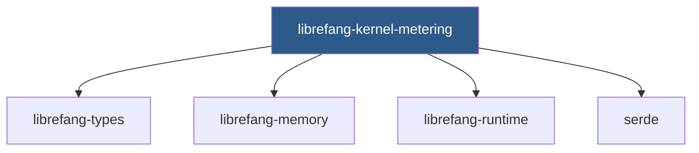

# Other — librefang-kernel-metering

# librefang-kernel-metering

Cost metering and quota enforcement for the LibreFang kernel.

## Purpose

This module provides the metering layer responsible for tracking resource consumption and enforcing usage quotas within the LibreFang kernel. It serves as the economic and resource governance component, ensuring that operations stay within defined budget and quota boundaries.

Metering in this context refers to the measurement and accounting of computational costs — such as memory allocations, execution time, or operation counts — while quota enforcement acts on those measurements to prevent runaway or unauthorized resource consumption.

## Dependencies

| Crate | Role |
|-------|------|
| `librefang-types` | Shared type definitions used across the kernel |
| `librefang-memory` | Memory allocation tracking and management |
| `librefang-runtime` | Runtime primitives and execution context |
| `serde` | Serialization support for persisting or transmitting metering data |

## Architecture

The module sits at the intersection of three core kernel crates. It draws type definitions from `librefang-types`, uses `librefang-memory` to ground its understanding of memory costs, and hooks into `librefang-runtime` for execution-level metering. The `serde` dependency enables metering data — such as usage snapshots or quota configurations — to be serialized for logging, reporting, or persistence.

## Key Concepts

### Metering

Metering involves instrumenting kernel operations to record their resource cost. This provides the raw data needed to answer questions like:

- How much memory has a session or tenant consumed?
- How many operations have been executed?
- Is a particular code path more expensive than expected?

### Quota Enforcement

Quota enforcement builds on metering data by comparing current usage against configured limits. When a quota is exceeded, the enforcement layer takes action — typically by rejecting the operation, signaling an error, or throttling further requests.

## Integration Notes

When integrating with this module:

- **Reading metering data.** Consumers should rely on the serialized forms exposed through `serde`-compatible types for structured access to usage statistics.
- **Setting quotas.** Quota thresholds are expected to be expressed in terms of the types defined in `librefang-types`, ensuring consistency across the kernel.
- **Memory-sensitive operations.** Any code path that allocates through `librefang-memory` should consider whether metering is required for that allocation class.