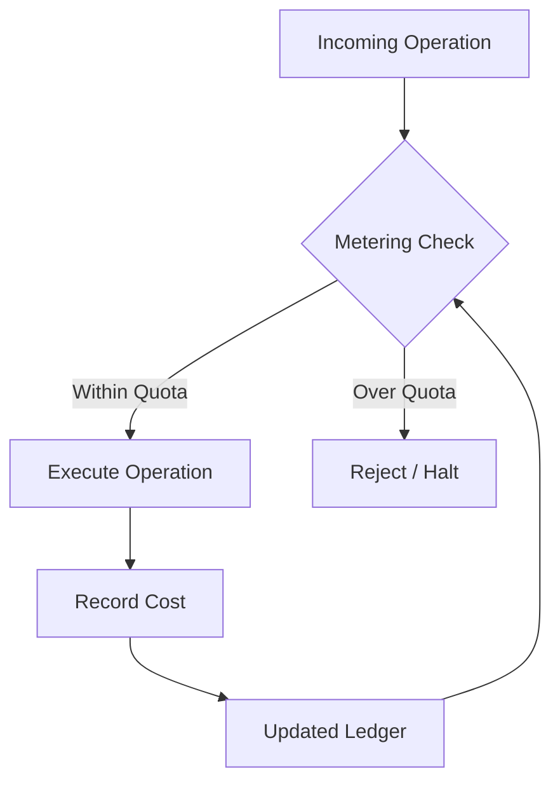

# Other — librefang-kernel-metering

# librefang-kernel-metering

Cost metering and quota enforcement for the LibreFang kernel.

## Overview

This crate provides the accounting and quota infrastructure that tracks resource consumption during kernel operations. It is responsible for metering computational costs — such as memory allocations, API calls, or execution time — and enforcing limits before resources are exhausted.

## Purpose in the Kernel

LibreFang meters resource usage to prevent runaway or malicious workloads from consuming unbounded kernel resources. This module acts as the ledger and gatekeeper:

- **Metering**: Recording resource consumption as operations occur.
- **Quota enforcement**: Rejecting or halting operations when a configured limit is breached.

## Dependencies

| Dependency | Role |
|---|---|
| `librefang-types` | Shared types used across the kernel — likely provides metering-related type definitions, cost units, or quota descriptors. |
| `librefang-memory` | Memory subsystem — metering likely intercepts or queries allocation state to track memory costs. |
| `librefang-runtime` | Runtime support — provides the execution context in which metering checks occur (e.g., per-request or per-session contexts). |
| `serde` | Serialization — quota configurations and metering snapshots are likely serializable for persistence or transport. |

## Architectural Position

Every operation that carries a cost flows through the metering layer. The ledger is updated after successful execution, and the accumulated total is checked before the next operation proceeds.

## Current Status

This module is in an early or stub state. No internal types, functions, or execution flows have been implemented yet. The dependency graph and package description define its intended scope, but the public API has not been populated.

## Expected Conventions

When contributing to this module, follow these patterns consistent with the rest of the LibreFang kernel:

- **Cost types** should be newtypes or structs deriving `serde::Serialize` / `serde::Deserialize` for portability.
- **Quota configuration** should be decoupled from enforcement logic — accept quota parameters rather than hardcoding limits.
- **Metering checks** should be cheap, synchronous, and infallible when within quota. Rejection paths should return a clear error type (likely defined in `librefang-types`).
- **State** should be scoped to a context (session, request, tenant) rather than global, to support concurrent workloads.