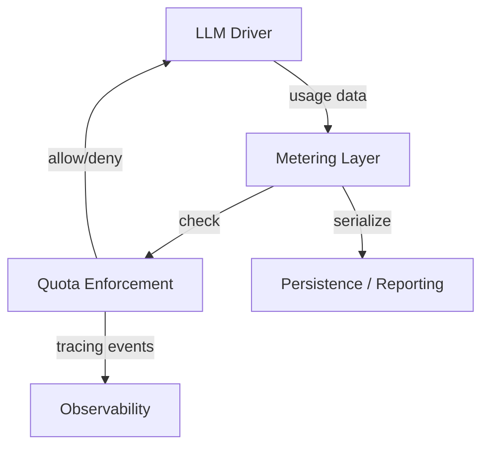

# Other — librefang-kernel-metering

# librefang-kernel-metering

Cost metering and quota enforcement for the LibreFang kernel.

## Purpose

This module is responsible for tracking resource consumption during LLM operations and enforcing configured quotas. It provides the accounting layer that ensures LibreFang operations stay within defined cost and usage boundaries.

## Dependencies

| Crate | Role |
|---|---|
| `librefang-types` | Shared types used across the kernel, likely including metering-related data structures |
| `librefang-memory` | Memory management for metering state and counters |
| `librefang-runtime` | Runtime context, likely providing access to the current execution environment and quota configuration |
| `librefang-llm-driver` | LLM driver interface — the primary source of billable operations (token usage, API calls) |
| `serde` | Serialization of metering records for persistence or reporting |
| `tracing` | Instrumentation for observability of quota decisions and cost accumulation |

## Architecture

```mermaid
graph TD
    A[LLM Driver] -->|usage data| B[Metering Layer]
    B -->|check| C[Quota Enforcement]
    C -->|allow/deny| A
    B -->|serialize| D[Persistence / Reporting]
    C -->|tracing events| E[Observability]
```

The module sits between the LLM driver and the rest of the kernel. When an LLM call completes, usage data flows into the metering layer. Before new calls proceed, quota enforcement checks accumulated usage against configured limits.

## Key Concepts

**Metering** — The process of recording resource consumption (e.g., prompt tokens, completion tokens, API calls) associated with LLM operations.

**Quota Enforcement** — The gating mechanism that evaluates accumulated usage against configured thresholds and decides whether to allow or deny subsequent operations.

## Current State

The module currently has no detected execution flows, which indicates it is in an early stage of development. The dependency footprint suggests the intended integration points are:

- Hooking into `librefang-llm-driver` to capture per-request token counts and latency.
- Using `librefang-runtime` to read quota configuration for the current session or tenant.
- Persisting metering snapshots through `serde`-based serialization.
- Emitting structured `tracing` events when quotas are approached or exceeded.

## Integration Notes

When implementing or extending this module, be aware of the following:

- **Granularity**: Metering should track at minimum per-request token counts (prompt and completion separately) and total API call count. Consider also tracking latency and error rates if those factor into cost models.
- **Quota boundaries**: Quotas may apply at multiple levels — per-conversation, per-session, per-tenant, or globally. Design enforcement to support at least one configurable scope.
- **Serialization format**: Any metering records that need persistence should derive `Serialize` / `Deserialize` via `serde`. Keep serialized representations stable across versions.
- **Observability**: Use `tracing::info!` or `tracing::warn!` at quota boundaries. Emit structured fields (tokens consumed, tokens remaining, quota limit) rather than formatted strings.