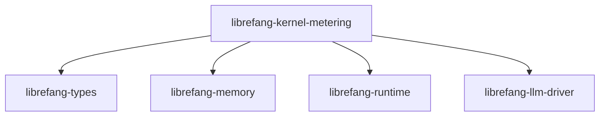

# Other — librefang-kernel-metering

# librefang-kernel-metering

Cost metering and quota enforcement for the LibreFang kernel.

## Purpose

This module is responsible for tracking resource consumption during LLM inference operations and enforcing configurable quota limits. It serves as the kernel's gatekeeper—ensuring that workloads stay within their allocated budgets and providing visibility into cost accumulation over time.

## Position in the Architecture

```mermaid
graph TD
    A[librefang-kernel-metering] --> B[librefang-types]
    A --> C[librefang-memory]
    A --> D[librefang-runtime]
    A --> E[librefang-llm-driver]
```

Metering sits at the intersection of several kernel subsystems. It consumes type definitions from `librefang-types`, tracks memory allocations through `librefang-memory`, hooks into the runtime lifecycle via `librefang-runtime`, and correlates costs with LLM driver operations through `librefang-llm-driver`.

## Dependencies

| Dependency | Role |
|---|---|
| `librefang-types` | Shared type definitions for metering counters, quota configurations, and cost units |
| `librefang-memory` | Tracking memory allocation and deallocation events for resource accounting |
| `librefang-runtime` | Integration with the runtime execution loop to intercept and measure operation boundaries |
| `librefang-llm-driver` | Correlating metering data with specific LLM inference calls and token throughput |
| `serde` | Serialization of metering reports and quota configurations |
| `tracing` | Structured logging of quota violations, cost thresholds, and metering events |

## Core Concepts

### Cost Metering

Every operation that consumes measurable resources—tokens processed, memory allocated, inference calls made—should be accounted for here. The metering layer acts as a central ledger, accumulating costs as work proceeds.

### Quota Enforcement

Beyond passive measurement, this module enforces hard limits. When a workload exceeds its configured quota, the enforcement layer halts further execution and surfaces an appropriate error. This prevents runaway costs and ensures fair resource distribution.

## Implementation Status

This module is currently a scaffold. No execution flows or call graphs have been wired yet. The dependency declarations establish the integration surface; concrete metering logic and quota enforcement are pending implementation.

## Integration Points

When implementing consumers of this module, expect to:

1. **Initialize** a metering context before beginning a workload, passing in quota configuration.
2. **Record** resource consumption events as they occur during execution.
3. **Check** quota status at natural boundaries (e.g., between inference steps) to allow early termination.
4. **Collect** a final metering report on workload completion for auditing and reporting.