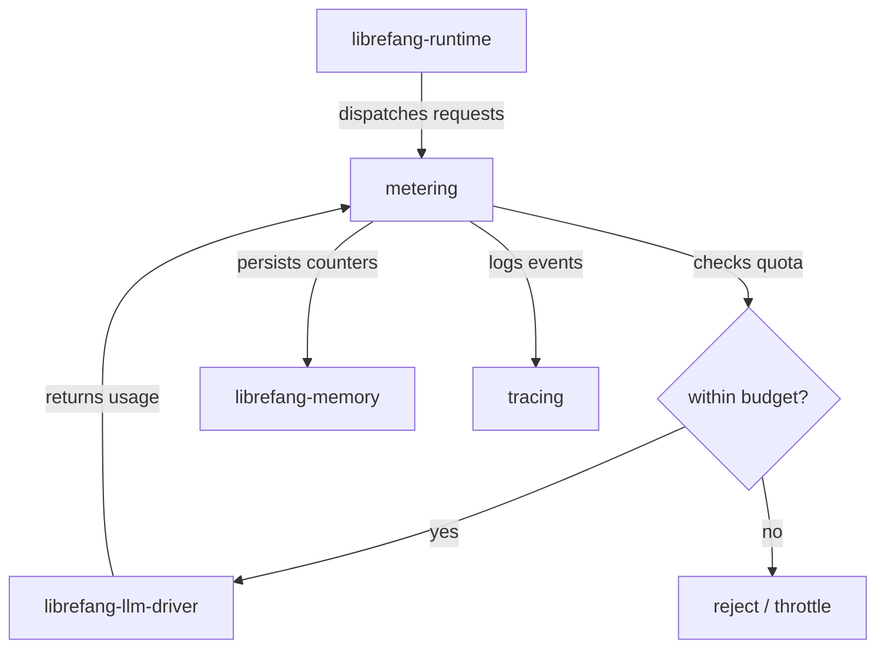

# Other — librefang-kernel-metering

# librefang-kernel-metering

Cost metering and quota enforcement for the LibreFang kernel.

## Overview

This crate is responsible for tracking resource consumption and enforcing spending limits within the LibreFang system. It acts as the financial control layer between the kernel and LLM driver operations, ensuring that no session or tenant exceeds its allocated budget.

## Purpose

In an LLM-driven kernel environment, every inference call incurs cost. This module exists to:

- **Meter** resource usage by tracking token counts, inference requests, and associated costs per session or tenant.
- **Enforce quotas** by rejecting or throttling operations when a budget threshold is reached.
- **Report** consumption metrics back to the runtime for observability and auditing.

## Dependencies

The crate sits at a middle layer in the LibreFang stack, pulling in both low-level primitives and higher-level runtime facilities:

| Dependency | Role |
|---|---|
| `librefang-types` | Shared types for cost units, quota configurations, and metering identifiers |
| `librefang-memory` | Memory-backed state storage for metering counters and budget ledgers |
| `librefang-runtime` | Integration with the kernel's execution context and lifecycle hooks |
| `librefang-llm-driver` | Visibility into LLM request/response metadata (token counts, model pricing) |
| `serde` | Serialization of metering records and quota definitions |
| `tracing` | Structured logging of quota breaches, cost events, and enforcement decisions |

## Architecture

```mermaid
graph TD
    RT[librefang-runtime] -->|dispatches requests| M[metering]
    M -->|checks quota| Q{within budget?}
    Q -->|yes| LD[librefang-llm-driver]
    LD -->|returns usage| M
    M -->|persists counters| MEM[librefang-memory]
    M -->|logs events| TRACING[tracing]
    Q -->|no| REJECT[reject / throttle]
```

The metering layer intercepts operations before they reach the LLM driver. Each request is evaluated against the current consumption state. If the operation would exceed the configured quota, it is rejected outright or throttled depending on policy. Successful operations have their cost recorded to memory for future quota checks.

## Key Concepts

### Metering vs. Quota Enforcement

These are two distinct responsibilities within the crate:

- **Metering** is the passive recording of resource consumption. It accumulates costs without making decisions.
- **Quota enforcement** is the active gating layer that consults metering state and decides whether to allow or block an operation.

### Cost Units

Costs are tracked using types from `librefang-types`. The granularity depends on the pricing model — typically token-based (prompt tokens, completion tokens) but extensible to other units (requests, wall-clock time).

### Quota Scope

Quotas can apply at different scopes:

- **Per-session** — limits for a single conversation or task
- **Per-tenant** — aggregate limits across all sessions for a given identity
- **Global** — system-wide spending caps

The specific scope hierarchy is defined by configuration passed in at initialization.

## Integration Points

### With the Runtime

The runtime invokes metering checks as part of its request dispatch pipeline. The metering layer must respond synchronously with an allow/deny decision before the runtime proceeds to call the LLM driver.

### With the LLM Driver

After an LLM call completes, the driver returns usage metadata (token counts, latency). The metering layer consumes this to update its counters. This feedback loop is critical for accurate accounting.

### With Memory

All persistent metering state lives in `librefang-memory`. This allows the kernel to recover metering state across restarts and ensures that quota enforcement is durable.

## Current Status

The crate is in early development. The `Cargo.toml` and dependency graph are established, but the implementation surface (public APIs, trait definitions, enforcement logic) has not yet been populated. The dependency selections indicate the intended integration surface described above.

## Contribution Notes

When implementing this crate:

1. **Define types first.** Establish the core metering and quota types in coordination with `librefang-types`.
2. **Keep enforcement synchronous.** The runtime needs a fast allow/deny answer; avoid async I/O in the hot path of quota checks.
3. **Use `tracing` for all enforcement decisions.** Every quota breach, threshold warning, and cost record should be emitted as a structured trace event.
4. **Design for pluggable pricing.** Token-based pricing is the default, but the metering interface should not assume a specific cost model.