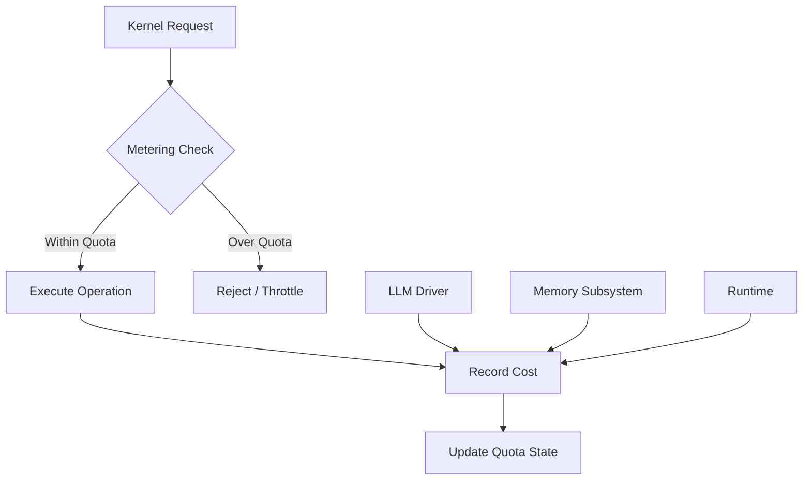

# Other — librefang-kernel-metering

# librefang-kernel-metering

Cost metering and quota enforcement for the LibreFang kernel.

## Overview

This module is responsible for tracking resource consumption costs and enforcing quota limits within the LibreFang kernel. It acts as the gatekeeper that ensures LLM operations stay within configured budget and usage boundaries.

Based on its dependency footprint, metering covers:

- **Memory allocation costs** — via `librefang-memory`
- **Runtime resource usage** — via `librefang-runtime`
- **LLM API call costs** (tokens, requests) — via `librefang-llm-driver`

All metering data structures support serialization through `serde`, enabling persistence of usage records and quota state. Observability is provided through the `tracing` crate.

## Dependencies

| Dependency | Purpose |
|---|---|
| `librefang-types` | Shared types for metering events, quota configurations, and cost units |
| `librefang-memory` | Tracking memory allocation and deallocation for cost accounting |
| `librefang-runtime` | Measuring runtime resource consumption (CPU time, wall clock) |
| `librefang-llm-driver` | Extracting token counts and per-request cost from LLM API responses |
| `serde` | Serializing metering records and quota state for persistence |
| `tracing` | Emitting structured logs for cost events and quota violations |

## Conceptual Architecture

```mermaid
graph TD
    A[Kernel Request] --> B{Metering Check}
    B -->|Within Quota| C[Execute Operation]
    B -->|Over Quota| D[Reject / Throttle]
    C --> E[Record Cost]
    E --> F[Update Quota State]
    G[LLM Driver] --> E
    H[Memory Subsystem] --> E
    I[Runtime] --> E
```

## Integration Points

This module is designed to be called by other kernel subsystems that need to check quotas before performing costly operations, and to report costs after operations complete. Downstream consumers of metering data (billing dashboards, audit logs, alerting) would read the serialized output this module produces.

## Status

The module is currently in early development. No internal or external call flows have been wired yet — the dependency declarations and package metadata define the intended scope and integration surface.