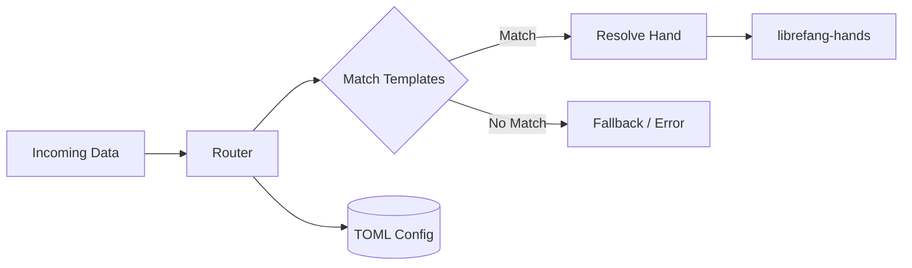

# Other — librefang-kernel-router

# librefang-kernel-router

Hand/Template routing engine for the LibreFang kernel.

## Overview

This module implements the routing logic that maps incoming requests to the appropriate **Hand** implementations based on template-matching rules. It serves as the dispatch layer between raw input and the hand execution pipeline, determining which hand should handle a given input by evaluating routing templates against the request data.

## Purpose

In the LibreFang kernel, a "Hand" is a named handler unit. The router's job is to:

1. **Load routing configuration** from TOML-based config files found in standard platform directories.
2. **Match incoming data** against registered templates using pattern-matching (regex-based).
3. **Dispatch** to the correct hand, passing along any captured parameters.

## Dependencies

| Dependency | Role |
|---|---|
| `librefang-types` | Shared type definitions used across the kernel |
| `librefang-hands` | Hand definitions and hand registry/access |
| `serde_json` | Deserialization of JSON-formatted request data |
| `regex-lite` | Lightweight regex engine for template pattern matching |
| `toml` | Parsing of routing configuration files |
| `dirs` | Resolving platform-specific config directories |
| `tracing` | Structured logging and diagnostics |

### Dev Dependencies

- **`tempfile`** — Used in tests for creating temporary config files.
- **`librefang-runtime`** — Integration-level test support via the runtime environment.

## Architecture

The router sits between raw input and the hands layer. It loads its routing table from TOML configuration at startup, then evaluates incoming data against the registered templates in order, selecting the first matching hand.

## Configuration

Routing rules are defined in TOML files. The module uses the `dirs` crate to locate configuration in standard platform directories (e.g., `~/.config/librefang/` on Linux). Configuration is parsed at initialization time to build the routing table.

## Relationship to Other Modules

- **`librefang-types`** — The router consumes types that represent incoming data and routing results.
- **`librefang-hands`** — After routing resolves a match, the target hand is looked up and invoked through this module.
- **`librefang-runtime`** — The runtime orchestrates the full pipeline, calling into the router as part of request processing. This dependency is test-only, used for integration validation.

## Testing

Tests use `tempfile` to create isolated temporary directories with controlled TOML configuration files, allowing routing behavior to be verified without touching the user's actual config. The `librefang-runtime` dev-dependency supports end-to-end integration tests that exercise routing through the full kernel pipeline.