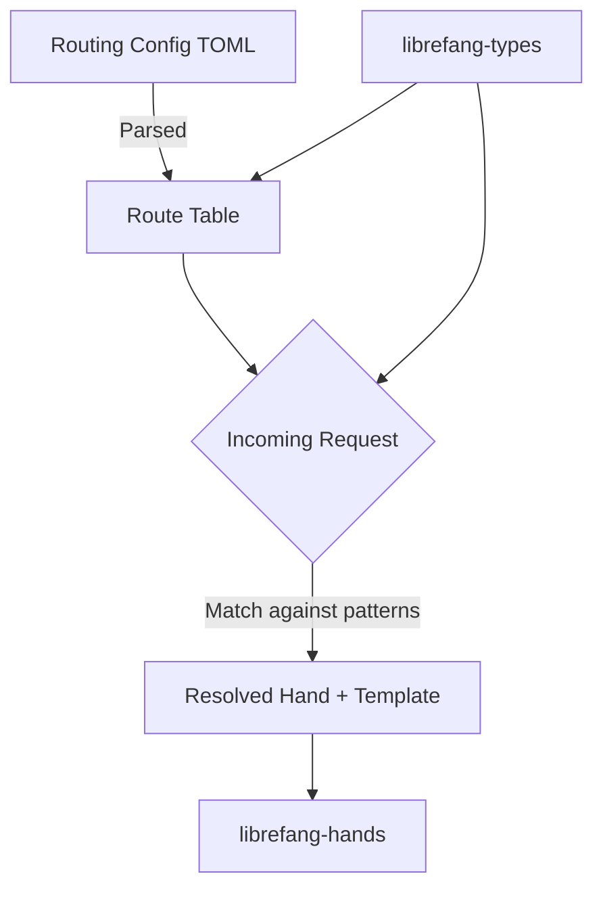

# Other — librefang-kernel-router

# librefang-kernel-router

Hand and template routing engine for the LibreFang kernel. This module is responsible for resolving incoming requests to the appropriate **hand** (handler) and **template** based on configurable routing rules.

## Overview

LibreFang processes requests through named *hands*—discrete handler units that encapsulate specific behavior. The router determines which hand (and which template variant) should handle a given input by evaluating a routing table of pattern-matching rules.

The routing table is loaded from TOML configuration files discovered on the local filesystem. Rules are expressed as regex patterns matched against request identifiers, with priority and fallback semantics governing conflict resolution.

## Dependencies

| Crate | Purpose |
|---|---|
| `librefang-types` | Shared type definitions (request identifiers, route entries, errors) |
| `librefang-hands` | Hand registry and hand trait definitions |
| `serde` / `serde_json` | Deserialization of routing tables and serialization of route resolution results |
| `regex-lite` | Pattern matching for route rule evaluation |
| `toml` | Parsing of routing configuration files |
| `dirs` | Resolving platform-specific config directory paths |
| `tracing` | Structured logging of route resolution decisions |

### Dev Dependencies

- **`tempfile`** — Creates isolated temporary directories for config-loading tests.
- **`librefang-runtime`** — Provides the runtime context needed for integration tests that exercise full route resolution.

## Architecture



### Route Table

The routing table is a declarative mapping loaded from TOML. Each entry associates a regex pattern with a target hand name and an optional template name. On startup, the router reads configuration from a platform-appropriate directory (resolved via `dirs`) and compiles the patterns into matchers.

### Resolution Strategy

When resolving a request, the router evaluates rules in a defined order. The first pattern that matches the request identifier determines the target hand and template. If no rule matches, a fallback or error result is returned depending on configuration.

The `tracing` crate is used to emit diagnostic events during resolution, aiding debugging of misconfigured or ambiguous routes.

## Integration with the Kernel

This module sits between the raw request layer and the hand execution layer:

1. **Input** — A request identifier (typed via `librefang-types`).
2. **Processing** — The router matches the identifier against its compiled route table using `regex-lite`.
3. **Output** — A resolved hand name and template name, which the kernel then dispatches to the appropriate handler from `librefang-hands`.

## Configuration

Routing rules are defined in TOML files located in the LibreFang configuration directory. The `dirs` crate resolves the platform-specific config path (e.g., `~/.config/librefang/` on Linux).

Example structure of a routing configuration:

```toml
[[route]]
pattern = "^greeting\\..*"
hand = "greeting-hand"
template = "default"

[[route]]
pattern = "^farewell\\..*"
hand = "farewell-hand"
template = "default"
```

Rules are evaluated in file order. More specific patterns should be listed before broader catch-all patterns.

## Testing

Unit tests use `tempfile` to create isolated config directories, ensuring tests don't depend on the host system's LibreFang configuration. Integration tests pull in `librefang-runtime` to exercise the full resolution pipeline from config loading through hand dispatch.