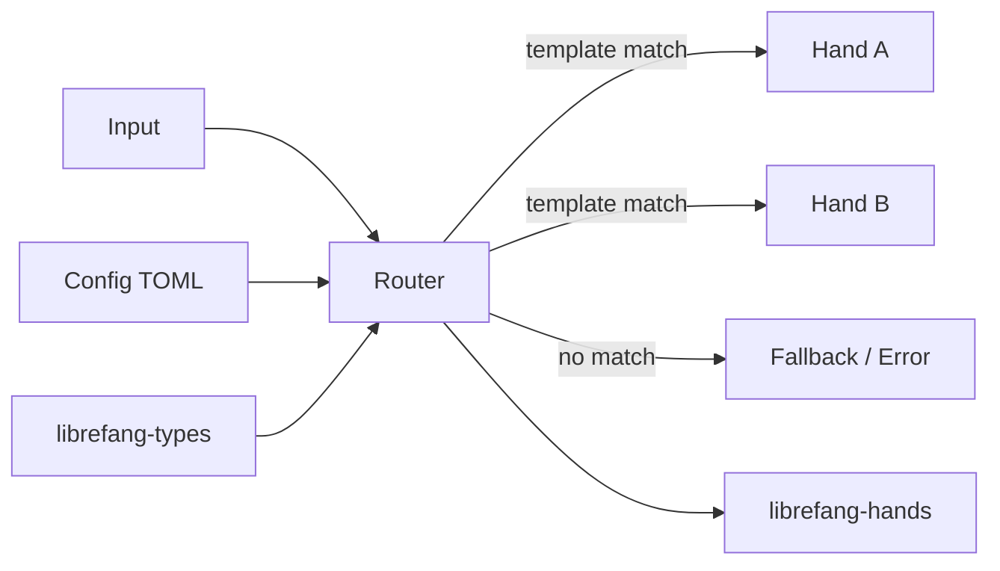

# Other — librefang-kernel-router

# librefang-kernel-router

Hand and template routing engine for the LibreFang kernel. This module is responsible for matching incoming input against registered templates and routing execution to the appropriate hand.

## Purpose

The router sits between raw input and the LibreFang kernel's hand execution layer. Its job is to:

1. Maintain a registry of available hands and their associated templates.
2. Match incoming requests against template patterns.
3. Resolve the correct hand to invoke based on that match.

This decouples input recognition from hand execution, allowing hands to be added, removed, or reconfigured without modifying the kernel's core dispatch logic.

## Dependencies

| Dependency | Role |
|---|---|
| `librefang-types` | Shared type definitions used across the LibreFang workspace |
| `librefang-hands` | Hand definitions and hand management |
| `regex-lite` | Lightweight regular expression matching for template patterns |
| `serde_json` | JSON serialization for template data and routing configuration |
| `toml` | Parsing of TOML-based routing configuration files |
| `dirs` | Resolving platform-specific configuration and data directories |
| `tracing` | Structured logging and diagnostics |

`librefang-runtime` and `tempfile` are available in tests for integration-style validation of routing behavior.

## Architecture

The router loads template-to-hand mappings from configuration (typically TOML files resolved via the `dirs` crate), uses `regex-lite` to match incoming input against registered templates, and delegates to the appropriate hand from `librefang-hands`.

## Configuration

Routing rules are defined in TOML. The `dirs` crate is used to locate configuration files in platform-appropriate directories (e.g., `~/.config/librefang/` on Linux).

## Testing

Integration tests use `librefang-runtime` to exercise the full routing pipeline end-to-end. `tempfile` supports creating transient configuration files for isolated test scenarios.

## Workspace Integration

This crate is part of the LibreFang workspace. It depends on `librefang-types` for shared types and `librefang-hands` for hand definitions. It does not depend on `librefang-runtime` in production builds — that relationship is test-only.