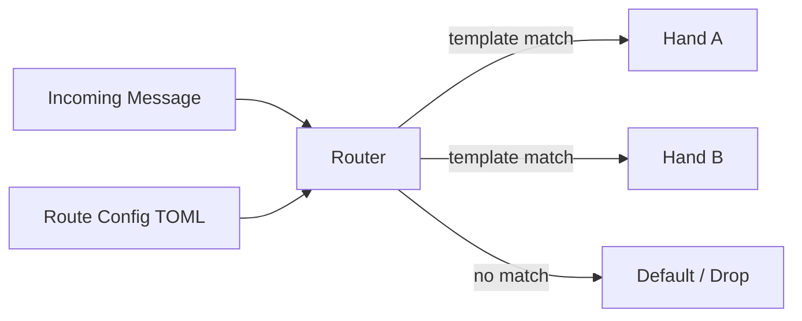

# Other — librefang-kernel-router

# librefang-kernel-router

Hand and template routing engine for the LibreFang kernel. This module is responsible for matching incoming kernel messages to registered **hands** based on configurable **template** patterns, loading route definitions from configuration files, and dispatching execution to the appropriate handler.

## Purpose

Within the LibreFang kernel, multiple hands (message handlers) can be registered to process different types of events or data. The router sits between message ingestion and hand execution, determining **which** hand should handle **which** message based on template-matching rules.

This decouples hand registration from message dispatch, allowing new hands to be added or existing routes modified without changes to the kernel's core message loop.

## Architecture

The router loads a set of route definitions (typically from TOML configuration), each associating a **template pattern** with a **hand identifier**. When a message arrives, the router evaluates it against all registered templates and dispatches to the first matching hand.

## Key Dependencies

| Dependency | Role in this module |
|---|---|
| `librefang-types` | Shared type definitions for messages, hand identifiers, and route descriptors |
| `librefang-hands` | Hand registry and trait definitions; the router resolves route targets against this |
| `regex-lite` | Powers template pattern matching for route evaluation |
| `serde` / `serde_json` | Deserialization of route definitions and message payloads |
| `toml` | Parsing of TOML-based route configuration files |
| `dirs` | Resolves platform-specific config directories for route file discovery |
| `tracing` | Structured logging of route resolution, matches, and misses |

## Route Configuration

Routes are defined in TOML files, discovered via platform-standard configuration directories (resolved through the `dirs` crate). The typical structure involves:

- **Template**: A pattern string (evaluated with `regex-lite`) tested against incoming message content.
- **Hand**: An identifier corresponding to a hand registered in `librefang-hands`.
- **Priority** (optional): Controls evaluation order when multiple templates could match.

Configuration is loaded at kernel startup and can define any number of routes. The router evaluates them in priority order, dispatching to the first hand whose template matches.

## Template Matching

Templates use regular expression syntax supported by `regex-lite`. When a message arrives, its content is tested against each registered template pattern. The router selects the highest-priority matching route and resolves the associated hand through the hand registry provided by `librefang-hands`.

Unmatched messages are either routed to a configured default hand or dropped, depending on kernel configuration.

## Integration with the Kernel

This module is a library crate consumed by the LibreFang kernel's message loop. The kernel:

1. Initializes the router by loading route configuration.
2. Passes each incoming message to the router for resolution.
3. Receives back the matched hand identifier (or nothing).
4. Dispatches execution to the resolved hand via `librefang-hands`.

The router itself has no direct outgoing calls to other kernel modules — it returns resolution results to its caller, keeping the dispatch decision separate from dispatch execution.

## Testing

Tests use `tempfile` to create temporary configuration files and `librefang-runtime` to simulate a minimal kernel environment for end-to-end route resolution scenarios.

When writing tests:

- Create a temp directory and write a TOML route config file.
- Register mock hands via `librefang-hands`.
- Initialize the router with the temp config path.
- Assert that test messages resolve to the expected hands.
- Verify that unmatched messages behave correctly (default route or no match).