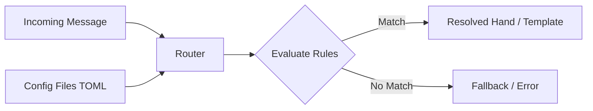

# Other — librefang-kernel-router

# librefang-kernel-router

Routing engine that resolves incoming messages to the correct **Hand** and **Template** handlers within the LibreFang kernel.

## Purpose

In the LibreFang architecture, incoming messages must be dispatched to the appropriate handler based on their content, type, or metadata. This module owns that dispatch logic. It maintains a registry of routing rules—pairing match conditions with target Hands and Templates—and evaluates incoming payloads against those rules to determine where execution should land.

## Core Concepts

### Hands

Hands are the executable handler units provided by `librefang-hands`. A Hand encapsulates the logic for processing a specific category of input. The router's job is to select the correct Hand for any given message.

### Templates

Templates define structural patterns that messages are expected to conform to. The router matches incoming messages against template patterns to identify which processing path to take.

### Routing Rules

A routing rule consists of:

- A **match condition** — the predicate that determines whether a rule applies to a given message. Conditions may involve pattern matching (via `regex-lite`), structural checks (via `serde_json`), or configuration-driven criteria (via `toml`).
- A **target** — the Hand or Template that should handle the message when the condition is satisfied.

## Dependencies and Their Roles

| Dependency | Role in This Module |
|---|---|
| `librefang-types` | Shared type definitions for messages, route descriptors, and cross-module data structures |
| `librefang-hands` | Provides the Hand abstractions that routes resolve to |
| `serde_json` | Inspects and deserializes JSON message payloads during route evaluation |
| `regex-lite` | Pattern-based matching within routing conditions |
| `toml` | Parses routing configuration from TOML files |
| `dirs` | Resolves platform-specific config directories where routing tables are stored |
| `tracing` | Emits structured log events for route resolution, misses, and errors |

## Architecture

The router loads its rule set from configuration (TOML files located via `dirs`). At dispatch time, it evaluates the message against each rule's match condition, returning the first matching target. The resolved target is then handed off to the kernel's execution layer.

## Configuration

Routing rules are defined in TOML. The module uses `dirs` to locate the appropriate configuration directory for the platform, then parses routing tables with `toml`. This allows route definitions to be managed externally without recompilation.

## Testing

Tests use `tempfile` to create isolated temporary directories for config files, ensuring routing logic can be verified without touching the user's actual configuration. The `librefang-runtime` dev-dependency provides a minimal runtime context for integration-level test scenarios.

## Integration Points

This module sits between message ingestion and handler execution in the LibreFang kernel:

- **Upstream consumers** pass raw or parsed messages into the router.
- **Downstream** it produces resolved route targets (Hand/Template references) that the kernel's executor acts on.
- It depends on `librefang-types` for shared vocabulary with the rest of the codebase, and on `librefang-hands` for the concrete handler types it resolves to.