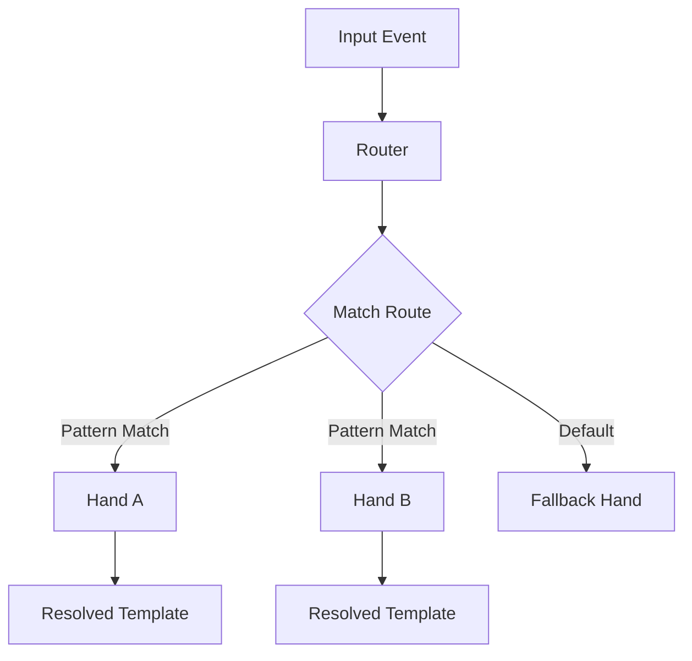

# Other — librefang-kernel-router

# librefang-kernel-router

Hand/Template routing engine for the LibreFang kernel.

## Overview

`librefang-kernel-router` provides the routing logic that maps incoming requests or events to the appropriate **Hand** definitions and **Templates** within the LibreFang kernel. It acts as the central dispatch layer, determining which hand should handle a given input based on configurable routing rules.

## Architecture

The router evaluates routing rules—defined via pattern matching—against incoming data and resolves the target hand. Each hand may further resolve to a template for response generation or processing.

## Key Concepts

### Hands

Hands are the primary processing units that the router dispatches to. The router depends on `librefang-hands` for hand definitions and lifecycle management. A hand encapsulates the logic for handling a specific category of input.

### Templates

Templates define the structure or format of outputs associated with a hand. The router resolves which template to use as part of the routing decision.

### Routing Rules

Routing rules are the core configuration that drives dispatch behavior. Rules are defined in TOML format and use pattern matching (via `regex-lite`) to match against incoming data characteristics. The router evaluates rules in priority order and selects the first matching hand.

## Dependencies

| Dependency | Purpose |
|---|---|
| `librefang-types` | Shared type definitions used across the kernel |
| `librefang-hands` | Hand definitions and management |
| `serde` / `serde_json` | Serialization of routing configuration and match results |
| `regex-lite` | Lightweight pattern matching for route evaluation |
| `toml` | Parsing TOML-based routing configuration files |
| `dirs` | Resolving platform-specific configuration directories |
| `tracing` | Structured logging and diagnostics |

### Development Dependencies

- **`tempfile`** — Used in tests for temporary configuration files.
- **`librefang-runtime`** — Provides the runtime context for integration tests that exercise the full routing pipeline.

## Configuration

Routing rules are loaded from TOML configuration files. The `dirs` crate is used to locate platform-appropriate configuration directories, allowing user-level and system-level routing overrides.

## Integration Points

This module sits between the input layer and the hand execution layer within the LibreFang kernel:

- **Upstream consumers** pass raw input to the router for dispatch.
- **Downstream**, the router resolves a `librefang-hands` hand instance and its associated template.
- **`librefang-types`** provides the shared types that both the router and its consumers rely on for type-safe communication.

## Testing

Tests use `tempfile` to create isolated configuration environments and `librefang-runtime` to bootstrap a minimal runtime context. This allows integration tests to exercise the full routing pipeline—from loading configuration through to hand resolution—without affecting system state.