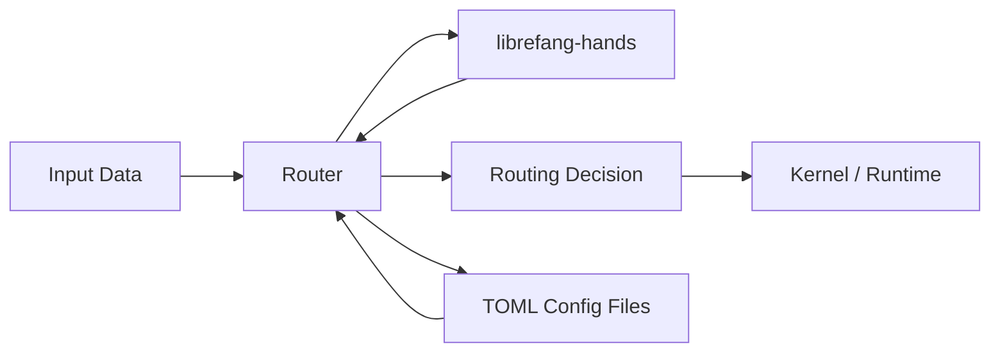

# Other — librefang-kernel-router

# librefang-kernel-router

Hand and template routing engine for the LibreFang kernel. This module is responsible for resolving incoming input to the correct hand definition and template, serving as the primary dispatch layer between raw input and kernel execution.

## Purpose

When the LibreFang kernel receives input (typically from a character or stroke recognition pipeline), it needs to determine which *hand* — a defined gesture or character shape — the input matches, and which *template* governs that match. The router owns this resolution logic, including:

- Loading and caching hand/template definitions from configuration files.
- Pattern matching incoming stroke data against registered hands.
- Scoring and ranking candidate matches.
- Returning routing decisions to the kernel for downstream processing.

## Architecture

The router sits between the type system (`librefang-types`) and the hand definitions (`librefang-hands`), consuming structured input and producing routing outcomes.



## Dependencies

| Crate | Purpose |
|-------|---------|
| `librefang-types` | Core type definitions used across all LibreFang crates — stroke data, match results, routing tables. |
| `librefang-hands` | Hand and template definitions that the router loads, indexes, and matches against. |
| `serde` / `serde_json` | Deserialization of configuration files and serialization of routing state. |
| `regex-lite` | Lightweight regex support for pattern-based template matching rules. |
| `toml` | Parsing of TOML-based hand and template configuration files. |
| `dirs` | Resolving platform-specific configuration directories where hand/template definitions are stored. |
| `tracing` | Structured logging of routing decisions, match scores, and diagnostic information. |

## Configuration Loading

The router uses `dirs` to locate platform-appropriate configuration directories and `toml` to parse hand/template definition files. Configuration is typically loaded at startup and cached for the lifetime of the kernel process.

Expected configuration locations follow the standard `dirs` conventions:

- **Linux:** `~/.config/librefang/` or `$XDG_CONFIG_HOME/librefang/`
- **macOS:** `~/Library/Application Support/librefang/`
- **Windows:** `%APPDATA%\librefang\`

## Pattern Matching

The `regex-lite` dependency indicates that template routing supports regex-based pattern rules. This allows hands to define flexible matching criteria rather than relying solely on exact structural comparison.

## Development

### Running Tests

The crate uses `tempfile` (dev dependency) for tests that involve file I/O — configuration loading, caching behavior, and directory resolution. The `librefang-runtime` dev dependency allows integration-level tests that exercise the router within a minimal runtime context.

```sh
cargo test -p librefang-kernel-router
```

### Adding New Routing Rules

When extending the router with new matching strategies:

1. Define the matching logic using the primitives from `librefang-types`.
2. Register any new configuration keys in the TOML schema.
3. Add unit tests with `tempfile`-based fixtures for config loading.
4. Add integration tests under `dev-dependencies` using `librefang-runtime` to validate end-to-end routing behavior.

## Integration with the Kernel

The router is consumed by the kernel layer, which calls into it after preprocessing raw input. The router produces a routing decision that the kernel then passes to the execution layer. It has no direct dependency on the runtime — that relationship is inverted, with the runtime consuming the router during kernel initialization.

## Logging and Diagnostics

All routing decisions are instrumented with `tracing` spans. Enable `debug` or `trace` level logging for this crate to inspect:

- Configuration file discovery and loading.
- Candidate hand evaluation and scoring.
- Final routing decisions and match confidence.