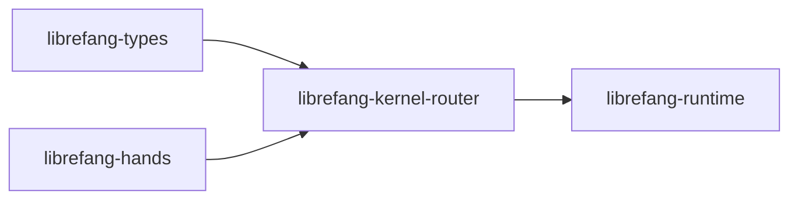

# Other — librefang-kernel-router

# librefang-kernel-router

Hand/Template routing engine for the LibreFang kernel.

## Purpose

This module is responsible for **routing incoming data to the appropriate Hand or Template** based on pattern matching rules. It acts as the kernel's dispatch layer — given some input, it determines which registered handler should process it by evaluating match conditions defined in routing configuration.

## Role in the Architecture

The router sits between the type definitions (`librefang-types`) and the hand implementations (`librefang-hands`). At runtime, the `librefang-runtime` module loads and exercises the router to resolve which hand to invoke for a given input.

## Dependencies and What They Indicate

| Dependency | Role in This Module |
|---|---|
| `librefang-types` | Shared type definitions — route entries, match criteria, hand references |
| `librefang-hands` | Access to registered hand definitions that routes point to |
| `regex-lite` | Pattern-based matching logic for route evaluation |
| `serde_json` | Deserialization of routing rules from JSON-format configuration |
| `toml` | Deserialization of routing rules from TOML-format configuration |
| `dirs` | Resolving platform-specific config/data directories for route file discovery |
| `tracing` | Instrumentation of route resolution and match evaluation |

The presence of both `serde_json` and `toml` indicates the router supports at least two configuration formats. The `dirs` crate suggests it looks for routing configuration in standard user or system directories rather than requiring hardcoded paths.

## Key Concepts

### Routes

A route is a mapping from a **match condition** to a **target hand or template**. Routes are likely loaded from configuration files at startup and organized into a routing table.

### Match Evaluation

The `regex-lite` dependency indicates that route matching uses regular expressions. Routes may match against fields of the incoming data — for example, matching on identifiers, type tags, or content patterns.

### Routing Table

Routes are assembled into a routing table. When the router receives input, it evaluates match conditions in a defined order and returns the first matching hand/template reference.

## Configuration

Route definitions are loaded from configuration files. The router searches standard platform directories (via `dirs`) and supports both JSON and TOML formats. This allows users to define routing rules without modifying compiled code.

## Testing

The dev-dependency on `tempfile` and `librefang-runtime` indicates that tests create temporary configuration files to verify route loading and resolution behavior end-to-end through the runtime.