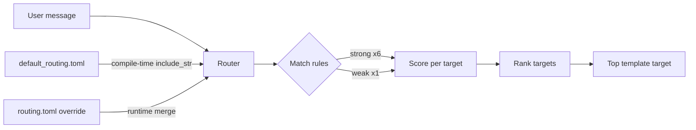

# Other — librefang-kernel-router

# librefang-kernel-router

Template/Hand routing engine for the LibreFang kernel. Scores incoming user messages against a bank of regex rules and returns the best-matching specialist template target.

## Overview

When a user sends a message, the kernel needs to decide which specialist "hand" should handle it. This module performs that classification by:

1. Loading a set of routing rules (compiled-in defaults, optionally overridden by the operator).
2. Matching the user message against each rule's regex patterns.
3. Scoring each template target — `strong` hits contribute 6 points, `weak` hits contribute 1 point.
4. Returning the highest-scoring target (or a ranked list of candidates).

The entire rule set is bilingual (English + Chinese) and covers ~30 specialist domains out of the box.

## Architecture


```mermaid
flowchart LR
    A[User message] --> B[Router]
    B --> C{Match rules}
    C -->|strong x6| D[Score per target]
    C -->|weak x1| D
    D --> E[Rank targets]
    E --> F[Top template target]
    
    G[default_routing.toml] -->|compile-time include_str| B
    H[routing.toml override] -->|runtime merge| B
```

## Configuration

### Default rules

`default_routing.toml` is embedded into the binary at compile time via `include_str!`. It is the single source of truth for built-in routes. No external file is required at runtime for the defaults to work.

### Operator overrides

Operators place a `routing.toml` at:

```
$LIBREFANG_HOME/registry/templates/routing.toml
```

Changes take effect on `POST /api/config/reload` or a daemon restart. The rule set is cached in memory and is **not** hot-reloaded on file changes alone.

### Merge semantics

Entries merge by `target` name:

| Scenario | Behavior |
|---|---|
| Same `target` as a default rule | Operator rule **overrides** the default |
| New `target` not in defaults | Operator rule is **appended** |
| `enabled = false` on a default `target` | Rule is **removed** from routing |

This allows operators to tune weights, tighten/loosen regex patterns, add entirely new specialists, or disable defaults without touching the binary.

### Rule format

Each rule is a `[[template]]` array entry:

```toml
[[template]]
target = "coder"                     # specialist hand identifier
strong = [                           # weight: 6 per match
  { label = "implement", regex = '\bimplement\b|\bbuild\b' },
]
weak = [                             # weight: 1 per match
  { label = "code", regex = '\bcode\b|\bfunction\b' },
]
```

- **`target`** — the template/hand name that will be selected on a winning score.
- **`strong`** — high-signal patterns. Each matching pattern contributes **6** points (equivalent to an explicit alias match).
- **`weak`** — low-signal patterns. Each matching pattern contributes **1** point.
- **`label`** — human-readable identifier for the pattern, used in tracing/debugging.
- **`regex`** — case-insensitive regex matched against the user message. Uses the `regex-lite` crate syntax.

A rule may omit `weak` entirely if only strong signals are needed (e.g., `hello-world`).

## Scoring algorithm

For each template target, the router:

1. Iterates every `{ label, regex }` pair in `strong` and `weak`.
2. Tests the regex against the full user message (case-insensitive).
3. Adds **6** per strong match, **1** per weak match.
4. The target with the highest total score wins.

Multiple patterns within the same rule can all contribute — a message hitting two strong patterns and one weak pattern for "coder" scores `6 + 6 + 1 = 13`.

### Error handling

- A rule with an **invalid regex** is skipped with a `WARN` log. Routing never fails closed on a bad pattern.
- An **unparseable** override file is skipped entirely; the compiled-in defaults are used as fallback.

## Built-in template targets

| Target | Domain | Strong signals |
|---|---|---|
| `hello-world` | Greetings | hello, hi, hey, 你好, 打招呼 |
| `coder` | Implementation | implement, build, refactor, 写代码, 实现 |
| `debugger` | Debugging | debug, traceback, 报错, 异常, 崩溃 |
| `test-engineer` | Testing | test, unit test, 测试用例, 覆盖率 |
| `code-reviewer` | Code review | code review, diff, 代码审查 |
| `architect` | Architecture | architecture, system design, 架构设计 |
| `security-auditor` | Security | vulnerability, xss, 漏洞, sql注入 |
| `devops-lead` | Deploy/Infra | deploy, ci/cd, kubernetes, 部署, 上线 |
| `researcher` | Research | research, look up, 调研, 事实核查 |
| `analyst` | Analysis | business analysis, 竞品分析, 趋势分析 |
| `data-scientist` | Data/ML | machine learning, 统计建模, 预测模型 |
| `planner` | Planning | plan, roadmap, 项目计划, 里程碑 |
| `writer` | Writing | write article, blog post, 写作, 润色 |
| `tutor` | Teaching | teach me, explain, 教我, 辅导 |
| `doc-writer` | Documentation | docs, readme, 技术文档, 操作手册 |
| `translator` | Translation | translate, localization, 翻译, 本地化 |
| `email-assistant` | Email | email, draft reply, 邮件草稿 |
| `meeting-assistant` | Meetings | meeting notes, agenda, 会议纪要 |
| `social-media` | Social media | twitter, linkedin, 社交媒体, 推文 |
| `sales-assistant` | Sales | crm, pipeline, 销售跟进, 商机 |
| `customer-support` | Support | support ticket, 客服回复, 工单 |
| `recruiter` | Recruiting | resume, candidate, 招聘, 简历 |
| `legal-assistant` | Legal | contract, nda, 法律, 合同 |
| `personal-finance` | Finance | budget, expense, 财务规划, 理财 |
| `recipe-assistant` | Cooking | recipe, meal plan, 食谱, 烹饪 |
| `travel-planner` | Travel | itinerary, trip plan, 行程规划 |
| `health-tracker` | Health | fitness plan, diet log, 健康记录 |
| `home-automation` | Smart home | home assistant, iot, 智能家居 |
| `ops` | Operations | incident response, 故障恢复, 运行诊断 |
| `orchestrator` | Multi-agent | orchestrate, delegate, 多代理, 编排 |

## Dependencies

| Crate | Purpose |
|---|---|
| `librefang-types` | Shared type definitions |
| `librefang-hands` | Hand/specialist registry that routing targets resolve against |
| `regex-lite` | Lightweight regex engine for pattern matching |
| `serde` / `serde_json` | Deserialization of rule structures |
| `toml` | Parsing of `routing.toml` configuration |
| `dirs` | Resolving `$LIBREFANG_HOME` / standard config paths |
| `tracing` | Diagnostic logging (invalid regex warnings, load events) |

## Development

### Running tests

The test suite uses `tempfile` to create temporary override files and `librefang-runtime` for integration scenarios:

```bash
cargo test -p librefang-kernel-router
```

### Adding a new template

1. Add a `[[template]]` block to `default_routing.toml` with the target name and at least one `strong` pattern entry.
2. Ensure the `target` value matches a registered hand name in `librefang-hands`.
3. Provide both English and Chinese patterns where appropriate for bilingual coverage.
4. Run the test suite to verify the new rule parses correctly.

### Tuning weights

If a template is triggering too eagerly or not enough:

- **Too many false positives**: Move ambiguous keywords from `strong` to `weak`, or narrow the regex.
- **Not triggering enough**: Promote keywords from `weak` to `strong`, or add additional language variants.

Both approaches can be done via the operator override file without recompiling.