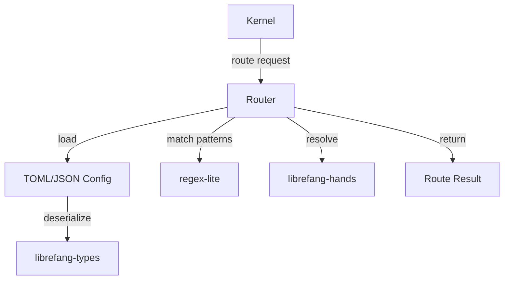

# Other — librefang-kernel-router

# librefang-kernel-router

Hand and template routing engine for the LibreFang kernel.

## Overview

This module is responsible for resolving which **hand definition** and **template** should be active during a game session. It acts as the kernel's decision layer—given a set of criteria (game rules, player context, configuration), it determines the correct routing target.

## Purpose

In a system where multiple hand definitions and templates can coexist, a routing engine is needed to:

- **Match** incoming game contexts against registered patterns
- **Resolve** the appropriate hand/template combination
- **Prioritize** routes when multiple candidates match

This keeps routing logic decoupled from the kernel core, allowing hand and template definitions to be added or modified without touching the kernel itself.

## Dependencies

| Crate | Role in this module |
|---|---|
| `librefang-types` | Shared type definitions used across the kernel |
| `librefang-hands` | Hand definitions that serve as routing targets |
| `serde_json` | Deserializing route configuration from JSON |
| `regex-lite` | Pattern matching for route rules |
| `toml` | Parsing TOML-based route configuration files |
| `tracing` | Structured logging of routing decisions |
| `dirs` | Resolving standard config directory paths |

## Architecture

```mermaid
graph TD
    A[Kernel] -->|route request| B[Router]
    B -->|load| C[TOML/JSON Config]
    B -->|match patterns| D[regex-lite]
    B -->|resolve| E[librefang-hands]
    B -->|return| F[Route Result]
    C -->|deserialize| G[librefang-types]
```

The router loads route definitions from configuration (TOML or JSON), uses regex patterns to match against incoming criteria, and resolves to a hand definition provided by `librefang-hands`.

## Configuration Loading

The module uses `dirs` to locate standard configuration directories and `toml`/`serde_json` to parse route definitions. This allows route tables to live outside the compiled binary, making them user-editable.

## Integration Points

This module sits between the kernel core and the hand system:

- **Upstream consumers**: The kernel core calls into this router when it needs to determine which hand/template to activate.
- **Downstream dependency**: The router resolves routes to types provided by `librefang-hands` and `librefang-types`.

In tests, `librefang-runtime` and `tempfile` are used to spin up isolated routing scenarios with temporary configuration files.

## Testing

The dev-dependencies indicate that tests create temporary configuration files (`tempfile`) and run routing scenarios through the runtime (`librefang-runtime`). This suggests integration-style tests that validate route matching end-to-end rather than purely unit-testing internal match logic.