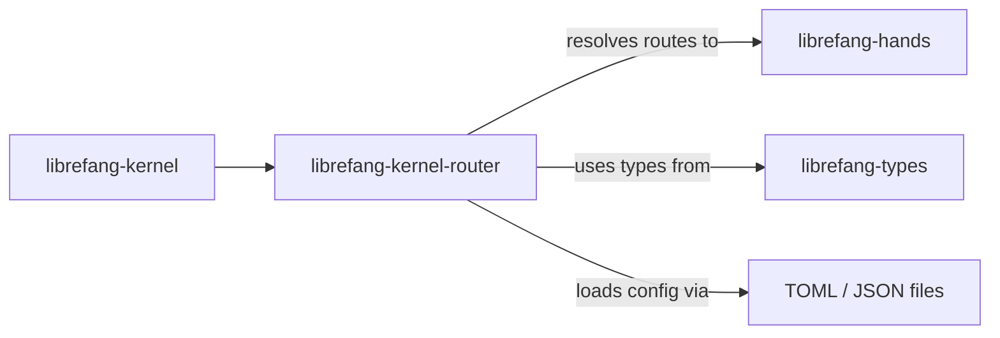

# Other — librefang-kernel-router

# librefang-kernel-router

Hand and template routing engine for the LibreFang kernel. This module is responsible for resolving incoming requests to the appropriate hand implementations and template renderers.

## Purpose

LibreFang uses a routing layer to map request patterns to hand handlers. `librefang-kernel-router` provides that layer — accepting a routing configuration, matching requests against defined patterns, and dispatching to the correct hand from `librefang-hands`.

The module also handles template routing, determining which templates apply to a given response context.

## Dependencies

| Dependency | Role in this module |
|---|---|
| `librefang-types` | Shared type definitions for routes, requests, and routing results |
| `librefang-hands` | Registry of available hand implementations to dispatch to |
| `regex-lite` | Lightweight pattern matching for route definitions |
| `serde_json` | Deserializing route configuration from JSON |
| `toml` | Deserializing route configuration from TOML files |
| `dirs` | Locating standard configuration directories on the host system |
| `tracing` | Structured logging of route resolution and matching decisions |

## Configuration Loading

The module supports two configuration formats:

- **TOML** — likely used for hand-authored route files in user or system config directories, discovered via `dirs`.
- **JSON** — likely used for programmatically generated or machine-written routing tables.

The use of `dirs` indicates that the router searches standard platform-specific configuration paths (e.g., `~/.config/librefang/` on Linux, `%APPDATA%` on Windows) for routing definition files.

## Pattern Matching

Route definitions use pattern-based matching powered by `regex-lite`. This allows routes to be expressed as patterns rather than exact paths, supporting capture groups and flexible path segments.

## Relationship to the Kernel

```mermaid
graph LR
    A[librefang-kernel] --> B[librefang-kernel-router]
    B -->|resolves routes to| C[librefang-hands]
    B -->|uses types from| D[librefang-types]
    B -->|loads config via| E[TOML / JSON files]
```

The kernel delegates routing decisions to this module. When a request arrives, the kernel asks the router to match it against registered routes. The router returns a reference to the target hand, which the kernel then invokes.

## Testing

Dev dependencies include `librefang-runtime` and `tempfile`, suggesting that tests spin up temporary configuration files on disk and verify routing behavior through the runtime layer rather than testing the router in isolation.

## Implementation Notes

- `regex-lite` is used instead of full `regex`, prioritizing smaller binary size and faster compilation. This means route patterns should stay within the supported regex-lite syntax — primarily character classes, quantifiers, groups, and alternation. Advanced features like look-around assertions are not available.
- All route resolution events are instrumented with `tracing` spans, enabling observability of which patterns are evaluated and which routes are selected at runtime.