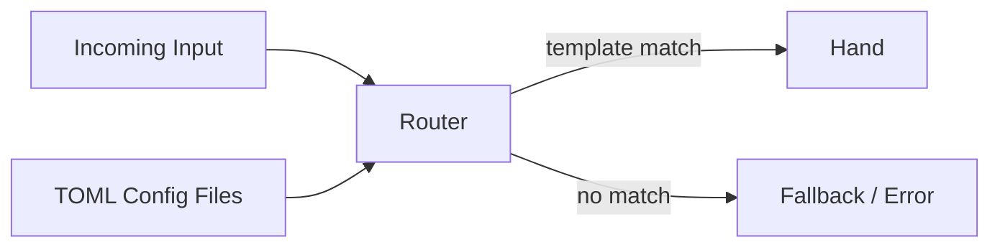

# Other — librefang-kernel-router

# librefang-kernel-router

Hand and template routing engine for the LibreFang kernel.

## Purpose

This module is responsible for resolving which **Hand** (handler) should process a given input by matching against registered **templates**. It acts as the dispatch layer of the LibreFang kernel — when a message or event arrives, the router determines where it goes.

## How It Works

The routing engine performs template-based pattern matching. Templates define patterns (using regular expressions via `regex-lite`) that are compared against incoming input. When a template matches, its associated Hand is returned as the route target.

The module loads routing configuration from TOML files (using the `toml` crate), discovered via standard platform directories (`dirs`). This allows route definitions to live outside the compiled binary and be modified without recompilation. JSON support (`serde_json`) handles any structured data within route definitions or match results.

## Dependencies and Their Roles

| Dependency | Role in This Module |
|---|---|
| `librefang-types` | Shared types used across the kernel — route descriptors, match results, template definitions |
| `librefang-hands` | The Hand abstractions that routes resolve to; the router maps templates → Hands |
| `regex-lite` | Lightweight regex engine for pattern matching within templates |
| `toml` | Parses routing configuration files |
| `dirs` | Locates platform-specific config directories where route files live |
| `serde_json` | Serializes/deserializes structured route data |
| `tracing` | Instrumentation for route resolution, match failures, and config loading |

## Architecture

```mermaid
flowchart LR
    A[Incoming Input] --> B[Router]
    C[TOML Config Files] --> B
    B -->|template match| D[Hand]
    B -->|no match| E[Fallback / Error]
```

The router sits between raw input and the Hand execution layer. It has no outgoing calls to other kernel modules at runtime — it is a pure lookup and dispatch mechanism.

## Integration with the Kernel

This module is consumed by `librefang-runtime` (present as a dev-dependency, indicating the runtime orchestrates route resolution). The typical flow is:

1. The runtime receives input.
2. It passes that input to this router.
3. The router returns a matched Hand (or reports no match).
4. The runtime invokes the Hand.

The router itself does not execute Hands — it only resolves them. This separation keeps routing logic testable in isolation.

## Configuration

Routes are defined in TOML files loaded from standard config directories. Each route entry maps a template pattern to a Hand identifier. The `regex-lite` engine performs the actual matching, meaning templates use standard regex syntax with the lite crate's feature set.

## Testing

The dev-dependency on `librefang-runtime` and `tempfile` suggests that integration tests create temporary config files, load routes through the router, and verify end-to-end resolution against the runtime.