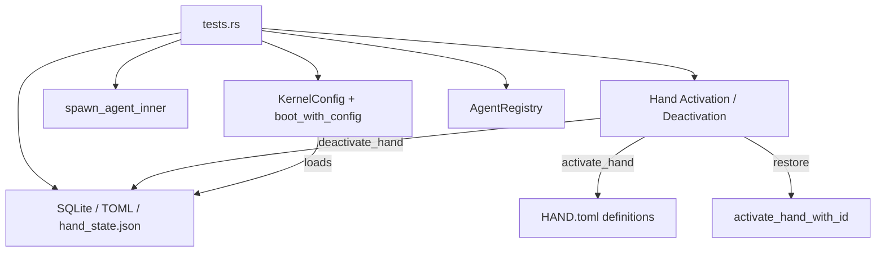

# Other — librefang-kernel-src

# librefang-kernel Test Suite

## Purpose

This is the integration and unit test suite for `librefang-kernel`, the central runtime kernel of LibreFang. The tests validate the kernel's core invariants: agent lifecycle management, capability security, hand activation/restoration, approval routing, skill evolution, and persistence correctness. Rather than testing individual functions in isolation, most tests boot a full `LibreFangKernel` against a temporary directory and exercise end-to-end flows.

## Architecture



## Test Infrastructure

### Kernel Boot Helper

Every test that needs a live kernel follows the same pattern:

1. Create a `tempfile::tempdir()` for isolation.
2. Build a `KernelConfig` pointing `home_dir` and `data_dir` into the temp directory.
3. Call `LibreFangKernel::boot_with_config(config)`.
4. Assert invariants, then call `kernel.shutdown()`.

No shared state exists between tests — each gets its own filesystem and SQLite database.

### Environment Variable Guards

`set_test_env` / `EnvVarGuard` manage environment variables safely for tests that need them (e.g., API key rotation tests). The guard removes the variable on drop so it never leaks across tests:

```rust
fn set_test_env(key: &'static str, value: &str) -> EnvVarGuard
```

**Safety**: Tests use unique env-var names and are serialized by the single-threaded default test runner.

### Recording Channel Adapter

`RecordingChannelAdapter` is a test double implementing `ChannelAdapter`. It captures all sent messages in a shared `Arc<Mutex<Vec<String>>>` so tests can assert notification routing without a real messaging backend:

```rust
struct RecordingChannelAdapter {
    name: String,
    channel_type: ChannelType,
    sent: Arc<Mutex<Vec<String>>>,
}
```

### Test Skill Installer

`install_test_skill` writes a minimal valid `skill.toml` + `prompt_context.md` under a given parent directory, used by skills-configuration tests:

```rust
fn install_test_skill(skills_parent: &Path, name: &str, tags: &[&str])
```

## Test Categories

### Agent Spawning and Lineage Security

| Test | Invariant |
|------|-----------|
| `test_spawn_agent_applies_local_default_model_override` | Agents with `provider: "default"` store the literal string; concrete resolution happens at execute time. |
| `test_spawn_child_exceeding_parent_is_rejected` | A child whose capabilities exceed its parent's is denied with "Privilege escalation denied". The check runs **before** `register()`. |
| `test_spawn_child_with_subset_capabilities_is_allowed` | A child whose capabilities are a strict subset of the parent's spawns successfully. |
| `test_spawn_with_unknown_parent_fails_closed` | A stale or fabricated `AgentId` as parent fails with "not registered" — never silently falls through to the non-parent path. |

### Provider and Model Switching

| Test | Invariant |
|------|-----------|
| `test_set_agent_model_clears_overrides_when_provider_changes` | Switching providers via `set_agent_model` clears stale `api_key_env` and `base_url` overrides. Same-provider model swaps preserve existing overrides. |

### Hand Lifecycle

The hand system (named pre-configured multi-agent deployments) has extensive coverage:

**Activation and Tool Filters:**
- `test_hand_activation_does_not_seed_runtime_tool_filters` — Hand activation leaves `tool_allowlist` / `tool_blocklist` empty so skill/MCP tools remain visible.
- `test_available_tools_returns_empty_when_tools_disabled` — The `tools_disabled` flag suppresses all tools.

**Reactivation:**
- `test_hand_reactivation_rebuilds_same_runtime_profile` — Deactivate then reactivate rebuilds from the hand definition, not from runtime overrides.
- `reactivate_builds_from_hand_toml_not_override` — A comprehensive check that every override field (model, provider, api_key_env, base_url, max_tokens, temperature, web_search_augmentation) is cleared on fresh activation.

**Skills Propagation (issue #3135):**
- `test_hand_skills_propagate_to_derived_agent_manifest` — Hand-level `skills = [...]` allowlist propagates into each per-role agent's `AgentManifest.skills`.
- `test_hand_skills_intersect_per_role_overrides` — When the per-role agent also declares its own `skills`, the result is the intersection of both lists.

**Persistence Across Restarts:**
- `hand_runtime_override_survives_restart_via_activate_hand_with_id` — Runtime overrides applied via `update_hand_agent_runtime_override` round-trip through `hand_state.json` and are re-applied by `activate_hand_with_id` on the next boot.
- `boot_drift_preserves_hand_settings_tail` — `## User Configuration` block rendered from `[[settings]]` survives restart.
- `boot_drift_preserves_skill_and_team_tails` — `## Reference Knowledge` and `## Your Team` blocks survive restart.

**Deactivation Cleanup:**
- `deactivate_hand_removes_hand_agent_rows_from_sqlite` — After deactivation, SQLite rows for all instance agents are removed, even when those agents are absent from the in-memory registry (the post-restart scenario introduced by commit #a023519d).

### Tool Availability and Capability Resolution

| Test | Invariant |
|------|-----------|
| `test_available_tools_glob_pattern_matches_mcp_tools` | Glob patterns like `file_*` correctly match concrete tool names (regression for exact-match bug). |
| `test_shell_exec_available_when_declared_in_tools_without_explicit_exec_policy` | Agents declaring `shell_exec` in `capabilities.tools` with `shell: ["*"]` get auto-promoted to `ExecSecurityMode::Full`. |
| `test_manifest_to_capabilities` / `_with_profile` / `_profile_overridden_by_explicit_tools` | Tool profiles expand to their constituent tools; explicit `tools` overrides suppress profile expansion. |
| `test_skill_evolve_tools_default_available_to_restricted_agent` | Skill evolution tools are always available regardless of the agent's declared `capabilities.tools`. |

### Agent Registry

| Test | Invariant |
|------|-----------|
| `test_send_to_agent_by_name_resolution` | `find_by_name` and `get` (by UUID) both resolve registered agents. |
| `test_find_agents_by_tag` | Tag-based and name-substring filtering work correctly against `registry.list()`. |

### Approval and Notification Routing

| Test | Invariant |
|------|-----------|
| `test_notify_escalated_approval_prefers_request_route_to` | Escalated approvals route to the explicit `route_to` targets on the request, ignoring policy rules, agent rules, and global channels. |
| `test_spawn_approval_sweep_task_is_idempotent` | The approval sweep background task can only be spawned once (atomic guard). |

### Task Board Sweeper

| Test | Invariant |
|------|-----------|
| `test_spawn_task_board_sweep_task_is_idempotent` | The sweeper loop is spawn-once (issue #2923). |
| `test_task_board_sweep_resets_stuck_in_progress_task` | A claimed task whose TTL has expired is reset to `pending` with `assigned_to` cleared. |

### Skills Configuration

| Test | Invariant |
|------|-----------|
| `test_skills_config_disabled_list_filters_at_boot` | `skills.disabled` in config prevents loading of named skills. |
| `test_skills_config_extra_dirs_loaded_as_overlay` | `skills.extra_dirs` loads external skills; local installations win name collisions. |
| `test_reload_skills_preserves_disabled_and_extra_dirs` | Hot-reload re-applies both `disabled` and `extra_dirs` policy (regression for silent policy drop). |
| `test_stable_mode_freezes_registry_and_skips_review_gate` | `KernelMode::Stable` freezes the registry, blocking mutations and review-driven skill creation. |

### Session Interrupt Cascade (issue #3044)

Tests for the parent `/stop` → child cancellation chain:

- `cascade_primitives_via_session_interrupts_dashmap` — `SessionInterrupt::new_with_upstream` propagates parent cancel to children; child cancel does not propagate upward.
- `no_upstream_when_parent_has_no_active_turn` — A parent with no registered interrupt yields `None`, and the call proceeds without cascade.
- `send_to_agent_as_tolerates_unregistered_parent_uuid` — An unregistered parent UUID falls through gracefully (parse-fallback).
- `send_to_agent_as_rejects_unparseable_parent_id` — Garbage parent IDs produce a clear error rather than a panic.

### Atomic Persistence

| Test | Invariant |
|------|-----------|
| `atomic_write_replaces_existing_content` | Content is fully replaced. |
| `atomic_write_leaves_no_tmp_file_on_success` | No staging artifacts remain. |
| `atomic_write_no_partial_state_under_concurrency` | Two threads racing to write the same file never produce a corrupt partial mix; readers always see a complete payload. |

### Ephemeral Messaging

| Test | Invariant |
|------|-----------|
| `test_send_message_ephemeral_unknown_agent_returns_not_found` | Unknown agent IDs produce an error. |
| `test_send_message_ephemeral_does_not_modify_session` | Ephemeral `/btw` messages leave the real session's message count unchanged. |

### Condition Evaluation and Peer Scoping

- `test_evaluate_condition_*` — The `agent.tags contains 'X'` condition parser works for matches, non-matches, empty/None conditions, and rejects unknown formats.
- `test_peer_scoped_key` — Keys are namespaced as `peer:<id>:<key>` when a peer_id is present; otherwise left unchanged.

### Thinking Override

- `apply_thinking_override` with `None` preserves existing config, `Some(false)` clears it, `Some(true)` inserts defaults while preserving existing budgets.

### JSON Extraction from LLM Responses

`LibreFangKernel::extract_json_from_llm_response` handles: code-fenced JSON blocks, bare objects, surrounding text, nested braces in string values, multiple code blocks (returns first), malformed JSON (returns `None`), and plain text without JSON.

### Reviewer Block Sanitization

`sanitize_reviewer_block` and `sanitize_reviewer_line` neutralize potential prompt-injection vectors from compromised prior responses: triple backticks, `</data>` / `<data>` envelope tags, control characters, and newlines in single-line contexts. Truncation is char-aware (not byte-aware) and appends `…[truncated]`.

### Background Review Error Classification

`is_transient_review_error` distinguishes retryable errors (timeouts, network failures, rate limits) from permanent errors (parse failures, validation errors, security blocks). Permanent errors are never retried.

### Trace Summarization

`summarize_traces_for_review` emits head and tail entries with an "omitted" marker for long traces, bounding the summary size.

### Cron Job Peer Context

`test_cron_create_preserves_peer_id` — The `peer_id` field in a cron job's JSON payload is persisted and recovered on list (regression for OFP-triggered cron jobs losing peer context).

### Route Caching and Assistant Boot

- `test_should_reuse_cached_route_for_brief_follow_up` — Short messages reuse cached routes; acknowledgments and long requests do not.
- `test_assistant_route_key_scopes_sender_and_thread` — Route keys include channel, user_id, and thread_id for isolation.
- `test_boot_spawns_assistant_as_default_agent` — A fresh kernel boot auto-spawns an `assistant` agent.

## Key APIs Exercised

| API | Location |
|-----|----------|
| `LibreFangKernel::boot_with_config` | `kernel/boot.rs` |
| `spawn_agent_inner` | `kernel/spawn.rs` |
| `set_agent_model` | `kernel/mod.rs` |
| `activate_hand` / `deactivate_hand` / `activate_hand_with_id` | `kernel/mod.rs` |
| `update_hand_agent_runtime_override` | `kernel/mod.rs` |
| `available_tools` | `kernel/mod.rs` |
| `manifest_to_capabilities` | `kernel/manifest_helpers.rs` |
| `collect_rotation_key_specs` | `kernel/mod.rs` |
| `notify_escalated_approval` | `kernel/mod.rs` |
| `AgentRegistry::register` / `find_by_name` / `get` / `list` | `registry.rs` |
| `apply_settings_block_to_manifest` / `apply_skill_reference_block_to_manifest` / `apply_team_block_to_manifest` | `kernel/mod.rs` |
| `atomic_write_toml` | `kernel/mod.rs` |
| `SessionInterrupt::new_with_upstream` | `runtime/interrupt.rs` |
| `AgentControl::send_to_agent_as` | `kernel_handle` |
| `cron_create` / `cron_list` | `kernel/mod.rs` |

## Contribution Guidelines

- **Isolation**: Every test must create its own `tempfile::tempdir()`. Never share filesystem state.
- **Cleanup**: Always call `kernel.shutdown()` at the end of each test, even on early-return paths.
- **Skip semantics**: Tests that depend on optional features (e.g., the `apitester` hand) use `Err(e) if e.to_string().contains("unsatisfied requirements")` to gracefully skip rather than fail.
- **Naming**: Regressions are annotated with their issue number (e.g., `issue #3135`, `issue #2923`) in doc comments.
- **Async tests**: Use `#[tokio::test(flavor = "multi_thread")]` for tests that need the tokio runtime. Kernel boot itself is synchronous.