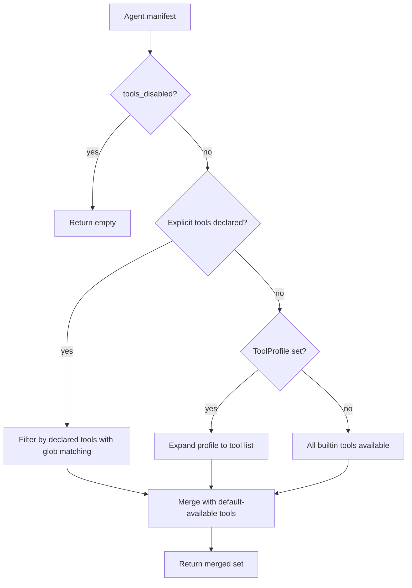

# Other — librefang-kernel-src

# Kernel Test Suite (`librefang-kernel/src/kernel/tests.rs`)

## Purpose

Integration and regression test suite for the LibreFang kernel. Tests exercise the kernel's public and internal APIs against real filesystem state, in-process agent registries, and mock channel adapters — covering capability enforcement, notification routing, skill lifecycle, provider switching, and LLM response parsing.

## Test Infrastructure

### `RecordingChannelAdapter`

A mock `ChannelAdapter` that captures outbound messages into a `Arc<Mutex<Vec<String>>>` instead of delivering them. Used by notification routing tests to assert exactly which recipients received messages.

```rust
let adapter = Arc::new(RecordingChannelAdapter::new("test"));
let sent = adapter.sent.clone();  // inspect after the call under test
kernel.channel_adapters.insert("test".to_string(), adapter);
```

`start()` returns an empty stream; `send()` records `"{platform_id}:{text}"` for each `ChannelContent::Text`.

### `EnvVarGuard` / `set_test_env`

RAII guard that removes an environment variable when dropped. Prevents test cross-contamination when testing env-var-backed config like API key rotation profiles.

```rust
let _guard = set_test_env("LIBREFANG_TEST_ROTATION_PRIMARY_KEY_A", "key-1");
// env var is cleaned up when _guard goes out of scope
```

### `install_test_skill`

Writes a minimal valid `skill.toml` + `prompt_context.md` into a directory so the skill registry accepts it at load time.

```rust
install_test_skill(&skills_parent, "my-skill", &["tag-a", "tag-b"]);
```

### `make_trace`

Creates a `DecisionTrace` with minimal defaults for trace summarization tests.

---

## Coverage Areas

### Agent Spawning and Lineage

The kernel enforces a **capability subset rule**: a child agent's declared capabilities must not exceed its parent's. This prevents a restricted agent from escalating privileges by spawning a child with broader access.

| Test | Behavior verified |
|------|-------------------|
| `test_spawn_child_exceeding_parent_is_rejected` | Parent with only `file_read` cannot spawn a child requesting `*`, `shell:*`, `network:*` — returns `"Privilege escalation denied"` |
| `test_spawn_child_with_subset_capabilities_is_allowed` | Parent with `file_read` + `file_write` can spawn a child requesting only `file_read` |
| `test_spawn_with_unknown_parent_fails_closed` | Passing a stale `AgentId` as parent fails with `"not registered"` instead of silently treating it as a top-level spawn |

When an agent declares `shell_exec` in `capabilities.tools` without an explicit `exec_policy`, the kernel **auto-promotes** the policy to `Full` (test: `test_shell_exec_available_when_declared_in_tools_without_explicit_exec_policy`).

### API Key Rotation

`collect_rotation_key_specs` resolves profiles into `RotationKeySpec` entries, handling:

- **Deduplication**: If a profile references the same env var as the primary key, it gets `use_primary_driver: true` instead of appearing twice
- **Missing env vars**: Profiles whose env var is unset are silently skipped
- **Ordering**: Primary key is prepended when no profile shares its value

### Provider Switching

`set_agent_model` must clear per-agent `api_key_env` and `base_url` overrides when the provider changes — otherwise the agent routes requests to the old endpoint with stale credentials (regression for issue #2380). Same-provider model swaps preserve existing overrides.

The flow tested: spawn agent with provider A + overrides → call `set_agent_model` with provider B → verify `api_key_env` and `base_url` are `None`.

### Tool Availability and Filtering



Key behaviors:

- **Glob patterns**: `file_*` in `capabilities.tools` matches `file_read`, `file_write`, `file_list` but not `web_fetch` (`test_available_tools_glob_pattern_matches_mcp_tools`)
- **Tool profiles vs explicit tools**: When both are present, explicit tools win and the profile is not expanded (`test_manifest_to_capabilities_profile_overridden_by_explicit_tools`)
- **Disabled tools**: `tools_disabled: true` suppresses all tools including skill and MCP tools
- **Skill evolution tools**: `skill_evolve_*`, `skill_read_file`, `skill_evolve_write_file`, `skill_evolve_remove_file` are always available regardless of the agent's declared capabilities — every agent can self-evolve skills

### Notification Routing

Escalated approval notifications use this precedence order:

1. **Per-request `route_to`** on the `ApprovalRequest` — highest priority
2. Routing rules matching the tool pattern
3. Agent notification rules
4. Global `approval_channels`

Test `test_notify_escalated_approval_prefers_request_route_to` sets up all four layers and verifies only the explicit per-request target receives the notification.

### Skill Lifecycle and Configuration

Four interrelated properties tested:

| Property | Test |
|----------|------|
| `skills.disabled` list filters skills at boot | `test_skills_config_disabled_list_filters_at_boot` |
| `skills.extra_dirs` loaded as overlay; local install wins on collision | `test_skills_config_extra_dirs_loaded_as_overlay` |
| `reload_skills()` re-applies disabled list and extra_dirs | `test_reload_skills_preserves_disabled_and_extra_dirs` |
| Stable mode freezes registry; reload becomes no-op | `test_stable_mode_freezes_registry_and_skips_review_gate` |

### Hand Activation

Hands are pre-configured agent instances. Tests verify:

- Activation does not inject runtime `tool_allowlist` or `tool_blocklist` entries — skill/MCP tools remain visible
- Deactivation followed by reactivation produces an identical runtime profile (capabilities, allowlist, blocklist, MCP servers)

### JSON Extraction from LLM Responses

`extract_json_from_llm_response` handles multiple formats the LLM might return:

- JSON inside ` ```json ``` ` code blocks (including multiple blocks — first valid one wins)
- Bare `{...}` objects embedded in surrounding text
- JSON with nested braces inside string values
- Malformed JSON → returns `None`
- No JSON present → returns `None`

### Reviewer Block Sanitization

`sanitize_reviewer_block` and `sanitize_reviewer_line` clean text before it enters the review envelope:

- Strips triple backticks (prevents a compromised prior response from forging a JSON block the reviewer mistakes for its own)
- Strips `<data>`/`</data>` envelope markers (prevents escaping the envelope)
- Removes control characters (`\x00`, `\x07`) while preserving `\n` and `\t`
- Truncates by **character count** (not bytes) to avoid panicking on UTF-8 boundaries

### Transient vs Permanent Error Classification

`is_transient_review_error` determines whether a background skill review error is worth retrying:

- **Transient** (retryable): timeouts, connection failures, 429 rate limits
- **Permanent** (do not retry): parse failures, missing required fields, security blocks

### Trace Summarization

`summarize_traces_for_review` produces a bounded summary of tool decision traces:

- Short traces (≤ ~20 entries): includes all entries verbatim
- Long traces: keeps head and tail, inserts `"omitted"` marker for the middle — ensures the summary is always smaller than the raw trace log

### Miscellaneous Utilities

| Function | Test | Behavior |
|----------|------|----------|
| `should_reuse_cached_route` | `test_should_reuse_cached_route_for_brief_follow_up` | Short messages and CJK text reuse the cached route; long messages and acknowledgments like "thanks" do not |
| `assistant_route_key` | `test_assistant_route_key_scopes_sender_and_thread` | Combines agent ID + channel + user ID + thread ID into a unique cache key |
| `evaluate_condition` | `test_evaluate_condition_*` | Supports `agent.tags contains 'X'` syntax; unknown formats return `false` (strict deny) |
| `peer_scoped_key` | `test_peer_scoped_key` | Prepends `peer:{id}:` when a peer ID is provided; leaves key unchanged otherwise |
| `apply_thinking_override` | `test_apply_thinking_override_*` | `None` preserves manifest; `Some(false)` clears thinking; `Some(true)` inserts defaults or preserves existing budget |

### Kernel Boot Defaults

A fresh kernel boot with default config auto-spawns an `assistant` agent (verified in `test_boot_spawns_assistant_as_default_agent`). The approval sweep task is idempotent — calling `spawn_approval_sweep_task` twice does not launch a second task.

### Ephemeral Messaging

`send_message_ephemeral` sends a one-off message to an agent **without modifying its session history**. Tests confirm:

- Unknown agent IDs return an error
- The agent's session message count is unchanged after the call (even if the LLM call itself fails due to no provider)

---

## Patterns and Conventions

**Filesystem isolation**: Every test that boots a kernel creates a unique temp directory via `tempfile::tempdir()`. No test relies on shared state or the user's real `~/.librefang`.

**Graceful skipping**: Tests involving optional hands (e.g., `apitester`) catch `"unsatisfied requirements"` errors and return early rather than failing in CI environments lacking the hand's dependencies.

**Shutdown discipline**: Every test that boots a kernel calls `kernel.shutdown()` before the test function returns. Tests using `Arc<Kernel>` also await a short sleep after shutdown to let async tasks drain.

**Regression-focused naming**: Several tests are explicitly labeled as regression guards (e.g., `test_spawn_child_exceeding_parent_is_rejected`, `test_set_agent_model_clears_overrides_when_provider_changes`) with doc comments explaining the original bug they prevent.