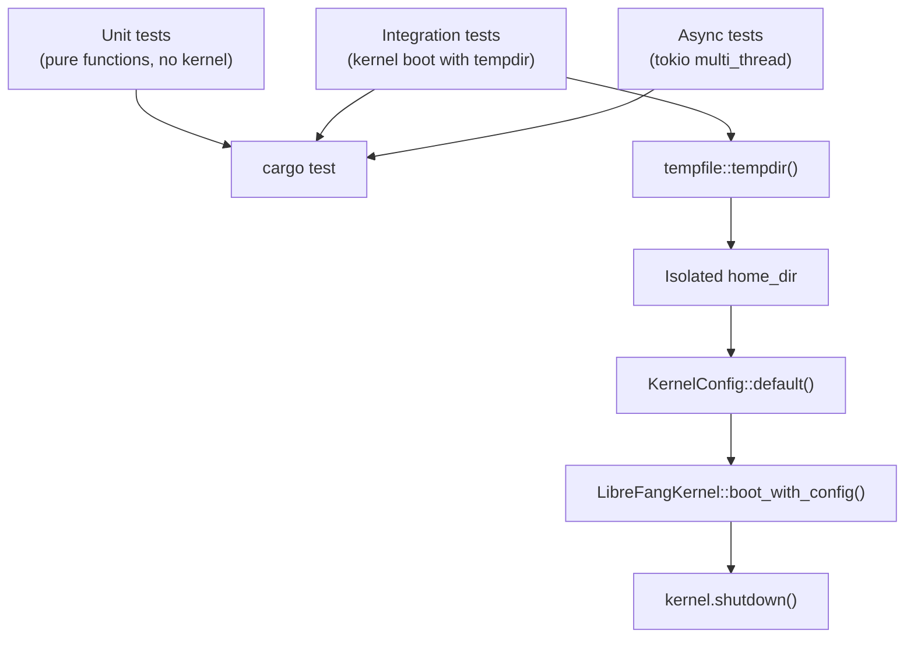

# Other — librefang-kernel-src

# librefang-kernel Test Suite

## Overview

The `kernel/tests.rs` module is the integration and unit test suite for the LibreFang kernel (`librefang-kernel`). It validates the kernel's core subsystems — agent lifecycle, capability enforcement, skill registry, approval routing, model switching, and LLM response parsing — through a combination of in-process kernel boots (using `tempfile::tempdir` for isolation) and lightweight unit tests on pure functions.

Tests are organized by functional domain rather than by internal module, which means this single file covers behaviors spanning the registry, config, manifest helpers, channel adapters, skill registry, and runtime tool runner.

## Test Infrastructure

### RecordingChannelAdapter

A stub `ChannelAdapter` implementation used by approval and notification tests. It produces an empty message stream on `start()`, records every `send()` call into a shared `Arc<Mutex<Vec<String>>>`, and captures messages in `"{platform_id}:{text}"` format. This allows tests to assert exactly which recipients were notified and what content was delivered — without requiring a real channel backend.

### EnvVarGuard / set_test_env

A RAII guard that sets an environment variable on creation and removes it on drop. Used by key-rotation tests to inject test API keys without polluting the process environment:

```rust
let _guard = set_test_env("LIBREFANG_TEST_ROTATION_KEY_A", "key-1");
// env var is cleaned up when _guard goes out of scope
```

### install_test_skill

A helper that writes a minimal valid `skill.toml` (with a `promptonly` runtime type) and a stub `prompt_context.md` into a given parent directory. Used by skill-registry tests to create on-disk skills that the kernel can discover at boot:

```rust
install_test_skill(&skills_parent, "my-skill", &["coding", "rust"]);
```

### test_manifest

Constructs a minimal `AgentManifest` with the given name, description, and tags. Used to avoid repetitive boilerplate in registry tests.

## Test Domains

### API Key Rotation (`collect_rotation_key_specs`)

Tests that the key-spec collector for multi-profile API key rotation correctly:

- **Deduplicates the primary key** — when a profile's `api_key_env` resolves to the same key as the current primary driver key, only one `RotationKeySpec` is emitted (marked `use_primary_driver: true`), and it appears first (lowest priority number wins).
- **Prepends a distinct primary** — when no profile shares the primary key, a synthetic `"primary"` spec is prepended.
- **Skips profiles with missing env vars** — profiles whose `api_key_env` points to an unset variable are silently excluded, not errored.

### Approval Notification Routing (`notify_escalated_approval`)

A multi-threaded tokio test that boots a full kernel, registers a `RecordingChannelAdapter`, and verifies the escalation notification priority hierarchy:

> **Per-request `route_to`** > routing rules > agent notification rules > global `approval_channels`

The test configures all four layers with different recipients, sets `escalation_count: 1` on the request, and asserts that only the explicit per-request target receives the notification. This prevents regressions where escalated approvals would spam all configured channels.

### Manifest → Capabilities (`manifest_to_capabilities`)

Tests the `manifest_to_capabilities` helper that converts an `AgentManifest` into the kernel's internal `Capability` set:

| Scenario | Expected behavior |
|----------|-------------------|
| Explicit `capabilities.tools` | Each tool name becomes `Capability::ToolInvoke(name)` |
| `capabilities.agent_spawn = true` | Adds `Capability::AgentSpawn` |
| `profile = Some(ToolProfile::Coding)` | Expands to `file_read`, `file_write`, `file_list`, `shell_exec`, `web_fetch` plus `ShellExec` and `NetConnect` capabilities |
| Explicit tools override profile | Profile expansion is suppressed — only the explicitly listed tools appear |

This defends against a design where explicit tool declarations silently merge with (rather than replace) profile defaults.

### Agent Registry (`AgentRegistry`)

Tests the `AgentRegistry`'s lookup operations:

- **`find_by_name("coder")`** resolves an agent by its human-readable name.
- **`get(agent_id)`** resolves by UUID.
- **Tag filtering** — `registry.list()` returns all entries; callers filter by `tags` or `name` substring. Validates that the registry stores tags at registration time and they survive retrieval.

### Agent Spawning and Capability Enforcement

This is the most heavily tested domain. It covers `spawn_agent_inner` and its security invariants:

#### Privilege escalation prevention (`test_spawn_child_exceeding_parent_is_rejected`)

A regression test ensuring that `spawn_agent_inner` (not just the higher-level `spawn_agent_checked`) enforces the **capability subset rule**: a child agent's declared capabilities must be a subset of its parent's. Before this check was pushed down, any caller routing through `spawn_agent_with_parent` directly (channel handlers, workflow engines, LLM routing, bulk spawn) would silently bypass the restriction.

The test spawns a parent with only `file_read`, then attempts a child requesting `["*"]` tools, `["*"]` shell, and `["*"]` network. It asserts:

1. The spawn returns an error containing `"Privilege escalation denied"`.
2. No agent named `"escalated-child"` exists in the registry (the check runs before `register()`).

#### Subset allowed (`test_spawn_child_with_subset_capabilities_is_allowed`)

The positive counterpart — a child requesting only `file_read` under a parent that has both `file_read` and `file_write` spawns successfully, and `entry.parent` is correctly set.

#### Unknown parent fails closed (`test_spawn_with_unknown_parent_fails_closed`)

Passing a stale `AgentId` as the parent argument fails with `"not registered"`, preventing a ghost parent from silently landing on the non-parent code path.

#### Default model override (`test_spawn_agent_applies_local_default_model_override`)

When a `default_model_override` is set (e.g., for a local Ollama instance), spawned agents store `"default"/"default"` as their provider/model. Concrete resolution is deferred to `execute_llm_agent` at execution time, not at spawn — so provider changes propagate without re-spawning.

### Model/Provider Switching (`set_agent_model`)

A regression test for issue #2380. When `set_agent_model` switches an agent's provider (e.g., `cloudverse` → `openrouter`), it must clear the per-agent `api_key_env` and `base_url` overrides from the previous provider. Before the fix, the stale credentials persisted, causing requests to hit the old endpoint with the wrong key (surfacing as upstream 401s).

The test also verifies that **same-provider** model swaps (e.g., `claude-3.5-sonnet` → `claude-3.7-sonnet` within `openrouter`) preserve per-agent overrides — they may be legitimate custom configurations.

### Hand Activation

Tests for the "hand" subsystem (named persistent agent instances like `"apitester"`):

- **No runtime tool filter seeding** — `activate_hand` must not populate `tool_allowlist` or `tool_blocklist` on the manifest, so skill and MCP tools remain visible.
- **Reactivation idempotency** — deactivating and reactivating the same hand produces an agent with identical `capabilities.tools`, `profile`, `tool_allowlist`, `tool_blocklist`, and `mcp_servers`.

Both tests gracefully skip if the `apitester` hand has unsatisfied requirements (missing dependencies).

### Available Tools Filtering

#### tools_disabled flag

Setting `tools_disabled: true` on a manifest causes `available_tools()` to return an empty set, suppressing all builtin, skill, and MCP tools.

#### Glob pattern matching

A regression test: declared tools previously used exact `==` matching, so `"mcp_filesystem_*"` never matched `"mcp_filesystem_list_directory"`. The fix uses glob matching. The test verifies `"file_*"` matches `file_read`, `file_write`, `file_list` but not `web_fetch` or `shell_exec`.

#### Shell exec auto-promotion

When `shell_exec` is declared in `capabilities.tools` and `shell: ["*"]` is set, but no explicit `exec_policy` is provided, the kernel auto-promotes the agent's `exec_policy` to `Full` mode. Without this, the global default `ExecSecurityMode::Deny` would strip `shell_exec` from `available_tools()` even though the agent explicitly requested it.

### Route Caching (`should_reuse_cached_route`, `assistant_route_key`)

- **`should_reuse_cached_route`** — brief follow-up messages (e.g., `"fix that"`, `"继续"`) return `true`; acknowledgments (`"thanks"`) and substantive prompts return `false`. This powers the `/btw` ephemeral-message optimization.
- **`assistant_route_key`** — the cache key incorporates `channel`, `user_id`, and `thread_id` from the `SenderContext`, ensuring different conversation contexts don't share cached routes.

### Kernel Boot (`test_boot_spawns_assistant_as_default_agent`)

A freshly booted kernel auto-spawns an `"assistant"` agent. This validates the default-agent provisioning path.

### Ephemeral Messaging (`send_message_ephemeral`)

Two async tests:

1. **Unknown agent → error** — sending to a random `AgentId` returns an error.
2. **Session isolation** — even when the ephemeral call fails (no LLM provider), the real session's message count is unchanged. Ephemeral `/btw` messages never persist to the agent's conversation history.

### Approval Sweep Idempotency

`spawn_approval_sweep_task` sets an `AtomicBool` guard. Calling it twice does not spawn a second task. After `shutdown()`, the flag is cleared.

### Condition Evaluation (`evaluate_condition`)

Tests the tag-based condition evaluator used by skill and routing matchers:

| Input | Result |
|-------|--------|
| `None` | `true` (no condition = always match) |
| `Some("")` | `true` (empty = always match) |
| `Some("agent.tags contains 'chat'")` with matching tags | `true` |
| `Some("agent.tags contains 'chat'")` without matching tags | `false` |
| Unknown format | `false` (strict default — prevents accidental injection) |

### Peer-Scoped Keys (`peer_scoped_key`)

Tests the key-namespacing function:

- With `peer_id`: `"peer:user-123:car"`
- Without `peer_id`: `"car"` (unchanged)

This enables per-user state isolation in shared memory stores.

### Thinking Override (`apply_thinking_override`)

Tests the three-way override logic for agent thinking/reasoning budgets:

| Override value | Existing thinking config | Result |
|---------------|------------------------|--------|
| `None` | Preserved as-is | Unchanged |
| `Some(false)` | Cleared to `None` | Forced off |
| `Some(true)` with no existing config | Default `ThinkingConfig` inserted | Forced on with defaults |
| `Some(true)` with existing config | Budget preserved | Forced on but respects existing `budget_tokens` |

### JSON Extraction (`extract_json_from_llm_response`)

Tests the LLM response parser that extracts structured JSON from freeform text:

| Input format | Handling |
|-------------|----------|
| `` ```json {...} ``` `` code block | Extracts JSON from first valid code block |
| Bare `{...}` object | Extracts directly |
| JSON surrounded by prose | Finds the outermost balanced `{`...`}` pair |
| Nested braces in string values | Handles correctly (the old `find/rfind` approach failed here) |
| Multiple code blocks | Returns the first valid one |
| No JSON present | Returns `None` |
| Malformed JSON | Returns `None` (validates before returning) |

### Background Review Error Classification (`is_transient_review_error`)

Determines whether a failed background skill-review should be retried:

- **Transient** (retry): timeouts, connection closures, network unreachable, 429 rate limits, provider overloaded.
- **Permanent** (skip): missing JSON, missing required fields, security blocks, validation errors. Retrying these wastes tokens since the same prompt will produce the same failure.

### Trace Summarization (`summarize_traces_for_review`)

Tests the head-and-tail trace summarizer that compresses long tool-call histories for the skill-review LLM:

- **60 traces** → first and last are preserved, middle is elided with an `"omitted"` marker. Line count stays well below 60.
- **5 traces** → no elision, all names present.

Uses the `make_trace` helper to generate `DecisionTrace` objects with configurable names and rationales.

### Reviewer Block Sanitization (`sanitize_reviewer_block`, `sanitize_reviewer_line`)

Tests the input sanitizer that prevents a compromised prior LLM response from injecting instructions into the reviewer:

| Attack vector | Mitigation |
|--------------|------------|
| Triple-backtick JSON blocks (`` ``` ``) | Neutralized to prevent the reviewer from interpreting forged JSON as its own output |
| `</data>` / `<data>` envelope markers | Stripped to prevent escaping the prompt envelope |
| Newlines in single-line context | Collapsed to spaces |
| Square brackets `[...]` | Replaced with parentheses `(...)` to prevent `[EXTERNAL SKILL CONTEXT]` injection |
| Null bytes, bell characters | Removed |
| Oversized content | Truncated by character count (not bytes), with `…[truncated]` suffix, safe at UTF-8 boundaries |

### Skill Registry Configuration

Four tests validating the `SkillsConfig` wiring that connects kernel configuration to the skill registry:

#### Disabled list filtering (`test_skills_config_disabled_list_filters_at_boot`)

A regression test: `skills.disabled` was dead code before the wiring was added. Skills listed in `config.skills.disabled` are excluded from the registry at boot even though their directories exist on disk.

#### Extra directories overlay (`test_skills_config_extra_dirs_loaded_as_overlay`)

Skills from `config.skills.extra_dirs` are loaded on top of the primary skills directory. When a skill exists in both locations, the **local install wins** — operators can override a shared skill locally.

#### Reload preservation (`test_reload_skills_preserves_disabled_and_extra_dirs`)

A regression test: `reload_skills()` used to instantiate a fresh `SkillRegistry` without re-applying policy, silently re-enabling disabled skills and dropping the overlay. The test triggers a reload and asserts both policies survive.

#### Stable mode freeze (`test_stable_mode_freezes_registry_and_skips_review_gate`)

When `config.mode = KernelMode::Stable`, the skill registry is frozen at boot (`is_frozen() == true`). Pre-existing skills remain visible, but:
- `reload_skills()` becomes a no-op.
- The background-review pre-claim gate refuses to spawn new reviews (preventing LLM budget drain with no visible effect until restart).

### Skill Evolution Default Availability

`test_skill_evolve_tools_default_available_to_restricted_agent` validates the core design promise: **every agent can self-evolve skills**. Even an agent whose `capabilities.tools` is restricted to `["memory_store"]` sees the full skill-evolution tool surface:

- `skill_read_file`
- `skill_evolve_create`
- `skill_evolve_update`
- `skill_evolve_patch`
- `skill_evolve_delete`
- `skill_evolve_rollback`
- `skill_evolve_write_file`
- `skill_evolve_remove_file`

This works because the kernel's tool-filtering Step 1 treats these names as `default_available`, bypassing the `capabilities.tools` allowlist check.

## Test Execution Model



Most integration tests follow a pattern:

1. Create a temporary directory via `tempfile::tempdir()`.
2. Construct a `KernelConfig` with isolated `home_dir` and `data_dir`.
3. Boot the kernel with `LibreFangKernel::boot_with_config(config)`.
4. Perform assertions against the kernel's registry, skill registry, or other subsystems.
5. Call `kernel.shutdown()` to clean up background tasks.

Async tests use `#[tokio::test(flavor = "multi_thread")]` to support the kernel's internal tokio runtime.