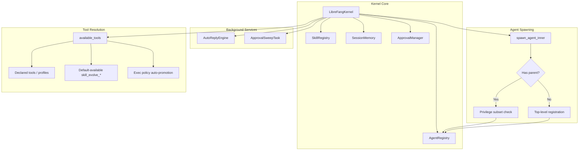

# Other — librefang-kernel-src

# librefang-kernel

The central orchestrator crate for LibreFang. It manages agent lifecycles, tool dispatch, skill evolution, approval workflows, channel routing, and auto-reply background processing.

## Architecture Overview



## Auto-Reply Engine

**File:** `auto_reply.rs`

A concurrency-limited background engine that triggers automatic agent replies based on incoming messages. It enforces suppression patterns and caps concurrent in-flight replies via a tokio `Semaphore`.

### `AutoReplyChannel`

Defines the delivery target for an auto-reply:

| Field | Type | Description |
|---|---|---|
| `channel_type` | `String` | Platform identifier (e.g. `"telegram"`, `"discord"`) |
| `peer_id` | `String` | Recipient user or conversation ID |
| `thread_id` | `Option<String>` | Optional thread for platforms that support threaded replies |

### `AutoReplyEngine`

```rust
pub struct AutoReplyEngine {
    config: AutoReplyConfig,
    semaphore: Arc<Semaphore>,
}
```

Constructed from `AutoReplyConfig`. The semaphore is initialized with `max_concurrent.max(1)` permits, guaranteeing at least one concurrent slot even if the config is zero.

#### `should_reply`

```rust
pub fn should_reply(&self, message: &str, _channel_type: &str, agent_id: AgentId) -> Option<AgentId>
```

Gate-check whether a message should trigger an auto-reply. Returns `None` if:

1. Auto-reply is disabled (`config.enabled == false`)
2. The message (case-insensitive) contains any `suppress_patterns` substring

Returns `Some(agent_id)` when the message passes both checks.

#### `execute_reply`

```rust
pub async fn execute_reply<F>(
    &self,
    kernel_handle: Arc<dyn KernelHandle>,
    agent_id: AgentId,
    message: String,
    reply_channel: AutoReplyChannel,
    send_fn: F,
) -> Result<tokio::task::JoinHandle<()>, String>
```

Spawns a background tokio task that:

1. Acquires a semaphore permit (non-blocking; returns `Err` immediately if at capacity)
2. Calls `kernel_handle.send_to_agent` with a timeout (`config.timeout_secs`)
3. On success, invokes `send_fn(response, reply_channel)` to deliver the result
4. On agent error or timeout, logs a warning — the caller is not notified of failure

The `send_fn` parameter is a closure `Fn(String, AutoReplyChannel) -> BoxFuture<'static, ()>` that handles actual delivery to the channel adapter. The semaphore permit is held for the lifetime of the spawned task (dropped when `_permit` goes out of scope).

#### Accessors

| Method | Returns |
|---|---|
| `is_enabled()` | `bool` — mirrors `config.enabled` |
| `config()` | `&AutoReplyConfig` — read-only reference |
| `available_permits()` | `usize` — current semaphore capacity (useful for monitoring) |

## Kernel Test Coverage & Documented Invariants

The `kernel/tests.rs` file serves as both a regression suite and living documentation of kernel behavioral contracts. The key invariants it establishes are described below.

### Agent Spawning & Lineage

#### Parent-child privilege restriction

`spawn_agent_inner` enforces that a child agent's capabilities must be a **strict subset** of its parent's. This prevents privilege escalation where a restricted parent spawns an unrestricted child:

- A parent with only `file_read` cannot spawn a child requesting `shell_exec` or `*` wildcard tools.
- A child requesting only `file_read` under a parent with `[file_read, file_write]` succeeds.
- Spawning with a `parent` argument pointing to a non-existent `AgentId` fails closed with a "not registered" error.

#### Default model override

When a global `DefaultModelConfig` is set (e.g. a local Ollama model), agents spawned with `provider: "default"` and `model: "default"` defer concrete resolution to execution time. The manifest stores the placeholder values; `resolve_driver` applies the real provider/model at LLM-call time.

#### Provider switching clears stale overrides

`set_agent_model` clears `api_key_env` and `base_url` overrides when the provider changes. This prevents a provider switch from accidentally routing requests to the previous provider's endpoint with stale credentials. Same-provider model swaps intentionally preserve per-agent overrides.

### Tool Availability

#### Glob pattern matching

Declared tool names support glob patterns. `"file_*"` matches `file_read`, `file_write`, `file_list` but not `web_fetch` or `shell_exec`.

#### Exec policy auto-promotion

An agent that declares `shell_exec` in `capabilities.tools` without an explicit `exec_policy` has its policy automatically promoted to `ExecSecurityMode::Full`. Without this, the global default (Deny) would silently strip `shell_exec` from `available_tools()`.

#### `tools_disabled` override

When `manifest.tools_disabled == true`, `available_tools()` returns an empty list regardless of declared capabilities, profiles, or MCP servers.

#### Default-available skill evolution tools

All `skill_evolve_*` tools (`skill_evolve_create`, `skill_evolve_update`, `skill_evolve_patch`, `skill_evolve_delete`, `skill_evolve_rollback`, `skill_evolve_write_file`, `skill_evolve_remove_file`, `skill_read_file`) are always available to every agent, even those with restrictive `capabilities.tools`. This ensures any agent can self-evolve skills regardless of its declared tool set.

### Hand Activation

- `activate_hand` does **not** seed `tool_allowlist` or `tool_blocklist` on the manifest. The runtime tool surface is determined solely by capabilities/profiles/MCP, not runtime filters.
- `deactivate_hand` followed by `activate_hand` rebuilds an identical runtime profile (capabilities, profile, allowlist, blocklist, MCP servers).

### Skill Registry Management

#### Disabled list filtering

`config.skills.disabled` excludes named skills at boot. The skill directory may exist on disk, but the registry will not load it. This filter is re-applied on every `reload_skills()` call.

#### Extra directories overlay

`config.skills.extra_dirs` loads skills from additional filesystem paths. When a skill exists in both the primary `skills/` directory and an extra dir, the **local** install wins.

#### Stable mode freeze

When `config.mode == KernelMode::Stable`, the skill registry is frozen at boot. `reload_skills()` becomes a no-op, and the background review gate refuses to spawn new reviews. Pre-existing skills remain visible.

### Approval & Notification Routing

Escalated approval notifications prefer the per-request `route_to` targets over policy routing rules, agent notification rules, and global approval channels. This ensures explicit escalation targets always take precedence.

`spawn_approval_sweep_task` is idempotent — calling it multiple times does not create duplicate sweep tasks. The `approval_sweep_started` atomic flag is cleared on shutdown.

### JSON Extraction from LLM Responses

`extract_json_from_llm_response` handles multiple LLM output formats:

- JSON inside `` ```json `` code blocks (takes the first valid block)
- Bare JSON objects (`{...}`)
- JSON surrounded by prose text
- JSON with nested braces inside string values (parsed correctly, not by naive brace matching)
- Returns `None` for malformed JSON or responses with no JSON at all

### Ephemeral Messaging

`send_message_ephemeral` sends a one-shot message to an agent without modifying its session history. It errors on unknown agent IDs. Even when the LLM call fails, the session's message count remains unchanged.

### Peer-Scoped Keys

```rust
fn peer_scoped_key(key: &str, peer_id: Option<&str>) -> String
```

Namespaces a key under `peer:<peer_id>:<key>` when a peer ID is provided. Returns the key unchanged when `peer_id` is `None`. Used for per-user memory isolation.

### Thinking Config Overrides

`apply_thinking_override` modifies an agent manifest's thinking configuration:

| Override value | Effect |
|---|---|
| `None` | No change — preserves existing thinking config |
| `Some(false)` | Clears `manifest.thinking` entirely (disables extended thinking) |
| `Some(true)` | Ensures thinking is enabled; inserts defaults if absent, preserves existing `budget_tokens` if present |

### Condition Evaluation

`evaluate_condition` supports `agent.tags contains '<tag>'` syntax. Returns `true` for `None` or empty conditions. Unknown condition formats return `false` (strict default — prevents accidental injection).

### Trace Summarization

`summarize_traces_for_review` produces a bounded summary of tool decision traces:

- Short traces (≤ ~5 entries) are included verbatim
- Long traces show the first entries, last entries, and an "omitted" marker in between
- Used by the background skill review pipeline to keep LLM context windows bounded

### Reviewer Block Sanitization

`sanitize_reviewer_block` and `sanitize_reviewer_line` prepare LLM output for the reviewer prompt by:

- Stripping triple-backtick code fences (prevents injection of fake JSON responses)
- Removing `<data>`/`</data>` envelope markers (prevents escape from the prompt envelope)
- Stripping control characters (`\x00`, `\x07`, etc.) while preserving newlines and tabs
- Truncating by character count (not byte count) with a `…[truncated]` marker, safe on UTF-8 boundaries