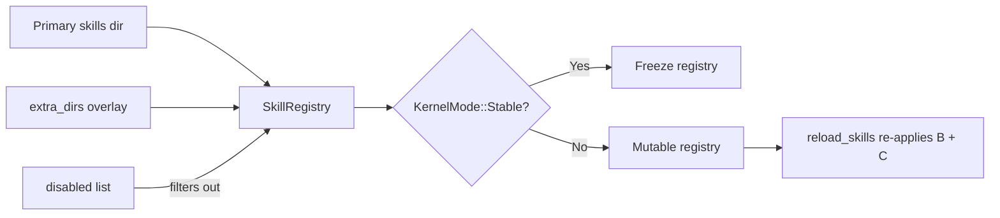

# Other — librefang-kernel-src

# librefang-kernel-src — Kernel Test Suite

## Purpose

This module is the integration and behavioral test suite for `LibreFangKernel`. It validates the kernel's core invariants—agent lifecycle, privilege delegation, tool resolution, skill registry management, notification routing, and LLM response parsing—under realistic conditions. Every test boots a temporary kernel instance against an isolated `tempdir` home, so no shared state leaks between runs.

The test file lives at `kernel/tests.rs` and is compiled as part of the kernel crate's `#[cfg(test)]` module (`use super::*` pulls in the parent `kernel` mod).

## Test Helpers

### `RecordingChannelAdapter`

A `ChannelAdapter` implementation that records every sent text message into an `Arc<Mutex<Vec<String>>>` shared with the test harness. Its `start` stream is permanently empty, and `send` captures `"user_id:text"` pairs. Used by async tests that need to assert notification routing without a real chat backend.

### `EnvVarGuard` / `set_test_env`

Sets an environment variable and returns a guard that removes it on drop. Prevents environment pollution across tests that exercise `api_key_env` resolution.

```rust
let _guard = set_test_env("LIBREFANG_TEST_ROTATION_PRIMARY_KEY_A", "key-1");
// variable is unset when _guard drops at end of scope
```

### `install_test_skill`

Writes a minimal valid `skill.toml` (plus a stub `prompt_context.md`) into a directory so the skill registry's loader accepts it. Accepts a name and tags:

```rust
install_test_skill(&skills_parent, "kept-skill", &["coding", "rust"]);
```

### `test_manifest` / `make_trace`

Convenience constructors for `AgentManifest` and `DecisionTrace` that reduce boilerplate in registry and trace-summarization tests.

---

## Behavioral Contracts Verified

### 1. API Key Rotation Deduplication

**Tests:** `test_collect_rotation_key_specs_dedupes_primary_profile_key`, `test_collect_rotation_key_specs_prepends_distinct_primary_and_skips_missing_profiles`

`collect_rotation_key_specs(profiles, primary_key)` builds a list of `RotationKeySpec` entries for LLM provider key rotation. The invariants are:

- If an `AuthProfile` references the same env var as the primary driver key, it gets `use_primary_driver: true` and appears exactly once (no duplicates).
- If the primary key differs from all profiles, a synthetic `"primary"` entry is prepended.
- Profiles whose `api_key_env` points to an unset variable are silently skipped.

### 2. Escalated Approval Notification Routing

**Test:** `test_notify_escalated_approval_prefers_request_route_to`

When an `ApprovalRequest` is escalated (`escalation_count > 0`), `notify_escalated_approval` must route notifications to the request's `route_to` field **in preference to** all other targets—routing rules, agent notification rules, and global approval channels. This prevents escalation spam from broadcasting to irrelevant recipients.

### 3. Manifest → Capabilities Expansion

**Tests:** `test_manifest_to_capabilities`, `test_manifest_to_capabilities_with_profile`, `test_manifest_to_capabilities_profile_overridden_by_explicit_tools`

`manifest_to_capabilities` converts an `AgentManifest` into a `Vec<Capability>`:

- Explicit `capabilities.tools` entries map to `Capability::ToolInvoke(name)`.
- `capabilities.agent_spawn = true` maps to `Capability::AgentSpawn`.
- A `ToolProfile` (e.g. `Coding`) expands into its full tool set (`file_read`, `file_write`, `file_list`, `shell_exec`, `web_fetch`) **only when** `capabilities.tools` is empty. Explicit tools always take precedence over the profile.
- Profiles also imply `Capability::ShellExec(_)` and `Capability::NetConnect(_)`.

### 4. Agent Registry Lookup

**Tests:** `test_send_to_agent_by_name_resolution`, `test_find_agents_by_tag`

`AgentRegistry` supports three lookup strategies:

| Method | Key | Returns |
|---|---|---|
| `register(entry)` | `AgentId` | Inserts by ID + name index |
| `get(id)` | `AgentId` | Exact `Option<AgentEntry>` |
| `find_by_name("coder")` | Name string | Exact match `Option<AgentEntry>` |
| Tag-based filtering | `entry.tags` | Manual `.iter().filter()` on `list()` |

### 5. Agent Spawning & Privilege Delegation

**Tests:** `test_spawn_agent_applies_local_default_model_override`, `test_spawn_child_exceeding_parent_is_rejected`, `test_spawn_child_with_subset_capabilities_is_allowed`, `test_spawn_with_unknown_parent_fails_closed`

```mermaid
graph TD
    A[spawn_agent_inner] --> B{Parent ID?}
    B -- None --> C[Top-level spawn]
    B -- Some(id) --> D{Parent in registry?}
    D -- No --> E[FAIL: "not registered"]
    D -- Yes --> F{Child caps ⊆ Parent caps?}
    F -- No --> G[FAIL: "Privilege escalation denied"]
    F -- Yes --> H[Register child]
    C --> I[Store "default"/"default" model]
    I --> H
```

Key invariants:

- **Capability subset rule:** A child's declared capabilities (tools, shell, network) must be a subset of its parent's. The check runs in `spawn_agent_inner` itself, not just in the higher-level `spawn_agent_checked`. This closes a bypass where direct callers (channel handlers, workflow engines) could silently escalate.
- **Unknown parent fails closed:** Passing a stale `AgentId` as `parent` results in an error, not silent top-level promotion.
- **Deferred model resolution:** The spawn stores `"default"` for both `provider` and `model` on the manifest. Concrete provider resolution happens at `execute_llm_agent` time, so the runtime picks up `default_model_override` changes without re-spawning.

### 6. Provider Switching & Override Cleanup

**Test:** `test_set_agent_model_clears_overrides_when_provider_changes`

`set_agent_model(agent_id, model, provider)` handles two cases:

- **Different provider** (e.g. `cloudverse` → `openrouter`): Clears `api_key_env` and `base_url` on the agent's `ModelConfig` so `resolve_driver` falls back to the new provider's global credentials and URL. Prevents issue #2380 where stale keys produced 401 errors.
- **Same provider, different model**: Preserves any per-agent `api_key_env`/`base_url` overrides since they remain valid.

### 7. Hand Activation

**Tests:** `test_hand_activation_does_not_seed_runtime_tool_filters`, `test_hand_reactivation_rebuilds_same_runtime_profile`

`activate_hand` / `deactivate_hand` manage persistent agent instances tied to external integrations ("hands"):

- Activation must **not** set `tool_allowlist` or `tool_blocklist` on the manifest—skill and MCP tools must remain visible.
- Re-activating the same hand after deactivation must rebuild an identical runtime profile (capabilities, profile, allowlist, blocklist, MCP servers).

### 8. Tool Availability Resolution

**Tests:** `test_available_tools_returns_empty_when_tools_disabled`, `test_available_tools_glob_pattern_matches_mcp_tools`, `test_shell_exec_available_when_declared_in_tools_without_explicit_exec_policy`, `test_skill_evolve_tools_default_available_to_restricted_agent`

`available_tools(agent_id)` applies these rules in order:

1. If `manifest.tools_disabled == true`, return empty regardless of all other config.
2. Filter the global `builtin_tool_definitions()` against the agent's declared `capabilities.tools` using **glob matching** (`file_*` matches `file_read`, `file_write`, `file_list`).
3. `shell_exec` is auto-promoted: if it appears in `capabilities.tools` and `capabilities.shell` is non-empty, the agent's `exec_policy` is promoted to `Full` even if the global default is `Deny`.
4. Skill-evolution tools (`skill_evolve_create`, `skill_evolve_update`, etc.) are always available regardless of `capabilities.tools`—every agent can self-evolve.

### 9. Route Caching Heuristics

**Tests:** `test_should_reuse_cached_route_for_brief_follow_up`, `test_assistant_route_key_scopes_sender_and_thread`

- `should_reuse_cached_route(text)` returns `true` for short follow-ups ("fix that", "继续") and `false` for gratitude ("thanks") or substantive new requests. This determines whether the assistant reuses its last active agent or re-routes.
- `assistant_route_key(agent_id, sender)` produces a cache key that includes the channel, user ID, and thread ID from the `SenderContext`, ensuring per-conversation isolation.

### 10. Ephemeral Messaging

**Tests:** `test_send_message_ephemeral_unknown_agent_returns_not_found`, `test_send_message_ephemeral_does_not_modify_session`

`send_message_ephemeral(agent_id, text)` is a side-effect-free query path:

- Returns an error for unknown agent IDs.
- Does **not** append to the agent's session history, even if the LLM call fails. The session message count is identical before and after.

### 11. Approval Sweep Idempotency

**Test:** `test_spawn_approval_sweep_task_is_idempotent`

`spawn_approval_sweep_task()` sets `approval_sweep_started` (an `AtomicBool`) to guard against duplicate background tasks. Calling it twice is a no-op. After `shutdown()`, the flag resets to `false`.

### 12. Condition Evaluation

**Tests:** `test_evaluate_condition_none`, `test_evaluate_condition_empty`, `test_evaluate_condition_tag_match`, `test_evaluate_condition_tag_no_match`, `test_evaluate_condition_unknown_format`

`evaluate_condition(condition, tags)` implements a simple DSL:

| Condition | Result |
|---|---|
| `None` | `true` (no filter) |
| `Some("")` | `true` (empty filter) |
| `Some("agent.tags contains 'chat'")` | `true` if `"chat"` is in `tags` |
| Unknown format | `false` (strict deny) |

### 13. Peer-Scoped Memory Keys

**Test:** `test_peer_scoped_key`

`peer_scoped_key(key, peer_id)` namespaces memory keys per-user when a peer is present:

- `peer_scoped_key("car", Some("user-123"))` → `"peer:user-123:car"`
- `peer_scoped_key("car", None)` → `"car"`

### 14. Thinking Override

**Tests:** `test_apply_thinking_override_none_leaves_manifest_untouched`, `test_apply_thinking_override_force_off_clears_thinking`, `test_apply_thinking_override_force_on_inserts_default`, `test_apply_thinking_override_force_on_keeps_existing_budget`

`apply_thinking_override(manifest, override)` controls the agent's extended-thinking budget:

- `None`: no change.
- `Some(false)`: clears `manifest.thinking` entirely (forces thinking off).
- `Some(true)`: inserts default `ThinkingConfig` if absent, preserves existing `budget_tokens` if present.

### 15. JSON Extraction from LLM Responses

**Tests:** `test_extract_json_from_code_block` through `test_extract_json_multiple_code_blocks`

`extract_json_from_llm_response(text)` handles the full spectrum of LLM output formats:

- JSON inside `` ```json `` code fences (extracts the first valid block).
- Bare JSON objects in free text.
- JSON surrounded by prose.
- Nested braces inside string values (handled correctly, not by naive `find/rfind`).
- Returns `None` for text with no JSON or malformed JSON.

### 16. Transient Error Classification

**Tests:** `test_is_transient_review_error_timeouts`, `test_is_transient_review_error_rate_limits`, `test_is_transient_review_error_permanent`

`is_transient_review_error(msg)` determines whether a background skill review error is worth retrying:

- **Transient** (retry): timeouts, connection closures, network failures, 429 rate limits.
- **Permanent** (no retry): parse failures, missing fields, security blocks, validation errors.

### 17. Trace Summarization

**Tests:** `test_summarize_traces_head_and_tail`, `test_summarize_traces_short_no_elision`

`summarize_traces_for_review(traces)` produces a bounded summary of tool execution traces:

- For ≤5 traces: includes all.
- For >5 traces: includes the first, last, and marks the middle as `"omitted"`.
- Guarantees the output is shorter than the raw trace count.

### 18. Reviewer Block Sanitization

**Tests:** `sanitize_reviewer_block_strips_code_fences_and_data_markers`, `sanitize_reviewer_block_preserves_structure_but_drops_controls`, `sanitize_reviewer_block_truncates_by_chars_not_bytes`, `sanitize_reviewer_line_strips_newlines_and_brackets`

Two functions harden the background skill review pipeline against prompt injection from compromised prior LLM output:

- `sanitize_reviewer_block(input, max_chars)`: Strips triple backticks (prevents code-fence injection), removes `<data>`/`</data>` envelope markers (prevents escape from the prompt envelope), drops control characters (`\x00`, `\x07`), preserves structural whitespace (`\n`, `\t`), and truncates by **character count** (not bytes) with a `…[truncated]` marker.
- `sanitize_reviewer_line(input, max_chars)`: Collapses whitespace to spaces, replaces `[`/`]` with `(`/`)` to prevent `[EXTERNAL SKILL CONTEXT]` injection.

### 19. Skills Configuration

**Tests:** `test_skills_config_disabled_list_filters_at_boot`, `test_skills_config_extra_dirs_loaded_as_overlay`, `test_reload_skills_preserves_disabled_and_extra_dirs`, `test_stable_mode_freezes_registry_and_skips_review_gate`

The kernel's skill loading pipeline respects `SkillsConfig`:



- **`skills.disabled`**: Skill names in this list are excluded from the registry at boot, even though their directories exist on disk.
- **`skills.extra_dirs`**: External skill directories loaded as an overlay. On name collisions, the **local** install wins over the external overlay.
- **Hot reload**: `reload_skills()` re-applies both the disabled list and extra_dirs overlay. A regression ensured these were preserved across reloads.
- **Stable mode**: `KernelMode::Stable` freezes the registry at boot (`is_frozen() == true`). Background review gates refuse to spawn new reviews when frozen, preventing wasted LLM budget.

---

## Relationship to Other Modules

| Dependency | Usage |
|---|---|
| `librefang_types::approval` | `ApprovalRequest`, `NotificationConfig`, `RiskLevel`, routing types |
| `librefang_types::config` | `KernelConfig`, `DefaultModelConfig`, `KernelMode`, `ThinkingConfig`, `ExecSecurityMode` |
| `librefang_types::agent` | `AgentManifest`, `ManifestCapabilities`, `ToolProfile`, `ModelConfig` |
| `librefang_types::tool` | `DecisionTrace` |
| `librefang_channels::types` | `ChannelAdapter`, `ChannelContent`, `ChannelType`, `ChannelUser` |
| `librefang_runtime::tool_runner` | `builtin_tool_definitions()` for tool availability assertions |
| `kernel::manifest_helpers` | `manifest_to_capabilities()` |
| `kernel::registry` | `AgentRegistry` with `register`, `get`, `find_by_name`, `list` |