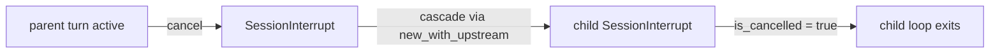

# Other — librefang-kernel-src

# `librefang-kernel` Test Suite

## Overview

The `tests.rs` module inside `librefang-kernel/src/kernel/` is the integration and regression test suite for the `LibreFangKernel` — the central runtime that manages agent lifecycles, tool routing, approval flows, hand (multi-agent preset) activation, skill evolution, and background maintenance tasks.

Tests are organized around **behavioral domains** rather than individual functions. Each domain validates invariants that cross several internal subsystems (registry, memory substrate, channel adapters, skill registry) through the kernel's public API.

## Test Infrastructure

### `RecordingChannelAdapter`

A stub `ChannelAdapter` that captures all sent messages into an `Arc<Mutex<Vec<String>>>`. Used by notification and approval tests to assert delivery without a live channel backend.

- `start()` returns an empty stream (no inbound messages)
- `send()` records `"{platform_id}:{text}"` for each `ChannelContent::Text`
- `stop()` is a no-op

### `EnvVarGuard` / `set_test_env`

RAII guard for environment variables in tests. `set_test_env(key, value)` sets an env var and returns an `EnvVarGuard` that removes it on drop. Used by API key rotation tests to isolate `LIBREFANG_TEST_*` variables.

### `cascade_test_kernel`

Helper that boots a kernel against a fresh tempdir (leaked to survive the test) and returns `Arc<LibreFangKernel>`. Used by parent/stop cascade tests to avoid repeating boilerplate boot sequences.

### `install_test_skill`

Writes a minimal valid `skill.toml` + `prompt_context.md` into a given parent directory. Used by skills wiring tests to seed the skill registry without a real skill installation pipeline.

### `test_manifest`

Factory function producing a minimal `AgentManifest` with configurable name, description, and tags. Used by agent registry lookup tests.

## Test Domains

### API Key Rotation

Tests for `collect_rotation_key_specs`:

| Test | What it verifies |
|---|---|
| `test_collect_rotation_key_specs_dedupes_primary_profile_key` | When a profile's `api_key_env` resolves to the same value as the primary key, the profile appears once with `use_primary_driver: true`; no duplicate key entries. |
| `test_collect_rotation_key_specs_prepends_distinct_primary_and_skips_missing_profiles` | A distinct primary key is prepended. Profiles whose env var is unset are silently dropped from the spec list. |

### Approval Notification Routing

`test_notify_escalated_approval_prefers_request_route_to` — validates the priority hierarchy for escalated approval notifications. When an `ApprovalRequest` carries explicit `route_to` targets, those win over:
- Approval routing rules (`approval.routing`)
- Agent notification rules (`notification.agent_rules`)
- Global approval channels (`notification.approval_channels`)

### Agent Manifest → Capabilities

Tests for `manifest_to_capabilities`:

| Test | Behavior |
|---|---|
| `test_manifest_to_capabilities` | Explicit `capabilities.tools` + `agent_spawn` produce corresponding `Capability` variants. |
| `test_manifest_to_capabilities_with_profile` | A `ToolProfile::Coding` expands into file, shell, and web tool capabilities. |
| `test_manifest_to_capabilities_profile_overridden_by_explicit_tools` | When `capabilities.tools` is non-empty, the profile is **not** expanded — explicit declarations take precedence. |

### Agent Registry Lookups

| Test | Behavior |
|---|---|
| `test_send_to_agent_by_name_resolution` | `find_by_name` and `get(UUID)` both resolve registered agents. |
| `test_find_agents_by_tag` | Tag-based and name-substring filtering works across multiple registered agents. |

### Agent Spawning and Lineage

These tests exercise `spawn_agent_inner` and the capability subset enforcement for parent/child relationships.

```mermaid
graph TD
    A[spawn_agent_inner] --> B{parent provided?}
    B -->|No| C[Register as top-level agent]
    B -->|Yes| D{parent in registry?}
    D -->|No| E[Fail: "not registered"]
    D -->|Yes| F{child caps ⊆ parent caps?}
    F -->|No| G[Fail: "Privilege escalation denied"]
    F -->|Yes| H[Register as child agent]
```

| Test | Key invariant |
|---|---|
| `test_spawn_agent_applies_local_default_model_override` | Agents with `provider: "default"` store `"default"` at spawn time; concrete resolution happens at execution time. |
| `test_spawn_child_exceeding_parent_is_rejected` | A child requesting capabilities beyond its parent's is rejected before registry insertion. |
| `test_spawn_child_with_subset_capabilities_is_allowed` | A child whose tools are a strict subset of the parent's spawns successfully. |
| `test_spawn_with_unknown_parent_fails_closed` | A stale `AgentId` as parent fails with "not registered" rather than silently treating the child as top-level. |

### Provider Switching

`test_set_agent_model_clears_overrides_when_provider_changes` — regression test for issue #2380. When `set_agent_model` switches an agent to a different provider, stale `api_key_env` and `base_url` overrides from the previous provider must be cleared. Same-provider model swaps must **preserve** existing overrides.

### Hand Activation and Deactivation

Hands are multi-agent presets defined by `HAND.toml` files. These tests validate the activate → override → deactivate → reactivate lifecycle.

| Test | What it verifies |
|---|---|
| `test_hand_activation_does_not_seed_runtime_tool_filters` | `tool_allowlist` and `tool_blocklist` remain empty after activation so skill/MCP tools stay visible. |
| `test_hand_reactivation_rebuilds_same_runtime_profile` | Deactivating and reactivating a hand rebuilds the agent from the `HAND.toml` definition, discarding any runtime overrides from the previous activation. |
| `reactivate_builds_from_hand_toml_not_override` | Extended version of the above covering model, provider, `api_key_env`, `base_url`, `max_tokens`, `temperature`, and `web_search_augmentation`. |
| `test_hand_skills_propagate_to_derived_agent_manifest` | Hand-level `skills = [...]` allowlist propagates into each derived agent's `AgentManifest.skills` (issue #3135). |
| `test_hand_skills_intersect_per_role_overrides` | When both hand and per-role agent declare skills, the effective list is the intersection. |

### Tool Availability

| Test | What it verifies |
|---|---|
| `test_available_tools_returns_empty_when_tools_disabled` | `tools_disabled: true` suppresses all builtin, skill, and MCP tools. |
| `test_available_tools_glob_pattern_matches_mcp_tools` | Glob patterns like `file_*` match `file_read`, `file_write`, `file_list` (regression for exact-match-only bug). |
| `test_shell_exec_available_when_declared_in_tools_without_explicit_exec_policy` | Agents declaring `shell_exec` in tools auto-promote their `exec_policy` to `Full` even when the global default is `Deny`. |
| `test_skill_evolve_tools_default_available_to_restricted_agent` | Skill evolution tools (`skill_evolve_create`, etc.) are always available regardless of restrictive `capabilities.tools`. |

### Message Routing

| Test | What it verifies |
|---|---|
| `test_should_reuse_cached_route_for_brief_follow_up` | Short follow-up messages ("fix that", "继续") reuse cached routes; long or terminal messages ("thanks") do not. |
| `test_assistant_route_key_scopes_sender_and_thread` | Route keys incorporate channel, user_id, and thread_id to prevent cross-context leakage. |
| `test_boot_spawns_assistant_as_default_agent` | A fresh kernel boot auto-spawns an `assistant` agent. |
| `test_send_message_ephemeral_unknown_agent_returns_not_found` | Ephemeral messages to non-existent agents error out. |
| `test_send_message_ephemeral_does_not_modify_session` | Ephemeral (`/btw`) messages never mutate the real session history. |

### Background Task Idempotency

| Test | What it verifies |
|---|---|
| `test_spawn_approval_sweep_task_is_idempotent` | Calling `spawn_approval_sweep_task` twice starts only one loop (atomic guard). |
| `test_spawn_task_board_sweep_task_is_idempotent` | Same idempotency guarantee for `spawn_task_board_sweep_task` (issue #2923). |
| `test_task_board_sweep_resets_stuck_in_progress_task` | A claimed task past its TTL gets reset to `pending` so another worker can re-claim. |

### Condition Evaluation

Tests for `evaluate_condition`:

- `None` and empty string conditions evaluate to `true`.
- `"agent.tags contains 'tag'"` matches against the agent's tag list.
- Unknown formats default to `false` (strict — prevents accidental bypass).

### Peer-Scoped Keys

`test_peer_scoped_key` — `peer_scoped_key("car", Some("user-123"))` → `"peer:user-123:car"`. Without a peer ID, the key is passed through unchanged.

### Thinking Override

Tests for `apply_thinking_override`:

| Override value | Effect |
|---|---|
| `None` | Leaves `manifest.thinking` untouched. |
| `Some(false)` | Clears `manifest.thinking` to `None`. |
| `Some(true)` when unset | Inserts default `ThinkingConfig`. |
| `Some(true)` when already set | Preserves existing `budget_tokens`. |

### JSON Extraction from LLM Responses

Tests for `LibreFangKernel::extract_json_from_llm_response`:

- Extracts JSON from `\`\`\`json` code blocks.
- Extracts bare `{...}` objects surrounded by prose.
- Handles nested braces inside string values (old find/rfind approach failed here).
- Returns `None` for no JSON, malformed JSON, or multiple code blocks (takes first valid).

### Background Skill Review

`is_transient_review_error` classifies errors:

| Transient (retryable) | Permanent (no retry) |
|---|---|
| Timeouts, connection closures, network errors | Missing JSON, validation errors, security blocks, rate limits |

`summarize_traces_for_review` produces bounded summaries: first N and last N traces with `"omitted"` for the middle, keeping output under the trace count threshold.

### Reviewer Block Sanitization

Tests for `sanitize_reviewer_block` and `sanitize_reviewer_line`:

- Strips triple-backtick code fences to prevent prompt injection via forged JSON blocks.
- Strips `</data>` / `<data>` envelope markers.
- Removes control characters (`\x00`, `\x07`) while preserving `\n` and `\t`.
- Truncates by **character count** (not byte count) with `…[truncated]` marker.
- Collapses newlines and replaces brackets with parentheses at the line level.

### Skills Configuration Wiring

| Test | What it verifies |
|---|---|
| `test_skills_config_disabled_list_filters_at_boot` | `skills.disabled` in config prevents listed skills from loading at boot. |
| `test_skills_config_extra_dirs_loaded_as_overlay` | `skills.extra_dirs` loads external skills; local install wins name collisions. |
| `test_reload_skills_preserves_disabled_and_extra_dirs` | Hot-reload re-applies the disabled list and overlay dirs (regression: they used to vanish). |
| `test_stable_mode_freezes_registry_and_skips_review_gate` | `KernelMode::Stable` freezes the skill registry; review gates refuse to spawn. |

### Cron Job Peer Context

`test_cron_create_preserves_peer_id` — regression for `cron_create` silently dropping `peer_id` from the job payload. Jobs created with `peer_id` must persist it; jobs without it must have `peer_id: null`.

### Parent /Stop Cascade

Tests for the session interrupt propagation chain (issue #3044):



| Test | What it verifies |
|---|---|
| `cascade_primitives_via_session_interrupts_dashmap` | Parent cancel propagates to child; child cancel does **not** propagate to parent. |
| `no_upstream_when_parent_has_no_active_turn` | Lookup returns `None` for idle parents — no cascade, no error. |
| `send_to_agent_as_tolerates_unregistered_parent_uuid` | Unregistered parent UUID falls through gracefully; error references the missing child. |
| `send_to_agent_as_rejects_unparseable_parent_id` | Garbage parent IDs surface an error rather than panicking. |

### Atomic TOML Writes

Tests for `atomic_write_toml` — the crash-safe replacement for `fs::write` used by `persist_manifest_to_disk`:

| Test | What it verifies |
|---|---|
| `atomic_write_replaces_existing_content` | Stages to `.tmp`, renames into place; final content is correct. |
| `atomic_write_leaves_no_tmp_file_on_success` | No staging artifacts remain after a successful write. |
| `atomic_write_no_partial_state_under_concurrency` | Two threads racing to write the same path never produce a corrupt/partial file; readers always see a complete payload. |

### Hand State Persistence Across Restarts

These tests simulate a daemon restart by booting a kernel, activating a hand, persisting state, shutting down, and booting a fresh kernel that restores from `hand_state.json`.

| Test | What it verifies |
|---|---|
| `boot_drift_preserves_hand_settings_tail` | `## User Configuration` settings block survives restart via `activate_hand_with_id`. |
| `boot_drift_preserves_skill_and_team_tails` | `## Reference Knowledge` (from `SKILL.md`) and `## Your Team` (peer roster) survive restart. |
| `hand_runtime_override_survives_restart_via_activate_hand_with_id` | Model, provider, max_tokens, temperature, and web_search_augmentation overrides round-trip through `hand_state.json`. |
| `deactivate_hand_removes_hand_agent_rows_from_sqlite` | SQLite rows for hand agents are scrubbed even when the in-memory registry has already evicted them (post-restart scenario). |
| `boot_gc_removes_orphaned_hand_agent_rows` | On boot, `is_hand = true` rows not claimed by any active hand instance are garbage-collected from SQLite. |

> **Note on `start_background_agents`**: The `#[ignore]` test `hand_runtime_override_survives_restart_via_start_background_agents` exercises the full async restore coroutine. It is disabled in CI because it depends on network-adjacent operations (registry sync, context engine). The deterministic sibling test above covers the same logic without those dependencies.

## Patterns and Conventions

- **Tempdir isolation**: Every test creates a unique `tempfile::tempdir()` as `home_dir`. No test relies on shared filesystem state.
- **Kernel lifecycle**: Tests follow `boot_with_config` → exercise → `shutdown()`. The `shutdown()` call is essential to join background tasks and release file locks.
- **Graceful skipping**: Hand tests that depend on optional components (e.g., `apitester` hand being installed) catch `"unsatisfied requirements"` errors and return early with a diagnostic `eprintln!`.
- **Atomicity guards**: Background sweep tasks use `AtomicBool` guards (`approval_sweep_started`, `task_board_sweep_started`) to ensure single-instance spawning across concurrent callers.
- **`std::mem::forget(dir)`**: The `cascade_test_kernel` helper leaks its tempdir so the directory survives the returned kernel's lifetime. This is acceptable in test code.