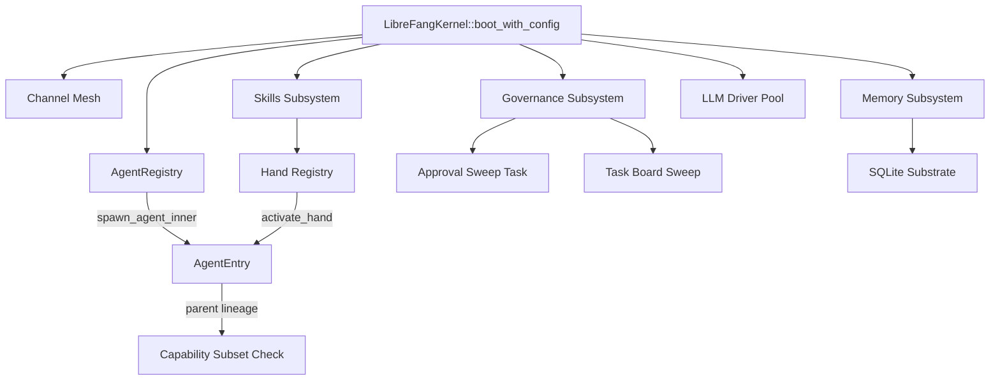

# Other — librefang-kernel-src

# librefang-kernel

The core runtime kernel for the LibreFang agent platform. This crate owns agent lifecycle management, capability enforcement, hand activation, skill evolution, approval routing, background task orchestration, and configuration persistence.

## Architecture Overview


```mermaid
graph TD
    Boot["LibreFangKernel::boot_with_config"] --> Registry["AgentRegistry"]
    Boot --> Mesh["Channel Mesh"]
    Boot --> Governance["Governance Subsystem"]
    Boot --> Memory["Memory Subsystem"]
    Boot --> Skills["Skills Subsystem"]
    Boot --> LLM["LLM Driver Pool"]
    Registry -->|spawn_agent_inner| AgentEntry["AgentEntry"]
    AgentEntry -->|parent lineage| CapCheck["Capability Subset Check"]
    Skills --> HandReg["Hand Registry"]
    HandReg -->|activate_hand| AgentEntry
    Governance --> ApprovalSweep["Approval Sweep Task"]
    Governance --> TaskBoard["Task Board Sweep"]
    Memory --> Substrate["SQLite Substrate"]
```

## Boot and Configuration

The kernel boots via `LibreFangKernel::boot_with_config(KernelConfig)`, which initializes all subsystems against a `home_dir` on the filesystem. A fresh boot auto-spawns a default `assistant` agent.

`KernelConfig` controls:
- **`home_dir` / `data_dir`** — filesystem roots for SQLite, TOML manifests, skill directories
- **`mode`** — `KernelMode::Stable` freezes the skill registry, preventing runtime mutations and skipping the background review gate
- **`skills.disabled`** — list of skill names excluded at boot
- **`skills.extra_dirs`** — overlay directories scanned in addition to `home_dir/skills`; local installations win name collisions over external overlays
- **`approval.routing`** — per-tool-pattern notification targets
- **`notification`** — global and per-agent notification rules

## Agent Lifecycle

### Spawning

`spawn_agent_inner(manifest, parent_id, session_id, config)` is the internal entry point. It:

1. Resolves the model from `manifest.model`, falling back to `default_model_override` when provider/model are `"default"`
2. Enforces **capability subset inheritance**: if a `parent_id` is provided, the child's declared capabilities must be a subset of the parent's. A child requesting `tools = ["*"]` + `shell = ["*"]` against a parent that only has `file_read` is rejected with `"Privilege escalation denied"`
3. Validates that `parent_id` refers to a registered agent — stale/ghost IDs fail closed with `"not registered"`
4. Registers the agent in `AgentRegistry` and persists to SQLite

### Agent Registry

`AgentRegistry` supports lookup by:
- **UUID** — `registry.get(agent_id)`
- **Name** — `registry.find_by_name("coder")`
- **Tag filtering** — done externally via `registry.list()` with predicate filters

### Provider Switching

`set_agent_model(agent_id, model, provider)` updates the agent's model configuration. When the provider changes (e.g., `"cloudverse"` → `"openrouter"`), it **clears** stale per-agent `api_key_env` and `base_url` overrides so `resolve_driver` falls back to the new provider's credentials. Same-provider model swaps preserve existing overrides.

### Ephemeral Messaging

`send_message_ephemeral(agent_id, message, sender)` executes a one-shot LLM turn against a **cloned** session. The real session's message history is never modified. Unknown agent IDs return an error.

## Capability System

### Manifest to Capabilities

`manifest_to_capabilities(&manifest)` converts an `AgentManifest` into a `Vec<Capability>`:
- If `capabilities.tools` is non-empty, those tools are enumerated as `Capability::ToolInvoke(name)`
- If `capabilities.tools` is empty but `profile` is set (e.g., `ToolProfile::Coding`), the profile expands to its default tool set
- `capabilities.agent_spawn` maps to `Capability::AgentSpawn`
- Profile expansion includes derived capabilities: `ToolProfile::Coding` grants `ShellExec` and `NetConnect`

Explicit `tools` **override** profile expansion — they are not merged.

### Tool Availability Filtering

`available_tools(agent_id)` resolves the effective tool set for an agent:

1. **`tools_disabled = true`** suppresses all builtin, skill, and MCP tools — returns empty
2. **Glob patterns** in `capabilities.tools` match by prefix: `"file_*"` matches `file_read`, `file_write`, `file_list` but not `web_fetch`
3. **`shell_exec` auto-promotion**: if `shell_exec` is declared in `capabilities.tools` and `capabilities.shell` is non-empty but no explicit `exec_policy` is set, the agent's `exec_policy` is auto-promoted to `ExecSecurityMode::Full`
4. **Skill evolution tools** (`skill_evolve_create`, `skill_evolve_update`, etc.) are **default-available** to every agent regardless of their declared `capabilities.tools`

## Hand System

Hands are multi-agent deployment units defined by `HAND.toml` files. Each hand can define multiple agent roles under `[agents.<role>]`.

### Activation Flow

`activate_hand(hand_id, config)` → `activate_hand_with_id(...)`:

1. Reads the `HandDefinition` from the hand registry
2. For each role in `[agents.*]`, builds an `AgentManifest` from the role's TOML
3. Applies settings blocks (`[[settings]]`) as a `## User Configuration` tail on `system_prompt`
4. Applies skill reference block (`## Reference Knowledge`) from `SKILL.md`
5. Applies team block (`## Your Team`) for multi-agent hands
6. **Skills propagation**: hand-level `skills = ["alpha", "beta"]` propagates to each role's `AgentManifest.skills`. If a role declares its own `skills` list, the effective list is the **intersection**
7. Registers all derived agents and returns an `ActiveHandInstance`

### Runtime Overrides

`update_hand_agent_runtime_override(agent_id, override)` applies per-agent model/provider/temperature overrides at runtime without modifying the hand definition. These persist in `hand_state.json`.

### Deactivation

`deactivate_hand(instance_id)` kills all agents owned by the instance and removes their SQLite rows — even when agents are no longer in the in-memory registry (the post-restart scenario where `load_all_agents` skips `is_hand=true` rows).

### Reactivation

After deactivation, a fresh `activate_hand` rebuilds from the `HAND.toml` definition. Previous runtime overrides (model, provider, temperature, max_tokens, web_search_augmentation) are **discarded** — the restored manifest reflects only the hand definition and persisted `config`.

### Persistence Across Restarts

On daemon restart, `start_background_agents` reads `hand_state.json` and calls `activate_hand_with_id` for each saved instance. This re-renders all system prompt tails and re-applies persisted `agent_runtime_overrides`. Hand agents are **not** rehydrated from SQLite — they are rebuilt from the hand definition every boot.

## Skills Subsystem

### Skill Registry

Skills live under `home_dir/skills/` (primary) and `skills.extra_dirs` (overlays). Each skill has a `skill.toml` and optional `prompt_context.md`.

- `skills.disabled` filters are applied at boot and survive `reload_skills()`
- `reload_skills()` re-scans directories and re-applies the disabled list and extra_dirs overlay
- `KernelMode::Stable` freezes the registry — `reload_skills()` becomes a no-op, and the background review gate refuses to spawn new reviews

### Skill Evolution

All agents have default access to skill evolution tools regardless of their declared capabilities:

- `skill_read_file`
- `skill_evolve_create`, `skill_evolve_update`, `skill_evolve_patch`, `skill_evolve_delete`
- `skill_evolve_rollback`, `skill_evolve_write_file`, `skill_evolve_remove_file`

## API Key Rotation

`collect_rotation_key_specs(profiles, primary_key)` builds the ordered list of `RotationKeySpec` entries used for driver rotation:

- Deduplicates: if a profile references the same env var as the primary key, only one spec is emitted (with `use_primary_driver: true`)
- Skips profiles whose `api_key_env` resolves to no value
- Prepends the primary key as a named `"primary"` spec when no profile already covers it

## Approval and Notification Routing

`notify_escalated_approval(request, request_id)` resolves notification targets with this precedence:

1. **Per-request `route_to`** — explicit targets on the `ApprovalRequest` itself (used for escalations)
2. **Policy routing rules** — `approval.routing` matching `tool_pattern`
3. **Agent notification rules** — per-agent-pattern channel targets
4. **Global approval channels** — fallback notification targets

Escalated approvals prefer the request-level `route_to` over all other routing layers.

## Background Sweep Tasks

Both sweep tasks are **spawn-idempotent** — guarded by atomic flags (`approval_sweep_started`, `task_board_sweep_started`) that prevent duplicate loops. `shutdown()` clears the flags.

### Approval Sweep

Periodically scans for timed-out approval requests.

### Task Board Sweep

`task_reset_stuck(ttl_secs, batch_limit)` resets `in_progress` tasks whose `claimed_at` exceeds the TTL back to `pending`, clearing `assigned_to`. This handles workers that stall after claiming (e.g., empty LLM response, session death).

## Session Interrupt Cascade

When a parent agent is stopped mid-turn, the cancel signal propagates to child agents:

1. `execute_llm_agent` registers a `SessionInterrupt` in `session_interrupts` keyed by `(agent_id, session_id)`
2. Child agents receive `SessionInterrupt::new_with_upstream(&parent_interrupt)` 
3. `parent_interrupt.cancel()` sets the cancellation flag on both parent and child
4. **Unidirectional**: canceling a child does **not** propagate to the parent
5. `send_to_agent_as` resolves parent IDs with a registry → UUID-parse fallback, tolerating unregistered parents (e.g., parent killed mid-flight)

## Peer-Scoped Keys

`peer_scoped_key(key, peer_id)` namespaces memory keys per-peer:

- `None` peer → global scope: `"car"`
- Valid peer → `"peer:{peer_id}:{key}"`

Security validations (issues #5119, #5120):
- Peer IDs containing `:` are rejected — prevents ambiguity with the `peer:{pid}:{key}` framing
- Empty peer IDs are rejected — prevents collision with `None`-scope keys
- Keys starting with `peer:` are rejected — prevents LLM-supplied keys from colliding with the internal namespace

## Atomic TOML Persistence

`atomic_write_toml(path, content)` replaces the previous `fs::write` for manifest persistence:

1. Writes content to a sibling `.tmp` staging file
2. Atomically renames into the target path
3. No partial state is observable under concurrent writes — readers always see a complete previous or new payload

## JSON Extraction from LLM Responses

`extract_json_from_llm_response(text)` handles multiple LLM output formats:

- `` ```json ... ``` `` code blocks (returns first valid block)
- Bare JSON objects embedded in surrounding text
- JSON with nested braces inside string values
- Returns `None` for text with no valid JSON

## Review Sanitization

`sanitize_reviewer_block(input, max_chars)` and `sanitize_reviewer_line(input, max_chars)` strip control characters and injection vectors from content fed to the background skill reviewer:

- Neutralizes triple backticks (prevents fake code-fence injection)
- Strips `</data>` / `<data>` envelope markers
- Removes null bytes, bell characters
- Truncates by **character count** (not bytes) with a `…[truncated]` marker

## Condition Evaluation

`evaluate_condition(condition, tags)` supports agent-scoped conditions:

- `None` or empty string → `true`
- `"agent.tags contains 'chat'"` → matches against the agent's tag list
- Unknown formats → `false` (strict default-deny)

## Cron Job Peer Context

`cron_create(agent_id, job_json)` preserves the `peer_id` field from the job payload. This ensures OFP-triggered cron jobs retain the originating peer's context for correct memory scoping.

## Utility: Thinking Override

`apply_thinking_override(manifest, override)` controls extended thinking:

| Override | Existing Thinking | Result |
|----------|------------------|--------|
| `None` | Any | Preserved unchanged |
| `Some(false)` | Any | Cleared to `None` |
| `Some(true)` | `None` | Inserted with default `budget_tokens` |
| `Some(true)` | Existing | Preserved with existing `budget_tokens` |

## Utility: Trace Summarization

`summarize_traces_for_review(traces)` condenses long decision traces for the background reviewer:

- Short traces (< ~30 entries) are included verbatim
- Long traces keep the head and tail with an `"omitted"` marker for the middle
- Output is bounded to prevent prompt overflow

## Utility: Brief Follow-Up Detection

`should_reuse_cached_route(message)` returns `true` for short messages that are likely follow-ups to a prior conversation turn (e.g., `"fix that"`, `"继续"`). Messages like `"thanks"` or long-form requests return `false`. Used to suppress unnecessary route re-evaluation.

## Utility: Assistant Route Key

`assistant_route_key(agent_id, sender)` generates a cache key scoped by agent, channel, user ID, and thread ID. Absent sender context produces a different key, ensuring channel-scoped routing doesn't leak across delivery paths.

## Test Infrastructure Helpers

| Helper | Purpose |
|--------|---------|
| `RecordingChannelAdapter` | Captures sent messages for assertion without a real channel |
| `EnvVarGuard` / `set_test_env` | Sets an env var for the test's duration; removes on drop. Requires single-threaded test runner for safety |
| `install_test_skill` | Writes a minimal valid `skill.toml` + `prompt_context.md` into a directory |
| `cascade_test_kernel` | Boots a kernel against a leaked tempdir for session-interrupt tests |