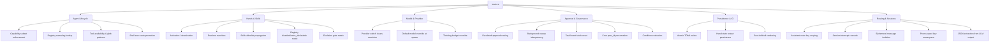

# Other — librefang-kernel-src

# librefang-kernel — Test Suite

## Overview

`librefang-kernel/src/kernel/tests.rs` is the integration and unit test module for the LibreFang kernel. It validates the central runtime's core invariants — agent lifecycle, capability enforcement, hand activation/restoration, skill gating, approval routing, model switching, session isolation, and atomic persistence — by exercising the public kernel API against ephemeral temporary directories.

The kernel is the orchestrator that ties together agent registration, LLM dispatch, channel mesh, memory substrate, governance (approvals, task boards, cron), skills, and hands. This test file is the primary safety net ensuring those subsystems compose correctly.

## Test Infrastructure

### Kernel Boot Pattern

Nearly every test follows the same template: create a temp directory, boot a kernel with a default `KernelConfig`, exercise the API, then call `kernel.shutdown()`.

```rust
let tmp = tempfile::tempdir().unwrap();
let home_dir = tmp.path().join("librefang-kernel-<test-name>");
std::fs::create_dir_all(&home_dir).unwrap();

let config = KernelConfig {
    home_dir: home_dir.clone(),
    data_dir: home_dir.join("data"),
    ..KernelConfig::default()
};

let kernel = LibreFangKernel::boot_with_config(config).expect("Kernel should boot");
// ... exercise kernel API ...
kernel.shutdown();
```

`boot_with_config` initializes all subsystems against the provided `home_dir` without reading real user config, giving each test a hermetic environment.

### Environment Variable Safety

Tests that mutate process-global environment variables (e.g. for API key rotation) use the `serial_test::serial(librefang_vault_key)` attribute and the `set_test_env` helper. The `EnvVarGuard` RAII guard removes the variable on drop:

```rust
#[test]
#[serial_test::serial(librefang_vault_key)]
fn test_rotation_logic() {
    let _guard = set_test_env("LIBREFANG_TEST_KEY", "value");
    // _guard removed the env var when it goes out of scope
}
```

The serial attribute ensures no two env-mutating tests run concurrently, since `cargo test` uses multiple threads within a single process.

### Recording Channel Adapter

`RecordingChannelAdapter` is a stub `ChannelAdapter` that captures sent messages into a `Mutex<Vec<String>>`. Tests insert it into `kernel.mesh.channel_adapters` to verify notification routing without a real channel backend:

```rust
let adapter = Arc::new(RecordingChannelAdapter::new("test"));
let sent = adapter.sent.clone();
kernel.mesh.channel_adapters.insert("test".to_string(), adapter);
// ... trigger notification ...
let messages = sent.lock().unwrap().clone();
assert!(messages[0].contains("expected-recipient"));
```

### Skill Installation Helper

`install_test_skill` writes a minimal valid `skill.toml` + `prompt_context.md` into a given directory, enabling tests to exercise the skill registry without external dependencies.

## Behavioral Invariants Under Test

### Agent Capability Enforcement

The kernel enforces a strict capability subset rule: a child agent's declared capabilities must not exceed its parent's. This prevents privilege escalation through agent spawning.

| Test | Invariant |
|------|-----------|
| `test_spawn_child_exceeding_parent_is_rejected` | Child requesting `tools=["*"]` + shell + network is denied |
| `test_spawn_child_with_subset_capabilities_is_allowed` | Child with a strict subset of parent tools spawns successfully |
| `test_spawn_with_unknown_parent_fails_closed` | Stale `AgentId` as parent fails, never silently de-escalates |

The `manifest_to_capabilities` function maps agent manifests into `Capability` sets. Tool profiles (e.g. `ToolProfile::Coding`) expand into predefined tool lists, but explicit `capabilities.tools` entries override the profile entirely.

### Model and Provider Switching

`set_agent_model` must clear per-agent `api_key_env` and `base_url` overrides when the provider changes, preventing stale credentials from leaking across providers. Same-provider model swaps preserve existing overrides.

**Regression context:** Before the fix, switching from a custom provider ("cloudverse") to "openrouter" would retain the old API key and base URL, causing 401 errors from the new endpoint (issue #2380).

### Hand Activation and Runtime Overrides

Hands are multi-agent constructs defined by `HAND.toml` files. The kernel supports:

- **Activation** — `activate_hand` creates agents from the hand definition
- **Runtime overrides** — `update_hand_agent_runtime_override` applies per-agent model/provider/temperature overrides without modifying the hand definition
- **Deactivation** — `deactivate_hand` tears down the hand's agents
- **Reactivation** — A fresh `activate_hand` rebuilds from the `HAND.tomL`, discarding any runtime overrides from prior activations

Key invariants:

- Runtime overrides (model, provider, max_tokens, temperature, web_search_augmentation) do **not** survive deactivation + reactivation
- The tool allowlist and blocklist remain empty after hand activation so skill/MCP tools remain visible
- Hand-level `skills` allowlists propagate to derived per-role agents, with intersection semantics when the role also declares its own list (issue #3135)

### Hand State Persistence Across Restarts

Hand agents are **not** rehydrated from SQLite rows. Instead, `start_background_agents` reads `hand_state.json` and calls `activate_hand_with_id` to rebuild each hand from its `HAND.toml` definition plus any persisted `agent_runtime_overrides`.

The rendered system prompt tails must survive this rebuild:

| Tail | Source |
|------|--------|
| `## User Configuration` | `[[settings]]` from `HAND.toml`, rendered by `apply_settings_block_to_manifest` |
| `## Reference Knowledge` | `SKILL.md`, rendered by `apply_skill_reference_block_to_manifest` |
| `## Your Team` | Peer roster for multi-agent hands, rendered by `apply_team_block_to_manifest` |

### Skill Registry Management

The skills subsystem supports operator-controlled filtering and overlay:

- **`skills.disabled`** — Named skills excluded from the registry at boot
- **`skills.extra_dirs`** — External directories loaded as overlay; local skills win name collisions
- **`reload_skills`** — Hot-reload preserves both disabled list and extra_dirs overlay (regression: pre-fix reload instantiated a fresh registry without policy)
- **Stable mode** — Freezes the registry (`is_frozen() == true`), preventing mutations and skipping the background review gate

### Skill Evolution Gating

Evolution tools (`skill_evolve_*`) are gated by the boolean expression:

```
evolve_enabled = auto_evolve || skill_workshop.enabled
```

The test matrix covers all four flag combinations. Explicit declaration in `capabilities.tools` overrides the gate — an operator listing `skill_evolve_create` in tools gets it regardless of the flags.

### Approval Notification Routing

`notify_escalated_approval` resolves targets in priority order:

1. Per-request `route_to` on the `ApprovalRequest` (highest priority)
2. Routing rules matching `tool_pattern`
3. Agent notification rules matching `agent_pattern`
4. Global `approval_channels`

Escalated approvals prefer the explicit request target over policy or global defaults.

### Shell Exec Policy Auto-Promotion

When `shell_exec` is declared in `capabilities.tools` with `shell: ["*"]` but no explicit `exec_policy`, the kernel auto-promotes the policy to `ExecSecurityMode::Full`. Without this, the default global policy (Deny) would strip `shell_exec` from `available_tools` despite the explicit declaration.

### Peer-Scoped Key Namespace

`peer_scoped_key` provides isolated key namespaces for per-user state:

```
peer_scoped_key("car", Some("user-123")) → "peer:user-123:car"
peer_scoped_key("car", None)             → "car"
```

Security constraints (issues #5119, #5120):
- `peer_id` containing `:` is rejected (breaks injective framing)
- Empty `peer_id` is rejected (ambiguous with unscoped keys)
- Key starting with `peer:` is rejected (prevents namespace collision)

### Session Interrupt Cascade

When a parent agent is stopped mid-turn (`/stop`), the cancellation propagates to child agents via `SessionInterrupt::new_with_upstream`. The cascade is one-directional: cancelling a child does not affect the parent. The kernel stores interrupts in `session_interrupts`, a DashMap keyed by `(AgentId, SessionId)`.

### Atomic TOML Persistence

`atomic_write_toml` stages content to a `.tmp` file and renames it into place, preventing partial writes under crash or concurrency. Tests verify no `.tmp` artifacts remain and concurrent writers never produce corrupt mixes.

### Task Board Sweep

The background sweeper resets stuck `in_progress` tasks back to `pending` after a configurable TTL. Both `spawn_approval_sweep_task` and `spawn_task_board_sweep_task` are idempotent — guarded by atomic flags that prevent duplicate loops.

### JSON Extraction from LLM Responses

`extract_json_from_llm_response` parses structured JSON from LLM freeform text, handling:
- `` ```json ... ``` `` code blocks
- Bare JSON objects surrounded by prose
- Nested braces inside string values
- Multiple code blocks (returns the first valid one)
- Malformed JSON (returns `None`)

### Background Review Sanitization

`sanitize_reviewer_block` and `sanitize_reviewer_line` strip control characters, neutralize code fences (preventing a compromised prior response from injecting JSON the reviewer mistakes for its own answer), remove `</data>` / `<data>` envelope markers, and truncate by character count (not byte count) to avoid panicking on UTF-8 boundaries.

### Trace Summarization

`summarize_traces_for_review` produces bounded summaries of tool decision traces using head-and-tail elision: the first and last traces are kept, intermediate traces are replaced with an "omitted" count. This keeps the LLM review prompt within budget.

### Ephemeral Messaging

`send_message_ephemeral` sends a `/btw` message without persisting it to the agent's session history. The session message count must remain unchanged after the call.

### Cron Peer ID Preservation

`cron_create` preserves the `peer_id` field from `job_json` so OFP-triggered cron jobs retain their peer context across the scheduling boundary (regression: pre-fix always set `peer_id: None`).

### Assistant Routing

- `assistant_route_key` scopes cache keys by sender identity (channel, user_id, thread_id), preventing cross-conversation cache collisions
- `should_reuse_cached_route` identifies brief follow-up messages (< 4 words, not "thanks") to reuse the previous routing decision

## Test Organization Summary


```mermaid
graph TD
    A[tests.rs] --> B[Agent Lifecycle]
    A --> C[Hands & Skills]
    A --> D[Model & Provider]
    A --> E[Approval & Governance]
    A --> F[Persistence & IO]
    A --> G[Routing & Sessions]

    B --> B1[Capability subset enforcement]
    B --> B2[Registry name/tag lookup]
    B --> B3[Tool availability & glob patterns]
    B --> B4[Shell exec auto-promotion]

    C --> C1[Activation / deactivation]
    C --> C2[Runtime overrides]
    C --> C3[Skills allowlist propagation]
    C --> C4[Registry disabled/extra_dirs/stable mode]
    C --> C5[Evolution gate matrix]

    D --> D1[Provider switch clears overrides]
    D --> D2[Default model override at spawn]
    D --> D3[Thinking budget override]

    E --> E1[Escalated approval routing]
    E --> E2[Background sweep idempotency]
    E --> E3[Task board stuck reset]
    E --> E4[Cron peer_id preservation]
    E --> E5[Condition evaluation]

    F --> F1[Atomic TOML writes]
    F --> F2[Hand state restart persistence]
    F --> F3[Boot drift tail rendering]

    G --> G1[Assistant route key scoping]
    G --> G2[Session interrupt cascade]
    G --> G3[Ephemeral message isolation]
    G --> G4[Peer-scoped key namespace]
    G --> G5[JSON extraction from LLM output]
```

## Running the Tests

```sh
# All kernel tests
cargo test -p librefang-kernel

# Single test (recommended for iteration)
cargo test -p librefang-kernel -- test_spawn_child_exceeding_parent_is_rejected --exact

# Tests requiring a multi-threaded tokio runtime
cargo test -p librefang-kernel -- test_notify_escalated_approval

# Serial env-var tests (automatically serialized by serial_test)
cargo test -p librefang-kernel -- test_collect_rotation_key_specs
```

Tests that exercise `activate_hand("apitester", ...)` gracefully skip if the hand definition has unsatisfied requirements (missing channels, etc.), printing a notice rather than failing.