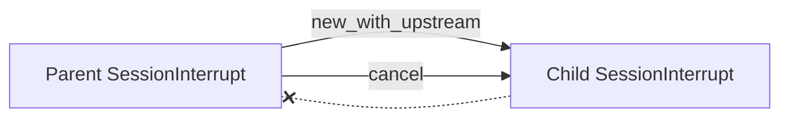

# Other — librefang-kernel-src

# `librefang-kernel` — Kernel Test Suite

## Purpose

The test suite in `src/kernel/tests.rs` is the integration-level validation layer for `LibreFangKernel`. It exercises the kernel's public and internal APIs against real (in-memory) subsystems — SQLite via temp directories, the agent registry, skill/hand registries, the memory substrate, and the governance/approval pipeline — without requiring a live LLM provider.

Every test boots a fresh kernel against an isolated `tempfile::tempdir()` home directory and tears it down at the end, so tests are hermetic and safe to run in parallel.

## Test Infrastructure

### `RecordingChannelAdapter`

A stub `ChannelAdapter` that captures every `send()` call into an `Arc<Mutex<Vec<String>>>`. Used by the approval-notification tests to assert exactly which recipients received a message, without a real chat backend.

```rust
let adapter = Arc::new(RecordingChannelAdapter::new("test"));
let sent = adapter.sent.clone();
kernel.mesh.channel_adapters.insert("test".to_string(), adapter);
// ... trigger notification ...
let messages = sent.lock().unwrap().clone();
```

### `EnvVarGuard` / `set_test_env`

A RAII guard that sets an environment variable on creation and removes it on drop. Used for API key rotation tests where `AuthProfile.api_key_env` points at real env vars.

**Safety contract**: each test function uses a unique env-var name, and the default single-threaded test runner serializes them, preventing races.

### `install_test_skill`

Writes a minimal valid `skill.toml` + `prompt_context.md` into a given directory so the `SkillRegistry` can load it during boot. Accepts a name and tags for filtering tests.

### `cascade_test_kernel`

Boots a kernel into an `Arc<LibreFangKernel>` against a leaked tempdir (intentionally kept alive until process exit) for the parent/stop cascade tests. Avoids per-test boilerplate.

### `boot_kernel_for_display_tests`

Shared helper for the display/UI-related tests (approval formatting, session listing). Appears in the call graph for several display-oriented tests.

## Coverage Areas

### 1. API Key Rotation — `collect_rotation_key_specs`

| Test | What it validates |
|------|-------------------|
| `test_collect_rotation_key_specs_dedupes_primary_profile_key` | When a profile's `api_key_env` resolves to the same key as the primary driver, it is merged into the primary spec (`use_primary_driver: true`) rather than appearing twice. |
| `test_collect_rotation_key_specs_prepends_distinct_primary_and_skips_missing_profiles` | Profiles whose env vars are unset are silently skipped; a distinct primary key is prepended when no profile claims it. |

### 2. Approval Routing — `notify_escalated_approval`

`test_notify_escalated_approval_prefers_request_route_to` validates the priority chain for escalated approval notifications:

1. **Per-request `route_to`** (highest priority — wins even over policy rules)
2. Approval routing rules (tool-pattern-based)
3. Agent notification rules (agent-pattern-based)
4. Global `approval_channels` (fallback)

The test seeds all four layers and confirms only the explicit per-request target receives the message.

### 3. Agent Capabilities — `manifest_to_capabilities`

| Test | Scenario |
|------|----------|
| `test_manifest_to_capabilities` | Explicit `capabilities.tools` + `agent_spawn = true` produce the correct `Capability` set. |
| `test_manifest_to_capabilities_with_profile` | A `ToolProfile::Coding` expands into file/shell/web tools. |
| `test_manifest_to_capabilities_profile_overridden_by_explicit_tools` | When explicit `tools` are set alongside a profile, the profile is **not** expanded — explicit declarations take precedence. |

### 4. Agent Registry — `AgentRegistry`

- **Name resolution**: `find_by_name("coder")` returns the correct entry; UUID lookup via `get(agent_id)` also works.
- **Tag-based search**: Filtering `registry.list()` by tags and name substrings returns only matching agents.

### 5. Agent Spawning and Lineage

```mermaid
graph TD
    A[spawn_agent_inner] --> B{Parent provided?}
    B -->|No| C[Register as top-level agent]
    B -->|Yes| D[Look up parent in registry]
    D -->|Not found| E[Fail closed: "not registered"]
    D -->|Found| F{Child capabilities ⊆ Parent?}
    F -->|No| G[Reject: "Privilege escalation denied"]
    F -->|Yes| H[Register child with parent link]
```

Key invariants tested:

- **Privilege escalation is blocked**: a parent with only `file_read` cannot spawn a child requesting `*`, `shell`, or `network` capabilities. The child is never registered.
- **Subset inheritance is allowed**: a parent with `file_read` + `file_write` can spawn a read-only child.
- **Unknown parents fail closed**: a stale `AgentId` that's not in the registry produces an error, not a silent top-level spawn.
- **Local model override**: `spawn_agent_inner` stores `"default"/"default"` when the model config delegates to the global default, deferring concrete resolution to `execute_llm_agent`.

### 6. Provider Switching — `set_agent_model`

`test_set_agent_model_clears_overrides_when_provider_changes` is a regression test for issue #2380. When switching an agent from one provider to another:

- `api_key_env` and `base_url` from the old provider are **cleared** so `resolve_driver` falls back to the new provider's credentials.
- A **same-provider** model swap preserves existing per-agent overrides (legitimate custom keys/URLs).

### 7. Hand Activation / Deactivation

Hands are multi-agent configurations defined in `HAND.toml` files. The test suite covers:

| Test | Invariant |
|------|-----------|
| `test_hand_activation_does_not_seed_runtime_tool_filters` | Activation leaves `tool_allowlist` and `tool_blocklist` empty so skill/MCP tools remain visible. |
| `test_hand_reactivation_rebuilds_same_runtime_profile` | Deactivate → reactivate rebuilds from the hand definition, discarding any runtime overrides (model, provider, max_tokens, temperature, web_search_augmentation). |
| `reactivate_builds_from_hand_toml_not_override` | Full field-by-field assertion that every runtime override is cleared on fresh activation. |
| `test_hand_skills_propagate_to_derived_agent_manifest` | Hand-level `skills = [...]` allowlist propagates into each per-role agent's `AgentManifest.skills`. |
| `test_hand_skills_intersect_per_role_overrides` | When both hand-level and per-role `skills` are set, the effective list is the **intersection**. |
| `deactivate_hand_removes_hand_agent_rows_from_sqlite` | After deactivation, the SQLite `agents` rows for all instance agents are removed — even when agents are no longer in the in-memory registry (post-restart scenario). |
| `boot_gc_removes_orphaned_hand_agent_rows` | Orphaned SQLite rows from a crashed deactivation are cleaned up on the next boot. |

### 8. Hand Persistence Across Restarts

The suite includes two complementary approaches to testing restart semantics:

**Deterministic path** (`hand_runtime_override_survives_restart_via_activate_hand_with_id`):
1. Boot → activate hand → apply override → persist → shutdown.
2. Boot fresh kernel → manually load `hand_state.json` → call `activate_hand_with_id`.
3. Assert all overrides (model, provider, max_tokens, temperature, web_search_augmentation) are re-applied.

**Full async path** (`hand_runtime_override_survives_restart_via_start_background_agents`, `#[ignore]` by default):
Same lifecycle but drives `start_background_agents`, exercising the registry sync and context-engine bootstrap. Kept for manual regression.

**Settings/tail persistence** (`boot_drift_preserves_hand_settings_tail`, `boot_drift_preserves_skill_and_team_tails`):
After a simulated restart via `activate_hand_with_id`, the restored agent's `system_prompt` must contain all three rendered tails:
- `## User Configuration` — from hand `[[settings]]`
- `## Reference Knowledge` — from `SKILL.md`
- `## Your Team` — peer roster for multi-agent hands

### 9. Tool Availability

| Test | Behavior |
|------|----------|
| `test_available_tools_returns_empty_when_tools_disabled` | `tools_disabled: true` suppresses all builtin, skill, and MCP tools. |
| `test_available_tools_glob_pattern_matches_mcp_tools` | Declared tools like `"file_*"` use glob matching, not exact equality. Matches `file_read`, `file_write`, `file_list` but not `web_fetch`. |
| `test_shell_exec_available_when_declared_in_tools_without_explicit_exec_policy` | When `shell_exec` is in `capabilities.tools` but no `exec_policy` is set, the kernel auto-promotes `ExecSecurityMode` to `Full` instead of silently stripping the tool. |
| `test_skill_evolve_tools_default_available_to_restricted_agent` | The `skill_evolve_*` surface is always available regardless of the agent's declared `capabilities.tools`, enabling self-evolution. |

### 10. Session Management

- **Ephemeral messages** (`send_message_ephemeral`): Targeting an unknown agent returns an error; targeting a known agent does not modify the real session's message history.
- **Assistant route key** (`assistant_route_key`): Scoped by channel, user_id, and thread_id so different senders get different routing contexts.
- **Brief follow-up detection** (`should_reuse_cached_route`): Short inputs like "fix that" or "继续" reuse the cached route; "thanks" or long prompts do not.
- **Default assistant**: A fresh boot auto-spawns an `assistant` agent.

### 11. Background Task Idempotency

Both `spawn_approval_sweep_task` and `spawn_task_board_sweep_task` use atomic flags to ensure only one loop runs at a time. Calling them twice is a no-op; after `shutdown()`, the flag resets.

### 12. Task Board Sweeper

`test_task_board_sweep_resets_stuck_in_progress_task` verifies the end-to-end flow: post a task → claim it → wait past the TTL → `task_reset_stuck` flips it back to `pending` with `assigned_to = ""` so another worker can reclaim it.

### 13. Condition Evaluation — `evaluate_condition`

| Input | Result |
|-------|--------|
| `None` or empty string | `true` (no constraint) |
| `"agent.tags contains 'chat'"` with matching tag | `true` |
| `"agent.tags contains 'chat'"` without matching tag | `false` |
| Unknown format | `false` (strict — prevents accidental injection) |

### 14. Peer-Scoped Keys — `peer_scoped_key`

Security-critical validation (issues #5119, #5120):

- Valid: `peer_scoped_key("car", Some("user-123"))` → `"peer:user-123:car"`
- No peer: `peer_scoped_key("car", None)` → `"car"`
- **Rejected**: peer_id containing `:` (namespace collision), empty peer_id (ambiguous with `None`), key starting with `peer:` (reserved prefix injection)

### 15. Thinking Override — `apply_thinking_override`

| Override value | Effect |
|----------------|--------|
| `None` | Preserves existing `ThinkingConfig` |
| `Some(false)` | Clears `thinking` to `None` |
| `Some(true)` with no existing config | Inserts default `ThinkingConfig` |
| `Some(true)` with existing config | Preserves existing `budget_tokens` |

### 16. JSON Extraction — `extract_json_from_llm_response`

Parses structured JSON from LLM free-text responses. Handles:

- `` ```json ... ``` `` code blocks (first block wins if multiple exist)
- Bare `{...}` objects surrounded by prose
- Nested braces inside string values (won't trip on `{placeholder}`)
- Invalid JSON → `None`
- No JSON at all → `None`

### 17. Background Skill Review

- **Transient errors** (timeouts, 429s, network failures) are identified by `is_transient_review_error` as retryable.
- **Permanent errors** (missing JSON fields, validation failures, security blocks) are not retried.
- **Trace summarization** (`summarize_traces_for_review`): Shows the first N and last N traces with an "omitted" marker in between, keeping the summary bounded regardless of trace count.

### 18. Sanitization — `sanitize_reviewer_block` / `sanitize_reviewer_line`

Prevents a compromised prior LLM response from injecting fake instructions into the reviewer:

- Strips triple backticks (prevents forged JSON blocks)
- Strips `</data>` / `<data>` envelope tags
- Removes control characters (`\x00`, `\x07`, etc.) while preserving structure (`\n`, `\t`)
- Truncates by character count (not bytes) to avoid UTF-8 panics, appending `…[truncated]`
- Collapses newlines in single-line mode, replaces `[`/`]` with parentheses

### 19. Skills Configuration

| Test | Behavior |
|------|----------|
| `test_skills_config_disabled_list_filters_at_boot` | `skills.disabled = ["blocked-skill"]` excludes the skill from the registry even though its directory exists on disk. |
| `test_skills_config_extra_dirs_loaded_as_overlay` | Skills from `extra_dirs` are visible; local installs win over external overlays with the same name. |
| `test_reload_skills_preserves_disabled_and_extra_dirs` | Hot-reload re-applies the disabled list and extra_dirs overlay — previously these were silently dropped after the first `reload_skills()` call. |
| `test_stable_mode_freezes_registry_and_skips_review_gate` | `KernelMode::Stable` freezes the registry (`is_frozen() == true`) and the pre-claim review gate refuses to spawn new reviews. |

### 20. Cron — Peer ID Preservation

`test_cron_create_preserves_peer_id` is a regression test ensuring `cron_create` reads `peer_id` from `job_json` and persists it, rather than always defaulting to `None`. Jobs created without a `peer_id` correctly have `peer_id = null`.

### 21. Parent / Stop Cascade — Session Interrupts


```mermaid
graph LR
    P[Parent SessionInterrupt] -->|new_with_upstream| C[Child SessionInterrupt]
    P -->|cancel| C
    C -.-x P
```

Tests validate the cascade primitives:

- **Parent cancel propagates to child**: When a parent's `SessionInterrupt` is cancelled, any child created via `new_with_upstream` is also cancelled.
- **Child cancel does NOT propagate upward**: Cancelling a child leaves the parent running.
- **No upstream when idle**: If the parent has no active turn (not in `session_interrupts`), the lookup returns `None` and the call proceeds without cascade.
- **Unregistered parent UUIDs are tolerated**: `send_to_agent_as` with a valid but unregistered parent UUID falls through gracefully rather than erroring on the parent.
- **Garbage parent IDs are rejected**: Non-UUID strings produce a clear error, not a panic.

### 22. Atomic TOML Writes — `atomic_write_toml`

Validates crash-safety for manifest persistence:

- **Replaces existing content**: Old bytes are fully replaced.
- **No temp file residue**: The `.tmp` staging file is cleaned up on success.
- **Concurrency safety**: Two threads racing to write the same file never produce a partial/corrupt mix — readers always see either the old content or one complete new payload.

### 23. Cron Management

| Test | Behavior |
|------|----------|
| `test_cron_create_preserves_peer_id` | `peer_id` from `job_json` is persisted; absent peer_id yields `null`. |

## Conventions for Adding Tests

1. **Isolation**: Always boot against a `tempfile::tempdir()`. Never share state between tests.
2. **Graceful skips**: Tests that depend on optional features (e.g., specific hands like `apitester`) should catch `"unsatisfied requirements"` errors, print a diagnostic, and return early rather than panic.
3. **Deterministic over async**: When possible, exercise the restore path manually (load state → call `activate_hand_with_id`) rather than driving the full async `start_background_agents`. Reserve the async path for `#[ignore]`'d regression tests.
4. **Regression references**: Every regression test includes a comment citing the issue number (e.g., `#2380`, `#2923`, `#3135`, `#5119`) so future readers can trace back to the original bug.