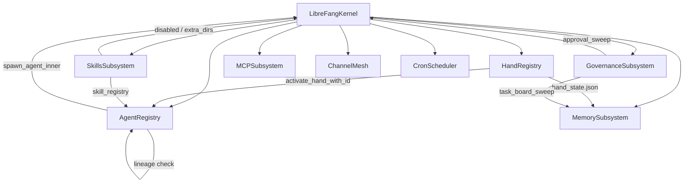

# Other — librefang-kernel-src

# librefang-kernel Test Suite

## Overview

The test module at `librefang-kernel/src/kernel/tests.rs` is the integration and unit test surface for the kernel's core orchestration layer. It validates agent lifecycle, capability enforcement, hand management, background task scheduling, persistence guarantees, and security boundaries. Every test targets the `LibreFangKernel` struct or its closely coupled helpers directly — this is not a mock-heavy layer; tests boot real kernels against temporary directories.

## Test Infrastructure

### `RecordingChannelAdapter`

A `ChannelAdapter` implementation that captures all sent text messages into an `Arc<Mutex<Vec<String>>>`. Used by notification and approval-routing tests to assert exactly which recipients received what. The adapter's `start()` returns an empty stream and `stop()` is a no-op — the only exercised path is `send()`.

### `EnvVarGuard` / `set_test_env`

```rust
fn set_test_env(key: &'static str, value: &str) -> EnvVarGuard
```

Sets an environment variable and returns a guard that removes it on drop. Safety relies on tests using unique key names and the default single-threaded test runner serialising execution. Used by API key rotation tests to inject `LIBREFANG_TEST_ROTATION_*` variables without polluting the process environment.

### `cascade_test_kernel`

Boots a kernel against a fresh tempdir with `std::mem::forget` on the `tempdir::TempDir` to keep the directory alive for the process lifetime. Returns `Arc<LibreFangKernel>` for tests that need shared ownership (background sweep tasks, session interrupt tests).

### `install_test_skill`

```rust
fn install_test_skill(skills_parent: &Path, name: &str, tags: &[&str])
```

Writes a minimal valid `skill.toml` + `prompt_context.md` under `skills_parent/<name>/`. Used by skills config tests to populate the skills directory without depending on external fixtures.

## Test Categories

### API Key Rotation

Tests for `collect_rotation_key_specs()`:

| Test | Behaviour verified |
|---|---|
| `test_collect_rotation_key_specs_dedupes_primary_profile_key` | A profile whose `api_key_env` resolves to the same key as the primary driver gets `use_primary_driver: true` and is not duplicated. |
| `test_collect_rotation_key_specs_prepends_distinct_primary_and_skips_missing_profiles` | The primary key is prepended when distinct from all profiles; profiles whose env vars are unset are silently dropped. |

### Approval Notification Routing

`test_notify_escalated_approval_prefers_request_route_to` — boots a kernel with three competing notification targets (routing rule, agent rule, global fallback), creates an `ApprovalRequest` with an explicit `route_to`, and verifies only the per-request target receives the notification. Escalated approvals must honour the caller's routing, not policy defaults.

### Agent Registry

Three tests exercise `AgentRegistry`:

- **Name resolution**: `find_by_name("coder")` returns the correct entry; UUID lookup via `get()` also works.
- **Tag search**: filter-by-tag and filter-by-name-substring over `registry.list()` produce correct subsets.
- **No cross-contamination** between name and tag indices.

### Capability Mapping (`manifest_to_capabilities`)

| Test | Behaviour |
|---|---|
| `test_manifest_to_capabilities` | Explicit `tools` list maps to `Capability::ToolInvoke` entries; `agent_spawn = true` produces `Capability::AgentSpawn`. |
| `test_manifest_to_capabilities_with_profile` | A `ToolProfile::Coding` expands into file, shell, and web capabilities. |
| `test_manifest_to_capabilities_profile_overridden_by_explicit_tools` | When `capabilities.tools` is non-empty, the profile is ignored — explicit declarations always win. |

### Agent Spawning and Lineage

The kernel's `spawn_agent_inner` is tested for privilege enforcement:

```
test_spawn_child_exceeding_parent_is_rejected
test_spawn_child_with_subset_capabilities_is_allowed
test_spawn_with_unknown_parent_fails_closed
```

**Security model**: A child agent's capabilities must be a subset of its parent's. A restricted parent (only `file_read`) cannot spawn a child requesting `tools=["*"]`, `shell=["*"]`, `network=["*"]` — the kernel rejects with `"Privilege escalation denied"`. Conversely, a child requesting only `file_read` from a parent that has `file_read + file_write` succeeds. A stale/unknown parent ID fails closed with `"not registered"`.

### Provider Switching (`set_agent_model`)

`test_set_agent_model_clears_overrides_when_provider_changes` — a regression test for issue #2380:

1. Spawn an agent with provider-specific `api_key_env` and `base_url`.
2. Switch to a different provider via `set_agent_model`.
3. Assert stale `api_key_env` and `base_url` are cleared (so `resolve_driver` falls back to the new provider's config).
4. Same-provider model swap does **not** clear overrides — they may be legitimate per-agent settings.

### Hand System

#### Activation and Reactivation

| Test | Behaviour |
|---|---|
| `test_hand_activation_does_not_seed_runtime_tool_filters` | `activate_hand` leaves `tool_allowlist` and `tool_blocklist` empty so skill/MCP tools remain visible. |
| `test_hand_reactivation_rebuilds_same_runtime_profile` | Deactivate then reactivate produces the same capabilities, profile, allowlists, blocklists, and MCP servers. Runtime overrides (model, provider, max_tokens, temperature, web_search) from the previous activation are discarded — fresh activation rebuilds from the HAND.tomL definition. |
| `reactivate_builds_from_hand_toml_not_override` | Exhaustive check that every field in `ModelConfig` and `WebSearchAugmentationMode` reverts to the HAND.toml default on fresh activation. |

#### Skills Propagation (Issue #3135)

```
test_hand_skills_propagate_to_derived_agent_manifest
test_hand_skills_intersect_per_role_overrides
```

The hand-level `skills = [...]` allowlist propagates into each per-role agent's `AgentManifest.skills`. Merge rules:

- Hand skills non-empty + agent skills empty → agent inherits hand list.
- Hand skills non-empty + agent skills non-empty → intersection (only skills in both lists survive).

#### Runtime Override Persistence

`hand_runtime_override_survives_restart_via_activate_hand_with_id` — a deterministic two-boot test:

1. Boot 1: activate hand, apply `HandAgentRuntimeOverride` (model, provider, max_tokens, temperature, web_search_augmentation), persist, shutdown.
2. Boot 2: reload `hand_state.json`, call `activate_hand_with_id` with persisted overrides, assert every override field is re-applied.

A companion `#[ignore]` test (`hand_runtime_override_survives_restart_via_start_background_agents`) exercises the full async `start_background_agents` path for local manual regression.

#### Deactivation and SQLite Cleanup

`deactivate_hand_removes_hand_agent_rows_from_sqlite` — after deactivation, every agent row owned by the hand instance is removed from SQLite, even when agents were evicted from the in-memory registry (the post-restart scenario where `load_all_agents` skips `is_hand=true` rows).

### Tool Availability

| Test | Behaviour |
|---|---|
| `test_available_tools_returns_empty_when_tools_disabled` | `tools_disabled = true` suppresses all builtin, skill, and MCP tools. |
| `test_available_tools_glob_pattern_matches_mcp_tools` | `tools: ["file_*"]` matches `file_read`, `file_write`, `file_list` but not `web_fetch` or `shell_exec`. |
| `test_shell_exec_available_when_declared_in_tools_without_explicit_exec_policy` | When `shell_exec` is in `capabilities.tools` and `shell: ["*"]` is set but no explicit `exec_policy` exists, the kernel auto-promotes the exec policy to `Full` instead of silently dropping the tool. |
| `test_skill_evolve_tools_default_available_to_restricted_agent` | All `skill_evolve_*` tools are default-available regardless of the agent's declared `capabilities.tools`, ensuring every agent can self-evolve skills. |

### Routing and Session Logic

| Test | Behaviour |
|---|---|
| `test_should_reuse_cached_route_for_brief_follow_up` | Short messages like "fix that" or "继续" return `true`; "thanks" and long prompts return `false`. |
| `test_assistant_route_key_scopes_sender_and_thread` | Route keys include channel, user_id, and thread_id when a `SenderContext` is provided. |
| `test_boot_spawns_assistant_as_default_agent` | Fresh boot auto-spawns an `assistant` agent. |
| `test_send_message_ephemeral_unknown_agent_returns_not_found` | Ephemeral messages to non-existent agents error. |
| `test_send_message_ephemeral_does_not_modify_session` | Ephemeral (aka `/btw`) messages leave the real session's message count unchanged. |

### Background Sweep Tasks

Two idempotent background loops are tested:

| Test | Behaviour |
|---|---|
| `test_spawn_approval_sweep_task_is_idempotent` | Calling twice sets `approval_sweep_started` once; after shutdown the flag clears. |
| `test_spawn_task_board_sweep_task_is_idempotent` | Same pattern for task-board sweep. |
| `test_task_board_sweep_resets_stuck_in_progress_task` | A claimed task whose TTL has expired is reset to `pending` by `task_reset_stuck`. |

Both use `AtomicBool` guards to prevent duplicate loops from forming.

### Condition Evaluation

```
test_evaluate_condition_none        → None condition is true
test_evaluate_condition_empty       → Empty string condition is true
test_evaluate_condition_tag_match   → "agent.tags contains 'chat'" matches
test_evaluate_condition_tag_no_match → Non-matching tag returns false
test_evaluate_condition_unknown_format → Unknown expressions default to false (strict)
```

### Peer-Scoped Keys (`peer_scoped_key`)

Security-critical namespace isolation:

| Input | Result |
|---|---|
| `peer_scoped_key("car", Some("user-123"))` | `"peer:user-123:car"` |
| `peer_scoped_key("car", None)` | `"car"` (global scope) |
| `peer_scoped_key(_, Some("u:456"))` | `Err(InvalidInput)` — colons in peer_id rejected (#5119) |
| `peer_scoped_key(_, Some(""))` | `Err(InvalidInput)` — empty peer_id rejected |
| `peer_scoped_key("peer:victim:user_name", _)` | `Err(InvalidInput)` — reserved prefix collision (#5120) |

### Thinking Override (`apply_thinking_override`)

| Test | Behaviour |
|---|---|
| `None` override | Leaves existing `ThinkingConfig` untouched. |
| `Some(false)` | Clears `thinking` to `None`. |
| `Some(true)` on `None` | Inserts default `ThinkingConfig`. |
| `Some(true)` on existing | Preserves existing `budget_tokens`. |

### JSON Extraction (`extract_json_from_llm_response`)

Handles LLM output that may contain markdown-wrapped or bare JSON:

- Code-fenced `\`\`\`json ... \`\`\`` blocks
- Bare `{...}` objects surrounded by prose
- Nested braces inside string values (the old `find/rfind` approach failed here)
- Multiple code blocks (returns the first valid one)
- Malformed JSON returns `None`

### Error Classification (`is_transient_review_error`)

| Category | Examples | Transient? |
|---|---|---|
| Timeouts | "timed out", "connection closed", "network unreachable" | ✅ |
| Rate limits | "429", "overloaded", "rate limit" | ✅ |
| Parse errors | "No valid JSON found", "Missing 'name'" | ❌ |
| Security blocks | "security_blocked", "prompt injection" | ❌ |

Transient errors are retriable; permanent errors should not waste tokens.

### Trace Summarization (`summarize_traces_for_review`)

Long tool traces (>50 entries) are elided to head + tail with an "omitted" marker. Short traces pass through verbatim. Keeps the background skill reviewer's prompt budget bounded.

### Sanitization (`sanitize_reviewer_block`, `sanitize_reviewer_line`)

Strip potentially dangerous content from reviewer inputs:

- Triple backticks neutralized (prevents prior-response injection)
- `</data>` / `<data>` envelope tags removed (prevents escape)
- Control characters (`\x00`, `\x07`) stripped; whitespace preserved
- Truncation is character-count-aware (UTF-8 safe), appends `…[truncated]`
- Per-line sanitization collapses newlines and replaces brackets with parens

### Skills Configuration

| Test | Behaviour |
|---|---|
| `test_skills_config_disabled_list_filters_at_boot` | `skills.disabled = ["blocked-skill"]` excludes the skill from the registry even though its directory exists on disk. |
| `test_skills_config_extra_dirs_loaded_as_overlay` | External skill directories overlay the primary; name collisions are won by the local install. |
| `test_reload_skills_preserves_disabled_and_extra_dirs` | Hot-reload re-applies the disabled list and extra_dirs overlay — they don't silently vanish. |
| `test_stable_mode_freezes_registry_and_skips_review_gate` | `KernelMode::Stable` sets `frozen=true` on the registry; pre-existing skills remain visible but mutations and background reviews are blocked. |

### Cron Jobs

`test_cron_create_preserves_peer_id` — regression for the fix that reads `peer_id` from `job_json`. Before the fix, `cron_create` always set `peer_id: None`, losing the peer context for OFP-triggered cron jobs.

### Session Interrupt Cascade

Parent `/stop` must propagate to child agents:

```
cascade_primitives_via_session_interrupts_dashmap
no_upstream_when_parent_has_no_active_turn
send_to_agent_as_tolerates_unregistered_parent_uuid
send_to_agent_as_rejects_unparseable_parent_id
```

The cascade uses `SessionInterrupt::new_with_upstream` to link a child's cancel token to its parent's. Cancelling the parent cancels the child; cancelling the child does **not** cancel the parent. Unregistered or malformed parent IDs are handled gracefully.

### Atomic TOML Writing (`atomic_write_toml`)

Replaces the previous `fs::write` with a write-to-temp-then-rename pattern:

| Test | Behaviour |
|---|---|
| `atomic_write_replaces_existing_content` | New content fully replaces old. |
| `atomic_write_leaves_no_tmp_file_on_success` | No `.tmp` staging file remains. |
| `atomic_write_no_partial_state_under_concurrency` | Two threads racing 50 writes each; every concurrent reader sees either the old content or one of the two complete payloads — never a truncated mix. |

### Boot Drift / Hand Restore

After a daemon restart, hand-derived agents are rebuilt from `HAND.toml` + `hand_state.json` (not rehydrated from SQLite — `load_all_agents` skips `is_hand=true` rows). Two tests pin the restored `system_prompt` must contain:

1. **`boot_drift_preserves_hand_settings_tail`**: The base prompt + `## User Configuration` tail with rendered `[[settings]]` values.
2. **`boot_drift_preserves_skill_and_team_tails`**: The base prompt + `## Reference Knowledge` (from `SKILL.md`) + `## Your Team` (peer roster for multi-agent hands).

Both tests synthesize a `HAND.toml` under `registry/hands/<id>/`, persist `hand_state.json`, boot the kernel, then replay the exact restore path (`load_state` → `activate_hand_with_id`) that `start_background_agents` follows.

## Key Subsystem Interactions


```mermaid
graph TD
    TK[LibreFangKernel] --> AR[AgentRegistry]
    TK --> SK[SkillsSubsystem]
    TK --> HH[HandRegistry]
    TK --> GV[GovernanceSubsystem]
    TK --> MM[MemorySubsystem]
    TK --> MC[MCPSubsystem]
    TK --> CH[ChannelMesh]
    TK --> CR[CronScheduler]
    
    HH -->|activate_hand_with_id| AR
    HH -->|hand_state.json| MM
    SK -->|skill_registry| AR
    SK -->|disabled / extra_dirs| TK
    GV -->|approval_sweep| TK
    GV -->|task_board_sweep| MM
    
    AR -->|spawn_agent_inner| TK
    AR -->|lineage check| AR
```

## Running the Tests

```bash
# Full suite (default — serial, single-threaded runner for env safety)
cargo test -p librefang-kernel

# Ignored e2e hand-restore test (requires network for registry sync)
cargo test -p librefang-kernel -- --ignored

# Specific test by name
cargo test -p librefang-kernel test_spawn_child_exceeding_parent_is_rejected
```

Tests that require multi-threaded tokio use `#[tokio::test(flavor = "multi_thread")]`. Tests that need the `apitester` hand installed will gracefully skip (via `eprintln!` + early return) if the hand's requirements aren't met in the test environment.