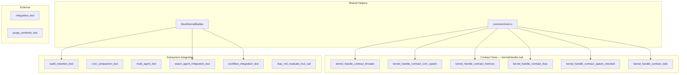

# Other — librefang-kernel-tests

# librefang-kernel-tests

Integration and contract tests for the `librefang-kernel` crate. This module validates the kernel's subsystems end-to-end: agent spawning, hand lifecycle, RBAC policy evaluation, audit retention, cron compaction, WASM execution, workflow orchestration, and memory isolation.

## Architecture Overview



## Test Categories

### Contract Tests (`kernel_handle_contract_*.rs`)

These tests exercise the `KernelHandle` trait object (`&dyn KernelHandle`) against a real `LibreFangKernel` booted via the shared `common/mod.rs` helpers. They validate that the public API surface behaves as documented without making network calls.

| File | Coverage |
|---|---|
| `kernel_handle_contract_broader.rs` | Roster CRUD, goal listing, A2A agent queries, event publishing, kill-agent error on unknown ID |
| `kernel_handle_contract_cron_spawn.rs` | `cron_create` preserves `peer_id`, spawn returns valid identity, `list_agents`/`find_agents` return manifest metadata |
| `kernel_handle_contract_memory.rs` | Global vs. peer-scoped namespace isolation for `memory_store`, `memory_recall`, `memory_list` |
| `kernel_handle_contract_rbac.rs` | Per-user tool policy resolution, memory ACL binding by sender+channel, `requires_approval_with_context` delegation |
| `kernel_handle_contract_spawn_checked.rs` | Capability-checked spawning: accepts valid parent caps, rejects escalation when child requests tools not in parent set |
| `kernel_handle_contract_task.rs` | Task lifecycle: `task_post` → `task_claim` → `task_complete` with field preservation |

All contract tests use the shared boot helpers from `common/mod.rs`:

```rust
// Minimal kernel (no users)
let (kernel, _tmp) = boot_kernel();

// Kernel with pre-configured users (for RBAC tests)
let (kernel, _tmp) = boot_kernel_with_users(vec![user_config]);
```

The `tempfile::TempDir` guard (`_tmp`) must remain in scope for the duration of the test — dropping it removes the temporary home directory.

### Subsystem Integration Tests

#### Audit Retention (`audit_retention_test.rs`)

Validates M7 milestone: the kernel's periodic trim task and self-audit `RetentionTrim` row.

- Boots via `MockKernelBuilder` with `trim_interval_secs = 1` and `max_in_memory_entries = 10`
- Seeds 50 audit entries, calls `start_background_agents()`, waits for the 1s trim interval to fire
- Asserts the log collapses to near the cap and that a `RetentionTrim` self-audit row appears
- Verifies `verify_integrity()` still passes after trimming

Requires `#![recursion_limit = "256"]` because `start_background_agents()` spawns 17 closures whose combined async-block layouts exceed the default 128-limit after `TriggerId` gained `PartialOrd`/`Ord`.

#### Cron Compaction (`cron_compaction_test.rs`)

Tests for `librefang_runtime::compactor` (SummarizeTrim mode, #3693):

| Test | What it verifies |
|---|---|
| `summarize_trim_successful_llm_produces_summary_not_fallback` | H2 gap 1: `FakeDriver` produces `used_fallback = false`, output is `[summary_msg] + tail` |
| `summarize_trim_llm_failure_sets_used_fallback_true` | H2 gap 2 / M4: `FailingDriver` sets `used_fallback = true`; the M4 guard `!result.used_fallback` correctly rejects the non-empty fallback string |
| `adjust_split_does_not_cut_tool_use_tool_result_pair` | H1: `adjust_split_for_tool_pair` shifts the split point to keep `Assistant{ToolUse}` + `User{ToolResult}` together |

Uses two stub drivers: `FakeDriver` (returns canned summary) and `FailingDriver` (always errors).

#### Hand Lifecycle (`multi_agent_test.rs`)

Comprehensive hand (multi-agent) lifecycle tests:

- **Activation/Deactivation**: `activate_hand` spawns agents, `deactivate_hand` kills them
- **Deterministic IDs**: `AgentId::from_hand_agent` produces stable IDs; reactivation preserves them under legacy format
- **Pause/Resume**: paused agents remain alive; status transitions correctly
- **Tool Inheritance**: hand-defined `tools` propagate to the agent manifest's `capabilities.tools`
- **State Persistence**: `hand_state.json` (v5 format) persisted to disk with `agent_ids` map, `instance_id`, `coordinator_role`
- **Settings Seeding**: `[[settings]]` with defaults are backfilled on activation; user overrides take precedence; missing keys are filled on reactivation (schema evolution)
- **Coexistence**: multiple hands can be active simultaneously; deactivating one doesn't affect the other
- **Explicit Coordinator**: `coordinator = true` in hand TOML determines which agent receives routed messages
- **Trigger Migration**: reactivation restores triggers to their original roles, doesn't leak across agents

Includes `test_six_agent_fleet` — a live LLM integration test requiring `GROQ_API_KEY`.

#### WASM Agents (`wasm_agent_integration_test.rs`)

Tests the full WASM agent pipeline: spawn → execute → verify response.

- Uses inline WAT (WebAssembly Text) modules: `ECHO_WAT`, `HELLO_WAT`, `INFINITE_LOOP_WAT`, `HOST_CALL_PROXY_WAT`
- Tests: hello response, echo passthrough, fuel exhaustion detection, missing module error, streaming fallback, concurrent agents, mixed WASM+LLM fleet
- WASM manifests use `module = "wasm:<path>"` format

#### Workflows (`workflow_integration_test.rs`)

Workflow registration, agent resolution, and execution:

- **Agent resolution by name**: `StepAgent::ByName` resolved via `agent_registry_ref().find_by_name()`
- **Agent resolution by ID**: `StepAgent::ById` deferred to execution time
- **Trigger registration**: `register_trigger` / `list_triggers` / `remove_trigger` with `TriggerPattern` variants
- **E2E with Groq**: 2-step analyst→writer pipeline (requires `GROQ_API_KEY`)

Requires `#![recursion_limit = "256"]` due to deeply-nested futures in the kernel→runtime→agent_loop call chain.

#### RBAC M3 (`rbac_m3_evaluate_tool_call.rs`)

End-to-end RBAC (#3054 Phase 2) integration tests:

- Boots a real kernel with `[[users]]` + `tool_policy` + `[tool_policy.groups]`
- Validates the deny-short-circuit → allow → needs-approval → category-resolution cascade
- **H7 regression**: unrecognised senders no longer fail-open (guest gate applies)
- **Trait-layer regression**: `(None, None)` sender/channel fails closed; only `Some("cron")` retains the system-call carve-out
- **Reload**: `auth_ref().reload()` invalidates the AuthManager so policy changes take effect immediately
- **B3 force_human**: `DeferredToolExecution.force_human = true` prevents hand-agent auto-approve

### External Integration Tests

#### Full Pipeline (`integration_test.rs`)

Boots kernel, spawns agents with Groq LLM, sends messages, verifies responses and token usage. All tests marked `#[ignore]` — run with:

```bash
GROQ_API_KEY=gsk_... cargo test -p librefang-kernel --test integration_test -- --nocapture
```

#### Purge Sentinels (`purge_sentinels_test.rs`)

CLI binary integration tests for the `purge_sentinels` tool. Drives the compiled binary via `std::process::Command`:

- **Dry-run**: reports removal counts, writes nothing
- **Apply**: creates `.bak` backups, rewrites files, skips mid-sentence sentinels
- **Idempotency**: second apply reports `removed=0`
- **Safety**: aborts when existing `.bak` differs from current file (prevents data loss)

## Conventions

### Runtime Flavor

Most async tests use `#[tokio::test(flavor = "multi_thread")]` because `start_background_agents()` and other kernel paths call `tokio::task::block_in_place`, which panics on the default current-thread runtime.

### Recursion Limit

Two test files require `#![recursion_limit = "256"]`:
- `audit_retention_test.rs` — 17 spawned closures + trait-bound additions on `TriggerId`
- `workflow_integration_test.rs` — deeply-nested future from kernel→runtime→agent_loop chain

### Temporary Directories

Tests use `tempfile::TempDir` for kernel home directories. The guard must stay in scope:

```rust
let (kernel, _tmp) = boot_kernel();  // _tmp must live for the whole test
```

Some tests intentionally leak the `TempDir` (`Box::leak`) when the kernel's lifetime exceeds the test function's scope (e.g., `rbac_m3_evaluate_tool_call.rs` wrapping the kernel in `Arc`).

### MockKernelBuilder vs. boot_kernel

| Helper | Use case |
|---|---|
| `MockKernelBuilder::new().with_config(...).build()` | Tests needing custom audit/cron config, or WASM/workflow subsystems |
| `boot_kernel()` / `boot_kernel_with_users()` | Contract tests exercising the `KernelHandle` trait with default or user-configured kernels |