# Other — librefang-kernel-tests

# librefang-kernel-tests

Integration and contract tests for the `librefang-kernel` crate. This test suite validates the kernel's public APIs end-to-end: agent lifecycle, hand activation, memory isolation, RBAC policy evaluation, WASM execution, workflow orchestration, audit retention, and the `purge_sentinels` CLI binary.

## Architecture

```mermaid
graph TD
    subgraph "Test Infrastructure"
        COMMON[common/mod.rs<br>boot_kernel / boot_kernel_with_users]
        MKB[MockKernelBuilder<br>librefang-testing]
    end

    subgraph "Contract Tests (KernelHandle trait)"
        BROADER[kernel_handle_contract_broader.rs]
        CRON[kernel_handle_contract_cron_spawn.rs]
        MEMORY[kernel_handle_contract_memory.rs]
        RBAC_CT[kernel_handle_contract_rbac.rs]
        SPAWN[kernel_handle_contract_spawn_checked.rs]
        TASK[kernel_handle_contract_task.rs]
    end

    subgraph "Feature Tests"
        AUDIT[audit_retention_test.rs]
        INTEGRATION[integration_test.rs]
        MULTI[multi_agent_test.rs]
        RBAC_M3[rbac_m3_evaluate_tool_call.rs]
        WASM[wasm_agent_integration_test.rs]
        WORKFLOW[workflow_integration_test.rs]
        PURGE[purge_sentinels_test.rs]
    end

    COMMON --> BROADER
    COMMON --> CRON
    COMMON --> MEMORY
    COMMON --> RBAC_CT
    COMMON --> SPAWN
    COMMON --> TASK

    MKB --> AUDIT
    MKB --> WASM
    MKB --> WORKFLOW
```



## Shared Infrastructure

### `common/mod.rs`

Provides two helper functions used across the `kernel_handle_contract_*` test files:

- **`boot_kernel() -> (LibreFangKernel, TempDir)`** — Boots a kernel with no users, network disabled, and a temporary SQLite database. Creates the required directory layout (`data/`, `skills/`, `workspaces/agents/`, `workspaces/hands/`).
- **`boot_kernel_with_users(users: Vec<UserConfig>) -> (LibreFangKernel, TempDir)`** — Same as above but injects user configurations for RBAC tests.

Both functions return the `TempDir` to keep it alive for the test's duration. The kernel is booted via `LibreFangKernel::boot_with_config`.

### `MockKernelBuilder` (from `librefang-testing`)

Used by most feature-level tests. Provides a `.with_config(|c| { ... })` hook to customize `KernelConfig` before building. Returns `(LibreFangKernel, TempDir)`.

## Runtime Requirements

Several tests require the **multi-threaded Tokio runtime** because `start_background_agents` and other kernel paths call `tokio::task::block_in_place`, which panics on the default current-thread runtime:

```rust
#[tokio::test(flavor = "multi_thread")]
```

The crate-level `#![recursion_limit = "256"]` is set in `audit_retention_test.rs` and `workflow_integration_test.rs` because deeply-nested async closures (17 spawned in `start_background_agents`) and complex future layouts exceed the compiler's default recursion limit of 128.

### Environment-dependent tests

Tests that call live LLM APIs check for `GROQ_API_KEY` at runtime:

- `integration_test.rs` — marked `#[ignore = "Requires GROQ_API_KEY environment variable"]`
- `multi_agent_test.rs::test_six_agent_fleet` — early-returns with `eprintln!`
- `workflow_integration_test.rs::test_workflow_e2e_with_groq` — early-returns with `eprintln!`

## Test Files

### Audit Retention — `audit_retention_test.rs`

Validates milestone M7: the kernel's periodic trim task activates on boot and the self-audit `RetentionTrim` row is written when entries are actually dropped.

**Test: `test_kernel_boot_with_retention_config_starts_trim_task`**

- Configures `trim_interval_secs = 1` and `max_in_memory_entries = 10`
- Seeds 50 `AuditAction::RoleChange` entries (chosen because it has no per-action retention rule — ensures the cap path is the sole reason rows are dropped)
- Calls `start_background_agents()` explicitly to boot the periodic task
- Sleeps 2.5s to allow the 1s interval to fire
- Asserts the log collapsed to ≤20 entries (cap of 10 + the self-audit `RetentionTrim` row + possible boot-time entries)
- Asserts at least one `AuditAction::RetentionTrim` row exists
- Asserts `audit.verify_integrity()` still passes after the trim

### Integration — `integration_test.rs`

Basic kernel boot → agent spawn → message send → response validation against the Groq API.

| Test | What it validates |
|------|-------------------|
| `test_full_pipeline_with_groq` | Single agent: spawn, send message, get non-empty response with token usage > 0, then kill |
| `test_multiple_agents_different_models` | Two agents with different models (`llama-3.3-70b-versatile` vs `llama-3.1-8b-instant`), both respond, coexist, and are independently killable |

### KernelHandle Contract Tests

These tests exercise the `KernelHandle` trait object (`&dyn KernelHandle`) to validate the public API contract independently of the concrete `LibreFangKernel` type.

#### `kernel_handle_contract_broader.rs`

General kernel operations:

| Test | Validates |
|------|-----------|
| `test_roster_roundtrip` | `roster_upsert` → `roster_members` → `roster_remove_member` cycle |
| `test_goal_list_active_default_empty` | Fresh kernel returns empty goal list |
| `test_list_a2a_agents_default_empty` | Fresh kernel returns empty A2A agent list |
| `test_get_a2a_agent_url_default_none` | Unknown agent returns `None` |
| `test_kill_agent_unknown_returns_error` | Killing nonexistent agent returns `Err` |
| `test_publish_event_succeeds` | Event publishing succeeds on a fresh kernel |

#### `kernel_handle_contract_cron_spawn.rs`

Cron job creation and agent spawning:

| Test | Validates |
|------|-----------|
| `test_cron_create_preserves_peer_id` | `cron_create` stores and `cron_list` returns the `peer_id` field |
| `test_cron_create_without_peer_id` | Omitting `peer_id` results in `null` in the stored job |
| `test_spawn_agent_returns_valid_identity` | `spawn_agent` returns a non-empty ID and correct name; agent appears in `list_agents` |
| `test_list_agents_returns_manifest_metadata` | `list_agents` and `find_agents` surface name, description, and ID from the manifest |

#### `kernel_handle_contract_memory.rs`

Memory namespace isolation between global and peer-scoped stores:

| Test | Validates |
|------|-----------|
| `test_memory_store_recall_isolates_peer_namespaces` | Same key in global, `peer-a`, `peer-b` stores returns correct values; unregistered peer returns `None` |
| `test_memory_list_separates_global_and_peer_keys` | `memory_list(None)` returns only global keys; `memory_list(Some("peer-a"))` returns only peer keys |
| `test_memory_recall_nonexistent_key_returns_none` | Missing keys return `None` in both global and peer scopes |

#### `kernel_handle_contract_rbac.rs`

User policy resolution for tool access and memory ACLs:

| Test | Validates |
|------|-----------|
| `test_resolve_user_tool_decision_default_allow_for_unconfigured_user` | No registered users → guest mode → `Allow` |
| `test_memory_acl_for_sender_default_none_for_unconfigured_user` | No users → `None` (no restriction) |
| `test_resolve_user_tool_decision_uses_sender_and_channel_policy` | Telegram-bound user gets their deny; unknown sender gets guest gate; wrong channel doesn't match |
| `test_memory_acl_for_sender_uses_sender_and_channel_binding` | Memory ACL is scoped to sender ID + channel binding |
| `test_requires_approval_with_context_delegates_to_requires_approval` | Context-aware variant delegates to the simpler method |
| `test_is_tool_denied_with_context_default_false` | Default config denies no tools |

#### `kernel_handle_contract_spawn_checked.rs`

Capability-checked agent spawning (prevents child agents from exceeding parent capabilities):

| Test | Validates |
|------|-----------|
| `test_spawn_agent_checked_with_empty_parent_caps` | Spawns successfully with empty capability list |
| `test_spawn_agent_checked_passes_parent_id` | Parent-child relationship tracked; both appear in `list_agents` |
| `test_spawn_agent_checked_with_capability_list` | Wildcard and glob capabilities accepted |
| `test_spawn_agent_checked_rejects_capability_escalation` | Child requesting `shell_exec` when parent only has `FileRead` is rejected; error mentions "escalation" or "capability" |

#### `kernel_handle_contract_task.rs`

Task lifecycle (post → claim → complete):

| Test | Validates |
|------|-----------|
| `test_task_post_preserves_assigned_to_and_created_by` | Both fields stored and retrievable via `task_list` |
| `test_task_claim_returns_assigned_task` | Claim returns the correct task |
| `test_task_complete_updates_status` | Status becomes `"completed"` and result is stored |
| `test_task_post_with_no_assignment` | Unassigned tasks have null/empty `assigned_to` and `created_by` |

### Multi-Agent / Hand Lifecycle — `multi_agent_test.rs`

The largest test file. Covers the hand (agent-template) activation lifecycle: deterministic IDs, pause/resume, state persistence, schema defaults, trigger reactivation, tool inheritance, and multi-hand coexistence.

#### Hand definitions used

| Constant | ID | Agents | Purpose |
|----------|-----|--------|---------|
| `HAND_A` | `test-clip` | Single `main` agent | Basic lifecycle tests |
| `HAND_B` | `test-devops` | Single `main` agent | Coexistence tests |
| `HAND_C` | `test-research` | `analyst` + `planner` (coordinator) | Multi-agent routing |
| `HAND_WITH_SETTINGS` | `test-settings` | Single `main` agent | Schema default seeding |

#### Key test cases

| Test | Validates |
|------|-----------|
| `test_activate_hand_spawns_agent` | Activation creates an agent in the registry |
| `test_deterministic_agent_id` | `AgentId::from_hand_agent("test-clip", "main", None)` matches the spawned agent |
| `test_explicit_coordinator_role_used_for_routes` | HAND_C routes resolve to `planner` (marked `coordinator = true`), not `analyst` |
| `test_deterministic_id_stable_across_reactivation` | Deactivate + reactivate yields the same legacy-format agent ID |
| `test_deactivate_kills_agent` | Agent removed from registry after deactivation |
| `test_pause_and_resume_hand` | Pause sets status to `"Paused"` (agent still exists); resume sets `"Active"` |
| `test_agent_tagged_with_hand_metadata` | Agent has tags `hand:test-clip` and `hand_instance:{uuid}` |
| `test_hand_tools_applied_to_agent` | Hand's tool list merged into agent's manifest capabilities |
| `test_hand_state_persistence` | State file written as JSON v5 with `instance_id`, `status`, `agent_ids` map |
| `test_multi_agent_hand_state_persists_coordinator_role` | `coordinator_role` field persisted to disk |
| `test_activation_seeds_schema_defaults_into_config` | `[[settings]]` defaults fill the instance config when no user overrides provided |
| `test_activation_preserves_user_overrides_over_defaults` | User-supplied values take precedence; unset keys still get defaults |
| `test_reactivation_backfills_missing_schema_keys` | Schema evolution: keys added after initial activation are backfilled from defaults |
| `test_multiple_hands_coexist` | Two hands active simultaneously with distinct agent IDs |
| `test_deactivate_one_hand_preserves_other` | Independent lifecycle per hand |
| `test_find_instance_by_agent_id` | `hands().find_by_agent()` returns the correct instance |
| `test_reactivation_restores_triggers_to_original_roles` | Triggers stay attached to their role's agent after deactivate/reactivate; planner doesn't inherit analyst's triggers |
| `test_six_agent_fleet` | *(Live LLM)* Spawns 6 agents with distinct roles, sends messages to each, prints fleet summary with token counts |

### RBAC M3 — `rbac_m3_evaluate_tool_call.rs`

End-to-end RBAC evaluation with real `LibreFangKernel`, `AuthManager`, and `KernelHandle` trait dispatch. Tests the full deny → needs-approval → allow decision chain.

Uses a local `boot()` helper that creates a kernel with specific `UserConfig` and `ToolPolicy` (with `ToolGroup` definitions). Leaks the `TempDir` intentionally (test is short-lived).

| Test | Scenario | Expected |
|------|----------|----------|
| `evaluate_tool_call_user_deny_short_circuits` | User denies `shell_exec` | `Deny { reason }` — deny takes precedence over any agent capability |
| `evaluate_tool_call_both_allow` | User allows `file_read` | `Allow` |
| `evaluate_tool_call_user_role_no_allow_list_needs_approval` | User role, no policy | `NeedsApproval` — escalation from `NeedsRoleEscalation` |
| `evaluate_tool_call_user_categories_resolve_against_kernel_groups` | `denied_groups: ["shell_tools"]` | `shell_exec` → `Deny`; `file_read` → `Allow` (admin self-authorizes) |
| `evaluate_tool_call_unrecognised_sender_no_longer_fail_open` | Unknown sender on bound channel | Safe tool → `Allow`; `shell_exec` → `NeedsApproval` (fail-closed) |
| `evaluate_tool_call_trait_layer_none_sender_fails_closed` | `(None, None)` sender/channel | `shell_exec` → `NeedsApproval`; `file_read` → `Allow`; `Some("cron")` → `Allow` (system-call carve-out); `Some("system")` → `NeedsApproval` |
| `evaluate_tool_call_user_categories_allow_list_short_circuits_for_user_role` | User role with `allowed_groups` | Tool in group → `Allow`; tool outside → `Deny` |
| `submit_tool_approval_hand_agent_force_human_skips_auto_approve` | Hand-tagged agent, `force_human=true` | `force_human=false` → `AutoApproved`; `force_human=true` → `Pending` |
| `evaluate_tool_call_reload_picks_up_new_policy` | `auth_manager().reload()` with updated policy | Stale policy invalidated; new deny takes effect immediately |

### WASM Agent — `wasm_agent_integration_test.rs`

Tests real WASM execution through the kernel pipeline (no mocks for the WASM runtime).

#### WASM modules used

| Constant | Behavior |
|----------|----------|
| `ECHO_WAT` | Returns input JSON as-is (bump allocator, passthrough `execute`) |
| `HELLO_WAT` | Returns fixed `{"response":"hello from wasm"}` from static data |
| `INFINITE_LOOP_WAT` | `loop { br 0 }` — triggers fuel exhaustion |
| `HOST_CALL_PROXY_WAT` | Forwards input to the `librefang.host_call` import |

| Test | Validates |
|------|-----------|
| `test_wasm_agent_hello_response` | Fixed response module returns `"hello from wasm"` |
| `test_wasm_agent_echo` | Echo module response contains the input message |
| `test_wasm_agent_fuel_exhaustion` | Infinite loop → error mentioning fuel |
| `test_wasm_agent_missing_module` | Nonexistent `.wasm` → error mentioning the file |
| `test_wasm_agent_host_call_time` | Host call proxy dispatches and returns non-empty response |
| `test_wasm_agent_streaming_fallback` | `send_message_streaming` produces ≥2 events; final result matches fixed response |
| `test_multiple_wasm_agents` | Two WASM agents coexist; registry shows 3 (2 WASM + default assistant) |
| `test_mixed_wasm_and_llm_agents` | WASM and LLM agents coexist in the same kernel; killing one doesn't affect the other |

### Workflow — `workflow_integration_test.rs`

Tests the workflow engine: registration, agent resolution (by name and by ID), run creation, trigger management, and full E2E pipeline execution.

| Test | Validates |
|------|-----------|
| `test_workflow_register_and_resolve` | Agents resolved by name; workflow stored; run created with correct input |
| `test_workflow_agent_by_id` | Agent referenced by ID; run creation succeeds |
| `test_trigger_registration_with_kernel` | Register `Lifecycle` and `SystemKeyword` triggers; list all/agent-specific; remove by ID |
| `test_workflow_e2e_with_groq` | *(Live LLM)* 2-step pipeline (analyst → writer); verifies token usage, step results, run state `Completed` |

### Purge Sentinels — `purge_sentinels_test.rs`

Tests the `purge_sentinels` binary (discovered via `env!("CARGO_BIN_EXE_purge_sentinels")`). The binary removes whole-line sentinel markers (e.g., `NO_REPLY`, `[no reply needed]`, `no_reply`) from Markdown files.

Uses a `fixture_dir()` helper that creates a directory structure with files containing various sentinel patterns.

| Test | Validates |
|------|-----------|
| `dry_run_reports_counts_and_touches_nothing` | Reports removal count; no files modified; no `.bak` created |
| `apply_creates_backup_and_rewrites` | `.bak` matches original; sentinels removed; mid-sentence sentinels preserved; clean files untouched; nested files processed |
| `apply_is_idempotent` | Second run reports 0 removals; files and backups unchanged |
| `apply_aborts_when_existing_bak_differs` | Stale `.bak` → non-zero exit with "backup mismatch" error; stale `.bak` preserved |
| `nonexistent_path_exits_non_zero` | Invalid path → error containing "does not exist" |

## Adding New Tests

1. **For `KernelHandle` contract tests**: Add to the appropriate `kernel_handle_contract_*.rs` file. Use `boot()` or `boot_with_users()` from `common/mod.rs`. Always test through `&dyn KernelHandle` to validate the trait contract.

2. **For feature integration tests**: Create a new `*_test.rs` file. Use `MockKernelBuilder` from `librefang-testing` for most cases. Use `#[tokio::test(flavor = "multi_thread")]` if the test touches kernel internals that call `block_in_place`.

3. **For live LLM tests**: Guard with `std::env::var("GROQ_API_KEY")` at the top of the test. Either early-return (preferred for multi-agent tests) or use `#[ignore]` annotation.

4. **Recursion limit**: If the compiler suggests increasing the recursion limit after adding trait bounds or async closures, add `#![recursion_limit = "256"]` at the crate level of the test file.