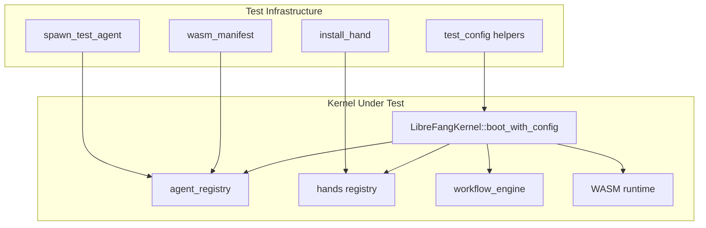

# Other — librefang-kernel-tests

# librefang-kernel-tests

Integration and end-to-end tests for the `librefang-kernel` crate. These tests exercise the full kernel lifecycle — booting, agent spawning, hand management, WASM execution, workflow orchestration, and LLM communication — against real infrastructure rather than mocks.

## Test Files

| File | Scope | Requires LLM? |
|---|---|---|
| `integration_test.rs` | Kernel boot, single/multi-agent messaging via Groq | Yes (`GROQ_API_KEY`) |
| `multi_agent_test.rs` | Hand lifecycle, state persistence, agent metadata, triggers | Mostly no; `test_six_agent_fleet` requires `GROQ_API_KEY` |
| `wasm_agent_integration_test.rs` | WASM module loading, execution, fuel limits, streaming, host calls | No |
| `workflow_integration_test.rs` | Workflow registration, agent resolution, trigger management, E2E Groq pipeline | `test_workflow_e2e_with_groq` requires `GROQ_API_KEY` |

## Running Tests

```bash
# All tests that don't need an API key
cargo test -p librefang-kernel

# Include live LLM integration tests
GROQ_API_KEY=gsk_... cargo test -p librefang-kernel -- --nocapture

# Run a specific test by name
cargo test -p librefang-kernel --test wasm_agent_integration_test
```

Tests that require `GROQ_API_KEY` print a skip message and return early when the variable is unset — they never fail due to a missing key.

## Test Architecture



Each test creates an isolated `LibreFangKernel` instance with a unique temporary directory. The kernel is booted via `boot_with_config`, exercised, then shut down. No state leaks between tests.

## Test Categories

### 1. Core Agent Pipeline (`integration_test.rs`)

Validates the fundamental message flow: boot kernel → spawn agent → send message → receive response → kill agent.

- **`test_full_pipeline_with_groq`** — Single agent round-trip through the Groq API. Asserts non-empty response and positive token usage.
- **`test_multiple_agents_different_models`** — Two agents (llama-70b and llama-8b) coexist, each receiving independent messages. Validates agent isolation.

### 2. Hand Lifecycle (`multi_agent_test.rs`)

Hands are reusable agent templates. These tests verify the full hand state machine and its interaction with the agent registry.

#### Activation and Identity

| Test | What it validates |
|---|---|
| `test_activate_hand_spawns_agent` | `activate_hand` creates an agent and registers it in `agent_registry` |
| `test_deterministic_agent_id` | Agent IDs are derived from `hand_id + role` via `AgentId::from_hand_agent` — no randomness |
| `test_explicit_coordinator_role_used_for_routes` | Multi-agent hands with a `coordinator = true` agent route messages to that role, not the first agent |
| `test_deterministic_id_stable_across_reactivation` | Deactivating and reactivating the same hand produces the same agent ID (legacy format) |

#### State Transitions

| Test | What it validates |
|---|---|
| `test_deactivate_kills_agent` | `deactivate_hand` removes the agent from the registry |
| `test_pause_and_resume_hand` | Pause sets status to `"Paused"` (agent survives); resume sets `"Active"` |
| `test_hand_instance_status_active_on_creation` | Fresh instances start as `"Active"` |

#### Agent Metadata

| Test | What it validates |
|---|---|
| `test_agent_tagged_with_hand_metadata` | Agents receive `hand:<hand_id>` and `hand_instance:<uuid>` tags |
| `test_hand_tools_applied_to_agent` | Tools declared in the hand definition propagate to the agent's `capabilities.tools` |
| `test_system_prompt_preserved` | The hand's `system_prompt` appears verbatim in the spawned agent's manifest |
| `test_default_provider_resolved_to_kernel_default` | `provider = "default"` in a hand definition is resolved to the kernel's actual provider at spawn time |

#### Persistence

| Test | What it validates |
|---|---|
| `test_hand_state_persistence` | State is written to `hand_state.json` as v4 format with typed fields (`instance_id`, `status`, `activated_at`, `updated_at`, `agent_ids` map) |
| `test_multi_agent_hand_state_persists_coordinator_role` | The `coordinator_role` field is persisted and restored correctly |

#### Coexistence and Isolation

| Test | What it validates |
|---|---|
| `test_multiple_hands_coexist` | Two hands activated simultaneously have distinct agent IDs |
| `test_deactivate_one_hand_preserves_other` | Killing one hand's agent doesn't affect the other |
| `test_find_instance_by_agent_id` | `hands().find_by_agent()` reverse-maps from agent ID to hand instance |

#### Trigger Reassignment

- **`test_reactivation_restores_triggers_to_original_roles`** — When a hand is deactivated and reactivated, triggers registered against specific roles (e.g., `"analyst"`) stay attached to that role's agent and do not leak to other roles (e.g., `"planner"`).

#### Error Cases

| Test | What it validates |
|---|---|
| `test_activate_nonexistent_hand_fails` | Returns `Err` for unknown hand IDs |
| `test_deactivate_nonexistent_instance_fails` | Returns `Err` for random UUIDs |
| `test_pause_nonexistent_instance_fails` | Returns `Err` for non-existent instances |
| `test_resume_nonexistent_instance_fails` | Returns `Err` for non-existent instances |

#### Live Fleet Test

- **`test_six_agent_fleet`** — Spawns six agents (coder, researcher, writer, ops, analyst, hello-world) using different models, sends each a tailored prompt, and asserts all respond with non-empty output. Prints a token usage summary.

### 3. WASM Agent Execution (`wasm_agent_integration_test.rs`)

Tests real WASM module execution through the kernel's WASM runtime. Uses inline WAT (WebAssembly Text) modules — no external WASM binaries needed.

#### Test Modules

| Module | Behavior |
|---|---|
| `ECHO_WAT` | Returns input JSON as-is via pointer arithmetic in `execute` |
| `HELLO_WAT` | Returns a fixed `{"response":"hello from wasm"}` from static data |
| `INFINITE_LOOP_WAT` | Runs `br $inf` forever — tests fuel exhaustion |
| `HOST_CALL_PROXY_WAT` | Forwards input to the `librefang.host_call` import |

All WASM modules export `memory`, `alloc(size) -> ptr`, and `execute(ptr, len) -> i64` (packed pointer+length).

#### Test Cases

| Test | What it validates |
|---|---|
| `test_wasm_agent_hello_response` | Fixed-response module returns `"hello from wasm"` |
| `test_wasm_agent_echo` | Echo module returns input containing the original message text |
| `test_wasm_agent_fuel_exhaustion` | Infinite loop is caught; error message contains `"fuel"` or `"WASM"` |
| `test_wasm_agent_missing_module` | Missing `.wasm`/`.wat` file produces an error mentioning the file name |
| `test_wasm_agent_host_call_time` | Host-call proxy module executes end-to-end through the kernel's host function interface |
| `test_wasm_agent_streaming_fallback` | `send_message_streaming` on a WASM agent emits at least 2 events (TextDelta + ContentComplete) and produces the same final response |
| `test_multiple_wasm_agents` | Two WASM agents (hello + echo) run concurrently in the same kernel instance |
| `test_mixed_wasm_and_llm_agents` | WASM and `builtin:chat` agents coexist in the same registry; WASM agent executes while LLM agent is spawned but not messaged |

WASM tests use `#[tokio::test(flavor = "multi_thread")]` because the WASM runtime requires multi-threaded Tokio.

### 4. Workflows and Triggers (`workflow_integration_test.rs`)

Tests the workflow engine's registration, agent resolution, and trigger system at the kernel level, plus one full E2E test with live LLM inference.

#### Kernel-Level Wiring (no LLM)

| Test | What it validates |
|---|---|
| `test_workflow_register_and_resolve` | `register_workflow` stores the workflow; `workflow_engine().list_workflows()` returns it; agents are found by name via `agent_registry().find_by_name()`; `create_run` initializes a run with the input |
| `test_workflow_agent_by_id` | Workflows referencing agents by string ID (not name) can be registered and have runs created |
| `test_trigger_registration_with_kernel` | `register_trigger` stores triggers; `list_triggers` filters by agent or returns all; `remove_trigger` deletes by ID |

#### Full E2E with Groq

- **`test_workflow_e2e_with_groq`** — Creates a 2-step pipeline (`wf-analyst` → `wf-writer`), runs it with real Groq inference, and asserts:
  - Workflow completes successfully (state is `Completed`)
  - Both steps have positive token counts
  - `step_results` records the correct step names in order
  - The output is non-empty
  - `list_runs` returns exactly 1 run

## Test Infrastructure Helpers

### `test_config()` / `test_config(name)`

Each test file has its own config factory that creates an isolated `KernelConfig`:

- **`integration_test.rs`**: `test_config()` — uses a fixed temp dir path under `std::env::temp_dir()`.
- **`multi_agent_test.rs`**: `test_config(name: &str)` — uses a per-test subdirectory keyed by name.
- **`wasm_agent_integration_test.rs`**: `test_config(tmp: &tempfile::TempDir)` — takes a `TempDir` reference for WASM file placement.
- **`workflow_integration_test.rs`**: `test_config(provider, model, api_key_env)` — parameterized for switching between mock (`ollama`) and real (`groq`) providers.

All factories set `provider = "groq"` and `model = "llama-3.3-70b-versatile"` by default, with `api_key_env = "GROQ_API_KEY"`.

### `install_hand(kernel, toml_content)`

Parses a TOML hand definition and installs it via `kernel.hands().install_from_content()`. Panics on parse failure. Used in `multi_agent_test.rs` with the constant hand definitions `HAND_A`, `HAND_B`, and `HAND_C`.

### `wasm_manifest(name, module)`

Generates an `AgentManifest` with `module = "wasm:{module}"` pointing to a `.wat` file. Used in `wasm_agent_integration_test.rs`.

### `spawn_test_agent(kernel, name, system_prompt)`

Creates an `AgentManifest` from a template and spawns it, returning the `AgentId`. Used in `workflow_integration_test.rs` for E2E tests.

## Hand Test Fixtures

Three hand TOML definitions are used throughout `multi_agent_test.rs`:

- **HAND_A** (`test-clip`) — Single-agent hand with `tools = ["file_read", "file_write", "shell_exec"]`, explicit `provider = "default"`.
- **HAND_B** (`test-devops`) — Single-agent hand with `tools = ["shell_exec"]`, no explicit provider/model (inherits kernel defaults).
- **HAND_C** (`test-research`) — Multi-agent hand with two agents (`analyst` and `planner` where `planner` is `coordinator = true`). Used to test role-based routing and trigger isolation.

## Relationships to Other Crates

```
librefang-kernel-tests
  ├── depends on librefang-kernel     (kernel under test)
  ├── depends on librefang-types      (AgentManifest, AgentId, KernelConfig, etc.)
  └── depends on tempfile             (isolated temp directories for WASM tests)
```

The tests call into the kernel's public API exclusively:

- `LibreFangKernel::boot_with_config` / `shutdown`
- `spawn_agent` / `kill_agent`
- `send_message` / `send_message_streaming`
- `activate_hand` / `deactivate_hand` / `pause_hand` / `resume_hand`
- `register_workflow` / `run_workflow`
- `register_trigger` / `list_triggers` / `remove_trigger`
- `agent_registry()` / `hands()` / `workflow_engine()`

No internal kernel modules are imported directly (except `triggers::TriggerPattern` and `workflow` types needed to construct test data).