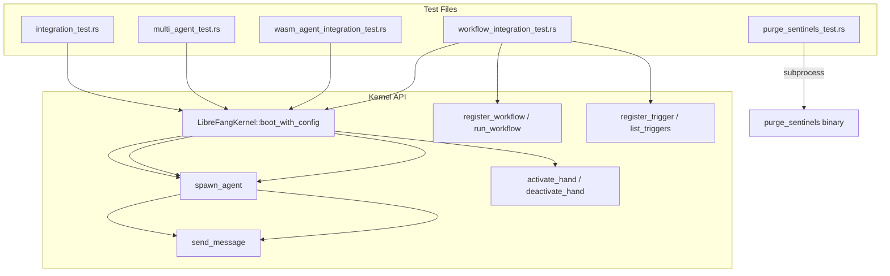

# Other — librefang-kernel-tests

# librefang-kernel-tests

Integration and end-to-end tests for the `librefang-kernel` crate. These tests exercise the kernel's major subsystems — agent spawning, hand lifecycle, WASM execution, workflow pipelines, and LLM-backed conversations — through the public API surface.

## Overview

The test suite is organized into five files, each targeting a distinct kernel capability:

| File | Scope | Requires LLM? |
|---|---|---|
| `integration_test.rs` | Basic boot → spawn → message pipeline | Yes (Groq) |
| `multi_agent_test.rs` | Hand lifecycle, agent registry, state persistence | Mostly no |
| `wasm_agent_integration_test.rs` | WASM module loading, fuel limits, host calls | No |
| `workflow_integration_test.rs` | Multi-step workflow registration and execution | Partial |
| `purge_sentinels_test.rs` | `purge_sentinels` CLI binary | No |

Tests that require a live LLM (via Groq API) guard themselves with a `GROQ_API_KEY` environment variable check and gracefully skip when absent. All other tests run offline.

## Running the Tests

```bash
# Offline tests only (no API key needed)
cargo test -p librefang-kernel

# Include live LLM integration tests
GROQ_API_KEY=gsk_... cargo test -p librefang-kernel -- --nocapture

# Run a specific test file
cargo test -p librefang-kernel --test multi_agent_test

# Run the WASM tests (uses multi_thread flavor)
cargo test -p librefang-kernel --test wasm_agent_integration_test
```

The `--nocapture` flag is recommended for integration tests so you can see agent responses and token usage printed to stdout.

## Architecture



## Common Patterns

### Kernel Configuration

Every test creates an isolated `KernelConfig` pointing at a temporary directory. This prevents tests from interfering with each other or with real user data:

```rust
fn test_config(name: &str) -> KernelConfig {
    let tmp = std::env::temp_dir().join(format!("librefang-hand-test-{name}"));
    let _ = std::fs::remove_dir_all(&tmp);
    std::fs::create_dir_all(&tmp).unwrap();

    KernelConfig {
        home_dir: tmp.clone(),
        data_dir: tmp.join("data"),
        default_model: DefaultModelConfig {
            provider: "groq".to_string(),
            model: "llama-3.3-70b-versatile".to_string(),
            api_key_env: "GROQ_API_KEY".to_string(),
            // ...
        },
        ..KernelConfig::default()
    }
}
```

Key points:
- Each test uses a unique subdirectory name to avoid collisions when tests run in parallel.
- The directory is wiped and recreated at the start of each test.
- `DefaultModelConfig` is configured even for non-LLM tests because the kernel requires it at boot.

### Agent Manifest via TOML

Tests define agents using inline TOML strings parsed into `AgentManifest`:

```rust
let manifest: AgentManifest = toml::from_str(r#"
    name = "test-agent"
    version = "0.1.0"
    module = "builtin:chat"

    [model]
    provider = "groq"
    model = "llama-3.3-70b-versatile"
    system_prompt = "You are a test agent."

    [capabilities]
    tools = ["file_read"]
    memory_read = ["*"]
    memory_write = ["self.*"]
"#).unwrap();
```

The `module` field determines the agent backend:
- `"builtin:chat"` — standard LLM chat agent
- `"wasm:<filename>"` — WASM module agent (see `wasm_agent_integration_test.rs`)

### Hand Installation

Hand-based tests install hand definitions from TOML content using a helper:

```rust
fn install_hand(kernel: &LibreFangKernel, toml_content: &str) {
    kernel
        .hands()
        .install_from_content(toml_content, "")
        .unwrap_or_else(|e| panic!("Failed to install hand: {e}"));
}
```

Three hand fixtures are defined as constants (`HAND_A`, `HAND_B`, `HAND_C`) covering single-agent hands, multi-agent hands with explicit coordinators, and varying tool configurations.

### LLM Guard Pattern

Tests that call live LLMs follow a consistent skip pattern:

```rust
if std::env::var("GROQ_API_KEY").is_err() {
    eprintln!("GROQ_API_KEY not set, skipping integration test");
    return;
}
```

This prints a message and returns early rather than panicking, so `cargo test` succeeds even without API access.

## Test Coverage by File

### integration_test.rs

Two tests validating the core message pipeline:

- **`test_full_pipeline_with_groq`** — Boots the kernel, spawns a single agent with a Groq model, sends a message, asserts the response is non-empty and token usage is recorded, then kills the agent and shuts down.
- **`test_multiple_agents_different_models`** — Spawns two agents with different Groq models (llama-3.3-70b-versatile and llama-3.1-8b-instant), sends messages to both, verifies independent responses.

These tests confirm that the kernel can manage multiple concurrent LLM sessions through different model configurations.

### multi_agent_test.rs

The largest test file, covering the hand subsystem comprehensively:

**Lifecycle:**
- `test_activate_hand_spawns_agent` — Activation creates agents in the registry.
- `test_deactivate_kills_agent` — Deactivation removes agents from the registry.
- `test_pause_and_resume_hand` — Pause keeps agents alive; status transitions correctly.
- `test_hand_instance_status_active_on_creation` — New instances start as `Active`.

**Deterministic IDs:**
- `test_deterministic_agent_id` — Agent IDs derive from hand ID + role via `AgentId::from_hand_agent`.
- `test_deterministic_id_stable_across_reactivation` — Single-instance reactivation preserves the same agent ID (legacy format).
- `test_agent_id_from_hand_id_is_deterministic` — Pure unit test for `AgentId::from_hand_id`.

**Coordinator routing:**
- `test_explicit_coordinator_role_used_for_routes` — When a hand declares a non-`main` coordinator, `agent_id()` and `agent_name()` resolve to that role.

**Metadata and tooling:**
- `test_agent_tagged_with_hand_metadata` — Agents receive `hand:<id>` and `hand_instance:<uuid>` tags.
- `test_hand_tools_applied_to_agent` — Hand-level `tools` list propagates to the agent manifest capabilities.
- `test_system_prompt_preserved` — The hand's `system_prompt` appears in the spawned agent's manifest.
- `test_default_provider_resolved_to_kernel_default` — `provider = "default"` is resolved to the actual provider from `KernelConfig`.

**State persistence:**
- `test_hand_state_persistence` — After activation, `hand_state.json` exists with v4 format, including typed fields (`instance_id`, `status`, `activated_at`, `updated_at`) and the `agent_ids` map.
- `test_multi_agent_hand_state_persists_coordinator_role` — The `coordinator_role` field is persisted for multi-agent hands.

**Coexistence and isolation:**
- `test_multiple_hands_coexist` — Two hands activated simultaneously have distinct agent IDs.
- `test_deactivate_one_hand_preserves_other` — Deactivating one hand doesn't affect the other's agents.
- `test_find_instance_by_agent_id` — `hands().find_by_agent()` looks up instances from agent IDs.

**Error cases:**
- `test_activate_nonexistent_hand_fails`
- `test_deactivate_nonexistent_instance_fails`
- `test_pause_nonexistent_instance_fails`
- `test_resume_nonexistent_instance_fails`

**Trigger migration:**
- `test_reactivation_restores_triggers_to_original_roles` — Verifies that triggers registered on a specific agent role stay attached to that role after deactivation/reactivation, rather than migrating to the coordinator.

**Live LLM:**
- `test_six_agent_fleet` — Spawns 6 agents (coder, researcher, writer, ops, analyst, hello-world) with different models and tool sets, sends each a message, and reports aggregate token usage.

### wasm_agent_integration_test.rs

Tests WASM agent execution without any LLM dependency. Uses WAT (WebAssembly Text format) modules written inline as string constants:

| Constant | Behavior |
|---|---|
| `ECHO_WAT` | Returns input JSON as-is (kernel extracts response) |
| `HELLO_WAT` | Returns fixed `{"response":"hello from wasm"}` |
| `INFINITE_LOOP_WAT` | Infinite `br` loop — tests fuel exhaustion |
| `HOST_CALL_PROXY_WAT` | Forwards input to the `librefang.host_call` import |

All WASM tests use `#[tokio::test(flavor = "multi_thread")]` because WASM execution requires a multi-threaded runtime.

**Test cases:**
- `test_wasm_agent_hello_response` — Fixed-response module returns expected string.
- `test_wasm_agent_echo` — Echo module includes the input message in its output.
- `test_wasm_agent_fuel_exhaustion` — Infinite loop module fails with a fuel-related error.
- `test_wasm_agent_missing_module` — Referencing a nonexistent `.wasm` file produces a clear "Failed to read" error.
- `test_wasm_agent_host_call_time` — Tests the host call import mechanism end-to-end.
- `test_wasm_agent_streaming_fallback` — `send_message_streaming` on a WASM agent produces at least `TextDelta` + `ContentComplete` events, then resolves to the same response as non-streaming.
- `test_multiple_wasm_agents` — Two WASM agents execute independently; registry count reflects both plus the default assistant.
- `test_mixed_wasm_and_llm_agents` — WASM and LLM agents coexist in the same kernel. Killing the WASM agent leaves the LLM agent intact.

### workflow_integration_test.rs

Tests the workflow engine at two levels:

**Kernel wiring (no LLM):**
- `test_workflow_register_and_resolve` — Creates a 2-step `Workflow` with agents referenced by name via `StepAgent::ByName`. Verifies the workflow is registered, agents are resolvable via `agent_registry().find_by_name()`, and a `WorkflowRun` can be created with input.
- `test_workflow_agent_by_id` — Uses `StepAgent::ById` to reference an agent directly by its string ID.
- `test_trigger_registration_with_kernel` — Registers `TriggerPattern::Lifecycle` and `TriggerPattern::SystemKeyword` triggers on an agent, verifies listing and removal.

**Full E2E with Groq:**
- `test_workflow_e2e_with_groq` — Spawns two agents (analyst, writer), creates a 2-step sequential pipeline, runs it with real LLM calls. Asserts:
  - Workflow completes successfully.
  - Both steps have non-zero token usage.
  - `step_results` records each step's name in order.
  - `WorkflowRunState::Completed` is set on the run.
  - `list_runs()` returns the run.

The workflow uses `{{input}}` template variables in `prompt_template` fields. Output variable binding (`output_var`) is tested in the registration test but not in the live E2E test.

### purge_sentinels_test.rs

Tests the `purge_sentinels` CLI binary as a subprocess. This is the only test file that drives an external binary rather than calling the kernel API directly.

The binary reference uses Cargo's built-in binary discovery:
```rust
const BIN: &str = env!("CARGO_BIN_EXE_purge_sentinels");
```

**Fixture setup** creates a temp directory with four test files:
- `a.md` — Contains whole-line sentinels (`NO_REPLY`, `[no reply needed]`) plus real text.
- `b.md` — Contains `NO_REPLY` embedded mid-sentence (should NOT be removed).
- `c.md` — Clean file with no sentinels.
- `nested/d.md` — Lowercase `no_reply` with surrounding whitespace.

**Test cases:**
- `dry_run_reports_counts_and_touches_nothing` — `--dry-run` reports `removed=3` but leaves all files unchanged and creates no `.bak` files.
- `apply_creates_backup_and_rewrites` — `--apply` creates `.bak` files with original content, removes whole-line sentinels, preserves mid-sentence sentinels, leaves clean files untouched, and handles nested directories.
- `apply_is_idempotent` — A second `--apply` run reports `removed=0` and leaves files/backups unchanged.
- `apply_aborts_when_existing_bak_differs` — If a stale `.bak` exists with different content, the tool exits non-zero with a "backup mismatch" error and preserves the stale backup.
- `nonexistent_path_exits_non_zero` — Invalid paths produce a clear error message.

## Contributing New Tests

When adding integration tests:

1. **Isolate state** — Always create a unique temp directory via `test_config("descriptive-name")`. Never share state between tests.
2. **Guard LLM tests** — Wrap any test calling `send_message` against a real provider with the `GROQ_API_KEY` check and early return.
3. **Use `multi_thread` for WASM** — Any test exercising WASM agents needs `#[tokio::test(flavor = "multi_thread")]`.
4. **Clean up** — Call `kernel.shutdown()` at the end of every test to release resources. Kill spawned agents if the test doesn't deactivate hands.
5. **Prefer TOML manifests** — Define agent configurations as inline TOML strings parsed with `toml::from_str` rather than constructing `AgentManifest` structs manually. This mirrors real usage and catches serialization issues.
6. **Assert meaningfully** — Beyond "is not empty," assert on specific field values, token counts, status strings, and error messages to catch regressions.