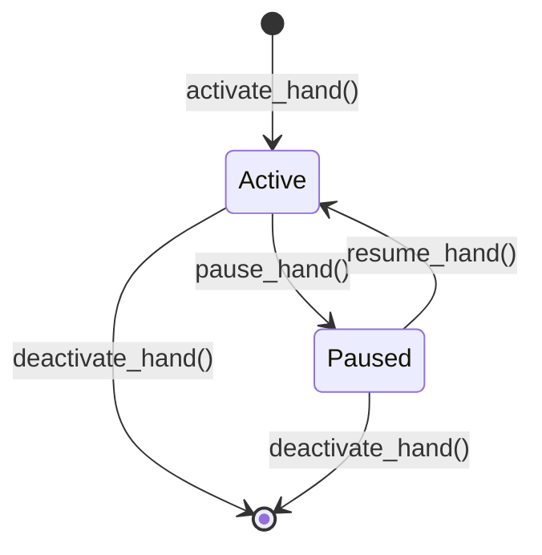

# Other — librefang-kernel-tests

# librefang-kernel Integration Tests

Integration and end-to-end tests for the `librefang-kernel` crate. These tests exercise the full kernel lifecycle — boot, agent spawning, messaging, hand activation, workflow execution, and WASM module execution — against real infrastructure (Groq LLM API, WASM runtimes) and in isolated unit-like configurations.

## Test Files

| File | Scope | LLM Required |
|------|-------|-------------|
| `integration_test.rs` | Basic single-agent and multi-model messaging pipeline | Yes (`GROQ_API_KEY`) |
| `multi_agent_test.rs` | Hand lifecycle: activation, deactivation, pause/resume, state persistence, trigger reactivation, fleet test | Mixed — most are local; `test_six_agent_fleet` requires `GROQ_API_KEY` |
| `wasm_agent_integration_test.rs` | WASM module loading, execution, fuel exhaustion, streaming, host calls | No |
| `workflow_integration_test.rs` | Workflow registration, agent resolution (by name/ID), trigger management, E2E pipeline | Only `test_workflow_e2e_with_groq` requires `GROQ_API_KEY` |
| `purge_sentinels_test.rs` | CLI binary for removing sentinel lines from markdown files | No |

## Running

```bash
# All local tests (no API key needed for most)
cargo test -p librefang-kernel --test multi_agent_test
cargo test -p librefang-kernel --test wasm_agent_integration_test
cargo test -p librefang-kernel --test workflow_integration_test
cargo test -p librefang-kernel --test purge_sentinels_test

# Live LLM integration tests
GROQ_API_KEY=gsk_... cargo test -p librefang-kernel --test integration_test -- --nocapture
GROQ_API_KEY=gsk_... cargo test -p librefang-kernel --test multi_agent_test test_six_agent_fleet -- --nocapture
GROQ_API_KEY=gsk_... cargo test -p librefang-kernel --test workflow_integration_test test_workflow_e2e_with_groq -- --nocapture
```

Tests that require `GROQ_API_KEY` detect its absence at runtime and return early with a skip message rather than failing.

## Common Patterns

### Kernel Boot with Isolation

Every test boots a fresh kernel with a unique temporary directory to avoid state collisions:

```rust
fn test_config(name: &str) -> KernelConfig {
    let tmp = std::env::temp_dir().join(format!("librefang-hand-test-{name}"));
    let _ = std::fs::remove_dir_all(&tmp);
    std::fs::create_dir_all(&tmp).unwrap();
    KernelConfig {
        home_dir: tmp.clone(),
        data_dir: tmp.join("data"),
        default_model: DefaultModelConfig {
            provider: "groq".to_string(),
            model: "llama-3.3-70b-versatile".to_string(),
            api_key_env: "GROQ_API_KEY".to_string(),
            // ...
        },
        ..KernelConfig::default()
    }
}
```

The `name` parameter ensures each test gets its own directory. Tests that don't call LLMs configure `provider: "ollama"` with dummy values.

### Agent Manifests from TOML

Agents are defined as inline TOML strings parsed into `AgentManifest`:

```rust
let manifest: AgentManifest = toml::from_str(r#"
    name = "test-agent"
    module = "builtin:chat"
    [model]
    provider = "groq"
    model = "llama-3.3-70b-versatile"
    system_prompt = "You are a test agent."
    [capabilities]
    tools = ["file_read"]
"#).unwrap();
```

For WASM agents, the `module` field uses the `wasm:` prefix:

```rust
module = "wasm:hello.wat"
```

### Kernel Lifecycle

Tests follow a consistent boot → operate → shutdown pattern:

```rust
let kernel = LibreFangKernel::boot_with_config(config).unwrap();
// ... operations ...
kernel.shutdown();
```

---

## Test Coverage by Area

### Agent Spawning and Messaging (`integration_test.rs`)

**`test_full_pipeline_with_groq`** — Boots kernel, spawns a single `builtin:chat` agent, sends a message through Groq's LLM, validates the response is non-empty and that token usage is reported.

**`test_multiple_agents_different_models`** — Spawns two agents with different models (`llama-3.3-70b-versatile` and `llama-3.1-8b-instant`), sends messages to both, confirms they coexist and respond independently.

### Hand Lifecycle (`multi_agent_test.rs`)

Hands are pre-configured agent blueprints. Three test hand definitions are used:

- **HAND_A** (`test-clip`) — Single-agent hand with tools: `file_read`, `file_write`, `shell_exec`
- **HAND_B** (`test-devops`) — Single-agent hand with tools: `shell_exec`
- **HAND_C** (`test-research`) — Multi-agent hand with `analyst` and `planner` roles; `planner` is the explicit coordinator



#### Activation and Agent Spawning

| Test | What it verifies |
|------|-----------------|
| `test_activate_hand_spawns_agent` | Activating a hand creates an agent in the registry |
| `test_deterministic_agent_id` | Agent ID is deterministic via `AgentId::from_hand_agent("test-clip", "main", None)` |
| `test_explicit_coordinator_role_used_for_routes` | When a hand defines a `coordinator = true` agent, routing resolves to that role |
| `test_hand_instance_status_active_on_creation` | Instance status is `"Active"` immediately after activation |

#### Deactivation and Cleanup

| Test | What it verifies |
|------|-----------------|
| `test_deactivate_kills_agent` | Agent is removed from registry after deactivation |
| `test_activate_nonexistent_hand_fails` | Error on unknown hand ID |
| `test_deactivate_nonexistent_instance_fails` | Error on unknown instance UUID |
| `test_pause_nonexistent_instance_fails` | Error on unknown instance UUID |
| `test_resume_nonexistent_instance_fails` | Error on unknown instance UUID |

#### Pause and Resume

**`test_pause_and_resume_hand`** — Pausing sets status to `"Paused"` while keeping the agent alive. Resuming sets status back to `"Active"`.

#### Metadata and Inheritance

| Test | What it verifies |
|------|-----------------|
| `test_agent_tagged_with_hand_metadata` | Agent gets `hand:test-clip` and `hand_instance:{uuid}` tags |
| `test_hand_tools_applied_to_agent` | Hand-level `tools` list propagates to the agent manifest's `capabilities.tools` |
| `test_system_prompt_preserved` | Hand's `system_prompt` appears in the agent's manifest |
| `test_default_provider_resolved_to_kernel_default` | `provider = "default"` is resolved to the actual kernel-configured provider (not left as the string `"default"`) |

#### State Persistence

**`test_hand_state_persistence`** — After activation, `hand_state.json` is written to the data directory. The file uses schema version 4 with typed fields: `instance_id`, `status`, `activated_at`, `updated_at`, and an `agent_ids` map.

**`test_multi_agent_hand_state_persists_coordinator_role`** — Multi-agent hands persist the `coordinator_role` field.

#### Coexistence and Isolation

| Test | What it verifies |
|------|-----------------|
| `test_multiple_hands_coexist` | Two hands activated simultaneously have distinct agent IDs |
| `test_deactivate_one_hand_preserves_other` | Deactivating one hand's instance doesn't affect another |
| `test_find_instance_by_agent_id` | `kernel.hands().find_by_agent(agent_id)` resolves back to the correct instance |

#### Reactivation and Triggers

**`test_deterministic_id_stable_across_reactivation`** — Single-instance reactivation with legacy format produces the same agent ID: `AgentId::from_hand_agent("test-clip", "main", None)`.

**`test_reactivation_restores_triggers_to_original_roles`** — After registering a trigger on the `analyst` role, deactivating and reactivating the hand preserves the trigger on the correct role. The `planner` role does not inherit the `analyst`'s triggers.

#### Live Fleet Test

**`test_six_agent_fleet`** — Spawns six named agents (coder, researcher, writer, ops, analyst, hello-world) across two models, sends each a tailored message via Groq, prints a summary table with token usage.

### WASM Agent Execution (`wasm_agent_integration_test.rs`)

Tests use hand-written WAT (WebAssembly Text format) modules stored as inline string constants:

| WAT Module | Behavior |
|------------|----------|
| `ECHO_WAT` | Returns input JSON as-is (pointer+length packed into i64) |
| `HELLO_WAT` | Returns fixed `{"response":"hello from wasm"}` |
| `INFINITE_LOOP_WAT` | Infinite `br` loop — triggers fuel exhaustion |
| `HOST_CALL_PROXY_WAT` | Forwards input to `librefang.host_call` import |

All WASM tests use `#[tokio::test(flavor = "multi_thread")]` because WASM execution requires a multi-threaded runtime.

| Test | What it verifies |
|------|-----------------|
| `test_wasm_agent_hello_response` | Fixed-response WASM module returns `"hello from wasm"`, iterations = 1 |
| `test_wasm_agent_echo` | Echo module's response contains the input message text |
| `test_wasm_agent_fuel_exhaustion` | Infinite loop module produces an error containing "Fuel exhausted" or "fuel" |
| `test_wasm_agent_missing_module` | Nonexistent `.wasm` file produces an error mentioning the missing file |
| `test_wasm_agent_host_call_time` | Host-call proxy module executes end-to-end through the kernel's host function import |
| `test_wasm_agent_streaming_fallback` | `send_message_streaming` on a WASM agent produces at least 2 events (`TextDelta` + `ContentComplete`) |
| `test_multiple_wasm_agents` | Two WASM agents coexist; registry contains 3 agents (hello + echo + default assistant) |
| `test_mixed_wasm_and_llm_agents` | WASM and `builtin:chat` agents coexist in the same kernel; killing one doesn't affect the other |

### Workflow Engine (`workflow_integration_test.rs`)

Tests exercise the workflow engine's `Workflow` and `WorkflowStep` types. Steps reference agents via `StepAgent::ByName` or `StepAgent::ById` and use `StepMode::Sequential` execution.

| Test | What it verifies |
|------|-----------------|
| `test_workflow_register_and_resolve` | Register a 2-step workflow, verify it appears in `list_workflows()`, verify agent name resolution via `find_by_name()`, create a run |
| `test_workflow_agent_by_id` | Register a workflow with `StepAgent::ById`, create a run successfully |
| `test_trigger_registration_with_kernel` | Register `Lifecycle` and `SystemKeyword` triggers, list by agent, remove by ID |
| `test_workflow_e2e_with_groq` | Full pipeline: spawn analyst + writer agents, create a 2-step `analyst → writer` workflow, execute through Groq, verify both steps recorded `input_tokens > 0` and `output_tokens > 0`, verify `WorkflowRunState::Completed` |

### Purge Sentinels CLI (`purge_sentinels_test.rs`)

Tests the `purge_sentinels` binary that removes sentinel lines (`NO_REPLY`, `[no reply needed]`, `no_reply`) from markdown files. The binary is invoked via `std::process::Command` using Cargo's `CARGO_BIN_EXE_purge_sentinels` environment variable.

Fixture setup creates four files:
- `a.md` — Contains whole-line sentinels: `NO_REPLY`, `[no reply needed]`
- `b.md` — Contains `NO_REPLY` embedded mid-sentence (should be preserved)
- `c.md` — Clean file, no sentinels
- `nested/d.md` — Lowercase `no_reply` with surrounding whitespace

| Test | What it verifies |
|------|-----------------|
| `dry_run_reports_counts_and_touches_nothing` | `--dry-run` prints `removed=3` but doesn't modify files or create `.bak` |
| `apply_creates_backup_and_rewrites` | `--apply` creates `.bak` with original content, removes whole-line sentinels, preserves mid-sentence sentinels, recurses into subdirectories |
| `apply_is_idempotent` | Second `--apply` run reports `removed=0` and doesn't change files or backups |
| `apply_aborts_when_existing_bak_differs` | Pre-existing `.bak` with different content causes a "backup mismatch" error and non-zero exit |
| `nonexistent_path_exits_non_zero` | Invalid path produces "does not exist" error |

---

## Key APIs Exercised

The tests exercise the following `LibreFangKernel` public surface:

- **Lifecycle**: `boot_with_config()`, `shutdown()`
- **Agents**: `spawn_agent()`, `kill_agent()`, `send_message()`, `send_message_streaming()`, `agent_registry()` (`.get()`, `.find_by_name()`, `.list()`, `.count()`)
- **Hands**: `activate_hand()`, `deactivate_hand()`, `pause_hand()`, `resume_hand()`, `hands()` (`.install_from_content()`, `.get_instance()`, `.find_by_agent()`, `.deactivate()`)
- **Triggers**: `register_trigger()`, `remove_trigger()`, `list_triggers()`
- **Workflows**: `register_workflow()`, `run_workflow()`, `workflow_engine()` (`.list_workflows()`, `.create_run()`, `.get_run()`, `.list_runs()`)
- **Self-handle**: `set_self_handle()`

## Adding New Tests

1. **Use a unique temp directory name** — Call `test_config("your-test-name")` or create an equivalent with a unique path.
2. **Clean up after yourself** — Call `kernel.shutdown()` at the end of every test.
3. **Guard LLM tests** — Check `std::env::var("GROQ_API_KEY").is_err()` and return early with a skip message.
4. **WASM tests need multi-threaded runtime** — Use `#[tokio::test(flavor = "multi_thread")]`.
5. **Hand definitions** — Use `install_hand(&kernel, TOML_CONTENT)` to register hand definitions before calling `activate_hand()`.