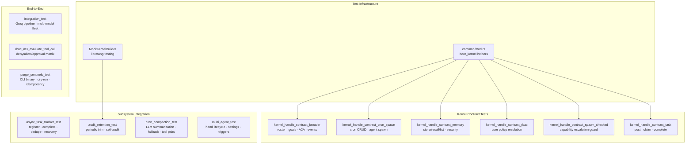

# Other — librefang-kernel-tests

# librefang-kernel-tests

Integration test suite for the LibreFang kernel. Covers the full lifecycle — boot, agent spawning, messaging, task tracking, memory isolation, RBAC policy evaluation, hand (multi-agent) management, audit retention, session compaction, and CLI tooling.

## Architecture



## Shared Infrastructure

### `common/mod.rs`

Two boot helpers used across contract tests:

- **`boot_kernel()`** — Boots a `LibreFangKernel` with a temp directory, SQLite memory store, networking disabled, no users. Returns `(LibreFangKernel, TempDir)`.
- **`boot_kernel_with_users(users)`** — Same but seeds `KernelConfig.users` for RBAC tests.

Both create the required directory skeleton (`data/`, `skills/`, `workspaces/agents/`, `workspaces/hands/`) and call `LibreFangKernel::boot_with_config`.

### `MockKernelBuilder` (from `librefang-testing`)

Used by `audit_retention_test.rs` to build a kernel with custom config closures (e.g., `trim_interval_secs`, `max_in_memory_entries`). Returns `(LibreFangKernel, TempDir)`.

## Kernel Handle Contract Tests

All contract tests operate through the `KernelHandle` trait object (`&dyn KernelHandle`), validating the public API surface that `librefang-runtime` and external consumers rely on.

### Broader (`kernel_handle_contract_broader.rs`)

Covers miscellaneous `KernelHandle` methods:

| Test | Method | Validates |
|------|--------|-----------|
| `test_roster_roundtrip` | `roster_upsert`, `roster_members`, `roster_remove_member` | Insert, enumerate, remove |
| `test_goal_list_active_default_empty` | `goal_list_active` | Empty kernel returns no goals |
| `test_list_a2a_agents_default_empty` | `list_a2a_agents` | No agents → empty list |
| `test_get_a2a_agent_url_default_none` | `get_a2a_agent_url` | Unknown agent → `None` |
| `test_kill_agent_unknown_returns_error` | `kill_agent` | Nonexistent agent → `Err` |
| `test_publish_event_succeeds` | `publish_event` | Publishing an arbitrary event succeeds |

### Cron and Spawn (`kernel_handle_contract_cron_spawn.rs`)

Tests cron job creation and agent spawning metadata:

- **`test_cron_create_preserves_peer_id`** — `cron_create` round-trips the `peer_id` field.
- **`test_cron_create_without_peer_id`** — Omitting `peer_id` results in `null`, not an error.
- **`test_spawn_agent_returns_valid_identity`** — `spawn_agent` returns `(id, name)` and the agent appears in `list_agents`.
- **`test_list_agents_returns_manifest_metadata`** — `list_agents` and `find_agents` return manifest fields (name, description).

### Memory (`kernel_handle_contract_memory.rs`)

Validates the memory subsystem's isolation model and security boundary.

**Namespace isolation:**

- `memory_store` / `memory_recall` / `memory_list` isolate global (`None` peer_id) from peer-scoped namespaces. Storing `"key1"` globally and as `"peer-a"` / `"peer-b"` returns the correct value per scope.
- `memory_list` returns only keys in the requested scope.

**Security boundary (#5119, #5120):**

The following inputs are rejected at the `KernelHandle` boundary with `KernelOpError::InvalidInput`, and tests assert the **side effect** (no data leakage), not just the error variant:

| Attack vector | Rejection | Side-effect assertion |
|---------------|-----------|----------------------|
| Key prefixed `peer:` | Rejected on store and recall | Victim namespace stays empty |
| `peer_id` containing `:` | Rejected on store, recall, list | No cross-namespace leakage |
| Empty `peer_id` | Rejected on store, recall, list | Global namespace unmodified |
| Pre-fix planted rows (`peer:victim:peer:other:secret`) | Not enumerable via `memory_list(Some("victim"))` | Round-trip guard drops structurally-impossible keys |

**Substrate validation (#5138):**

- Empty key rejected — no nameless row lands in the substrate.
- Oversized value (>256 KiB) rejected — the key is never created.
- `test_concurrent_goal_update_loses_no_writes_5138` — Two threads concurrently update different goals. Uses `std::thread::scope` with 20 iterations each. Asserts both goals reach their final status (no lost updates from the pre-fix get→mutate→set pattern).

### RBAC (`kernel_handle_contract_rbac.rs`)

Tests user-policy resolution through `resolve_user_tool_decision` and `memory_acl_for_sender`:

- **Unconfigured kernel** — No registered users: `resolve_user_tool_decision` returns `Allow` (guest mode).
- **Configured user, matching channel** — Bound Telegram sender receives the configured deny.
- **Unknown sender** — Falls back to guest gate (`NeedsApproval`), not a registered user's policy.
- **Wrong channel** — Same sender ID on a different channel does not match.
- **Memory ACL** — `memory_acl_for_sender` returns `None` for unconfigured or mis-routed users.
- **Delegation** — `requires_approval_with_context` and `is_tool_denied_with_context` delegate to their context-free counterparts in default config.

### Spawn Checked (`kernel_handle_contract_spawn_checked.rs`)

Tests `spawn_agent_checked`, which enforces capability non-escalation:

- Succeeds with empty parent caps, with a parent ID, and with specific capabilities.
- **Rejects capability escalation** — A child manifest requesting `shell_exec` when the parent only has `FileRead("/data/*")` returns an error mentioning "escalation" or "capability".

### Task (`kernel_handle_contract_task.rs`)

Full task lifecycle through `KernelHandle`:

1. `task_post` — Creates a task with optional `assigned_to` and `created_by`. Both fields are preserved in `task_list` output.
2. `task_claim` — Returns the assigned task for an agent.
3. `task_complete` — Updates status to `"completed"` with a result string.
4. Unassigned task — `task_post` with `None` assignment results in null/empty `assigned_to`.

## Async Task Tracker (`async_task_tracker_test.rs`)

Tests the `register_async_task` / `complete_async_task` pair — the kernel-side registry for tracking async work (workflows, delegations) across agent loop turns.

### Core lifecycle

| Test | Validates |
|------|-----------|
| `register_inserts_into_registry_and_returns_handle` | Registration increments `pending_async_task_count`, handle is lookable up by ID |
| `complete_workflow_task_injects_signal_into_originating_session` | Completion injects `AgentLoopSignal::TaskCompleted` on the injection channel, removes registry entry |
| `complete_delegation_task_injects_signal_with_delegation_kind` | Delegation completions preserve `(agent_id, prompt_hash)` in the signal |
| `complete_unknown_task_id_returns_ok_false` | Unknown ID returns `Ok(false)`, no panic |

### Delivery paths

- **Mid-turn delivery** — When an injection receiver is attached, `complete_async_task` returns `Ok(true)` and the signal arrives on the channel.
- **Idle delivery** — When no receiver is attached and `self_handle` is unset, returns `Ok(false)`. The entry is still removed (delete-on-delivery contract).
- **Wake-idle path** — When `self_handle` is set (via `set_self_handle`), the kernel spawns a `tokio::task` to drive a turn, returning `Ok(true)`.
- **Backpressure fallthrough** — When the injection channel is full (`TrySendError::Full`), the kernel falls through to the wake-idle path instead of propagating the error. Test uses a capacity-1 channel pre-saturated with a stray signal.

### Deduplication (#5033)

| Test | Behavior |
|------|----------|
| `register_dedupes_workflow_kind_against_existing_run_id` | Same `TaskKind::Workflow { run_id }` returns the existing handle, count stays 1 |
| `register_dedupes_delegation_kind_against_existing_target_and_hash` | Same `(agent_id, prompt_hash)` returns the existing handle |
| `register_does_not_dedupe_distinct_delegations_to_same_target` | Different `prompt_hash` → distinct handles |
| `register_dedupe_is_cross_session_for_delegation_kind` | **Intentional**: same `(target, prompt_hash)` from different `(agent, session)` callers returns the same handle. Completion routes to the first caller's session only. Callers needing per-session isolation must salt their `prompt_hash`. |

### Idempotency and recovery

- **`double_completion_is_a_noop_on_second_call`** — Second call returns `Ok(false)`, only one signal lands.
- **`recovery_synthesizes_failed_event_for_matching_pending_workflow`** — `synthesize_task_failures_for_recovered_runs` drains matching entries and injects a `Failed("workflow run interrupted by daemon restart")` signal.
- **`recovery_noop_when_no_pending_task_matches_recovered_run`** — Non-matching run ID is a no-op.

### Type contract

- **`workflow_run_id_canonical_definition_lives_in_types_crate`** — `librefang_kernel::workflow::WorkflowRunId` is a re-export of `librefang_types::task::WorkflowRunId`, not a parallel newtype.

## Audit Retention (`audit_retention_test.rs`)

Tests the periodic audit log trim task:

1. Seeds 50 audit entries (well over the configured `max_in_memory_entries = 10`).
2. Calls `start_background_agents()` to spawn the periodic trim task.
3. Waits ~2.5 seconds for the 1-second trim interval to fire.
4. Asserts the log length drops to near the cap (≤20, accounting for boot-time writes).
5. Asserts a `RetentionTrim` self-audit row appears.
6. Asserts chain integrity (`verify_integrity`) is maintained.

Requires `#![recursion_limit = "256"]` due to deeply nested async closures from `start_background_agents()`.

## Cron Compaction (`cron_compaction_test.rs`)

Tests session compaction via `librefang_runtime::compactor`:

### H2 gap 1 — Successful summarization

`compact_session` with a `FakeDriver` returns a non-empty summary with `used_fallback = false`. The output is `[summary_msg] + kept_tail` (1 summary + `keep_recent` messages).

### H2 gap 2 / M4 — LLM failure fallback

`compact_session` with a `FailingDriver` returns `Ok(result)` with `used_fallback = true`. The M4 guard (`!result.summary.is_empty() && !result.used_fallback`) correctly rejects the fallback placeholder.

### H1 — Tool pair integrity

`adjust_split_for_tool_pair` shifts the split point so an `Assistant{ToolUse}` / `User{ToolResult}` pair is never separated across the summary/tail boundary. Test constructs a 10-message sequence with a pair at indices 6-7 and verifies the raw split (7) is adjusted past the ToolResult.

## Multi-Agent / Hand Lifecycle (`multi_agent_test.rs`)

Comprehensive hand lifecycle tests covering activation, deactivation, settings, triggers, and persistence.

### Hand definitions used

| Constant | ID | Agents | Notes |
|----------|----|--------|-------|
| `HAND_A` | `test-clip` | Single (`main`) | Tools: file_read, file_write, shell_exec |
| `HAND_B` | `test-devops` | Single (`main`) | Tools: shell_exec |
| `HAND_C` | `test-research` | `analyst` + `planner` (coordinator) | Explicit non-main coordinator |
| `HAND_WITH_SETTINGS` | `test-settings` | Single | Has `[[settings]]` with defaults |

### Key behaviors tested

- **Deterministic agent IDs** — `AgentId::from_hand_agent(hand_id, role, None)` produces stable IDs. Single-instance reactivation preserves the same agent ID.
- **Explicit coordinator** — `HAND_C` uses `coordinator = true` on the planner role; routes resolve to the planner, not the first-defined agent.
- **Deactivation kills agents** — `deactivate_hand` removes agents from the registry.
- **Pause/resume** — Agents remain alive while paused; status transitions correctly.
- **Tags** — Agents are tagged with `hand:{hand_id}` and `hand_instance:{instance_id}`.
- **Tool inheritance** — Hand-level `tools` are applied to the agent manifest capabilities.
- **Provider resolution** — `"default"` provider sentinel is resolved to the kernel's actual provider at activation time.

### Settings schema

- **`test_activation_seeds_schema_defaults_into_config`** — Activating with no user overrides fills all settings from their `[[settings]]` defaults.
- **`test_activation_preserves_user_overrides_over_defaults`** — User-provided values take precedence.
- **`test_reactivation_backfills_missing_schema_keys`** — When persisted config is missing a key added by schema evolution, reactivation fills it from the default while preserving existing values.

### State persistence

- State file at `data/hand_state.json`, version 5.
- Persists `instance_id`, `status`, `activated_at`, `updated_at`, `agent_ids` map, `coordinator_role`, and `config`.
- Multi-agent hands persist the `coordinator_role` field.

### Trigger reactivation

- **`test_reactivation_restores_triggers_to_original_roles`** — Triggers registered on an agent role survive deactivation and reactivation. A reactivated analyst retains its triggers; the planner does not inherit them.

### Live LLM test

`test_six_agent_fleet` — Spawns 6 agents (coder, researcher, writer, ops, analyst, hello-world) with different models and sends a message to each. Skips if `GROQ_API_KEY` is unset.

## Integration Test (`integration_test.rs`)

Live Groq API tests, both marked `#[ignore]`:

- **`test_full_pipeline_with_groq`** — Boot → spawn agent from TOML manifest → `send_message` → assert non-empty response and positive token usage → kill agent.
- **`test_multiple_agents_different_models`** — Spawns a llama-70b agent and a llama-8b agent concurrently, sends messages to both.

Requires `#![recursion_limit = "256"]`.

## RBAC M3 (`rbac_m3_evaluate_tool_call.rs`)

End-to-end RBAC policy evaluation with real `LibreFangKernel` (no stubs):

- Boots with `[[users]]` having per-user `tool_policy` and `[tool_policy.groups]`.
- Tests the deny/allow/approval matrix:
  - (a) User denies but agent allows → `Deny` (user deny short-circuits).
  - (c) Both allow → `Allow`.
  - (d) User policy says `NeedsApproval` → `NeedsApproval`.
- Tests hot-reload: `reload()` picks up new policy without reboot.

## Purge Sentinels (`purge_sentinels_test.rs`)

Tests the `purge_sentinels` CLI binary via `std::process::Command`:

| Test | Behavior |
|------|----------|
| `dry_run_reports_counts_and_touches_nothing` | Reports removed line count, files unmodified, no `.bak` created |
| `apply_creates_backup_and_rewrites` | Creates `.bak` with original content; removes whole-line sentinels (`NO_REPLY`, `[no reply needed]`, `  no_reply  `); preserves sentence-embedded sentinels |
| `apply_is_idempotent` | Second run reports 0 removals; files and backups unchanged |
| `apply_aborts_when_existing_bak_differs` | Pre-seeded stale `.bak` causes non-zero exit with "backup mismatch" error |
| `nonexistent_path_exits_non_zero` | Invalid path → error containing "does not exist" |

## Running the Tests

Most tests run offline. Some require environment variables:

```bash
# Full suite (offline tests only)
cargo test -p librefang-kernel

# Live LLM tests
GROQ_API_KEY=gsk_... cargo test -p librefang-kernel --test integration_test -- --nocapture --ignored
GROQ_API_KEY=gsk_... cargo test -p librefang-kernel --test multi_agent_test test_six_agent_fleet -- --nocapture --ignored
```

Several test files require `#![recursion_limit = "256"]` due to deeply monomorphized futures from `send_message_full` / `start_background_agents` (specifically `audit_retention_test.rs`, `integration_test.rs`, `multi_agent_test.rs`).