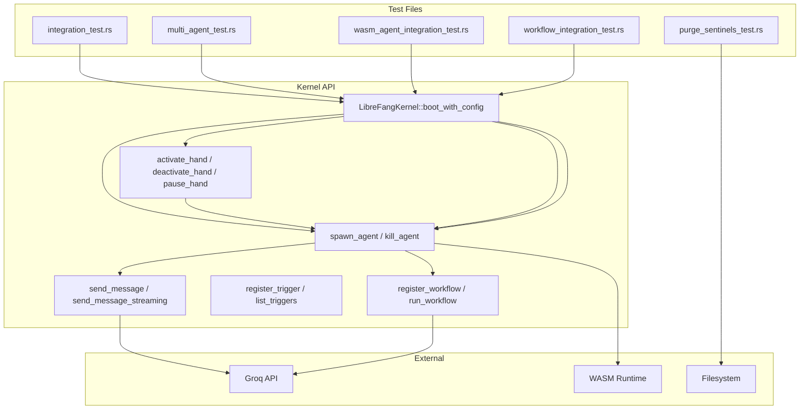

# Other — librefang-kernel-tests

# librefang-kernel Tests

Integration and end-to-end test suite for the `librefang-kernel` crate. These tests exercise the full kernel lifecycle — boot, agent spawning, messaging, hand management, WASM execution, workflow orchestration, and CLI tooling — against real infrastructure when API keys are available, and against stubs otherwise.

## Test Files

| File | Scope | Requires API Key |
|---|---|---|
| `integration_test.rs` | Basic agent boot → spawn → message pipeline | `GROQ_API_KEY` |
| `multi_agent_test.rs` | Hand lifecycle, multi-agent coexistence, state persistence | Partial (fleet test only) |
| `wasm_agent_integration_test.rs` | WASM module loading, execution, fuel limits, streaming | No |
| `workflow_integration_test.rs` | Workflow registration, agent resolution, multi-step pipelines | `GROQ_API_KEY` (E2E only) |
| `purge_sentinels_test.rs` | `purge_sentinels` CLI binary | No |

## Running the Tests

```bash
# Fast: all local tests (no API keys needed)
cargo test -p librefang-kernel

# Full: include live LLM integration tests
GROQ_API_KEY=gsk_... cargo test -p librefang-kernel -- --nocapture
```

Tests that require `GROQ_API_KEY` print a skip message and return early when the variable is unset — they never fail in CI without keys.

WASM tests require `#[tokio::test(flavor = "multi_thread")]` because WASM execution spawns blocking tasks.

The workflow E2E test sets `#![recursion_limit = "256"]` at the crate level to accommodate deeply-nested future types produced by the kernel → runtime → agent_loop call chain.

## Kernel Boot Pattern

Every test follows the same structure:

```
1. Create a KernelConfig with an isolated temp directory
2. Boot the kernel with LibreFangKernel::boot_with_config()
3. Exercise the API under test
4. Call kernel.shutdown()
```

Each test creates its own temp directory (under `$TMPDIR/librefang-<test-name>-<suffix>`) to avoid state leakage between parallel runs. The `test_config()` helpers in each file construct a `KernelConfig` pointing at these isolated paths.

## Test Coverage by Domain

### Agent Lifecycle (`integration_test.rs`)

Tests the minimal happy path:

- **`test_full_pipeline_with_groq`** — Boots kernel, spawns a single agent from a TOML `AgentManifest`, sends `"Say hello in exactly 5 words."`, asserts a non-empty response and token usage > 0, then kills the agent.
- **`test_multiple_agents_different_models`** — Spawns two agents (llama-3.3-70b-versatile and llama-3.1-8b-instant) simultaneously, sends messages to both, verifies both respond. Tests that the kernel correctly multiplexes different model configs.

Both tests validate the response struct fields: `result.response`, `result.total_usage.input_tokens`, `result.total_usage.output_tokens`, `result.iterations`.

### Hand Lifecycle (`multi_agent_test.rs`)

The most extensive test file. Covers the hand system (reusable agent templates):

**Activation and Deactivation**

- `test_activate_hand_spawns_agent` — Installing a hand definition and activating it creates a live agent in the registry.
- `test_deactivate_kills_agent` — `deactivate_hand` removes the agent from the registry.
- `test_activate_nonexistent_hand_fails` / `test_deactivate_nonexistent_instance_fails` — Error handling for invalid IDs.

**Deterministic Agent IDs**

- `test_deterministic_agent_id` — Agent IDs derive from `AgentId::from_hand_agent(hand_id, role, None)`, producing the same ID for the same hand + role combination.
- `test_deterministic_id_stable_across_reactivation` — Deactivating and reactivating a single-instance hand produces the same agent ID (legacy format).

**Coordinator Roles**

- `test_explicit_coordinator_role_used_for_routes` — A hand with `[agents.planner] coordinator = true` routes messages to the planner role, not the first-defined agent. The `HandInstance.coordinator_role` field reflects this.

**Pause and Resume**

- `test_pause_and_resume_hand` — Pausing sets status to `"Paused"` while keeping the agent alive. Resuming sets it back to `"Active"`. Error cases for nonexistent instances also tested.

**Metadata and Tool Inheritance**

- `test_agent_tagged_with_hand_metadata` — Agents spawned by hands receive tags `hand:<hand_id>` and `hand_instance:<instance_id>`.
- `test_hand_tools_applied_to_agent` — Tools declared in the hand definition (`tools = ["file_read", "file_write", "shell_exec"]`) propagate to the agent's `capabilities.tools`.
- `test_system_prompt_preserved` — The hand's `system_prompt` appears in the agent manifest.
- `test_default_provider_resolved_to_kernel_default` — `provider = "default"` and `model = "default"` in hand definitions are resolved to the actual values from `KernelConfig.default_model`.

**State Persistence**

- `test_hand_state_persistence` — After activation, `data/hand_state.json` is written with version 4 format, including typed fields (`instance_id`, `status`, `activated_at`, `updated_at` as strings) and an `agent_ids` map.
- `test_multi_agent_hand_state_persists_coordinator_role` — The `coordinator_role` field is persisted in the state file.

**Multi-Hand Coexistence**

- `test_multiple_hands_coexist` — Two different hands can be active simultaneously with distinct agent IDs.
- `test_deactivate_one_hand_preserves_other` — Killing one hand's instance leaves the other hand's agent alive.
- `test_find_instance_by_agent_id` — `hands().find_by_agent()` reverse-maps from agent ID to hand instance.

**Trigger Reactivation**

- `test_reactivation_restores_triggers_to_original_roles` — After deactivating and reactivating a multi-agent hand, triggers remain attached to their original role's agent. The planner does not inherit the analyst's triggers.

**Live Fleet Test**

- `test_six_agent_fleet` — Spawns 6 agents (coder, researcher, writer, ops, analyst, hello-world) with different models and tool sets, sends a unique prompt to each, verifies all respond. Prints a fleet summary with aggregate token usage.

### WASM Agents (`wasm_agent_integration_test.rs`)

Tests the `module = "wasm:<path>"` agent type using hand-written WAT (WebAssembly Text Format) modules:

**Test Modules**

| Module | Behavior |
|---|---|
| `HELLO_WAT` | Returns fixed `{"response":"hello from wasm"}` from pre-loaded memory |
| `ECHO_WAT` | Returns input JSON as-is (pointer/length passthrough) |
| `INFINITE_LOOP_WAT` | Infinite `br` loop — tests fuel exhaustion |
| `HOST_CALL_PROXY_WAT` | Forwards input to the `librefang.host_call` import |

**Test Cases**

- `test_wasm_agent_hello_response` — Fixed-response module returns `"hello from wasm"`.
- `test_wasm_agent_echo` — Echo module's response contains the input message.
- `test_wasm_agent_fuel_exhaustion` — Infinite loop triggers a fuel-exhaustion error (checks for `"Fuel exhausted"` or `"fuel"` in error message).
- `test_wasm_agent_missing_module` — Referencing a nonexistent `.wasm` file fails with a descriptive error.
- `test_wasm_agent_host_call_time` — End-to-end test of the `host_call` import mechanism.
- `test_wasm_agent_streaming_fallback` — `send_message_streaming` on a WASM agent produces at least 2 events (`TextDelta` + `ContentComplete`), then resolves to the same response as `send_message`.
- `test_multiple_wasm_agents` — Two WASM agents coexist (echo + hello), registry count is 3 (includes default assistant).
- `test_mixed_wasm_and_llm_agents` — WASM and builtin:chat agents coexist in the same kernel. Killing the WASM agent reduces the registry count.

WASM modules must export `memory`, `alloc(size) -> ptr`, and `execute(ptr, len) -> i64` (packed as high-32=pointer, low-32=length).

### Workflows (`workflow_integration_test.rs`)

Tests the workflow engine that chains agents into multi-step pipelines:

**Kernel-Level Wiring (no LLM)**

- `test_workflow_register_and_resolve` — Creates a 2-step `Workflow` with `StepAgent::ByName`, registers it via `kernel.register_workflow()`, verifies it appears in `workflow_engine().list_workflows()`, and that `agent_registry().find_by_name()` resolves the agent. Creates a run and verifies the input is stored.
- `test_workflow_agent_by_id` — Same but with `StepAgent::ById`, proving the workflow accepts direct agent IDs.
- `test_trigger_registration_with_kernel` — Registers `TriggerPattern::Lifecycle` and `TriggerPattern::SystemKeyword` triggers on an agent, lists them (global and per-agent), removes one, verifies the other remains.

**Full E2E with LLM**

- `test_workflow_e2e_with_groq` — Spawns two agents (`wf-analyst` and `wf-writer`), creates a sequential 2-step workflow (analyze → summarize), runs it with real Groq LLM calls. Verifies:
  - Both steps produce non-empty output
  - Token usage is > 0 for all steps
  - `WorkflowRunState::Completed`
  - `step_results` contains 2 entries with correct step names
  - `workflow_engine().list_runs()` returns 1 run

Workflow steps use `prompt_template` with `{{input}}` and `{{output_var}}` interpolation.

### Purge Sentinels CLI (`purge_sentinels_test.rs`)

Tests the `purge_sentinels` binary that removes sentinel lines (e.g., `NO_REPLY`, `[no reply needed]`) from markdown files.

**Test Fixtures**

The `fixture_dir()` helper creates a temp directory with:

| File | Content |
|---|---|
| `a.md` | Two whole-line sentinels (`NO_REPLY`, `[no reply needed]`) plus real text |
| `b.md` | Mid-sentence `NO_REPLY` (not whole-line) — should be preserved |
| `c.md` | Clean file, no sentinels |
| `nested/d.md` | Lowercase `no_reply` with surrounding whitespace |

**Test Cases**

- `dry_run_reports_counts_and_touches_nothing` — `--dry-run` prints removal counts but leaves all files and backups unchanged.
- `apply_creates_backup_and_rewrites` — `--apply` creates `.bak` files with original content, removes whole-line sentinels, preserves mid-sentence sentinels, skips clean files, recurses into subdirectories.
- `apply_is_idempotent` — Running `--apply` twice produces `removed=0` on the second pass with no file changes.
- `apply_aborts_when_existing_bak_differs` — If a `.bak` file exists but doesn't match the current file content, the tool exits non-zero with a `"backup mismatch"` error.
- `nonexistent_path_exits_non_zero` — Invalid paths produce a clear `"does not exist"` error.

## Key Kernel API Surface Exercised

```rust
// Boot and shutdown
LibreFangKernel::boot_with_config(config) -> Result<LibreFangKernel>
kernel.shutdown()

// Agent management
kernel.spawn_agent(manifest) -> Result<AgentId>
kernel.kill_agent(agent_id) -> Result<()>
kernel.agent_registry().get(id) -> Option<AgentEntry>
kernel.agent_registry().find_by_name(name) -> Option<AgentEntry>
kernel.agent_registry().list() -> Vec<AgentEntry>
kernel.agent_registry().count() -> usize

// Messaging
kernel.send_message(agent_id, text).await -> Result<AgentResponse>
kernel.send_message_streaming(agent_id, text, None) -> Result<(Receiver, JoinHandle)>

// Hands
kernel.hands().install_from_content(toml, path)
kernel.activate_hand(hand_id, HashMap::new()) -> Result<HandInstance>
kernel.deactivate_hand(instance_id) -> Result<()>
kernel.pause_hand(instance_id) -> Result<()>
kernel.resume_hand(instance_id) -> Result<()>
kernel.hands().get_instance(instance_id) -> Option<HandInstance>
kernel.hands().find_by_agent(agent_id) -> Option<HandInstance>

// Triggers
kernel.register_trigger(agent_id, pattern, template, priority) -> Result<TriggerId>
kernel.list_triggers(Some(agent_id)) -> Vec<Trigger>
kernel.remove_trigger(trigger_id) -> bool

// Workflows
kernel.register_workflow(workflow).await -> WorkflowId
kernel.run_workflow(wf_id, input).await -> Result<(RunId, String)>
kernel.workflow_engine().list_workflows().await -> Vec<Workflow>
kernel.workflow_engine().create_run(wf_id, input).await -> Option<RunId>
kernel.workflow_engine().get_run(run_id).await -> Option<WorkflowRun>
kernel.workflow_engine().list_runs(None).await -> Vec<WorkflowRun>
```

## Test Architecture



## Adding New Tests

When adding integration tests to this crate:

1. **Isolate state** — Always create a unique temp directory via `test_config("descriptive-name")`. Never share directories between tests.
2. **Always shutdown** — End every test with `kernel.shutdown()` to clean up resources.
3. **Guard live LLM tests** — Wrap Groq-dependent code with `if std::env::var("GROQ_API_KEY").is_err() { return; }`.
4. **Use `multi_thread` for WASM** — WASM tests need `#[tokio::test(flavor = "multi_thread")]`.
5. **Prefer `Arc<LibreFangKernel>` for workflows** — The workflow engine requires shared ownership when passing the kernel into async execution contexts.
6. **Assert observable behavior, not internal state** — Tests verify agent registry membership, response content, token counts, file contents, and status strings rather than private fields.