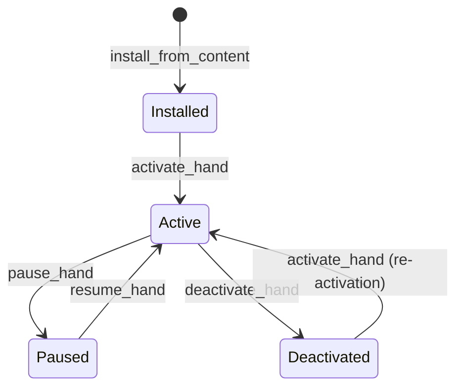

# Other — librefang-kernel-tests

# librefang-kernel-tests

Integration and end-to-end tests for the `librefang-kernel` crate. These tests exercise the full kernel boot path, agent lifecycle, RBAC enforcement, WASM execution, workflow orchestration, audit retention, and the `purge_sentinels` CLI binary — all against the real kernel with minimal mocking.

## Structure

```
tests/
├── audit_retention_test.rs          # Audit log trimming & self-audit M7
├── integration_test.rs              # Basic boot → spawn → message pipeline
├── multi_agent_test.rs              # Hand lifecycle, state persistence, settings
├── purge_sentinels_test.rs          # purge_sentinels CLI binary tests
├── rbac_m3_evaluate_tool_call.rs    # RBAC M3 tool-call evaluation
├── wasm_agent_integration_test.rs   # WASM module execution pipeline
└── workflow_integration_test.rs     # Workflow engine registration & E2E runs
```

## Running

Most tests are self-contained and need no external services:

```bash
cargo test -p librefang-kernel
```

Tests requiring a live LLM are gated on `GROQ_API_KEY` and print a skip message when unset:

```bash
GROQ_API_KEY=gsk_... cargo test -p librefang-kernel --test integration_test -- --nocapture
GROQ_API_KEY=gsk_... cargo test -p librefang-kernel --test workflow_integration_test -- --nocapture
```

The RBAC tests set a throwaway env var (`RBAC_M3_TEST_KEY`) internally — no real API key needed.

The audit retention test uses `#[tokio::test(flavor = "multi_thread")]` because `start_background_agents` calls `tokio::task::block_in_place`, which panics on the default current-thread runtime.

## Test Categories

### Integration Pipeline (`integration_test.rs`)

Two tests validating the core kernel→agent→LLM round-trip:

- **`test_full_pipeline_with_groq`** — Boots `LibreFangKernel`, spawns a single agent from a TOML `AgentManifest`, sends a message through the Groq API, and asserts a non-empty response with non-zero token usage.
- **`test_multiple_agents_different_models`** — Spawns two agents (llama-3.3-70b-versatile and llama-3.1-8b-instant) concurrently, verifies both respond independently, then cleans up.

Both tests call `kernel.spawn_agent()`, `kernel.send_message()`, `kernel.kill_agent()`, and `kernel.shutdown()` in sequence.

### Multi-Agent Hand Lifecycle (`multi_agent_test.rs`)

The largest test file. Exercises the **hand** abstraction — pre-packaged agent templates that can be activated, paused, resumed, and deactivated.



**Core lifecycle tests:**

| Test | What it verifies |
|------|-----------------|
| `test_activate_hand_spawns_agent` | Activation creates an agent in the registry |
| `test_deactivate_kills_agent` | Deactivation removes the agent |
| `test_pause_and_resume_hand` | Pause preserves the agent; status transitions correctly |
| `test_activate_nonexistent_hand_fails` | Error on unknown hand ID |
| `test_deactivate_nonexistent_instance_fails` | Error on unknown instance UUID |

**Deterministic agent IDs:**

`test_deterministic_agent_id` and `test_deterministic_id_stable_across_reactivation` confirm that `AgentId::from_hand_agent("test-clip", "main", None)` produces the same ID across activations (legacy single-instance format).

**Multi-agent hands:**

`HAND_C` defines two agents (`analyst`, `planner`) with `coordinator = true` on the planner. `test_explicit_coordinator_role_used_for_routes` verifies that routing resolves to the declared coordinator rather than defaulting to "main".

**Metadata and tool inheritance:**

- `test_agent_tagged_with_hand_metadata` — Agents receive `hand:<id>` and `hand_instance:<uuid>` tags.
- `test_hand_tools_applied_to_agent` — The hand's `tools` array propagates into the agent's `capabilities.tools`.
- `test_system_prompt_preserved` — The hand's `system_prompt` reaches the agent manifest.
- `test_default_provider_resolved_to_kernel_default` — The `"default"` provider sentinel is resolved at activation time.

**State persistence (`hand_state.json`):**

`test_hand_state_persistence` writes a version-5 state file with typed fields (`instance_id`, `status`, `activated_at`, `updated_at`) and an `agent_ids` map. `test_multi_agent_hand_state_persists_coordinator_role` confirms the `coordinator_role` field survives to disk.

**Settings schema (`[[settings]]`):**

Three tests exercise default-seeding:

1. `test_activation_seeds_schema_defaults_into_config` — Empty user config gets filled from `[[settings]].default`.
2. `test_activation_preserves_user_overrides_over_defaults` — User-provided values win over schema defaults.
3. `test_reactivation_backfills_missing_schema_keys` — Schema evolution: keys added after the initial activation are backfilled on reactivation without overwriting existing values.

**Coexistence:**

`test_multiple_hands_coexist` and `test_deactivate_one_hand_preserves_other` confirm that activating two hands produces distinct agents and deactivating one doesn't kill the other.

**Trigger preservation on reactivation:**

`test_reactivation_restores_triggers_to_original_roles` registers a trigger on the `analyst` role, deactivates, reactivates, and confirms the trigger stays attached to `analyst` without leaking to `planner`.

**Live fleet test:**

`test_six_agent_fleet` spawns 6 agents (coder, researcher, writer, ops, analyst, hello-world) against Groq, sends a message to each, and prints a summary table. Requires `GROQ_API_KEY`.

### RBAC Tool-Call Evaluation (`rbac_m3_evaluate_tool_call.rs`)

End-to-end tests for the three-layer tool authorization pipeline. Uses `KernelHandle::resolve_user_tool_decision` through the real trait object — no mocks.

**Test helpers:**

- `boot(users, groups)` — Creates a kernel with specific `UserConfig` entries and `ToolGroup` definitions. Leaks the tempdir to keep paths alive.
- `user(name, role, platform_id, tool_policy, tool_categories)` — Builds a `UserConfig` with a Telegram channel binding.

**Authorization cases:**

| Test | Layer exercised | Expected result |
|------|----------------|-----------------|
| `evaluate_tool_call_user_deny_short_circuits` | User explicit deny | `Deny` (regardless of agent capabilities) |
| `evaluate_tool_call_both_allow` | User explicit allow | `Allow` |
| `evaluate_tool_call_user_role_no_allow_list_needs_approval` | No policy, User role | `NeedsApproval` |
| `evaluate_tool_call_user_categories_resolve_against_kernel_groups` | Bulk category deny | `Deny` for tools in denied group |
| `evaluate_tool_call_user_categories_allow_list_short_circuits_for_user_role` | Category allow-list, User role | `Allow` for matching tools, `Deny` for non-matching |
| `evaluate_tool_call_unrecognised_sender_no_longer_fail_open` | Guest gate (H7 hardening) | Safe tools → `Allow`; unsafe → `NeedsApproval` |
| `evaluate_tool_call_trait_layer_none_sender_fails_closed` | `(None, None)` regression | `NeedsApproval` for unsafe tools; `Allow` for safe |
| `evaluate_tool_call_reload_picks_up_new_policy` | `AuthManager::reload` | Policy changes take effect immediately |

**Special carve-out:**

`submit_tool_approval_hand_agent_force_human_skips_auto_approve` verifies that hand-tagged agents auto-approve tool calls by default, but `force_human = true` in `DeferredToolExecution` overrides that carve-out and routes to `Pending`.

### WASM Agent Execution (`wasm_agent_integration_test.rs`)

Tests the `module = "wasm:<path>"` execution path using real WAT modules compiled by the WASM runtime.

**Test WAT modules:**

| Module | Behavior |
|--------|----------|
| `ECHO_WAT` | Bump-allocator + returns input JSON as-is |
| `HELLO_WAT` | Returns fixed `{"response":"hello from wasm"}` |
| `INFINITE_LOOP_WAT` | Infinite `br` loop — triggers fuel exhaustion |
| `HOST_CALL_PROXY_WAT` | Forwards input to `librefang.host_call` import |

**Test cases:**

- `test_wasm_agent_hello_response` — Fixed response; asserts `"hello from wasm"`.
- `test_wasm_agent_echo` — Echo module; asserts input message appears in output.
- `test_wasm_agent_fuel_exhaustion` — Infinite loop; asserts error mentions "Fuel exhausted".
- `test_wasm_agent_missing_module` — Nonexistent `.wasm` file; asserts "Failed to read" error.
- `test_wasm_agent_host_call_time` — Host-call proxy; verifies the host function import pipeline.
- `test_wasm_agent_streaming_fallback` — Streaming API on WASM agent; collects `TextDelta` + `ContentComplete` events.
- `test_multiple_wasm_agents` — Two WASM agents coexisting; verifies registry count.
- `test_mixed_wasm_and_llm_agents` — WASM + LLM agent in the same kernel; verifies coexistence and independent execution.

### Workflow Engine (`workflow_integration_test.rs`)

Tests workflow registration, agent resolution, and end-to-end multi-step pipeline execution.

**Kernel-level wiring (no LLM):**

- `test_workflow_register_and_resolve` — Creates a 2-step `Workflow` with `StepAgent::ByName`, registers it via `kernel.register_workflow()`, verifies agent lookup with `find_by_name()`, and creates a `WorkflowRun`.
- `test_workflow_agent_by_id` — Same but using `StepAgent::ById` for direct agent reference.
- `test_trigger_registration_with_kernel` — Registers `TriggerPattern::Lifecycle` and `TriggerPattern::SystemKeyword` triggers, verifies listing and removal.

**Full E2E (requires `GROQ_API_KEY`):**

`test_workflow_e2e_with_groq` runs a 2-step analyst→writer pipeline through the real LLM. Verifies:
- Workflow completes successfully
- Both steps produce non-zero token counts
- `step_results[0].step_name == "analyze"`, `[1].step_name == "summarize"`
- Run state is `Completed`
- `list_runs()` returns the run

Uses `#![recursion_limit = "256"]` because the deeply-nested future from `LoopOptions` / `SessionInterrupt` changes can overflow the default 128.

### Audit Retention (`audit_retention_test.rs`)

Single test (`test_kernel_boot_with_retention_config_starts_trim_task`) that validates the periodic audit log trim task:

1. Boots the kernel with `max_in_memory_entries: Some(10)` and `trim_interval_secs: Some(1)`.
2. Seeds 50 `AuditAction::RoleChange` entries (well over the cap).
3. Calls `kernel.start_background_agents()` to spawn the periodic task.
4. Sleeps 2.5s to allow at least one trim cycle.
5. Asserts `audit.len() <= 20` (cap + self-audit row).
6. Asserts at least one `AuditAction::RetentionTrim` self-audit row exists.
7. Asserts `audit.verify_integrity()` still passes after trimming.

### Purge Sentinels CLI (`purge_sentinels_test.rs`)

Black-box tests for the `purge_sentinels` binary, driven via `std::process::Command` with `env!("CARGO_BIN_EXE_purge_sentinels")`.

**Fixture setup:**

Creates a temp directory with:
- `a.md` — Contains whole-line sentinels (`NO_REPLY`, `[no reply needed]`)
- `b.md` — Contains a mid-sentence `NO_REPLY` (should be preserved)
- `c.md` — Clean file, no sentinels
- `nested/d.md` — Lowercase `no_reply` with surrounding whitespace

**Test cases:**

| Test | Flags | Assertion |
|------|-------|-----------|
| `dry_run_reports_counts_and_touches_nothing` | `--dry-run` | Reports `removed=3` but files unchanged, no `.bak` created |
| `apply_creates_backup_and_rewrites` | `--apply` | `.bak` matches original; sentinels removed from `a.md`; `b.md` unchanged (mid-sentence); `nested/d.md` cleaned |
| `apply_is_idempotent` | `--apply` × 2 | Second run reports `removed=0`; files and backups unchanged |
| `apply_aborts_when_existing_bak_differs` | `--apply` with stale `.bak` | Non-zero exit; stderr mentions "backup mismatch" |
| `nonexistent_path_exits_non_zero` | `--apply /bad/path` | Non-zero exit; stderr mentions "does not exist" |

## Common Patterns

### Temp directory isolation

Every test creates an isolated temp directory under `std::env::temp_dir()` with a unique suffix:

```rust
fn test_config(name: &str) -> KernelConfig {
    let tmp = std::env::temp_dir().join(format!("librefang-hand-test-{name}"));
    let _ = std::fs::remove_dir_all(&tmp);
    std::fs::create_dir_all(&tmp).unwrap();
    // ...
}
```

The RBAC tests use `tempfile::tempdir()` and intentionally leak the `TempDir` via `Box::leak` so the kernel's file paths remain valid for the test's duration.

### Kernel boot and shutdown

All tests follow the same lifecycle:

```rust
let kernel = LibreFangKernel::boot_with_config(config).expect("kernel boots");
// ... exercise kernel APIs ...
kernel.shutdown();
```

`shutdown()` is always called, even in assertion-heavy tests, to ensure clean resource release.

### LLM guard

Tests requiring a live LLM check the environment at the top:

```rust
if std::env::var("GROQ_API_KEY").is_err() {
    eprintln!("GROQ_API_KEY not set, skipping integration test");
    return;  // not a panic — test passes as "ignored"
}
```

This pattern means `cargo test` succeeds without API keys while still running all deterministic tests.

### Multi-threaded runtime requirement

Tests that call `start_background_agents()` or exercise WASM execution use `#[tokio::test(flavor = "multi_thread")]` because the kernel's synchronous substrate touches (`toml_edit`, memory operations) use `tokio::task::block_in_place`, which panics on the current-thread runtime.