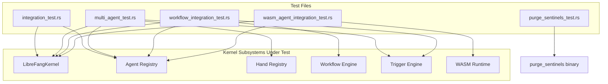

# Other — librefang-kernel-tests

# librefang-kernel Tests

Integration and end-to-end tests for the `librefang-kernel` crate. These tests exercise the full kernel pipeline — booting, agent spawning, message dispatch, hand management, WASM execution, and workflow orchestration — against both mocked and live backends.

## Overview

The test suite is organized into five files by subsystem:

| File | Scope | LLM Required |
|------|-------|-------------|
| `integration_test.rs` | Basic boot → spawn → message cycle | Yes (Groq) |
| `multi_agent_test.rs` | Hand lifecycle, agent registry, state persistence | No (most tests) |
| `purge_sentinels_test.rs` | `purge_sentinels` binary CLI behavior | No |
| `wasm_agent_integration_test.rs` | WASM module loading, fuel limits, host calls | No |
| `workflow_integration_test.rs` | Multi-step workflow registration and execution | Yes (one test) |

Tests that require a live LLM guard on `GROQ_API_KEY` and silently return if unset, so the full suite can be run offline without failure.



## Running the Tests

**Offline (no API key):**
```bash
cargo test -p librefang-kernel
```
All non-LLM tests pass. LLM-guarded tests print a skip message and return successfully.

**Full E2E (requires Groq):**
```bash
GROQ_API_KEY=gsk_... cargo test -p librefang-kernel -- --nocapture
```
The `--nocapture` flag preserves printed agent responses and fleet summaries for debugging.

---

## Test Files

### integration_test.rs

Validates the core message pipeline against the Groq API.

**`test_full_pipeline_with_groq`** — Boots a kernel, spawns a single `builtin:chat` agent configured for `llama-3.3-70b-versatile`, sends a constrained prompt ("Say hello in exactly 5 words."), asserts the response is non-empty and that token usage is reported, then kills the agent and shuts down.

**`test_multiple_agents_different_models`** — Spawns two agents with different models (70B and 8B instant), sends each a message, and verifies both respond. Proves the kernel can route concurrent multi-model sessions.

Both tests use a shared `test_config()` helper that creates an isolated temporary directory and configures the kernel with `GROQ_API_KEY` from the environment.

---

### multi_agent_test.rs

The largest test file, covering **hand** (preconfigured agent template) lifecycle and the relationship between hands and agents. Most tests are pure kernel-level with no LLM needed.

#### Test Configuration

Each test calls `test_config(name)` with a unique name to get an isolated `KernelConfig` pointing at a fresh temp directory. The default model is configured for Groq but is only used by the final fleet test.

Three hand definitions are used as test fixtures:

- **`HAND_A`** (`test-clip`) — Single-agent hand with tools `file_read`, `file_write`, `shell_exec`. Uses `provider = "default"` to test resolution.
- **`HAND_B`** (`test-devops`) — Single-agent hand with only `shell_exec`. Used for coexistence tests.
- **`HAND_C`** (`test-research`) — Multi-agent hand with an explicit `coordinator = true` on the `planner` role, plus a separate `analyst` role.

#### Hand Lifecycle Tests

| Test | What it verifies |
|------|-----------------|
| `test_activate_hand_spawns_agent` | `activate_hand` returns an instance with a valid agent ID present in the registry |
| `test_deactivate_kills_agent` | `deactivate_hand` removes the agent from the registry |
| `test_pause_and_resume_hand` | Pausing sets status to `"Paused"` without killing the agent; resuming restores `"Active"` |
| `test_activate_nonexistent_hand_fails` | Returns `Err` for unknown hand IDs |
| `test_deactivate_nonexistent_instance_fails` | Returns `Err` for random UUIDs |
| `test_pause_nonexistent_instance_fails` | Returns `Err` |
| `test_resume_nonexistent_instance_fails` | Returns `Err` |

#### Deterministic Agent IDs

**`test_deterministic_agent_id`** — When `activate_hand` is called without an explicit instance ID, the agent ID follows the legacy format `AgentId::from_hand_agent("test-clip", "main", None)`. This ensures routing tables and trigger lookups remain stable.

**`test_deterministic_id_stable_across_reactivation`** — After deactivate → reactivate, the same hand+role combination produces the same agent ID (single-instance legacy format).

#### Coordinator and Multi-Agent

**`test_explicit_coordinator_role_used_for_routes`** — For `HAND_C` which defines `coordinator = true` on the `planner` role, the hand instance's `agent_id()` and default routing resolve to the planner, not the first-defined agent.

**`test_multi_agent_hand_state_persists_coordinator_role`** — The persisted `hand_state.json` stores the `coordinator_role` field, surviving kernel restarts.

#### Metadata and Tool Inheritance

| Test | What it verifies |
|------|-----------------|
| `test_agent_tagged_with_hand_metadata` | Agents receive `hand:{hand_id}` and `hand_instance:{uuid}` tags |
| `test_hand_tools_applied_to_agent` | Tools declared in the hand definition appear in the agent's `capabilities.tools` |
| `test_system_prompt_preserved` | The hand's `system_prompt` appears verbatim in the spawned agent's manifest |
| `test_default_provider_resolved_to_kernel_default` | `provider = "default"` is replaced with the actual provider from `KernelConfig` |

#### State Persistence

**`test_hand_state_persistence`** — After activating a hand, verifies `hand_state.json` exists with version 4 format, string-typed fields (`instance_id`, `status`, `activated_at`, `updated_at`), and an `agent_ids` map containing the correct agent ID.

#### Coexistence

**`test_multiple_hands_coexist`** — Two different hands activated simultaneously have distinct agent IDs, both present in the registry.

**`test_deactivate_one_hand_preserves_other`** — Deactivating one hand's instance does not affect another hand's agents.

#### Trigger Reactivation

**`test_reactivation_restores_triggers_to_original_roles`** — After registering a trigger on the `analyst` role, deactivating and reactivating the hand preserves the trigger on the analyst and does not leak it to the planner. This validates that trigger ownership is bound to role-specific agent IDs, not to the hand instance itself.

#### Live Fleet Test

**`test_six_agent_fleet`** *(requires `GROQ_API_KEY`)* — Spawns six named agents (coder, researcher, writer, ops, analyst, hello-world) with distinct system prompts and tool sets, sends each a tailored message, verifies all respond, and prints a fleet summary with aggregate token usage.

---

### purge_sentinels_test.rs

Tests the `purge_sentinels` CLI binary by driving it as a subprocess via `std::process::Command`. Uses `CARGO_BIN_EXE_purge_sentinels` for binary discovery.

#### Fixture

`fixture_dir()` creates a temp directory with four files:

- `a.md` — Contains whole-line sentinels `NO_REPLY` and `[no reply needed]` mixed with real text
- `b.md` — Contains `NO_REPLY` embedded mid-sentence (should NOT be removed)
- `c.md` — Clean file with no sentinels
- `nested/d.md` — Lowercase `no_reply` with whitespace padding

#### Tests

| Test | Behavior |
|------|----------|
| `dry_run_reports_counts_and_touches_nothing` | `--dry-run` prints removal counts but leaves files and `.bak` files untouched |
| `apply_creates_backup_and_rewrites` | `--apply` creates `.bak` with original content, rewrites file with whole-line sentinels removed, preserves mid-sentence occurrences, skips clean files |
| `apply_is_idempotent` | Second `--apply` reports `removed=0` and leaves both files and backups unchanged |
| `apply_aborts_when_existing_bak_differs` | If a stale `.bak` exists that doesn't match the current file, the tool exits non-zero with a "backup mismatch" error and preserves the stale backup |
| `nonexistent_path_exits_non_zero` | Invalid path argument produces a clear error |

Key design property: only **whole-line** sentinel matches are removed. `NO_REPLY` appearing within a sentence is preserved.

---

### wasm_agent_integration_test.rs

Tests the WASM agent execution pipeline using hand-crafted `.wat` (WebAssembly Text) modules. All tests use `tokio::test(flavor = "multi_thread")` because the WASM runtime requires multi-threaded tokio.

#### Test Modules

| Constant | Behavior |
|----------|----------|
| `ECHO_WAT` | Returns the input JSON as-is (pointer+length passthrough) |
| `HELLO_WAT` | Returns a fixed `{"response":"hello from wasm"}` string from a data section |
| `INFINITE_LOOP_WAT` | Runs an infinite `br` loop to trigger fuel exhaustion |
| `HOST_CALL_PROXY_WAT` | Forwards input to the `librefang.host_call` import |

Agents are spawned with `module = "wasm:{filename}"` in the manifest. The kernel resolves the `.wat` file relative to the kernel's home directory.

#### Tests

| Test | What it verifies |
|------|-----------------|
| `test_wasm_agent_hello_response` | Fixed-response module executes and returns `"hello from wasm"` in a single iteration |
| `test_wasm_agent_echo` | Echo module returns the input message within its response JSON |
| `test_wasm_agent_fuel_exhaustion` | Infinite loop terminates with a fuel-exhaustion error (not a hang) |
| `test_wasm_agent_missing_module` | Nonexistent `.wasm` file produces a "Failed to read" error |
| `test_wasm_agent_host_call_time` | Host call import `librefang.host_call` is wired and callable end-to-end |
| `test_wasm_agent_streaming_fallback` | `send_message_streaming` on a WASM agent falls back to a single `TextDelta` + `ContentComplete` event pair |
| `test_multiple_wasm_agents` | Two WASM agents (hello + echo) run concurrently with distinct responses; registry count is correct |
| `test_mixed_wasm_and_llm_agents` | WASM and `builtin:chat` agents coexist in the same kernel; killing one doesn't affect the other |

---

### workflow_integration_test.rs

Tests the workflow subsystem: registration, agent resolution (by name and by ID), trigger management, and full end-to-end workflow execution.

#### Kernel-Level Tests (No LLM)

**`test_workflow_register_and_resolve`** — Spawns two named agents (`agent-alpha`, `agent-beta`), creates a 2-step `Workflow` with `StepAgent::ByName` references, registers it via `kernel.register_workflow()`, verifies the workflow appears in `list_workflows()`, and that `agent_registry().find_by_name()` resolves to the correct IDs. Also creates a run and verifies input preservation.

**`test_workflow_agent_by_id`** — Creates a workflow whose step references an agent by string ID (`StepAgent::ById`), verifying the run can be created (actual agent resolution happens at execute time).

**`test_trigger_registration_with_kernel`** — Spawns an agent, registers two triggers (`Lifecycle` and `SystemKeyword`), verifies `list_triggers(None)` returns both, `list_triggers(Some(agent_id))` filters correctly, and `remove_trigger()` works.

#### End-to-End with Live LLM

**`test_workflow_e2e_with_groq`** *(requires `GROQ_API_KEY`)* — Full pipeline:

1. Boots kernel with Groq config, sets `self_handle`
2. Spawns `wf-analyst` and `wf-writer` with role-specific system prompts
3. Creates a 2-step sequential workflow: `analyze` → `summarize`
4. Calls `kernel.run_workflow()` with input text
5. Asserts the workflow completes, both steps recorded token usage, `step_results` has length 2 with correct step names, and the run appears in `list_runs()`

---

## Test Helpers and Patterns

### Isolation

Every test creates an isolated temp directory via `tempfile::tempdir()` or `std::env::temp_dir().join(...)`. The kernel's `home_dir` and `data_dir` are set to this directory, so state files (`hand_state.json`, agent data) never leak between tests.

### LLM Guard Pattern

Tests that call live LLMs follow this pattern:

```rust
if std::env::var("GROQ_API_KEY").is_err() {
    eprintln!("GROQ_API_KEY not set, skipping integration test");
    return;
}
```

This makes the test pass (not skip-with-error) when the key is absent, keeping CI green on offline runners.

### Hand Installation

The `install_hand()` helper in `multi_agent_test.rs` calls `kernel.hands().install_from_content()` to register hand definitions from inline TOML strings, avoiding filesystem fixtures.

### Agent Manifests

All tests use inline TOML strings parsed via `toml::from_str::<AgentManifest>()`. This keeps manifests co-located with the tests that use them and makes it easy to vary configuration per test case.