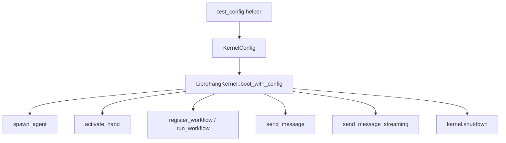

# Other — librefang-kernel-tests

# librefang-kernel-tests

Integration and end-to-end tests for the `librefang-kernel` crate. These tests exercise the kernel's major subsystems—agent spawning, hand lifecycle, WASM execution, workflow orchestration, and CLI tooling—against real infrastructure where possible.

## Test Files

| File | Scope | Requires LLM |
|------|-------|-------------|
| `integration_test.rs` | Basic agent spawn → message → response pipeline | Yes (`GROQ_API_KEY`) |
| `multi_agent_test.rs` | Hand lifecycle, state persistence, agent registry | No (mostly) |
| `wasm_agent_integration_test.rs` | WASM module loading, execution, fuel limits | No |
| `workflow_integration_test.rs` | Workflow registration, multi-step pipelines | Yes (one test) |
| `purge_sentinels_test.rs` | `purge_sentinels` CLI binary | No |

## Running

```bash
# All tests that don't need external services
cargo test -p librefang-kernel -- --nocapture

# Include live LLM integration tests
GROQ_API_KEY=gsk_... cargo test -p librefang-kernel -- --nocapture
```

Tests that require `GROQ_API_KEY` print a skip message and return early when the variable is unset—they never fail due to missing credentials.

## Architecture

Each test file follows the same pattern: construct a `KernelConfig` pointing at an isolated temp directory, boot the kernel, exercise a subsystem, assert invariants, then `kernel.shutdown()`.



## Test Coverage by Subsystem

### Agent Spawning and Messaging (`integration_test.rs`)

Two tests validate the core LLM pipeline:

- **`test_full_pipeline_with_groq`** — Boots the kernel, spawns a single agent from a TOML `AgentManifest`, sends a message via the Groq API, asserts the response is non-empty and token usage is reported, then kills the agent.
- **`test_multiple_agents_different_models`** — Spawns two agents configured with different Groq models (`llama-3.3-70b-versatile` and `llama-3.1-8b-instant`), sends each a message, verifies both respond independently.

Both use `test_config()` which creates a fresh temp directory under `$TMPDIR/librefang-integration-test` and configures the default model provider as `"groq"`.

### Hand Lifecycle (`multi_agent_test.rs`)

The largest test file. Covers the hand activation/deactivation system and its interaction with the agent registry.

**Test fixtures** are three hand TOML definitions:

- `HAND_A` (`test-clip`) — single-agent hand with tools `["file_read", "file_write", "shell_exec"]`
- `HAND_B` (`test-devops`) — single-agent hand with `["shell_exec"]`
- `HAND_C` (`test-research`) — multi-agent hand with `analyst` and `planner` roles, where `planner` is the explicit coordinator

**Lifecycle tests:**

| Test | What it verifies |
|------|-----------------|
| `test_activate_hand_spawns_agent` | Activation creates an agent in the registry |
| `test_deactivate_kills_agent` | Deactivation removes the agent from the registry |
| `test_pause_and_resume_hand` | Pause sets status to `"Paused"`, agent persists; resume restores `"Active"` |
| `test_deterministic_agent_id` | `AgentId::from_hand_agent("test-clip", "main", None)` matches the spawned ID |
| `test_deterministic_id_stable_across_reactivation` | Same hand+role produces the same agent ID after deactivate/reactivate |
| `test_explicit_coordinator_role_used_for_routes` | `HAND_C` routes resolve to the `planner` coordinator, not `main` |

**Metadata and inheritance:**

| Test | What it verifies |
|------|-----------------|
| `test_agent_tagged_with_hand_metadata` | Agent gets tags `"hand:test-clip"` and `"hand_instance:{uuid}"` |
| `test_hand_tools_applied_to_agent` | Agent manifest inherits the hand's tool list |
| `test_system_prompt_preserved` | Agent's system prompt contains the hand's prompt text |
| `test_default_provider_resolved_to_kernel_default` | `provider = "default"` is resolved to the actual kernel provider, not left as the string `"default"` |

**State persistence (`test_hand_state_persistence`):**

After activation, the kernel writes `hand_state.json` to `{data_dir}/`. The test asserts:

- Schema version is `4`
- Instance fields (`instance_id`, `status`, `activated_at`, `updated_at`) are typed strings
- `agent_ids` is a map from role names to `AgentId` strings
- `coordinator_role` is persisted for multi-agent hands (`test_multi_agent_hand_state_persists_coordinator_role`)

**Coexistence and isolation:**

- `test_multiple_hands_coexist` — Two hands can be active simultaneously with distinct agent IDs
- `test_deactivate_one_hand_preserves_other` — Deactivating one hand doesn't affect the other's agent
- `test_find_instance_by_agent_id` — `kernel.hands().find_by_agent(id)` reverse-lookups work

**Error cases:**

- `test_activate_nonexistent_hand_fails`
- `test_deactivate_nonexistent_instance_fails`
- `test_pause_nonexistent_instance_fails`
- `test_resume_nonexistent_instance_fails`

**Trigger migration (`test_reactivation_restores_triggers_to_original_roles`):**

Registers a trigger on the `analyst` role, deactivates the hand, reactivates it, and asserts the trigger stays attached to `analyst` and does not leak to `planner`. Validates that reactivation uses the legacy deterministic ID format so triggers survive.

**Live LLM test (`test_six_agent_fleet`):**

Spawns six agents (coder, researcher, writer, ops, analyst, hello-world) using two different Groq models, sends each a tailored prompt, asserts all responses are non-empty, and prints a fleet summary with aggregate token usage.

### WASM Agent Execution (`wasm_agent_integration_test.rs`)

Tests the `module = "wasm:..."` agent path using hand-written WAT (WebAssembly Text Format) modules. All tests are self-contained—no external services needed.

**WAT modules defined as string constants:**

| Constant | Behavior |
|----------|----------|
| `HELLO_WAT` | Returns fixed `{"response":"hello from wasm"}` from a data section |
| `ECHO_WAT` | Returns the input JSON as-is (ptr/len passthrough) |
| `INFINITE_LOOP_WAT` | Infinite `br` loop—tests fuel exhaustion |
| `HOST_CALL_PROXY_WAT` | Forwards input to the `librefang.host_call` import |

All modules export `memory`, `alloc` (bump allocator), and `execute` (returns `i64` with ptr in high 32 bits, len in low 32 bits).

**Tests:**

| Test | What it verifies |
|------|-----------------|
| `test_wasm_agent_hello_response` | Fixed-response module returns `"hello from wasm"` |
| `test_wasm_agent_echo` | Echo module's response contains the input message |
| `test_wasm_agent_fuel_exhaustion` | Infinite loop returns an error containing `"Fuel exhausted"` or `"fuel"` |
| `test_wasm_agent_missing_module` | Nonexistent `.wasm` file produces an error mentioning the filename |
| `test_wasm_agent_host_call_time` | Host-call proxy executes end-to-end through the kernel's host function dispatch |
| `test_wasm_agent_streaming_fallback` | `send_message_streaming` on a WASM agent produces at least 2 events (`TextDelta` + `ContentComplete`) and the final result matches the module output |
| `test_multiple_wasm_agents` | Two WASM agents coexist in the registry; both execute correctly |
| `test_mixed_wasm_and_llm_agents` | WASM and `builtin:chat` agents coexist; WASM agent executes while LLM agent is registered but not messaged |

All WASM tests use `#[tokio::test(flavor = "multi_thread")]` and configure `provider = "ollama"` / `model = "test"` since no real LLM is needed—the WASM runtime handles execution directly.

### Workflow Orchestration (`workflow_integration_test.rs`)

Tests the workflow engine: registration, agent resolution, run creation, and full multi-step execution.

**Kernel-level wiring (no LLM):**

- **`test_workflow_register_and_resolve`** — Spawns `agent-alpha` and `agent-beta`, creates a two-step `Workflow` with `StepAgent::ByName` references, calls `kernel.register_workflow()`, verifies `workflow_engine().list_workflows()` returns the registered workflow, asserts `agent_registry().find_by_name()` resolves correctly, and creates a run via `workflow_engine().create_run()`.
- **`test_workflow_agent_by_id`** — Creates a workflow referencing an agent by `StepAgent::ById` and verifies run creation succeeds.
- **`test_trigger_registration_with_kernel`** — Registers `TriggerPattern::Lifecycle` and `TriggerPattern::SystemKeyword` triggers on an agent, verifies `kernel.list_triggers()` returns both, filters by agent ID, and tests `kernel.remove_trigger()`.

**Full E2E with Groq (`test_workflow_e2e_with_groq`):**

1. Boots kernel with Groq config, calls `kernel.set_self_handle()`
2. Spawns `wf-analyst` and `wf-writer` agents
3. Creates a two-step sequential workflow: analyze → summarize, with Mustache-style `{{input}}` templates
4. Calls `kernel.run_workflow()` with input text
5. Asserts the workflow completes with `WorkflowRunState::Completed`
6. Verifies `step_results` has 2 entries with correct step names and positive token counts
7. Verifies `workflow_engine().list_runs()` returns 1 run

### Purge Sentinels CLI (`purge_sentinels_test.rs`)

Black-box tests for the `purge_sentinels` binary that removes whole-line sentinel markers (e.g., `NO_REPLY`, `[no reply needed]`) from markdown files.

Uses `env!("CARGO_BIN_EXE_purge_sentinels")` to locate the compiled binary and `tempfile::TempDir` for isolated fixtures.

**Fixture setup (`fixture_dir()`):**

Creates four files:
- `a.md` — contains `NO_REPLY` and `[no reply needed]` as whole lines
- `b.md` — `NO_REPLY` embedded mid-sentence (should be preserved)
- `c.md` — clean file
- `nested/d.md` — lowercase `no_reply` with whitespace

**Tests:**

| Test | Behavior |
|------|----------|
| `dry_run_reports_counts_and_touches_nothing` | `--dry-run` prints removed count but leaves all files unchanged, no `.bak` created |
| `apply_creates_backup_and_rewrites` | `--apply` creates `.bak` with original content, rewrites file without whole-line sentinels, leaves mid-sentence sentinels intact, skips clean files, recurses into subdirectories |
| `apply_is_idempotent` | Second `--apply` reports `removed=0` and leaves files/backups unchanged |
| `apply_aborts_when_existing_bak_differs` | Pre-seeded stale `.bak` causes non-zero exit with `"backup mismatch"` error; stale `.bak` is preserved |
| `nonexistent_path_exits_non_zero` | Invalid path produces error containing `"does not exist"` |

## Common Patterns

### Config Construction

Every test creates an isolated `KernelConfig`:

```rust
fn test_config(name: &str) -> KernelConfig {
    let tmp = std::env::temp_dir().join(format!("librefang-hand-test-{name}"));
    let _ = std::fs::remove_dir_all(&tmp);
    std::fs::create_dir_all(&tmp).unwrap();

    KernelConfig {
        home_dir: tmp.clone(),
        data_dir: tmp.join("data"),
        default_model: DefaultModelConfig { /* ... */ },
        ..KernelConfig::default()
    }
}
```

Each test uses a unique subdirectory name so tests can run in parallel without conflict.

### Hand Installation

```rust
fn install_hand(kernel: &LibreFangKernel, toml_content: &str) {
    kernel
        .hands()
        .install_from_content(toml_content, "")
        .unwrap_or_else(|e| panic!("Failed to install hand: {e}"));
}
```

### Conditional LLM Tests

```rust
if std::env::var("GROQ_API_KEY").is_err() {
    eprintln!("GROQ_API_KEY not set, skipping integration test");
    return;
}
```

### Cleanup

Every test calls `kernel.shutdown()` at the end. Temp directories are cleaned up when `TempDir` drops, or on the next test run via `remove_dir_all` in the config helper.

## Key API Surfaces Tested

| API | Tested In |
|-----|-----------|
| `LibreFangKernel::boot_with_config` | All kernel tests |
| `kernel.spawn_agent(manifest)` | `integration_test`, `wasm_*`, `workflow_*`, `multi_agent_test` (fleet) |
| `kernel.send_message(agent_id, msg)` | `integration_test`, `wasm_*` |
| `kernel.send_message_streaming(agent_id, msg, None)` | `wasm_agent_streaming_fallback` |
| `kernel.kill_agent(agent_id)` | `integration_test`, `wasm_*` |
| `kernel.activate_hand(id, params)` | `multi_agent_test` |
| `kernel.deactivate_hand(instance_id)` | `multi_agent_test` |
| `kernel.pause_hand(instance_id)` | `multi_agent_test` |
| `kernel.resume_hand(instance_id)` | `multi_agent_test` |
| `kernel.hands().install_from_content(...)` | `multi_agent_test` |
| `kernel.hands().get_instance(instance_id)` | `multi_agent_test` |
| `kernel.hands().find_by_agent(agent_id)` | `multi_agent_test` |
| `kernel.agent_registry().get(agent_id)` | All kernel tests |
| `kernel.agent_registry().find_by_name(name)` | `workflow_integration_test` |
| `kernel.agent_registry().count()` / `.list()` | `wasm_*`, `multi_agent_test` (fleet) |
| `kernel.register_workflow(workflow)` | `workflow_integration_test` |
| `kernel.run_workflow(wf_id, input)` | `workflow_integration_test` |
| `kernel.workflow_engine().list_workflows()` | `workflow_integration_test` |
| `kernel.workflow_engine().create_run(...)` / `.get_run(...)` / `.list_runs(...)` | `workflow_integration_test` |
| `kernel.register_trigger(...)` / `.list_triggers(...)` / `.remove_trigger(...)` | `workflow_integration_test`, `multi_agent_test` |
| `kernel.set_self_handle()` | `workflow_integration_test` (E2E) |