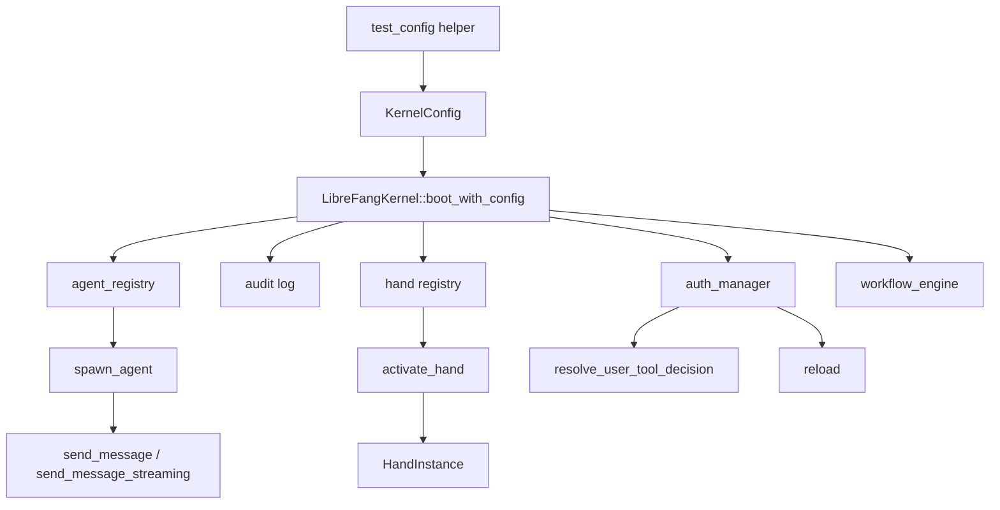

# Other — librefang-kernel-tests

# librefang-kernel-tests

Integration and end-to-end test suite for the `librefang-kernel` crate. These tests exercise the full kernel lifecycle—boot, agent management, tool policy enforcement, WASM execution, hand orchestration, workflow pipelines, audit retention, and CLI tooling—against real subsystems (no mocks for the kernel itself).

## Test Files Overview

| File | Scope | Requires LLM? |
|---|---|---|
| `integration_test.rs` | Kernel boot → agent spawn → Groq message round-trip | `GROQ_API_KEY` |
| `multi_agent_test.rs` | Hand lifecycle, settings, state persistence, fleet coexistence | No (live fleet test opt-in) |
| `rbac_m3_evaluate_tool_call.rs` | RBAC user-tool policy evaluation, role escalation, hot-reload | No |
| `wasm_agent_integration_test.rs` | WASM module loading, execution, fuel limits, host calls, streaming | No |
| `workflow_integration_test.rs` | Workflow registration, agent resolution, multi-step E2E pipeline | `GROQ_API_KEY` (opt-in) |
| `audit_retention_test.rs` | Periodic audit trim task, in-memory cap enforcement, self-audit row | No |
| `purge_sentinels_test.rs` | `purge_sentinels` CLI binary: dry-run, apply, idempotency, backup safety | No |

## Running

```bash
# All tests (LLM-dependent tests auto-skip without the key)
cargo test -p librefang-kernel

# Live LLM integration tests
GROQ_API_KEY=gsk_... cargo test -p librefang-kernel --test integration_test -- --nocapture

# Multi-threaded tests that require the multi_thread runtime
cargo test -p librefang-kernel --test audit_retention_test
cargo test -p librefang-kernel --test rbac_m3_evaluate_tool_call
```

Several tests use `#[tokio::test(flavor = "multi_thread")]` because `start_background_agents` and WASM execution paths call `tokio::task::block_in_place`, which panics on the default current-thread runtime.

## Test Architecture



All tests follow the same pattern: construct a `KernelConfig` pointing at a temporary directory, boot the kernel, exercise the API surface, assert invariants, then call `kernel.shutdown()`.

## integration_test.rs

Basic kernel lifecycle with live Groq API calls.

**`test_full_pipeline_with_groq`** — Boots the kernel, parses an `AgentManifest` from TOML, calls `spawn_agent`, sends a message via `send_message`, asserts the response is non-empty and token usage is reported, then kills the agent.

**`test_multiple_agents_different_models`** — Spawns two agents backed by different Groq models (`llama-3.3-70b-versatile` and `llama-3.1-8b-instant`), sends each a message, and verifies both respond independently.

Both tests return early if `GROQ_API_KEY` is unset.

## multi_agent_test.rs

Comprehensive hand-lifecycle coverage. A *hand* is a named, installable agent configuration that the kernel can activate, pause, deactivate, and re-activate with deterministic identity.

### Hand Definitions

Tests define hands as inline TOML strings installed via `kernel.hands().install_from_content()`. Three standard fixtures are used:

- **HAND_A** (`test-clip`) — single-agent hand with `tools = ["file_read", "file_write", "shell_exec"]`
- **HAND_B** (`test-devops`) — single-agent hand with `tools = ["shell_exec"]`
- **HAND_C** (`test-research`) — multi-agent hand with an explicit `coordinator = true` on the planner role

### Lifecycle Tests

| Test | What it verifies |
|---|---|
| `test_activate_hand_spawns_agent` | Activation creates an agent and registers it |
| `test_deterministic_agent_id` | `AgentId::from_hand_agent("test-clip", "main", None)` matches the spawned ID |
| `test_explicit_coordinator_role_used_for_routes` | When `coordinator = true` is set on a non-first agent, routing uses that role |
| `test_deterministic_id_stable_across_reactivation` | Deactivate → reactivate produces the same agent ID (legacy single-instance format) |
| `test_deactivate_kills_agent` | Agent removed from registry after deactivation |
| `test_pause_and_resume_hand` | Status transitions Active → Paused → Active; agent stays registered |
| `test_agent_tagged_with_hand_metadata` | Agent gets `hand:test-clip` and `hand_instance:<uuid>` tags |
| `test_hand_tools_applied_to_agent` | Agent capabilities inherit the hand's tool list |
| `test_system_prompt_preserved` | Agent manifest carries the hand's `system_prompt` |
| `test_default_provider_resolved_to_kernel_default` | `provider = "default"` sentinel is resolved at activation time |

### Error Cases

`test_activate_nonexistent_hand_fails`, `test_deactivate_nonexistent_instance_fails`, `test_pause_nonexistent_instance_fails`, `test_resume_nonexistent_instance_fails` — all assert `is_err()`.

### Settings and Schema Defaults

Uses `HAND_WITH_SETTINGS` which declares `[[settings]]` blocks with `verbosity` (select, default `"normal"`) and `max_concurrency` (text, default `"5"`).

- **`test_activation_seeds_schema_defaults_into_config`** — Empty user config gets filled from schema defaults; persisted to `hand_state.json`.
- **`test_activation_preserves_user_overrides_over_defaults`** — User-supplied values win over defaults; unset keys still get defaults.
- **`test_reactivation_backfills_missing_schema_keys`** — Simulates an older state file missing a key; re-activation backfills from current schema without clobbering existing values.

### State Persistence

**`test_hand_state_persistence`** — After activation, `data/hand_state.json` exists with version 5 format. Validates typed fields (`instance_id`, `status`, `activated_at`, `updated_at` as strings) and the `agent_ids` map.

**`test_multi_agent_hand_state_persists_coordinator_role`** — The `coordinator_role` field is persisted when a multi-agent hand is activated.

### Coexistence

- **`test_multiple_hands_coexist`** — Two hands activated simultaneously with distinct agent IDs.
- **`test_deactivate_one_hand_preserves_other`** — Killing one hand's agent doesn't affect the other.
- **`test_find_instance_by_agent_id`** — `kernel.hands().find_by_agent()` reverse-lookup works.

### Trigger Reactivation

**`test_reactivation_restores_triggers_to_original_roles`** — Registers a trigger on the analyst role, deactivates, reactivates. Verifies triggers stay attached to the correct role agent and don't leak to the coordinator.

### Live Fleet Test

**`test_six_agent_fleet`** — Requires `GROQ_API_KEY`. Spawns 6 agents (coder, researcher, writer, ops, analyst, hello-world) using two models, sends each a tailored prompt, verifies all respond with non-empty output, and reports aggregate token usage.

## rbac_m3_evaluate_tool_call.rs

End-to-end RBAC Phase 2 tests. Boots a real kernel with `[[users]]` and `tool_policy` configuration, then exercises `KernelHandle::resolve_user_tool_decision` through the trait object.

### Setup

The `boot()` helper creates a kernel with configurable `UserConfig` entries and `ToolGroup` definitions. The `user()` helper constructs a `UserConfig` with channel bindings and optional per-user `UserToolPolicy` / `UserToolCategories`.

### Decision Matrix Tests

| Test | User policy | Expected result |
|---|---|---|
| `evaluate_tool_call_user_deny_short_circuits` | `denied_tools: ["shell_exec"]` | `Deny` (user gate fires before agent capability) |
| `evaluate_tool_call_both_allow` | `allowed_tools: ["file_read"]` | `Allow` |
| `evaluate_tool_call_user_role_no_allow_list_needs_approval` | No policy, role=user | `NeedsApproval` (role escalation required) |
| `evaluate_tool_call_user_categories_resolve_against_kernel_groups` | `denied_groups: ["shell_tools"]` where group contains `shell_exec` | `Deny` for grouped tool, `Allow` for admin+other |
| `evaluate_tool_call_user_categories_allow_list_short_circuits_for_user_role` | `allowed_groups: ["read_only"]` | `Allow` for `file_read`, `Deny` for `shell_exec` |

### Security Regression Tests

- **`evaluate_tool_call_unrecognised_sender_no_longer_fail_open`** — H7 fix: unrecognised sender IDs route through the guest gate (read-only tools allowed, others need approval). Previously returned `Allow` unconditionally.
- **`evaluate_tool_call_trait_layer_none_sender_fails_closed`** — PR #3205: `(None, None)` sender/channel no longer sets `system_call=true`. Only `Some("cron")` retains the system-call escape hatch. Pseudo-channels like `"system"` fail closed.
- **`submit_tool_approval_hand_agent_force_human_skips_auto_approve`** — B3: `DeferredToolExecution.force_human=true` overrides the hand-agent auto-approve carve-out. Without `force_human`, hand-tagged agents auto-approve.

### Hot Reload

**`evaluate_tool_call_reload_picks_up_new_policy`** — Calls `kernel.auth_manager().reload()` with updated user policies and verifies the new deny rule takes effect immediately.

## wasm_agent_integration_test.rs

Tests real WASM module execution through the kernel. Modules are written as WAT (WebAssembly Text) and placed on disk for the kernel's `wasm:` module loader.

### Module Fixtures

| Constant | Behavior |
|---|---|
| `ECHO_WAT` | Returns input pointer/length as-is; kernel extracts JSON |
| `HELLO_WAT` | Returns fixed `{"response":"hello from wasm"}` at offset 0 |
| `INFINITE_LOOP_WAT` | Infinite `br` loop; triggers fuel exhaustion |
| `HOST_CALL_PROXY_WAT` | Forwards input to the `librefang.host_call` import |

Agents are spawned with `module = "wasm:<filename>"` in their TOML manifest.

### Test Cases

- **`test_wasm_agent_hello_response`** — Fixed-response module returns `"hello from wasm"`.
- **`test_wasm_agent_echo`** — Echo module includes the input message in its output.
- **`test_wasm_agent_fuel_exhaustion`** — Infinite loop fails with an error containing "Fuel exhausted" or "fuel".
- **`test_wasm_agent_missing_module`** — Nonexistent `.wat` file produces an error mentioning the file.
- **`test_wasm_agent_host_call_time`** — Proxy module exercises the `host_call` import end-to-end.
- **`test_wasm_agent_streaming_fallback`** — `send_message_streaming` returns at least 2 events (TextDelta + ContentComplete); final result matches the fixed response.
- **`test_multiple_wasm_agents`** — Two WASM agents (hello + echo) coexist with distinct results; registry reports 3 agents (2 WASM + default assistant).
- **`test_mixed_wasm_and_llm_agents`** — WASM and builtin:chat agents coexist; WASM agent executes while LLM agent is registered but not called.

## workflow_integration_test.rs

Tests the workflow engine's registration, agent resolution, and execution paths. Uses `#![recursion_limit = "256"]` due to deeply nested future types from the kernel → runtime → agent_loop call chain.

### Kernel-Level Wiring (No LLM)

- **`test_workflow_register_and_resolve`** — Registers a 2-step workflow with `StepAgent::ByName` references, verifies `find_by_name` resolution, creates a run, and checks the run record.
- **`test_workflow_agent_by_id`** — Workflow step references an agent directly by ID via `StepAgent::ById`.
- **`test_trigger_registration_with_kernel`** — Registers `Lifecycle` and `SystemKeyword` triggers, lists by agent, removes one, verifies remaining.

### E2E with Live LLM

**`test_workflow_e2e_with_groq`** — Requires `GROQ_API_KEY`. Spawns `wf-analyst` and `wf-writer` agents, creates a 2-step sequential pipeline (analyze → summarize), runs it, and asserts:
- Both steps produce output
- Token usage is reported for each step
- `WorkflowRunState::Completed`
- Step names match the definition
- Run appears in `list_runs()`

### Workflow Types Used

```
Workflow { id, name, description, steps, created_at, layout }
WorkflowStep { name, agent, prompt_template, mode, timeout_secs, error_mode, output_var, inherit_context, depends_on }
StepAgent::ByName { name } | StepAgent::ById { id }
StepMode::Sequential
ErrorMode::Fail
```

## audit_retention_test.rs

Verifies M7 audit retention: the periodic trim task fires and the self-audit `RetentionTrim` row is recorded.

**`test_kernel_boot_with_retention_config_starts_trim_task`** — Configures `AuditRetentionConfig` with `trim_interval_secs: 1` and `max_in_memory_entries: 10`. Seeds 50 audit entries via `audit.record()`, calls `start_background_agents()`, sleeps 2.5s, then asserts:

- Log length collapsed near the cap (≤ 20, accounting for the self-audit row and boot-time entries)
- At least one `AuditAction::RetentionTrim` entry exists
- `audit.verify_integrity()` still passes after trimming

The `max_in_memory_entries` cap path is used instead of per-action `retention_days_by_action` because the cap doesn't require manipulating internal timestamps.

## purge_sentinels_test.rs

Integration tests for the `purge_sentinels` CLI binary, discovered via `env!("CARGO_BIN_EXE_purge_sentinels")`.

### Fixture

`fixture_dir()` creates a temp directory with:
- `a.md` — contains whole-line `NO_REPLY` and `[no reply needed]` sentinels
- `b.md` — `NO_REPLY` embedded mid-sentence (should be preserved)
- `c.md` — clean file with no sentinels
- `nested/d.md` — lowercase `no_reply` with leading/trailing spaces

### Test Cases

| Test | Verifies |
|---|---|
| `dry_run_reports_counts_and_touches_nothing` | Reports `removed=3` lines, no file modifications, no `.bak` created |
| `apply_creates_backup_and_rewrites` | `.bak` matches original; sentinels removed from `a.md` and `nested/d.md`; `b.md` unchanged (mid-sentence); `c.md` untouched (no `.bak`) |
| `apply_is_idempotent` | Second run reports `removed=0`; files and backups unchanged |
| `apply_aborts_when_existing_bak_differs` | Pre-seeded stale `.bak` causes non-zero exit with "backup mismatch" error; stale `.bak` preserved |
| `nonexistent_path_exits_non_zero` | Invalid path produces stderr containing "does not exist" |

The binary only removes *whole-line* sentinels (case-insensitive, whitespace-trimmed). Sentence-embedded occurrences like `b.md`'s `"I said NO_REPLY yesterday"` are preserved.

## Common Patterns

### Temporary Directories

Every test creates an isolated temp directory under `$TMP/librefang-<test-name>-<suffix>`. The directory is cleaned up before each run (`remove_dir_all` + `create_dir_all`) to prevent cross-test contamination.

### Kernel Lifecycle

```rust
let config = test_config("unique-name");
let kernel = LibreFangKernel::boot_with_config(config).expect("kernel boots");
// ... exercise kernel APIs ...
kernel.shutdown();
```

`shutdown()` is always called to flush state and release resources. Tests that need `Arc<Kernel>` wrap it explicitly.

### Conditional LLM Tests

Tests requiring live LLM access follow the pattern:

```rust
if std::env::var("GROQ_API_KEY").is_err() {
    eprintln!("GROQ_API_KEY not set, skipping integration test");
    return;
}
```

This allows the full suite to run in CI without API keys while still supporting manual live testing.