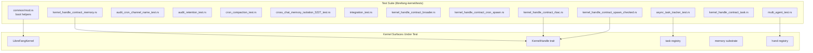

# Other — librefang-kernel-tests

# librefang-kernel-tests

Integration test suite for `librefang-kernel`. Exercises the kernel's public APIs — boot, agent lifecycle, messaging, async tasks, memory, RBAC, cron compaction, hand management, and workflow integration — without requiring a full production runtime.

## Architecture


```mermaid
graph TD
    subgraph "Test Suite (librefang-kernel/tests)"
        COMMON["common/mod.rs<br/>boot helpers"]
        ASYNC["async_task_tracker_test.rs"]
        AUDIT_CH["audit_cron_channel_name_test.rs"]
        AUDIT_RET["audit_retention_test.rs"]
        COMPACT["cron_compaction_test.rs"]
        MEM_ISO["cross_chat_memory_isolation_5227_test.rs"]
        INTEGRATION["integration_test.rs"]
        KH_BROADER["kernel_handle_contract_broader.rs"]
        KH_CRON["kernel_handle_contract_cron_spawn.rs"]
        KH_MEM["kernel_handle_contract_memory.rs"]
        KH_RBAC["kernel_handle_contract_rbac.rs"]
        KH_SPAWN["kernel_handle_contract_spawn_checked.rs"]
        KH_TASK["kernel_handle_contract_task.rs"]
        MULTI["multi_agent_test.rs"]
    end

    subgraph "Kernel Surfaces Under Test"
        KERNEL["LibreFangKernel"]
        HANDLE["KernelHandle trait"]
        TASK_REG["task registry"]
        MEMORY["memory substrate"]
        HANDS["hand registry"]
    end

    COMMON --> KERNEL
    ASYNC --> TASK_REG
    KH_MEM --> HANDLE
    KH_RBAC --> HANDLE
    KH_SPAWN --> HANDLE
    MULTI --> HANDS
```

## Common Utilities

**`common/mod.rs`** provides shared boot helpers:

- `boot_kernel()` — Boots a `LibreFangKernel` with a temp directory, network disabled, and an in-memory SQLite store. Returns `(LibreFangKernel, TempDir)`.
- `boot_kernel_with_users(users)` — Same as above but seeds `UserConfig` entries (used by RBAC contract tests).

Most test files in this crate define their own `test_config(name)` helper that creates an isolated temp directory per test. The `common/mod.rs` helpers are consumed by the `kernel_handle_contract_*` files via `mod common;`.

## Test Domains

### Async Task Tracker (`async_task_tracker_test.rs`)

Tests the `register_async_task` / `complete_async_task` lifecycle. Covers:

| Test | Contract |
|------|----------|
| `register_inserts_into_registry_and_returns_handle` | Registration inserts into the registry and the handle is lookable-up via `lookup_async_task` |
| `complete_workflow_task_injects_signal_into_originating_session` | Workflow completion injects `AgentLoopSignal::TaskCompleted` into the originating session's injection channel and removes the registry entry |
| `complete_delegation_task_injects_signal_with_delegation_kind` | Delegation completion carries the correct `TaskKind::Delegation` and status through the signal |
| `complete_with_no_attached_receiver_still_removes_entry` | Delete-on-delivery contract: entry is removed even when no receiver is attached (`self_handle` unset → `Ok(false)`) |
| `wake_idle_path_returns_true_when_self_handle_is_set` | With `set_self_handle`, the wake-idle path spawns a turn and returns `Ok(true)` |
| `double_completion_is_a_noop_on_second_call` | Idempotency: second `complete_async_task` returns `Ok(false)`, no duplicate signal |
| `complete_unknown_task_id_returns_ok_false` | Unknown IDs return `Ok(false)` without panicking |
| `register_dedupes_workflow_kind_against_existing_run_id` | Same `TaskKind::Workflow { run_id }` returns the existing handle |
| `register_dedupes_delegation_kind_against_existing_target_and_hash` | Same `(target, prompt_hash)` returns the existing handle |
| `register_does_not_dedupe_distinct_delegations_to_same_target` | Different `prompt_hash` values produce distinct task IDs |
| `register_dedupe_is_cross_session_for_delegation_kind` | Dedupe is structural on `kind` — cross-session callers sharing `(target, prompt_hash)` get the same handle; completion routes to the first caller's session only |
| `complete_falls_through_to_wake_idle_when_injection_channel_is_full` | `Backpressure(Full)` on the injection channel falls through to the wake-idle spawn path rather than returning an error |
| `recovery_synthesizes_failed_event_for_matching_pending_workflow` | `synthesize_task_failures_for_recovered_runs` drains matching entries and injects a `Failed("workflow run interrupted by daemon restart")` signal |

Key helper: `attach_injection_receiver` manually wires an `mpsc::channel` into the kernel's `injection_senders_ref()` map so tests can receive `AgentLoopSignal` values without going through the agent loop.

### Audit: Channel Name Reservation (`audit_cron_channel_name_test.rs`)

Regression test for a security audit issue where external callers could pass `channel = "cron"` and collide with the kernel's internal cron session. The fix applies `sanitize_channel_name` at every external ingress point, renaming reserved names to `ext-<name>`.

Tests assert:
- External variants of `"cron"`, `"autonomous"`, `"webui"` (case-insensitive, with whitespace) never derive the same `SessionId` as the internal path
- The sanitizer only renames reserved names; benign channels pass through unchanged
- Sanitized external channels are stable across invocations (two external adapters sharing the same reserved name land on the same `ext-` session)

### Audit: Retention Trimming (`audit_retention_test.rs`)

Tests that `start_background_agents()` spawns the periodic trim task and the self-audit `RetentionTrim` row is recorded when a trim cycle drops entries. Uses a `trim_interval_secs = 1` and `max_in_memory_entries = 10` with 50 seeded entries, then waits ~2.5s for the periodic task to fire.

Requires `#![recursion_limit = "256"]` because `start_background_agents()` spawns many closures whose combined async-block layouts exceed the default limit.

### Cron Session Compaction (`cron_compaction_test.rs`)

Tests the `try_summarize_trim` logic through the `librefang_runtime::compactor` surface:

- **Successful LLM summarization**: `compact_session` with a `FakeDriver` produces a non-empty summary with `used_fallback = false`. The output is `[summary_msg] + kept_tail`.
- **LLM failure fallback**: A `FailingDriver` causes `compact_session` to return `Ok(result)` with `used_fallback = true` (not an `Err`). The kernel checks `!result.used_fallback` to reject these.
- **Tool pair integrity**: `adjust_split_for_tool_pair` shifts the split point so an `Assistant{ToolUse}` / `User{ToolResult}` pair is never separated across the summary/tail boundary.

### Cross-Chat Memory Isolation (`cross_chat_memory_isolation_5227_test.rs`)

Regression test for #5227 where memories extracted in a WhatsApp group chat bled into a 1:1 DM. Tests verify:

- `SessionId::for_sender_scope` produces distinct session IDs for DM vs group of the same peer
- `ProactiveMemoryHooks::auto_memorize` stamps every stored memory with `CHAT_SCOPE_METADATA_KEY` matching the originating channel
- Unscoped callers (`chat_scope = None`) retain legacy recall behavior — no filtering
- `compose_sender_scope` formula matches `for_sender_scope` for WhatsApp (pre-qualified), Telegram/Slack/Discord (bare channel + chat_id), and empty chat_id shapes

### Live LLM Integration (`integration_test.rs`)

Full pipeline tests that require `GROQ_API_KEY`. Marked `#[ignore]`. Tests:
- Boot → spawn agent → send message → receive response → kill agent
- Multiple agents with different models running concurrently

### KernelHandle Contract Tests

A family of test files exercising the `KernelHandle` trait (from `librefang-kernel-handle`), which is the stable API surface consumed by adapters and the HTTP layer.

#### `kernel_handle_contract_broader.rs`

General `KernelHandle` methods:
- Roster upsert/remove/members round-trip
- `goal_list_active` returns empty by default
- `list_a2a_agents` / `get_a2a_agent_url` defaults
- `kill_agent` on unknown ID returns error
- `publish_event` succeeds

#### `kernel_handle_contract_cron_spawn.rs`

Cron job creation and agent spawning:
- `cron_create` preserves `peer_id` and omits it when not provided
- `spawn_agent` returns valid identity and the agent appears in `list_agents`
- `find_agents` matches by name

#### `kernel_handle_contract_memory.rs`

Memory subsystem isolation, security, and validation:

**Isolation**: Per-agent writes are invisible to other agents. Peer-scoped keys are isolated per peer. Global (agent_id=None) namespace is independent.

**Security (#5119 / #5120)**:
- `peer:`-prefixed keys are rejected at the boundary (prevents LLM-planted rows surfacing in victim's namespace)
- Colon-bearing `peer_id` values (e.g. Slack-style `"T1:U2"`) are rejected
- Empty `peer_id` is rejected (prevents ambiguous `peer::{key}` collision)
- Pre-fix planted rows are not enumerable via `memory_list` (round-trip guard)
- Empty keys are rejected (#5138)
- Oversized values (>256 KiB) are rejected (#5138)

**Concurrency (#5138)**: `test_concurrent_goal_update_loses_no_writes_5138` verifies that concurrent `goal_update` calls using `structured_modify` don't lose writes (fixes a prior get→mutate→set race).

#### `kernel_handle_contract_rbac.rs`

RBAC policy resolution:
- Unconfigured users default-allow (guest mode)
- Tool deny and memory ACL policies match on `(sender_id, channel_binding)` — wrong channel doesn't match
- `requires_approval_with_context` delegates to `requires_approval`

#### `kernel_handle_contract_spawn_checked.rs`

Capability-checked spawning:
- `spawn_agent_checked` succeeds with empty parent caps
- Parent ID is tracked
- Capability escalation (child requesting `shell_exec` when parent only has `FileRead`) is rejected

#### `kernel_handle_contract_task.rs`

Task lifecycle:
- `task_post` preserves `assigned_to` and `created_by`
- `task_claim` returns the assigned task
- `task_complete` updates status to `"completed"`
- Unassigned tasks have null/empty fields

### Multi-Agent / Hand Lifecycle (`multi_agent_test.rs`)

Comprehensive tests for the hand system (preconfigured agent templates):

**Lifecycle**: `activate_hand` → spawns agent → `deactivate_hand` → kills agent. `pause_hand` / `resume_hand` change status without killing.

**Deterministic IDs**: `AgentId::from_hand_agent(hand_id, role, instance_id)` produces stable IDs. Single-instance activations use legacy format (same ID on reactivation).

**Coordinator roles**: Multi-agent hands with an explicit `[agents.planner] coordinator = true` route through the coordinator role, not the default "main".

**Agent metadata**: Spawned agents are tagged with `hand:<hand_id>` and `hand_instance:<uuid>`.

**Tool inheritance**: Hand-defined tools are applied to the spawned agent's capabilities.

**Settings**: `[[settings]]` blocks with `default` values are seeded into the instance config on activation. User overrides take precedence over schema defaults.

**State persistence**: Hand state is written to `hand_state.json` (version 5 format) with typed fields (`instance_id`, `status`, `activated_at`, `agent_ids` map, `coordinator_role`).

**Triggers**: Hand trigger patterns survive reactivation and are restored to original roles.

**Coexistence**: Multiple hands can be active simultaneously.

## Running the Tests

```bash
# All unit-style tests (no API keys needed)
cargo test -p librefang-kernel

# Live LLM integration tests (requires API key)
GROQ_API_KEY=gsk_... cargo test -p librefang-kernel --test integration_test -- --nocapture --ignored

# Specific test domain
cargo test -p librefang-kernel --test async_task_tracker_test
cargo test -p librefang-kernel --test kernel_handle_contract_memory
```

Most tests require `#[tokio::test(flavor = "multi_thread")]` because the kernel spawns blocking tasks internally via `tokio::task::block_in_place`.

## Recursion Limit

Several test files set `#![recursion_limit = "256"]`. This is required because `send_message_full` and `start_background_agents` nest deeply monomorphized async closures that exceed the compiler's default limit of 128. The crate root (`librefang-kernel/src/lib.rs`) sets the same limit.