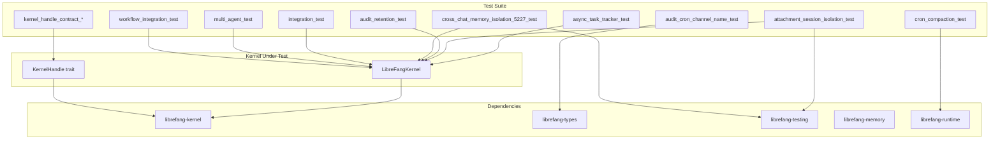

# Other — librefang-kernel-tests

# librefang-kernel-tests

Integration and regression test suite for the `librefang-kernel` crate. Tests exercise the kernel's public API surface—agent lifecycle, messaging, memory isolation, async task tracking, RBAC, cron scheduling, session compaction, and workflow wiring—without requiring a full production deployment. Most tests boot a real `LibreFangKernel` against a temporary directory with a stub model provider; a handful of end-to-end tests require a live `GROQ_API_KEY` and are marked `#[ignore]`.

## Architecture


```mermaid
graph TD
    subgraph "Test Suite"
        A[async_task_tracker_test]
        B[attachment_session_isolation_test]
        C[audit_cron_channel_name_test]
        D[audit_retention_test]
        E[cron_compaction_test]
        F[cross_chat_memory_isolation_5227_test]
        G[integration_test]
        H[kernel_handle_contract_*]
        I[multi_agent_test]
        J[workflow_integration_test]
    end

    subgraph "Kernel Under Test"
        K[LibreFangKernel]
        L[KernelHandle trait]
    end

    subgraph "Dependencies"
        M[librefang-kernel]
        N[librefang-types]
        O[librefang-testing]
        P[librefang-memory]
        Q[librefang-runtime]
    end

    A --> K
    B --> K
    D --> K
    E --> Q
    F --> K
    G --> K
    H --> L
    I --> K
    J --> K
    K --> M
    L --> M
    B --> O
    F --> O
    C --> N
```

## Shared Infrastructure

### `common/mod.rs`

Provides two boot helpers used across multiple contract tests:

- **`boot_kernel()`** — Boots a `LibreFangKernel` with an empty user list, network disabled, and a SQLite database in a temporary directory. Returns `(LibreFangKernel, TempDir)`.
- **`boot_kernel_with_users(users)`** — Same as above but pre-registers the given `UserConfig` entries (used by RBAC tests).

Both helpers create the required directory skeleton (`data/`, `skills/`, `workspaces/agents/`, `workspaces/hands/`) and clean up on drop via `tempfile::TempDir`.

### Per-test `test_config(name)`

Several test files (especially `async_task_tracker_test.rs`, `multi_agent_test.rs`, `integration_test.rs`) define a local `test_config` helper that builds a `KernelConfig` pointing at an isolated temp directory. The config uses `groq` / `llama-3.3-70b-versatile` as the default model so that live tests can run, but stub tests work without it because no actual LLM call is made.

### `MockKernelBuilder` (from `librefang-testing`)

Used by `attachment_session_isolation_test.rs` and `cross_chat_memory_isolation_5227_test.rs`. Wraps kernel boot with a builder pattern that accepts a config closure, returning `(Arc<LibreFangKernel>, TempDir)`.

## Test Files

### `async_task_tracker_test.rs`

Validates the `register_async_task` / `complete_async_task` lifecycle introduced in step 2 of the async task tracker (#4983). Tests cover:

| Test | What it asserts |
|------|----------------|
| `register_inserts_into_registry_and_returns_handle` | Registration inserts into the registry and returns a lookup-capable handle |
| `complete_workflow_task_injects_signal_into_originating_session` | Workflow completion injects `AgentLoopSignal::TaskCompleted` into the originating session's injection channel and removes the registry entry |
| `complete_delegation_task_injects_signal_with_delegation_kind` | Delegation completion carries the correct `TaskKind::Delegation` and status through the signal |
| `complete_with_no_attached_receiver_still_removes_entry` | When no receiver is attached and `self_handle` is unset, completion returns `Ok(false)` but still drains the registry entry (delete-on-delivery contract) |
| `wake_idle_path_returns_true_when_self_handle_is_set` | With `set_self_handle()` called, the wake-idle path spawns a turn and returns `Ok(true)` |
| `double_completion_is_a_noop_on_second_call` | Idempotency: second completion returns `Ok(false)`, no duplicate signal injected |
| `complete_unknown_task_id_returns_ok_false` | Unknown task ID returns `Ok(false)` without panic |
| `register_dedupes_workflow_kind_against_existing_run_id` | Same `WorkflowRunId` returns the same handle (#5033) |
| `register_dedupes_delegation_kind_against_existing_target_and_hash` | Same `(agent_id, prompt_hash)` returns the same handle |
| `register_does_not_dedupe_distinct_delegations_to_same_target` | Different `prompt_hash` for the same target produces distinct handles |
| `register_dedupe_is_cross_session_for_delegation_kind` | Dedupe is structural on `TaskKind`—two sessions registering the same delegation share one handle; completion routes to the first caller's session only |
| `complete_falls_through_to_wake_idle_when_injection_channel_is_full` | Backpressure on the injection channel falls through to the wake-idle spawn path |
| `recovery_synthesizes_failed_event_for_matching_pending_workflow` | `synthesize_task_failures_for_recovered_runs` drains matching registry entries and injects `TaskStatus::Failed("workflow run interrupted by daemon restart")` |
| `recovery_noop_when_no_pending_task_matches_recovered_run` | Recovery is a no-op when no registry entry matches |

Key helper: **`attach_injection_receiver`** manually wires an `mpsc::channel` into the kernel's `injection_senders` map for a given `(agent_id, session_id)`, letting the test act as the receiver without going through the full agent loop.

### `attachment_session_isolation_test.rs`

Regression test for the 2026-05-20 cross-chat attachment leak. The bug: `inject_attachment_blocks` wrote into the agent's persistent registry session (`entry.session_id`) instead of the explicitly requested session, causing a DM image to appear in a group chat's history.

**Fix pinned:** `SessionWriter::inject_attachment_blocks` now requires an explicit `session_id` parameter. The test:

1. Spawns an agent and snapshots its registry session ID.
2. Derives a DM-scoped session ID via `SessionId::for_sender_scope`.
3. Asserts the two differ.
4. Calls `inject_attachment_blocks` with the DM session.
5. Asserts the DM session has 1 message and the registry session has 0.

A second test verifies two different chat scopes produce two independent sessions, each containing only its own attachment.

### `audit_cron_channel_name_test.rs`

Regression test for the `cron` channel name collision audit issue. External callers could pass `channel = "cron"` and derive the same `SessionId` as the kernel-internal cron dispatcher, causing interleaved history.

**Fix pinned:** `sanitize_channel_name` from `librefang_channels::types` rewrites reserved names to `ext-<name>` at every external ingress point. Tests verify:

- `"cron"`, `"CRON"`, `"  cron  "` all sanitize to `"ext-cron"` and derive a session ID disjoint from the internal `SessionId::for_channel(agent, "cron")`.
- Same for `"autonomous"` and `"webui"`.
- Non-reserved names (`"telegram"`, `"slack"`, etc.) pass through unchanged.
- Sanitization is stable across invocations (two external adapters sharing `"CRON"` land on the same external session).

### `audit_retention_test.rs`

Tests that kernel boot wires the periodic audit-log trim task and that a `RetentionTrim` self-audit row lands when a trim cycle drops entries. Seeds 50 audit entries against a `max_in_memory_entries = 10` cap, calls `start_background_agents()`, waits 2.5 seconds for the 1-second trim interval to fire, then asserts the log length collapsed near the cap and a `RetentionTrim` action is present. Verifies hash-chain integrity after trim.

Requires `#![recursion_limit = "256"]` due to the complex async closure layouts in `start_background_agents()`.

### `cron_compaction_test.rs`

Integration tests for cron session compaction (`SummarizeTrim` mode, #3693). Uses fake LLM drivers:

- **`FakeDriver`** — Returns a canned summary string. Tests that `compact_session` produces a summary + tail with `used_fallback = false`.
- **`FailingDriver`** — Always returns `LlmError::Http`. Tests that the kernel correctly detects `used_fallback = true` and falls back to plain prune (M4 fix).
- **`adjust_split_for_tool_pair`** — Tests that the split boundary never cuts between an `Assistant{ToolUse}` and its matching `User{ToolResult}`, shifting the split past the ToolResult when necessary.

### `cross_chat_memory_isolation_5227_test.rs`

Regression test for #5227—cross-chat memory bleed via `auto_memorize` + `auto_retrieve`. A memory extracted in a WhatsApp group appeared in a DM's `auto_retrieve` results.

Tests at the kernel boundary:

- **Session isolation** — `SessionId::for_sender_scope` produces distinct IDs for DM vs. group of the same peer.
- **Chat-scope stamping** — `ProactiveMemoryHooks::auto_memorize` stamps `CHAT_SCOPE_METADATA_KEY` onto every stored memory matching the caller's channel.
- **Legacy compatibility** — Unscoped callers (`chat_scope = None`) see all memories (filter is a no-op).
- **Formula consistency** — `compose_sender_scope` and `SessionId::for_sender_scope` agree on the composition formula for all adapter shapes: WhatsApp (pre-qualified channel), Telegram/Slack/Discord (bare channel + chat_id), empty chat_id, and empty channel.

### `integration_test.rs`

Full end-to-end pipeline tests that require a live `GROQ_API_KEY`. Marked `#[ignore]`.

- **`test_full_pipeline_with_groq`** — Boots kernel, spawns an agent, sends a message, asserts non-empty response and positive token usage, then kills the agent.
- **`test_multiple_agents_different_models`** — Spawns two agents with different models (llama-3.3-70b vs llama-3.1-8b-instant), sends messages to both, asserts both respond.

### `kernel_handle_contract_*.rs`

Contract tests for the `KernelHandle` trait (`librefang-kernel-handle`), exercising the kernel through its stable public interface.

#### `kernel_handle_contract_broader.rs`

- Roster upsert/remove/members round-trip.
- Goal list returns empty by default.
- A2A agent list and URL lookup return empty/None by default.
- Killing a nonexistent agent returns an error.
- `publish_event` succeeds.

#### `kernel_handle_contract_cron_spawn.rs`

- `cron_create` preserves `peer_id` in the stored job; absent `peer_id` stores `null`.
- `spawn_agent` returns a non-empty ID matching the manifest name.
- `list_agents` and `find_agents` reflect spawned agent metadata.

#### `kernel_handle_contract_memory.rs`

Comprehensive memory isolation and security tests:

- **Per-agent isolation** — Agents A and B writing the same key see only their own values.
- **Cross-agent prevention** — Agent B cannot read Agent A's data.
- **Peer scoping** — `peer_id` further partitions the key space within an agent.
- **Shared namespace** — `agent_id = None` writes to a global namespace independent of agent namespaces.
- **Legacy fallback** — Per-agent recall falls back to the shared namespace when the agent has no own value.

Security regressions (#5119, #5120, #5138):

- **`peer:` prefix keys** — Rejected on store and recall; planted pre-fix rows are not enumerable via `memory_list`.
- **Colon-bearing `peer_id`** — Rejected to prevent namespace collision attacks.
- **Empty `peer_id`** — Rejected to prevent ambiguous `peer::key` rows.
- **Empty keys** — Rejected to prevent nameless entries.
- **Oversized values** — Rejected at the substrate boundary (>256 KiB).
- **Concurrent goal updates** — `structured_modify` (atomic RMW) prevents lost updates under concurrent writes to `__librefang_goals`.

#### `kernel_handle_contract_rbac.rs`

- Default-allow for unconfigured users (guest mode).
- Sender + channel binding lookup resolves the correct `UserToolPolicy` and `UserMemoryAccess`.
- Wrong channel or unknown sender falls back to guest behavior.
- `requires_approval_with_context` delegates to `requires_approval`.

#### `kernel_handle_contract_spawn_checked.rs`

- `spawn_agent_checked` succeeds with empty parent capabilities.
- Parent ID is passed through and the child appears in `list_agents`.
- Capability escalation is rejected: a child requesting `shell_exec` when the parent only has `FileRead` fails with an error mentioning escalation/denial.

#### `kernel_handle_contract_task.rs`

- `task_post` preserves `assigned_to` and `created_by`.
- `task_claim` returns the assigned task.
- `task_complete` updates status to `"completed"` with the result.
- Tasks with no assignment store null/empty for both fields.

### `multi_agent_test.rs`

Hand lifecycle tests covering activation, deactivation, pause/resume, deterministic IDs, agent tagging, tool inheritance, state persistence, and multi-agent coexistence.

Key behaviors tested:

- **`activate_hand`** spawns agents and registers them in the kernel's agent registry.
- **Deterministic agent IDs** — `AgentId::from_hand_agent("test-clip", "main", None)` produces the same ID across reactivations (legacy single-instance format).
- **Explicit coordinator roles** — A hand defining `[agents.planner] coordinator = true` routes through the planner role, not the default "main".
- **Deactivation kills agents** — The agent is removed from the registry on `deactivate_hand`.
- **Pause/resume** — Paused agents remain in the registry; status toggles between `"Paused"` and `"Active"`.
- **Agent tagging** — Spawned agents carry hand metadata in their registry entries.
- **Coexistence** — Multiple hands can be active simultaneously; deactivating one does not affect the other.
- **User overrides** — Runtime parameters passed to `activate_hand` override the hand definition's defaults.

Requires `#![recursion_limit = "256"]` due to `send_message_full`'s deeply nested async block layouts.

## Running the Tests

```bash
# All tests (no external API calls)
cargo test -p librefang-kernel

# Live LLM integration tests (requires API key)
GROQ_API_KEY=gsk_... cargo test -p librefang-kernel --test integration_test -- --nocapture --ignored

# Single test file
cargo test -p librefang-kernel --test async_task_tracker_test
```

Tests that need `tokio::block_in_place` (e.g., `audit_retention_test`, most kernel boot tests) require `#[tokio::test(flavor = "multi_thread")]`. The current-thread runtime will panic at kernel internals that use blocking file I/O.