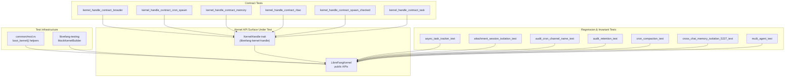

# Other — librefang-kernel-tests

# librefang-kernel-tests

Integration and contract tests for the `librefang-kernel` crate. These tests exercise the kernel's public APIs, trait boundaries, and cross-subsystem invariants without requiring a running server or (in most cases) a live LLM provider.

## Architecture


```mermaid
graph TD
    subgraph "Test Infrastructure"
        COMMON["common/mod.rs<br/>boot_kernel() helpers"]
        MOCK["librefang-testing<br/>MockKernelBuilder"]
    end

    subgraph "Kernel API Surface Under Test"
        KH["KernelHandle trait<br/>(librefang-kernel-handle)"]
        KAPI["LibreFangKernel<br/>public APIs"]
    end

    subgraph "Contract Tests"
        BROADER["kernel_handle_contract_broader"]
        CRON_SPAWN["kernel_handle_contract_cron_spawn"]
        MEMORY["kernel_handle_contract_memory"]
        RBAC["kernel_handle_contract_rbac"]
        SPAWN_CHK["kernel_handle_contract_spawn_checked"]
        TASK["kernel_handle_contract_task"]
    end

    subgraph "Regression & Invariant Tests"
        ASYNC["async_task_tracker_test"]
        ATTACH["attachment_session_isolation_test"]
        CHANNEL["audit_cron_channel_name_test"]
        RETENTION["audit_retention_test"]
        COMPACT["cron_compaction_test"]
        XCHAT["cross_chat_memory_isolation_5227_test"]
        MULTI["multi_agent_test"]
    end

    COMMON --> KAPI
    MOCK --> KAPI
    KH --> KAPI

    BROADER --> KH
    CRON_SPAWN --> KH
    MEMORY --> KH
    RBAC --> KH
    SPAWN_CHK --> KH
    TASK --> KH

    ASYNC --> KAPI
    ATTACH --> KAPI
    CHANNEL --> KAPI
    RETENTION --> KAPI
    COMPACT --> KAPI
    XCHAT --> KAPI
    MULTI --> KAPI
```

## Test Categories

### Contract Tests (`kernel_handle_contract_*.rs`)

These validate the `KernelHandle` trait from `librefang-kernel-handle` — the primary abstraction layer that API routes and external consumers use to interact with the kernel. Each file targets a specific subsystem.

#### Broader (`kernel_handle_contract_broader.rs`)

General trait methods: roster management, goals, A2A agents, event publishing.

| Test | What it validates |
|---|---|
| `test_roster_roundtrip` | `roster_upsert` → `roster_members` → `roster_remove_member` cycle |
| `test_goal_list_active_default_empty` | Empty kernel returns no goals |
| `test_list_a2a_agents_default_empty` | No A2A agents before registration |
| `test_get_a2a_agent_url_default_none` | Unknown agent returns `None` |
| `test_kill_agent_unknown_returns_error` | Killing nonexistent agent is an error |
| `test_publish_event_succeeds` | Event bus accepts arbitrary events |

#### Memory (`kernel_handle_contract_memory.rs`)

Per-agent memory isolation, peer-scoped namespaces, input validation, and concurrent write safety. This is the largest contract test file.

**Isolation guarantees:**

- Each `(agent_id, peer_id)` tuple addresses an independent namespace
- Cross-agent reads are blocked — agent B cannot recall keys written by agent A
- `memory_list` only enumerates keys within the caller's scope
- A shared (no-agent) namespace exists for backward compatibility, and per-agent recall falls back to it

**Security hardening (#5119 / #5120):**

| Threat | Guard |
|---|---|
| `peer:`-prefixed keys | Rejected on store and recall — prevents LLM tools from planting rows that surface in another peer's `memory_list` |
| Colon-bearing `peer_id` (e.g. `"T1:U2"`) | Rejected on store/recall/list — prevents `peer:T1:U2:key` from being stripped as if peer `T1` owns it |
| Empty `peer_id` | Rejected — would produce ambiguous `peer::key` rows |
| Empty key | Rejected on store/recall (#5138) |
| Oversized values (>256 KiB) | Rejected on store (#5138) |

**Concurrency (#5138):**

`test_concurrent_goal_update_loses_no_writes_5138` proves that concurrent `goal_update` calls on different goals within the same `__librefang_goals` JSON array don't lose writes. This validates the transactional `structured_modify` RMW primitive replaced the earlier non-atomic get→mutate→set pattern.

**Side-effect assertions:** Security tests don't just check the returned error — they also verify the target victim namespace is empty after the rejected operation, proving the guard prevents silent data leakage.

#### RBAC (`kernel_handle_contract_rbac.rs`)

Tests the `resolve_user_tool_decision` and `memory_acl_for_sender` methods that enforce per-user tool and memory policies.

Key behaviors:

- Unconfigured kernels default-allow all tools (guest mode)
- User policies are bound to `(sender_id, channel)` — the same sender ID on different channels gets different policies
- Unknown senders get the guest gate, not a registered user's policy
- `requires_approval_with_context` delegates to `requires_approval` (no context-aware override by default)

#### Spawn Checked (`kernel_handle_contract_spawn_checked.rs`)

Validates `spawn_agent_checked`, which enforces capability boundaries when agents create child agents:

- A parent can spawn children with no capabilities
- Parent capabilities (e.g. `FileRead("/data/*")`) are passed through
- Capability escalation is rejected — a child requesting `shell_exec` when the parent only has `FileRead` fails with an error mentioning "escalation" or "capability"

#### Task (`kernel_handle_contract_task.rs`)

Basic task lifecycle: `task_post` → `task_claim` → `task_complete`. Validates that `assigned_to` and `created_by` are preserved through the pipeline, and that unassigned tasks have null fields.

#### Cron & Spawn (`kernel_handle_contract_cron_spawn.rs`)

- `cron_create` preserves `peer_id` through the round-trip
- `cron_list` returns created jobs with correct fields
- `spawn_agent` returns a valid identity that appears in `list_agents` and `find_agents`

### Regression & Invariant Tests

#### Async Task Tracker (`async_task_tracker_test.rs`)

Tests the `register_async_task` / `complete_async_task` pair — the integration surface for workflow engine step 2.

**Core lifecycle:**

- Registration inserts into the registry and returns a look-up-able `TaskHandle`
- Completion removes the registry entry (delete-on-delivery contract)
- `AgentLoopSignal::TaskCompleted` arrives on the originating session's injection channel

**Task kinds:**

- `TaskKind::Workflow { run_id }` — completion carries the run ID and status
- `TaskKind::Delegation { agent_id, prompt_hash }` — completion carries the target agent and hash

**Delivery paths:**

| Scenario | `delivered` | Registry entry |
|---|---|---|
| Live receiver attached | `true` | Removed |
| No receiver, no `self_handle` | `false` | Removed |
| No receiver, `self_handle` set (wake-idle) | `true` | Removed |
| Injection channel full (backpressure) | `true` (falls through to wake-idle) | Removed |

**Deduplication:**

- Same `TaskKind::Workflow { run_id }` registered twice returns the same `TaskId`
- Same `(target_agent, prompt_hash)` delegation returns the same `TaskId`
- Different `prompt_hash` for the same target creates distinct entries
- Dedup is **cross-session** — two different callers sharing the same task kind share one handle. Completion routes to the first caller's session only. Callers needing isolation must salt their `prompt_hash`.

**Idempotency:** Double completion is a no-op — the second call returns `Ok(false)` and injects no signal.

**Recovery:** `synthesize_task_failures_for_recovered_runs` drains registry entries matching recovered workflow runs and injects `TaskStatus::Failed("workflow run interrupted by daemon restart")` events.

#### Attachment Session Isolation (`attachment_session_isolation_test.rs`)

Regression test for a 2026-05-20 incident where a DM image was persisted into a group session's history because `inject_attachment_blocks` wrote to `entry.session_id` instead of the explicitly provided session.

The fix added an explicit `session_id` parameter to the trait method. The test:

1. Spawns an agent whose registry session differs from a DM-derived session
2. Calls `inject_attachment_blocks` with the DM session ID
3. Asserts the DM session has the image and the registry session has zero messages

A second test validates two chat scopes (DM + group) produce independent sessions.

#### Audit Cron Channel Name (`audit_cron_channel_name_test.rs`)

Validates that `sanitize_channel_name` prevents external callers from colliding with internal system channels (`cron`, `autonomous`, `webui`).

- Reserved names are renamed to `ext-<name>` (not rejected) — external adapters sharing the same reserved name still share history with each other, just not with the internal path
- Case-insensitive matching with trim
- Non-reserved names pass through unchanged
- Sanitized names are stable across invocations (deterministic rename)

#### Audit Retention (`audit_retention_test.rs`)

Tests the periodic audit log trim task:

- Seeds 50 entries with `max_in_memory_entries = 10`
- Boots `start_background_agents` with `trim_interval_secs = 1`
- After ~2.5s, asserts the log length collapsed near the cap
- Asserts a `RetentionTrim` self-audit row was written
- Verifies chain integrity post-trim

Requires `#![recursion_limit = "256"]` due to the complex monomorphized future types in `start_background_agents`.

#### Cron Compaction (`cron_compaction_test.rs`)

Tests the `try_summarize_trim` / `compact_session` compaction logic:

- **H2 gap 1:** Successful LLM summarization produces `[summary_msg] + tail` with `used_fallback = false`
- **H2 gap 2 / M4:** LLM driver failure returns `Ok(result)` with `used_fallback = true` — the kernel must check this flag (not just `!summary.is_empty()`) to avoid accepting a placeholder fallback as a real summary
- **H1:** `adjust_split_for_tool_pair` never splits an `Assistant{ToolUse}` / `User{ToolResult}` pair across the summary/tail boundary — the split index is advanced past the ToolResult

Uses `FakeDriver` (canned summary) and `FailingDriver` (always errors) instead of real LLM calls.

#### Cross-Chat Memory Isolation (`cross_chat_memory_isolation_5227_test.rs`)

Regression test for #5227 — memories extracted from a group chat bleeding into a DM prompt via `auto_retrieve`.

Validates:

1. `SessionId::for_sender_scope` produces distinct IDs for DM vs group (session isolation is intact at the kernel level)
2. `auto_memorize` stamps `CHAT_SCOPE_METADATA_KEY` onto every stored memory matching the originating channel
3. Unscoped callers (dashboard, direct API) pass `chat_scope = None` and get no filtering — backward compatible
4. `compose_sender_scope` formula is consistent between kernel-side session resolution and memory-side scope stamping — covers Telegram/Slack/Discord shape (bare channel + `chat_id`) in addition to WhatsApp's pre-qualified format

#### Multi-Agent / Hand Lifecycle (`multi_agent_test.rs`)

Tests the hand activation system:

- **Activation:** `activate_hand` spawns agents, returns `HandInstance` with hand ID, agent IDs, and coordinator role
- **Deterministic IDs:** `AgentId::from_hand_agent("test-clip", "main", None)` produces stable, reproducible agent IDs
- **Explicit coordinator:** Multi-agent hands with `[agents.planner] coordinator = true` route through the named coordinator role instead of defaulting to "main"
- **Deactivation:** Kills the spawned agents and removes them from the registry
- **Pause/Resume:** Paused agents remain in the registry but have status "Paused"; resume restores "Active"
- **Agent tagging:** Agents are tagged with hand metadata in the registry
- **Tool inheritance:** Hands declare tools; activated agents inherit them
- **Coexistence:** Multiple hands can be active simultaneously; deactivating one doesn't affect others
- **User overrides:** Activation parameters override hand defaults
- **State persistence:** Coordinator role survives across activation/deactivation cycles

The final test (`test_six_agent_fleet`) is a live LLM integration test requiring `GROQ_API_KEY`.

## Common Test Infrastructure (`common/mod.rs`)

Provides shared boot helpers:

- `boot_kernel()` — boots a kernel with temp directories, network disabled, SQLite memory backend, no users
- `boot_kernel_with_users(users)` — same but with configured `UserConfig` entries (used by RBAC tests)

Both return `(LibreFangKernel, tempfile::TempDir)` — the `TempDir` must be held alive for the test duration to prevent the OS from cleaning up the storage.

## Running the Tests

```bash
# All integration tests (no external dependencies)
cargo test -p librefang-kernel

# Only contract tests
cargo test -p librefang-kernel --test kernel_handle_contract_memory

# Live LLM tests (requires API key)
GROQ_API_KEY=gsk_... cargo test -p librefang-kernel --test integration_test -- --nocapture --include-ignored
```

Most tests use `#[tokio::test(flavor = "multi_thread")]` because the kernel internals call `tokio::task::block_in_place`, which panics on the single-threaded runtime.

## Key Patterns

**No live LLM required (except `integration_test.rs`):** Tests use fake drivers, `MockKernelBuilder`, or direct substrate manipulation. The `#[ignore]` attribute marks tests needing real API keys.

**Delete-on-delivery contract:** Async task completion always removes the registry entry, regardless of whether the signal was delivered. This ensures no stale entries accumulate.

**Side-effect assertions:** Security and isolation tests verify both the return value and the state of the system — e.g., "the victim's key list is empty" not just "the function returned an error."

**Deterministic scope composition:** `compose_sender_scope` and `SessionId::for_sender_scope` must agree on the formula. Tests assert both produce the same string for identical inputs, preventing subtle isolation regressions across adapter types.