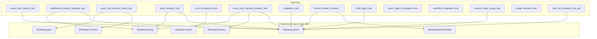

# Other — librefang-kernel-tests

# librefang-kernel-tests

Integration and contract test suite for `librefang-kernel`. Tests exercise the kernel's public APIs at the crate boundary — no internal module paths are `use`d directly except where the test specifically pins internal invariants (e.g. cross-chat leak guards).

## Architecture


```mermaid
graph TD
    subgraph "Test Files"
        ATT[async_task_tracker_test]
        ASI[attachment_session_isolation_test]
        ACCN[audit_cron_channel_name_test]
        AR[audit_retention_test]
        CC[cron_compaction_test]
        CCMI[cross_chat_memory_isolation_test]
        IT[integration_test]
        KHC[kernel_handle_contract_*]
        MA[multi_agent_test]
        WS[wasm_agent_integration_test]
        WF[workflow_integration_test]
        RS[session_reset_scope_test]
        PS[purge_sentinels_test]
        RB[rbac_m3_evaluate_tool_call]
    end

    subgraph "Production Crates Under Test"
        K[librefang-kernel]
        KH[librefang-kernel-handle]
        RT[librefang-runtime]
        MEM[librefang-memory]
        CH[librefang-channels]
        TP[librefang-types]
        TG[librefang-testing]
    end

    ATT --> K
    ASI --> K
    ASI --> TG
    ACCN --> CH
    ACCN --> TP
    AR --> K
    AR --> TG
    CC --> RT
    CCMI --> K
    CCMI --> MEM
    CCMI --> TG
    IT --> K
    KHC --> KH
    KHC --> K
    MA --> K
    RS --> K
    RB --> K
```

## Shared Infrastructure

### `common/mod.rs`

Provides `boot_kernel()` and `boot_kernel_with_users()` helpers that create a `tempfile::TempDir`, populate the required directory skeleton (`data/`, `skills/`, `workspaces/agents/`, `workspaces/hands/`), and call `LibreFangKernel::boot_with_config`. The returned `(LibreFangKernel, TempDir)` tuple keeps the temp directory alive for the test's duration.

### Per-file config helpers

Several test files define their own `test_config(name)` that creates an isolated temp directory under the system temp folder. This avoids cross-test interference when tests run in parallel.

### `librefang_testing::MockKernelBuilder`

Used by attachment isolation, memory isolation, and audit retention tests. Wraps kernel boot with a builder API for config overrides (`.with_config(|c| ...)`). Returns `(Arc<LibreFangKernel>, TempDir)`.

## Test Suites

### Async Task Tracker (`async_task_tracker_test.rs`)

Exercises the `register_async_task` / `complete_async_task` pair — the registry that tracks in-flight async work items and injects `AgentLoopSignal::TaskCompleted` back into the originating session on completion.

**Key scenarios:**

| Test | What it validates |
|---|---|
| `register_inserts_into_registry_and_returns_handle` | Basic insert → lookup → count |
| `complete_workflow_task_injects_signal_into_originating_session` | Live-receiver delivery: signal arrives on the injection channel, registry entry removed |
| `complete_delegation_task_injects_signal_with_delegation_kind` | `TaskKind::Delegation` preserves target agent and prompt hash in the signal |
| `complete_with_no_attached_receiver_still_removes_entry` | Delete-on-delivery contract: entry drained even when no wake-idle is possible (`self_handle` unset) |
| `wake_idle_path_returns_true_when_self_handle_is_set` | `set_self_handle` enables the spawn-a-turn path, returns `Ok(true)` |
| `double_completion_is_a_noop_on_second_call` | Idempotency: second call returns `Ok(false)`, no duplicate signal |
| `complete_unknown_task_id_returns_ok_false` | Unknown `TaskId` does not panic |
| `register_dedupes_workflow_kind_against_existing_run_id` | Same `TaskKind::Workflow { run_id }` returns the existing handle |
| `register_dedupes_delegation_kind_against_existing_target_and_hash` | Same `(agent_id, prompt_hash)` returns the existing handle |
| `register_does_not_dedupe_distinct_delegations_to_same_target` | Different `prompt_hash` → distinct task |
| `register_dedupe_is_cross_session_for_delegation_kind` | Dedupe ignores caller `(agent, session)` — completion routes to the first registrant only |
| `complete_falls_through_to_wake_idle_when_injection_channel_is_full` | `Backpressure(Full)` on `try_send` falls through to wake-idle spawn rather than returning an error |
| `recovery_synthesizes_failed_event_for_matching_pending_workflow` | `synthesize_task_failures_for_recovered_runs` drains matching entries and injects `Failed("workflow run interrupted by daemon restart")` |

**Helper — `attach_injection_receiver`:** Manually wires a `tokio::sync::mpsc::channel` into `kernel.injection_senders_ref()` for a given `(agent_id, session_id)`, letting the test act as the agent-loop receiver without booting the full agent runtime.

### Attachment Session Isolation (`attachment_session_isolation_test.rs`)

Regression guard for the 2026-05-20 cross-chat attachment leak (WhatsApp DM image persisted into a group session's history).

The fix added an explicit `session_id` parameter to `SessionWriter::inject_attachment_blocks`. The test verifies:
- `inject_attachment_blocks(agent_id, dm_session_id, blocks)` writes into `dm_session_id`, **not** into the agent's registry `entry.session_id`
- Two sequential calls with different session IDs produce two independent sessions

### Audit Cron Channel Name (`audit_cron_channel_name_test.rs`)

Pins the ingress sanitization that prevents external callers from colliding with kernel-internal system channel names (`cron`, `autonomous`, `webui`).

Uses `librefang_channels::types::{sanitize_channel_name, is_reserved_system_channel, RESERVED_SYSTEM_CHANNEL_NAMES}` to verify:
- External `"cron"` variants (case-insensitive, whitespace-padded) sanitize to `ext-cron` and derive a disjoint `SessionId` from the internal `for_channel(agent, "cron")`
- Non-reserved names (`"telegram"`, `"slack"`, etc.) pass through unchanged
- Sanitized names are stable across invocations (deterministic `ext-<name>`)

### Audit Retention (`audit_retention_test.rs`)

Tests that `start_background_agents()` launches the periodic trim task and that a `RetentionTrim` self-audit row lands when the trim cycle drops entries.

Uses a 1-second `trim_interval_secs` and `max_in_memory_entries = 10`. Seeds 50 entries, waits ~2.5 seconds, then asserts the buffer shrank near the cap and a `RetentionTrim` action appears in the log. Chain integrity is verified post-trim via `audit.verify_integrity()`.

Requires `#![recursion_limit = "256"]` due to `start_background_agents` spawning many closures with complex future layouts.

### Cron Session Compaction (`cron_compaction_test.rs`)

Exercises the `librefang_runtime::compactor` surface used by `try_summarize_trim`:

- **H2 gap 1:** `compact_session` with a `FakeDriver` (canned summary) produces `used_fallback = false` and a `[summary_msg] + tail` output
- **H2 gap 2 / M4:** `FailingDriver` produces `used_fallback = true`; the kernel must check `!result.used_fallback` (not just `!result.summary.is_empty()`) to correctly reject fallback summaries
- **H1:** `adjust_split_for_tool_pair` never splits a `ToolUse`/`ToolResult` pair across the summary/tail boundary — the split is pushed forward to include the paired `ToolResult` in the head

### Cross-Chat Memory Isolation (`cross_chat_memory_isolation_5227_test.rs`)

Regression for #5227: memories extracted from a group chat surfaced in a DM via `auto_retrieve`.

Tests at the kernel boundary:
- `SessionId::for_sender_scope` produces distinct IDs for DM vs. group of the same peer
- `auto_memorize` stamps `CHAT_SCOPE_METADATA_KEY` onto stored memories when `chat_scope` is `Some(...)`
- `auto_memorize` with `chat_scope = None` does **not** stamp the key (legacy backward compat)
- Unscoped recall (`chat_scope = None`) is a no-op filter — all memories remain visible
- `compose_sender_scope` formula matches `for_sender_scope` for WhatsApp (pre-qualified), Telegram (bare channel + chat_id), and empty-chat-id shapes

### Full Pipeline Integration (`integration_test.rs`)

Live LLM tests marked `#[ignore]` — require `GROQ_API_KEY`.

- `test_full_pipeline_with_groq`: boot → spawn agent → `send_message` → assert non-empty response and token usage → kill agent
- `test_multiple_agents_different_models`: two agents with different models, both respond correctly

### Kernel Handle Contracts

Six files exercising the `librefang-kernel-handle::KernelHandle` trait — the abstract interface external consumers use.

#### `kernel_handle_contract_broader.rs`

General API surface: roster CRUD, goal list (empty by default), A2A agent list/URL, kill unknown agent returns error, `publish_event` succeeds.

#### `kernel_handle_contract_cron_spawn.rs`

- `cron_create` preserves `peer_id` (or leaves it null)
- `spawn_agent` returns a valid identity that appears in `list_agents`
- `find_agents` matches by name

#### `kernel_handle_contract_memory.rs`

Comprehensive memory isolation and security tests:

**Isolation:**
- Per-agent isolation: same key, different agents → independent values
- Cross-agent read prevention
- Cross-agent list prevention
- Peer-scoped namespaces: `memory_store("k", ..., Some("peer-a"))` invisible to `Some("peer-b")`
- Shared namespace (`agent_id = None`) for backward compat
- Legacy fallback: per-agent recall falls back to shared namespace

**Security (#5119 / #5120):**
- `peer:`-prefixed keys rejected on store/recall — prevents LLM from planting rows that surface in a victim's `memory_list`
- Colon-bearing `peer_id` rejected (e.g. Slack `"T1:U2"`) — prevents namespace collision
- Empty `peer_id` rejected — prevents ambiguous `peer::{key}` vs. `:{key}`
- Pre-fix planted rows (`peer:victim:peer:other:secret`) not enumerable via tool-boundary `memory_list` (round-trip guard)
- Empty key rejected (#5138)
- Oversized values rejected (256 KiB cap)
- Concurrent `goal_update` loses no writes (#5138) — atomic RMW via `structured_modify`

#### `kernel_handle_contract_rbac.rs`

RBAC resolution through `UserConfig` channel bindings:
- Unconfigured users default-allow (guest mode)
- Bound sender + channel matches the configured tool deny
- Wrong channel or unknown sender does not match
- Memory ACL similarly scoped to sender + channel binding
- `requires_approval_with_context` delegates to `requires_approval`

#### `kernel_handle_contract_spawn_checked.rs`

Capability-checked agent spawning:
- Empty parent caps → child spawns successfully
- Parent ID passed through correctly
- Parent capability list accepted
- Capability escalation (child requests `shell_exec`, parent only has `FileRead`) → rejected with error mentioning escalation/denied

#### `kernel_handle_contract_task.rs`

Task lifecycle:
- `task_post` preserves `assigned_to` and `created_by`
- `task_claim` returns the assigned task
- `task_complete` updates status to `"completed"`
- Unassigned task posts with null/empty fields

### Multi-Agent / Hand Lifecycle (`multi_agent_test.rs`)

Exercises the hand (agent template) system:

- **Activation:** `activate_hand` spawns an agent and registers it in the agent registry
- **Deterministic IDs:** `AgentId::from_hand_agent("test-clip", "main", None)` — same hand + role always produces the same agent ID (legacy single-instance format)
- **Explicit coordinator:** multi-agent hands with `coordinator = true` on a non-main role use that role for routing
- **Deactivation:** kills the agent, removes it from the registry
- **Pause/Resume:** agent remains in registry while paused, status toggles between `Paused` and `Active`
- **Coexistence:** multiple hands active simultaneously with independent agents
- **Tool inheritance:** hand-declared tools are applied to the spawned agent
- **System prompt preservation:** hand's `system_prompt` survives activation
- **Default provider resolution:** `"default"` provider resolves to the kernel's configured default
- **Error cases:** activate/pause/resume/deactivate on nonexistent instances fail gracefully
- **Trigger restoration:** reactivation restores triggers to their original roles
- **Schema backfill:** reactivation backfills missing schema keys from the current hand definition

### Running the Tests

```bash
# Unit-level tests (no external API key needed)
cargo test -p librefang-kernel

# Live LLM integration tests
GROQ_API_KEY=gsk_... cargo test -p librefang-kernel --test integration_test -- --nocapture --ignored
```

Most tests use `#[tokio::test(flavor = "multi_thread")]` because the kernel's boot and agent-spawn paths call `tokio::task::block_in_place`, which requires a multi-threaded runtime. Files that call `start_background_agents` or exercise deeply-nested `held_agent_locks::scope` futures need `#![recursion_limit = "256"]`.