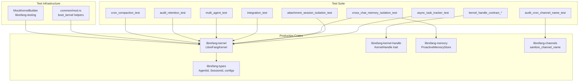

# Other — librefang-kernel-tests

# librefang-kernel-tests

Integration and contract tests for the `librefang-kernel` crate — the core runtime kernel that manages agent lifecycles, sessions, memory, messaging, task tracking, cron scheduling, and audit logging.

## Purpose

This test suite validates kernel behavior at the **public API boundary**. Tests boot a real `LibreFangKernel` (or a `MockKernelBuilder` variant) against a temporary directory and exercise subsystems through their published traits — `KernelApi`, `KernelHandle`, `SessionWriter`, `MemorySubsystemApi`, `AgentSubsystemApi`, `EventSubsystemApi`, `SkillsSubsystemApi`, `MeteringSubsystemApi` — without booting a full workflow engine or requiring external services (unless explicitly opted in via `#[ignore]`).

The tests serve three roles:

1. **Behavioral correctness** — registration, lookup, completion, deduplication, isolation, compaction.
2. **Regression guards** — each security/privacy incident (cross-chat leaks, channel name collisions, peer-id injection) has a dedicated test file that pins the fix.
3. **Contract documentation** — `kernel_handle_contract_*` files encode the `KernelHandle` trait's input/output contract so downstream consumers (API layer, adapters) can rely on tested semantics.

## Test File Index

### Core Subsystem Tests

| File | Scope |
|---|---|
| `async_task_tracker_test.rs` | `register_async_task` / `complete_async_task` lifecycle — insert, lookup, signal injection, wake-idle, backpressure fallthrough, deduplication, recovery synthesis |
| `cron_compaction_test.rs` | Cron session `SummarizeTrim` compaction via the `compactor` surface — LLM success, LLM failure fallback, `adjust_split_for_tool_pair` pair integrity |
| `audit_retention_test.rs` | Periodic audit-log trim task — `RetentionTrim` self-audit row, `max_in_memory_entries` cap enforcement, chain integrity post-trim |
| `integration_test.rs` | Full end-to-end pipeline: boot → spawn agent → `send_message` through Groq API (ignored unless `GROQ_API_KEY` is set) |
| `multi_agent_test.rs` | Hand activation/deactivation, deterministic `AgentId` from hand+role, pause/resume, trigger registration, multi-agent coexistence, WASM agent integration |

### Security & Privacy Regression Tests

| File | Incident | What It Guards |
|---|---|---|
| `attachment_session_isolation_test.rs` | 2026-05-20 cross-chat attachment leak | `inject_attachment_blocks` writes into the explicit `session_id`, never into `entry.session_id` |
| `cross_chat_memory_isolation_5227_test.rs` | #5227 cross-chat memory bleed | `SessionId::for_sender_scope` produces distinct IDs per chat scope; `auto_memorize` stamps `chat_scope` metadata; unscoped callers retain legacy behavior |
| `audit_cron_channel_name_test.rs` | `cron-channel-name-not-reserved` audit | External callers passing `channel="cron"` get sanitized to `ext-cron` so they never collide with the kernel's internal `for_channel(agent, "cron")` session |
| `kernel_handle_contract_memory.rs` (security section) | #5119, #5120, #5138 | Rejects `peer:`-prefixed keys, colon-bearing/empty peer IDs, oversized values, empty keys; concurrent `goal_update` atomicity |

### KernelHandle Contract Tests

These files implement the `&dyn KernelHandle` trait contract shared with `librefang-kernel-handle` consumers:

| File | API Surface |
|---|---|
| `kernel_handle_contract_broader.rs` | `roster_upsert/remove/members`, `goal_list_active`, `list_a2a_agents`, `publish_event`, `kill_agent` error on unknown |
| `kernel_handle_contract_cron_spawn.rs` | `cron_create` (with/without `peer_id`), `spawn_agent` identity, `list_agents` / `find_agents` metadata |
| `kernel_handle_contract_memory.rs` | Per-agent isolation, cross-agent prevention, peer-namespace separation, legacy shared-namespace fallback, input validation, atomic RMW |
| `kernel_handle_contract_rbac.rs` | `resolve_user_tool_decision`, `memory_acl_for_sender` — sender+channel binding, guest fallback |
| `kernel_handle_contract_spawn_checked.rs` | `spawn_agent_checked` — capability list pass-through, escalation rejection |
| `kernel_handle_contract_task.rs` | `task_post`, `task_claim`, `task_complete` — assignment preservation, status transitions |

### Shared Infrastructure

| File | Purpose |
|---|---|
| `common/mod.rs` | `boot_kernel()` and `boot_kernel_with_users()` helpers — creates a temp dir, builds a `KernelConfig`, boots the kernel |

## Architecture


```mermaid
graph TD
    subgraph "Test Suite"
        A[async_task_tracker_test]
        B[attachment_session_isolation_test]
        C[audit_cron_channel_name_test]
        D[audit_retention_test]
        E[cron_compaction_test]
        F[cross_chat_memory_isolation_test]
        G[integration_test]
        H[kernel_handle_contract_*]
        I[multi_agent_test]
    end

    subgraph "Test Infrastructure"
        J[common/mod.rs<br/>boot_kernel helpers]
        K[MockKernelBuilder<br/>librefang-testing]
    end

    subgraph "Production Crates"
        L[librefang-kernel<br/>LibreFangKernel]
        M[librefang-kernel-handle<br/>KernelHandle trait]
        N[librefang-types<br/>AgentId, SessionId, configs]
        O[librefang-memory<br/>ProactiveMemoryStore]
        P[librefang-channels<br/>sanitize_channel_name]
    end

    H --> M
    A & B & F & G & I --> L
    C --> P
    D & E --> L
    J --> L
    K --> L
    L --> N
    F --> O
```

## Key Patterns

### Kernel Boot

Most tests create an isolated kernel instance in a temp directory. Two approaches are used:

**Direct config construction** (used by `async_task_tracker_test`, `integration_test`, `multi_agent_test`):

```rust
fn test_config(name: &str) -> KernelConfig {
    let tmp = std::env::temp_dir().join(format!("librefang-async-task-test-{name}"));
    let _ = std::fs::remove_dir_all(&tmp);
    std::fs::create_dir_all(&tmp).unwrap();
    KernelConfig {
        home_dir: tmp.clone(),
        data_dir: tmp.join("data"),
        default_model: DefaultModelConfig { /* ... */ },
        ..KernelConfig::default()
    }
}
let kernel = LibreFangKernel::boot_with_config(test_config("my-test")).unwrap();
```

**MockKernelBuilder** (used by attachment, memory, RBAC, retention tests):

```rust
let (kernel, _tmp) = MockKernelBuilder::new()
    .with_config(|c| {
        c.default_model.provider = "ollama".to_string();
        c.default_model.model = "test".to_string();
    })
    .build();
```

The `_tmp` guard must be held for the test's lifetime — dropping it would remove the temp directory while the kernel still holds file handles.

### Injection Channel Wiring

`async_task_tracker_test` manually wires an `mpsc` channel into the kernel's `injection_senders` map to act as the receiver side of `AgentLoopSignal` without running the full agent loop:

```rust
fn attach_injection_receiver(
    kernel: &LibreFangKernel,
    agent_id: AgentId,
    session_id: SessionId,
) -> tokio::sync::mpsc::Receiver<AgentLoopSignal> {
    let (tx, rx) = tokio::sync::mpsc::channel::<AgentLoopSignal>(8);
    kernel.injection_senders_ref().insert((agent_id, session_id), tx);
    rx
}
```

This lets tests assert that `complete_async_task` enqueues a `TaskCompleted` signal without spawning a real agent.

### Fake LLM Drivers

`cron_compaction_test` uses `FakeDriver` (canned summary) and `FailingDriver` (always errors) implementations of `LlmDriver` to test the compaction surface without a real LLM:

```rust
struct FakeDriver { summary: String }
#[async_trait]
impl LlmDriver for FakeDriver {
    async fn complete(&self, _req: CompletionRequest) -> Result<CompletionResponse, LlmError> {
        Ok(CompletionResponse { content: vec![ContentBlock::Text { text: self.summary.clone(), ... }], ... })
    }
}
```

### Multi-Thread Runtime Requirement

Tests that call `start_background_agents()` or `send_message_full` require `#[tokio::test(flavor = "multi_thread")]` because the kernel internally calls `tokio::task::block_in_place`, which panics on the single-threaded runtime.

### Recursion Limit

Tests involving deep monomorphized futures (`audit_retention_test`, `integration_test`, `multi_agent_test`) set `#![recursion_limit = "256"]` at the crate level to accommodate the compiler's type-layout requirements after trait-bound additions to kernel-internal types like `TriggerId`.

## Running the Tests

```bash
# All unit-style tests (no external dependencies)
cargo test -p librefang-kernel

# Exclude ignored Groq integration tests
cargo test -p librefang-kernel -- --skip ignored

# Run live LLM integration tests (requires API key)
GROQ_API_KEY=gsk_... cargo test -p librefang-kernel --test integration_test -- --nocapture --include-ignored
```

## Notable Design Decisions Captured in Tests

**Cross-session deduplication is intentional** — `register_async_task` with the same `TaskKind` from different `(agent_id, session_id)` pairs returns the same handle. Completion routes to the first caller's session only. Callers needing per-session isolation must salt their `prompt_hash`. Pinned by `register_dedupe_is_cross_session_for_delegation_kind`.

**Delete-on-delivery contract** — `complete_async_task` always removes the registry entry regardless of whether the signal was delivered, the channel was full (backpressure fallthrough), or no receiver was attached. Pinned by `complete_with_no_attached_receiver_still_removes_entry` and `complete_falls_through_to_wake_idle_when_injection_channel_is_full`.

**Channel name sanitization is rename, not reject** — reserved names like `cron`, `autonomous`, `webui` are rewritten to `ext-cron` etc. so multiple external adapters sharing the same reserved name still share history with each other — just not with the kernel's internal path. Pinned by `sanitized_external_channel_remains_stable_across_invocations`.

**Memory peer-namespace isolation uses prefix stripping** — the shared substrate stores peer-scoped keys as `peer:<peer_id>:<key>`. The `memory_list` / `memory_recall` boundary strips and re-validates this prefix, rejecting any key that doesn't round-trip cleanly. This prevents planted `peer:victim:...` rows from surfacing to a victim's enumeration. Pinned by `test_prefix_planted_rows_not_enumerable_via_tool_memory_list`.