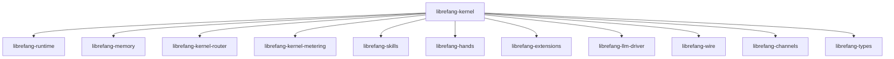

# Other — librefang-kernel

# librefang-kernel

The central orchestrator crate for the LibreFang Agent OS. This module assembles and coordinates all subsystems into a coherent kernel, providing configuration loading, state management, database access, scheduling, and the glue that binds the agent's runtime together.

## Role in the Architecture

`librefang-kernel` sits at the top of the dependency tree as the integration layer. It does not implement domain logic itself—instead, it wires together the following subsystems:

| Dependency | Purpose |
|---|---|
| `librefang-types` | Shared type definitions used across all crates |
| `librefang-memory` | Conversation and context memory management |
| `librefang-kernel-router` | Request/message routing within the kernel |
| `librefang-kernel-metering` | Usage metering and quota tracking |
| `librefang-runtime` | Task and process runtime execution |
| `librefang-skills` | Skill definitions and lifecycle |
| `librefang-hands` | Tool/action invocation ("hands") |
| `librefang-extensions` | Extension loading and management |
| `librefang-llm-driver` | LLM provider abstraction and driver |
| `librefang-wire` | Wire protocol for inter-component communication |
| `librefang-channels` | Channel management (feature-gated, no default features) |



## Key Capabilities

### Configuration Loading

Supports three configuration formats via `serde`, `toml`, and `serde_yaml`:

- **TOML** — primary configuration format for agent settings
- **YAML** — alternative structured configuration
- **JSON** — programmatic or generated configurations

### Persistent Storage

Uses `rusqlite` (SQLite) for local persistent state—conversation history, agent configuration, metering data, and sentinel records.

### Concurrent State

- **`dashmap`** — lock-free concurrent hash maps for hot-path state
- **`arc-swap`** — atomic swapping of shared references for live configuration reloads
- **`crossbeam`** — multi-producer/multi-consumer channels and concurrent primitives

### Scheduling

The `cron` crate enables time-based task scheduling. Agents can register cron expressions for periodic actions (health checks, cleanup, metering rollups, etc.).

### Security

- **`totp-rs`** — TOTP-based two-factor authentication for agent identity verification
- **`zeroize`** — secure clearing of sensitive data from memory (keys, tokens)
- **`subtle`** — constant-time comparisons to prevent timing attacks
- **`rand`** — cryptographic random number generation for nonces and tokens

### HTTP Communication

`reqwest` provides the HTTP client used by the kernel for outbound requests—LLM API calls, webhook delivery, and extension fetches.

### Async Runtime

Built entirely on `tokio`. All I/O, scheduling, and inter-task communication is async. The kernel manages its own tokio runtime lifecycle.

### Observability

`tracing` and `tracing-subscriber` provide structured logging and diagnostic spans throughout the kernel.

### Time Handling

`chrono` and `chrono-tz` provide timezone-aware datetime handling, used for scheduling, metering windows, and audit timestamps.

## Binaries

### `purge_sentinels`

Located at `bin/purge_sentinels.rs`. A standalone utility that cleans up stale sentinel records from the kernel's SQLite database. Run via:

```bash
cargo run --bin purge_sentinels
```

This is intended for scheduled or manual maintenance of the agent's local database.

## Platform Notes

On Unix targets, the crate links against `libc` (version `0.2`) for low-level system interactions—file descriptor management, signal handling, or process control.

## Development

Tests use `tokio-test` for async test utilities and `tempfile` for temporary directory/file fixtures when testing database or configuration loading code.

## Dependency Checklist for Contributors

When adding a new subsystem to the kernel:

1. Add the crate dependency in `Cargo.toml`
2. Ensure the subsystem's types are represented in `librefang-types` if shared
3. Route messages through `librefang-kernel-router` if the subsystem produces/consumes kernel events
4. Register any periodic tasks with the cron scheduler
5. Add metering hooks via `librefang-kernel-metering` if the subsystem consumes billable resources