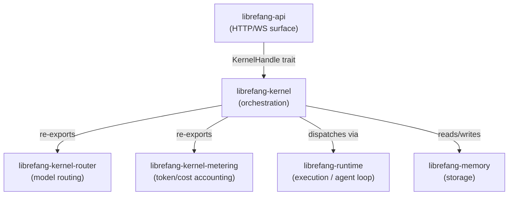

# Other — librefang-kernel

# librefang-kernel

Core orchestration crate for the LibreFang Agent Operating System. Manages agent lifecycles, scheduling, permissions, inter-agent communication, and the message-handling loop that dispatches requests to LLM drivers, tools, and the memory substrate.

## Architecture



The kernel sits between the HTTP surface layer (`librefang-api`) and the execution layer (`librefang-runtime`). It does **not** depend on `librefang-api` or `librefang-extensions`. When those crates need a kernel callback, they go through the `KernelHandle` trait defined in `librefang-runtime`, reversing the dependency arrow.

### What the kernel owns

- Agent registry (spawn / lookup / kill)
- Scheduling and cron
- Approval and auth
- Auto-dream, inbox, pairing
- Event bus (broadcast)
- Session lifecycle state machine
- Metering and model routing (re-exported from `librefang-kernel-metering` and `librefang-kernel-router`)

### What the kernel does NOT own

| Concern | Lives in |
|---|---|
| Agent loop body, tool dispatch | `librefang-runtime` |
| Channel adapters (Slack, Discord, etc.) | `librefang-channels` |
| HTTP routing, dashboard SPA | `librefang-api` |

## Boot sequence

Entry point is `LibreFangKernel::boot_with_config(KernelConfig)`. This initializes all subsystems and returns the ready orchestrator. `KernelConfig` carries every tuneable knob; see [Configuration](#configuration) below.

`LibreFangKernel` is currently a large struct (~18k LOC, 50+ fields). Adding fields requires coordination (tracking issue #3565).

## Key subsystems

### `registry::AgentRegistry`

Concurrent agent table. Operations: spawn, lookup, kill. Thread-safe via internal synchronization.

### `kernel::cron`

Cron-based job scheduling. Resolves `session_mode` per-job with the following precedence:

1. Per-job override (highest)
2. Agent manifest (`agent.toml`)
3. Historical persistent session (lowest)

### `kernel::event_bus`

Broadcast event bus with bounded history. Internal storage is `parking_lot::Mutex<VecDeque<Arc<Event>>>` (since #3385). The `Arc<Event>` avoids cloning large events; the `Mutex<VecDeque>` gives deterministic iteration order. **Do not** switch back to `RwLock<VecDeque<Event>>` — it caused contention issues.

### `kernel::session_lifecycle`

Session state machine. Manages transitions between session states (active, paused, terminated, etc.).

### `kernel::scheduler`

General-purpose task scheduling with concurrency controls (see [Concurrency tuning](#concurrency-tuning)).

### `metering` (re-exported from `librefang-kernel-metering`)

Token and cost accounting. Reads from the kernel's `model_catalog` for pricing data.

### `router` (re-exported from `librefang-kernel-router`)

Model routing and alias resolution. Selects the appropriate LLM provider/model for a given request.

## Concurrency and lock strategies

Each hot field has a specific lock strategy chosen for its access pattern. Do not change these without profiling.

| Field | Strategy | Rationale |
|---|---|---|
| `model_catalog` | `arc_swap::ArcSwap<ModelCatalog>` | Hot read, rare write. Readers get an `Arc` clone via atomic load (#3384). Writers use RCU through `model_catalog_update(\|cat\| ...)`. Never use `RwLock<ModelCatalog>`. |
| `skill_registry` | `std::sync::RwLock<SkillRegistry>` | Hot-reload on skill install/uninstall. Keep reads brief — copy out what you need, don't hold the lock across I/O. |
| `running_tasks` | `dashmap::DashMap<(AgentId, SessionId), RunningTask>` | High read/write throughput. Keyed by `(agent, session)`, **not** by `AgentId` alone. Pre-#3172 it used `AgentId` only, which silently overwrote concurrent loops. Do not regress. |
| `mcp_oauth_provider` | `Arc<dyn McpOAuthProvider + Send + Sync>` | Pluggable trait object. Implemented in `librefang-api` to keep the daemon free of HTTP concerns. All new OAuth flows must go through this trait, not direct kernel logic. |

## Determinism

Anything that reaches an LLM prompt **must** be deterministically ordered before stringifying (ref #3298). Use `BTreeMap` / `BTreeSet` for all data that ends up in prompts. `HashMap` iteration order varies across processes and silently invalidates provider prompt caches, increasing cost and reducing correctness.

Regression tests guard these boundaries. See `kernel::tests::mcp_summary_is_byte_identical_across_input_orders` for the canonical example.

## Configuration

### `KernelConfig` fields

| Field | Default | Description |
|---|---|---|
| `max_history_messages` | (varies) | Global default for conversation history length. Clamped up to `MIN_HISTORY_MESSAGES = 4` with a WARN log if set lower. Per-agent override available in `agent.toml`. |
| `queue.concurrency.trigger_lane` | `8` | Global semaphore size for `Lane::Trigger`. Controls how many trigger-type jobs run concurrently across all agents. |
| `queue.concurrency.default_per_agent` | `1` | Fallback per-agent concurrency when `agent.toml: max_concurrent_invocations` is unset. |
| `workflow_stale_timeout_minutes` | (varies) | Cutoff used by `recover_stale_running_runs` at boot to identify and clean up stale workflows. |

### Adding a new field to `LibreFangKernel`

1. **Visibility**: `pub(crate)` unless an external crate genuinely needs access.
2. **`KernelConfig` default**: If the field has a config-side counterpart, add it to the `Default` impl on `KernelConfig`. Missing this silently breaks the build.
3. **Trait objects**: If the field is `Option<Arc<dyn Trait>>`, mark it `#[serde(skip)]` and manually implement `Serialize`, `Deserialize`, `Clone`, and `Debug`.
4. **Lock strategy** — pick based on access pattern:
   - Hot read, rare write → `arc_swap::ArcSwap`
   - Hot read, hot write → `parking_lot::Mutex` or `dashmap::DashMap`
   - Append-only history → `parking_lot::Mutex<VecDeque<Arc<T>>>`

## Dependencies

### Internal crate dependencies

```
librefang-types
librefang-memory
librefang-memory-wiki
librefang-kernel-router      (re-exported as `router`)
librefang-kernel-metering    (re-exported as `metering`)
librefang-runtime
librefang-skills
librefang-hands
librefang-extensions
librefang-llm-driver
librefang-wire
librefang-channels           (default-features = false)
```

### Notable external dependencies

- `tokio` — async runtime (we are already inside one; never call `block_on`)
- `dashmap` — concurrent hash maps for `running_tasks`
- `arc-swap` — RCU-style atomic swaps for `model_catalog`
- `parking_lot` — `Mutex` and `RwLock` for event bus and skill registry
- `cron` (0.16) — cron expression parsing for job scheduling

### Binary target

`purge_sentinels` (`bin/purge_sentinels.rs`) — utility for cleaning up sentinel files.

## Testing

### Unit tests

Most kernel unit tests live inside `crates/librefang-kernel/src/kernel/`, colocated with the code they test. Run with:

```sh
cargo test -p librefang-kernel
```

### Integration tests

Integration tests that need a real router or HTTP surface live in `librefang-api/tests/`. That is where `#[tokio::test]` against `TestServer` belongs (ref #3721).

### Forbidden commands

- **`cargo test`** (workspace-wide) — causes `target/` contention with running user sessions.
- **`cargo build`** — use `cargo check --workspace --lib` instead. Real builds run in CI.

### Test dependencies

`tokio-test`, `tempfile`, `serial_test` (3), `proptest` (1), `tracing-subscriber`, `librefang-testing`, `librefang-kernel-handle`.

## Taboos

These are hard rules, not suggestions:

- **No daemon spawning.** The CLI binary owns `start`. The kernel just runs within the provided runtime.
- **No `tokio::runtime::Handle::block_on`.** The kernel executes inside an existing runtime. Nesting runtimes causes panics or deadlocks.
- **No direct LLM HTTP calls.** All LLM interaction goes through `librefang-runtime` drivers.
- **No `Result<_, String>` from `KernelHandle` methods.** Use typed errors (ref #3541).
- **No `HashMap` in LLM prompt data.** Use `BTreeMap` / `BTreeSet` everywhere a field ends up serialized into a prompt (ref #3298).
- **No `RwLock<VecDeque<Event>>` in the event bus.** Use `parking_lot::Mutex<VecDeque<Arc<Event>>>` (ref #3385).
- **No `RwLock<ModelCatalog>`.** Use `arc_swap::ArcSwap` (ref #3384).
- **No `AgentId`-only keying in `running_tasks`.** Use `(AgentId, SessionId)` (ref #3172).